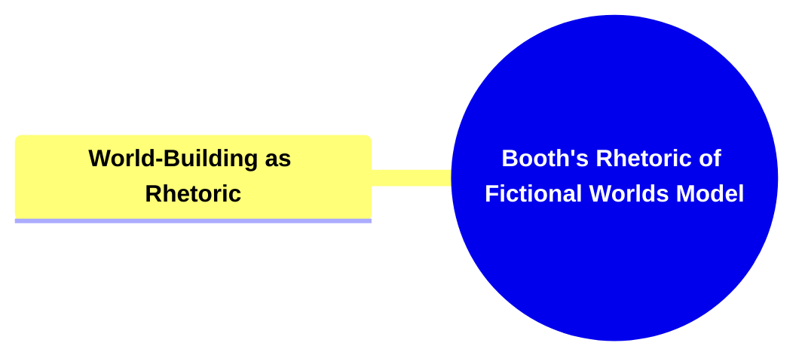

- [1. Title: **Booth's Rhetoric of Fictional Worlds Model**](#1-title-booths-rhetoric-of-fictional-worlds-model)
- [2. **Key Concepts**:](#2-key-concepts)
  - [2.1. **World-Building as Rhetoric**:](#21-world-building-as-rhetoric)
    - [2.1.1. **Components of World-Building as Rhetoric**](#211-components-of-world-building-as-rhetoric)
      - [2.1.1.1. **Detail-Oriented Construction**](#2111-detail-oriented-construction)
      - [2.1.1.2. **Consistency**](#2112-consistency)
      - [2.1.1.3. **Plausibility**](#2113-plausibility)
      - [2.1.1.4. **Reader Engagement**](#2114-reader-engagement)
- [3. **Theoretical Significance**:](#3-theoretical-significance)
- [4. **Supporting Information**:](#4-supporting-information)

---

---

### 1. Title: **Booth's Rhetoric of Fictional Worlds Model**

- **The Rhetoric of Fictional Worlds**:
  - **Definition**: Wayne C. Booth’s concept of the _Rhetoric of Fictional Worlds_ explores how authors construct fictional worlds with the intention of engaging and persuading readers. Booth argues that the creation of a believable and coherent fictional world is not merely a matter of imagination but a rhetorical act. This act involves deliberate choices in narrative construction designed to immerse the reader, making the events, characters, and settings within the narrative convincing and compelling. Booth’s model highlights the relationship between the author’s techniques and the reader’s willingness to accept the narrative as a plausible and coherent reality.

### 2. **Key Concepts**:

#### 2.1. **World-Building as Rhetoric**:

- **Definition**: World-building, according to Booth, is the process by which authors construct the fictional environment in which their narrative takes place. This involves the careful crafting of details, maintaining internal consistency, and ensuring the plausibility of the world’s rules and logic. World-building is seen as a rhetorical strategy aimed at persuading the reader to believe in and become invested in the story world, despite its fictional nature.

##### 2.1.1. **Components of World-Building as Rhetoric**

###### 2.1.1.1. **Detail-Oriented Construction**

- **Definition**: Effective world-building requires meticulous attention to detail, covering all aspects of the fictional world to create a sense of realism and depth.
- **Characteristics**
  - **Comprehensive Elements**: Includes detailed descriptions of geography, culture, politics, and history to enrich the narrative.
  - **Authentic Interactions**: Ensures characters and societies behave in ways that align with the world's specific norms and values.
  - **Layered Complexity**: Incorporates nuanced details that reveal different facets of the world, adding depth and making it more immersive for the reader.

###### 2.1.1.2. **Consistency**

- **Definition**: The adherence to a set of established rules and logic within a fictional world, ensuring that all elements of the narrative align and function cohesively.
- **Characteristics**
  - **Rule Adherence**: The world operates under consistent rules that govern aspects like magic systems, technology, or social norms.
  - **Logical Progression**: Events and character actions align with the established rules, preventing contradictions and maintaining narrative credibility.
  - **Continuity**: Details and story elements remain consistent throughout the narrative, avoiding discrepancies that could disrupt the reader's immersion.

###### 2.1.1.3. **Plausibility**

- **Definition**: The creation of a believable narrative world where events, characters, and settings feel realistic within the context of the story’s own logic.
- **Characteristics**
  - **Believable Constructs**: The world may include fantastical or speculative elements, but they are presented in a way that makes sense within its own framework.
  - **Character Reactions**: Characters respond to events and circumstances in a manner that aligns with the world’s established rules and cultural norms.
  - **Rational Outcomes**: Plot developments follow a logical pattern based on the world’s structure, reinforcing the story’s credibility and engaging the reader.

###### 2.1.1.4. **Reader Engagement**

- **Definition**: World-building engages the reader’s imagination, encouraging them to suspend disbelief and fully immerse themselves in the narrative.
- **Characteristics**
  - **Immersive Atmosphere**: Creates a world so complete and coherent that readers feel transported into the story.
  - **Interactive Connection**: Invites readers to explore and question aspects of the world, deepening their engagement.
  - **Emotional Investment**: The more cohesive and vivid the world, the more likely readers are to become emotionally invested in the characters and plot.

### 3. **Theoretical Significance**:

- **Impact on Narrative and Literary Theory**: Booth’s Rhetoric of Fictional Worlds Model has significantly influenced narrative and literary theory, particularly in the study of how authors craft and present fictional realities. By framing world-building as a rhetorical act, Booth underscores the importance of the author’s intentionality in narrative construction and the active role of the reader in engaging with the story world. This model has expanded the understanding of how fictional worlds function within narratives and how they contribute to the overall impact and meaning of the story.
- **Application Across Genres and Media**: While Booth’s concepts were originally applied to literary analysis, they are equally relevant in other narrative forms, including film, television, and video games. In these media, the creation of immersive and believable worlds is crucial for engaging audiences and enhancing the narrative experience. The rhetorical strategies involved in world-building are central to the success of these narratives, as they rely on the audience’s willingness to accept and engage with the fictional reality presented.

### 4. **Supporting Information**:

- **Interdisciplinary Influence**: Booth’s framework has influenced not only literary studies but also fields such as media studies, game design, and even architecture, where the principles of world-building are applied to create immersive environments. In game design, for example, the construction of detailed, consistent, and plausible worlds is key to player engagement and the overall success of the game narrative. Booth’s ideas have also informed studies in cognitive science, particularly in understanding how readers and audiences process and engage with fictional worlds.
- **Critiques and Further Development**: While Booth’s model emphasizes the importance of coherence and plausibility in world-building, some critics argue that it may overlook the creative potential of ambiguity and inconsistency within fictional worlds. Postmodern and experimental narratives often play with the boundaries of coherence and challenge traditional notions of world-building, creating worlds that are intentionally fragmented or contradictory. However, Booth’s framework remains a foundational concept in the study of narrative, offering valuable insights into the rhetorical strategies that underpin effective world-building.
