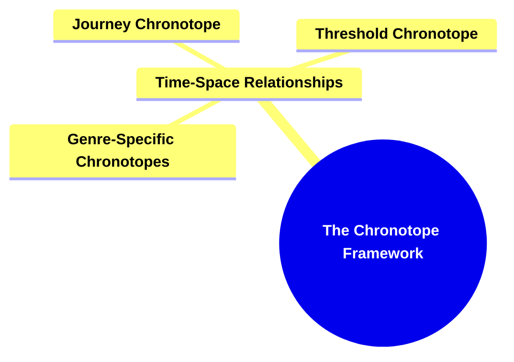
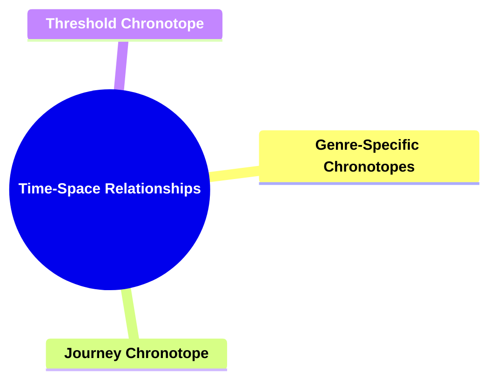
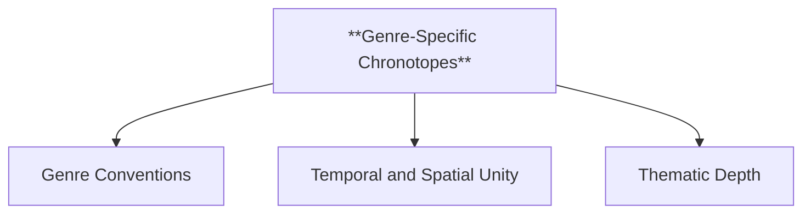
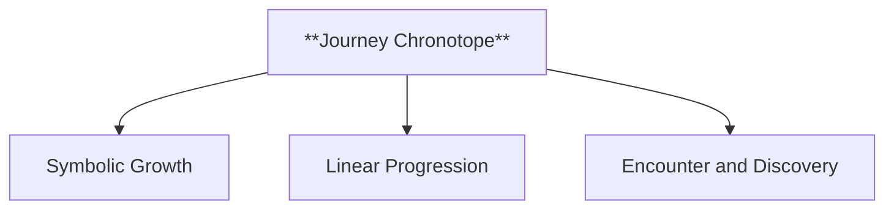
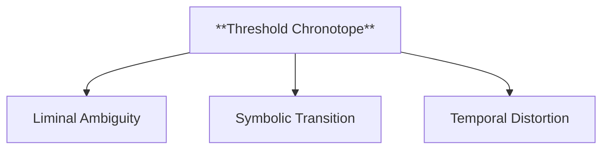
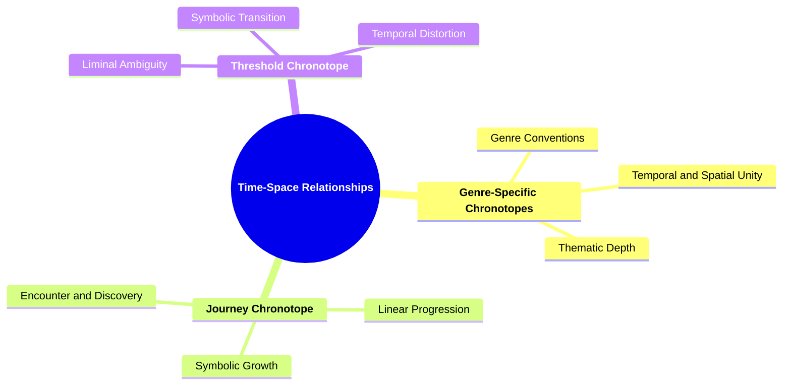

- [1. **Title: Bakhtin's Chronotope Framework**](#1-title-bakhtins-chronotope-framework)
- [2. **Key Concepts**](#2-key-concepts)
  - [2.1. **Time-Space Relationships**](#21-time-space-relationships)
    - [2.1.1. **Components of Time-Space Relationships**](#211-components-of-time-space-relationships)
      - [2.1.1.1. **Genre-Specific Chronotopes**](#2111-genre-specific-chronotopes)
      - [2.1.1.2. **Journey Chronotope**](#2112-journey-chronotope)
      - [2.1.1.3. **Threshold Chronotope**](#2113-threshold-chronotope)
- [3. Implications of Bakhtin's Chronotope Framework](#3-implications-of-bakhtins-chronotope-framework)

---
### 1. **Title: Bakhtin's Chronotope Framework**

**The Chronotope**:
   **Definition**: Mikhail Bakhtin’s 
   chronotope, from the Greek *chronos* (time) and *topos* (space), refers to the intrinsic connectedness of time and space in narrative. It describes how temporal and spatial relationships shape the meaning, themes, and development of a story, offering a way to understand the narrative world as a reflection of human experience.

---

### 2. **Key Concepts**

#### 2.1. **Time-Space Relationships**

**Definition**:
   The chronotope encapsulates the specific ways in which time and space are interwoven in a narrative, forming the foundational structure that governs how events are perceived and understood by the reader. Different literary genres and forms possess distinct chronotopes that define their unique temporal and spatial dynamics.

##### 2.1.1. **Components of Time-Space Relationships**

###### 2.1.1.1. **Genre-Specific Chronotopes**
  - **Definition**: Different genres and forms have unique chronotopes. For example, the chronotope of the "road novel" involves a continuous journey, while the chronotope of the epic involves cyclical time linked to myth and history.

  - **Characteristics**
    - **Genre Conventions**: Each chronotope reflects the typical narrative structure and themes associated with its genre, such as the expansive time of an epic or the forward momentum of a road novel.
    - **Temporal and Spatial Unity**: Integrates specific time-space relationships that are characteristic of a particular genre, providing coherence to the storytelling.
    - **Thematic Depth**: Reinforces the underlying themes of the genre, like the endless cycle of time in epics or the dynamic change in road novels.

---

###### 2.1.1.2. **Journey Chronotope**
  - **Definition**: The protagonist's movement through space is a journey through time, often associated with personal growth and change.

  - **Characteristics**
    - **Symbolic Growth**: The physical journey mirrors internal development, where the protagonist evolves through experiences.
    - **Linear Progression**: Time and space move forward together, creating a sense of continuous advancement in both the plot and the character arc.
    - **Encounter and Discovery**: The journey chronotope often involves encounters with different people, cultures, or challenges, adding layers to the narrative and fostering character transformation.

---

###### 2.1.1.3. **Threshold Chronotope**
  - **Definition**: Found in gothic fiction, this represents a liminal space where time and space become ambiguous, reflecting transitions or tensions between known and unknown.

  - **Characteristics**
    - **Liminal Ambiguity**: Blurs the lines between reality and the supernatural, creating suspense and unease as characters confront the unknown.
    - **Symbolic Transition**: Represents moments of significant change or crisis, where characters face choices that alter their reality.
    - **Temporal Distortion**: Time within the threshold chronotope can seem slowed, accelerated, or disjointed, contributing to an eerie, otherworldly atmosphere.

---

### 3. Implications of Bakhtin's Chronotope Framework

**Impact on Literary Theory**:
   Bakhtin’s concept of the chronotope has had a profound influence on literary theory, particularly in narratology and genre studies. It highlights the fundamental role of time and space in shaping narrative structure, offering a new perspective on how stories represent human experience.

**Collaborative or Future-Oriented Insight**:
   The chronotope is versatile and can be applied across various media, including literature, film, and other cultural forms. It provides a framework for understanding how narratives use time and space to create meaning and explore cultural values. Bakhtin’s ideas also inform interdisciplinary studies in anthropology, sociology, and philosophy.