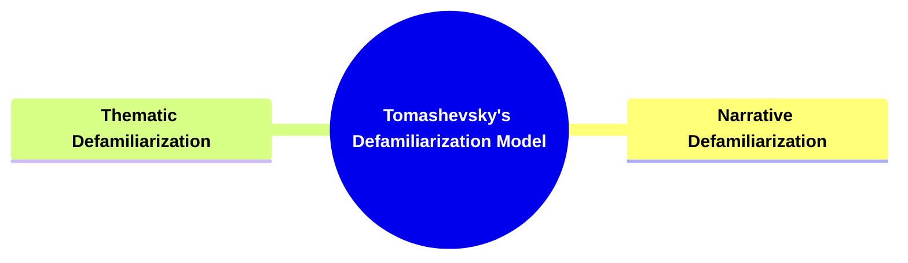
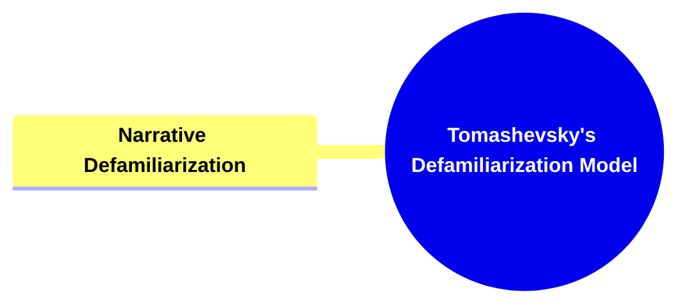
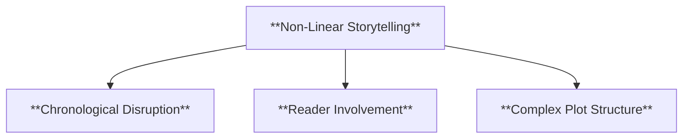
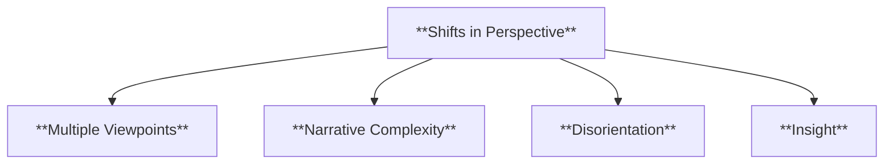
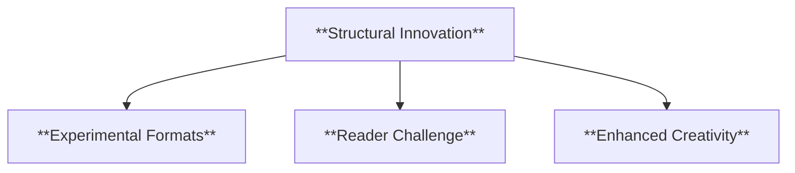
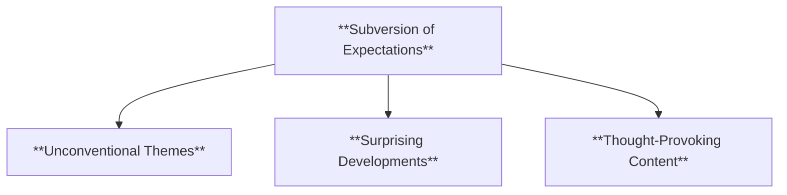
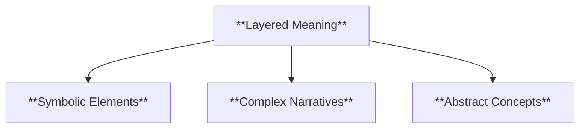
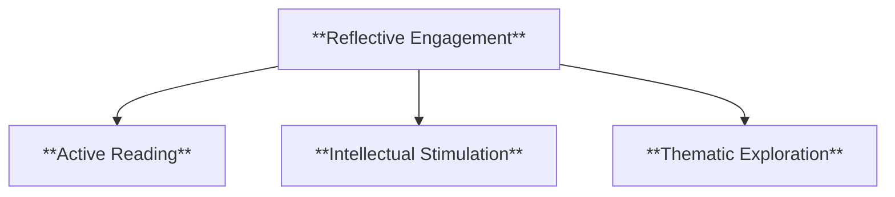
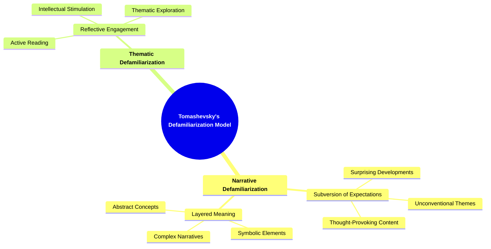

- [1. Title: **Tomashevsky's Defamiliarization Model**](#1-title-tomashevskys-defamiliarization-model)
- [2. Key Concepts](#2-key-concepts)
  - [2.1. **Narrative Defamiliarization**](#21-narrative-defamiliarization)
    - [2.1.1. **Components of Narrative Defamiliariation**](#211-components-of-narrative-defamiliariation)
      - [2.1.1.1. **Non-Linear Storytelling**](#2111-non-linear-storytelling)
      - [2.1.1.2. **Shifts in Perspective**](#2112-shifts-in-perspective)
      - [2.1.1.3. **Structural Innovation**](#2113-structural-innovation)
  - [2.2. **Thematic Defamiliarization**](#22-thematic-defamiliarization)
    - [2.2.1. **Components of Thematic Defamiliarization**](#221-components-of-thematic-defamiliarization)
      - [2.2.1.1. **Subversion of Expectations**](#2211-subversion-of-expectations)
      - [2.2.1.2. **Layered Meaning**](#2212-layered-meaning)
      - [2.2.1.3. **Reflective Engagement**](#2213-reflective-engagement)
- [3. Implications of Tomashevsky’s Defamiliarization Model](#3-implications-of-tomashevskys-defamiliarization-model)

---

---

### 1. Title: **Tomashevsky's Defamiliarization Model**

**Defamiliarization (Ostranenie)**:
**Definition**: Tomashevsky expanded on the concept of defamiliarization, originally introduced by Viktor Shklovsky, which involves presenting common objects, events, or experiences in a way that makes them appear unfamiliar or strange. This technique is designed to disrupt the reader's automatic perception, forcing them to engage more deeply with the text and to see the world in a new light.

---

### 2. Key Concepts

#### 2.1. **Narrative Defamiliarization**

**Definition**:
Narrative defamiliarization refers to the use of unconventional narrative structures to challenge the reader’s usual way of understanding stories. By altering familiar storytelling conventions, such as chronology or perspective, authors disrupt expectations and encourage readers to engage with the narrative in new ways.

##### 2.1.1. **Components of Narrative Defamiliariation**

###### 2.1.1.1. **Non-Linear Storytelling**

- **Definition**: Breaks the chronological sequence of events, creating a fragmented or layered narrative that prompts readers to piece together the story themselves.

- **Characteristics**
  - **Chronological Disruption**: Alters the traditional time flow to create suspense or thematic depth.
  - **Reader Involvement**: Requires active participation as readers reconstruct the narrative order and meaning.
  - **Complex Plot Structure**: Uses flashbacks, flash-forwards, or parallel timelines to enrich the narrative’s complexity.

###### 2.1.1.2. **Shifts in Perspective**

- **Definition**: Employs changes in narrative voice or point of view to create disorientation or highlight different interpretations of the story.

- **Characteristics**
  - **Multiple Viewpoints**: Presents the story through various characters’ eyes, offering diverse interpretations.
  - **Narrative Complexity**: Adds depth by showing how different perspectives impact the understanding of events.
  - **Disorientation**: Generates a sense of mystery by challenging readers' expectations and creating uncertainty within the narrative.
  - **Insight**: Encourages readers to critically assess each viewpoint, revealing deeper understanding or hidden truths in the narrative.

###### 2.1.1.3. **Structural Innovation**

- **Definition**: Uses experimental formats or structures, such as stream-of-consciousness or nested narratives, to engage readers in a unique storytelling experience.

- **Characteristics**
  - **Experimental Formats**: Utilizes unique storytelling techniques that may break traditional conventions.
  - **Reader Challenge**: Encourages active engagement as readers adapt to unconventional structures.
  - **Enhanced Creativity**: Allows authors to express ideas in innovative ways that resonate differently with readers.

---

#### 2.2. **Thematic Defamiliarization**

**Definition**:
Thematic defamiliarization involves the inclusion of unexpected or unconventional thematic elements that challenge traditional interpretations or reader expectations. This technique forces readers to reconsider the underlying messages and ideas presented in the narrative.

##### 2.2.1. **Components of Thematic Defamiliarization**

###### 2.2.1.1. **Subversion of Expectations**

- **Definition**: Introduces themes that go against conventional norms, prompting readers to question established beliefs or perspectives.

- **Characteristics**
  - **Unconventional Themes**: Challenges societal norms or conventional story tropes, adding depth and originality.
  - **Surprising Developments**: Keeps readers engaged by presenting unexpected narrative turns or outcomes.
  - **Thought-Provoking Content**: Pushes readers to reconsider preconceived ideas and think critically about the narrative.

###### 2.2.1.2. **Layered Meaning**

- **Definition**: Integrates complex or abstract themes that require deeper analysis and interpretation, moving beyond simple or familiar ideas.

- **Characteristics**
  - **Symbolic Elements**: Employs motifs and symbols that carry multiple interpretations and add thematic depth.
  - **Complex Narratives**: Uses subtle hints and interwoven themes to encourage deeper exploration.
  - **Abstract Concepts**: Introduces themes that challenge readers to engage in analytical thinking to fully grasp the narrative’s meaning.

###### 2.2.1.3. **Reflective Engagement**

- **Definition**: Encourages readers to critically think about the narrative’s themes, fostering a more active and contemplative reading experience.

- **Characteristics**
  - **Active Reading**: Requires readers to reflect on the narrative’s implications and connect them to broader contexts.
  - **Intellectual Stimulation**: Promotes analytical thought and interpretation, deepening the reader’s interaction with the text.
  - **Thematic Exploration**: Invites readers to consider moral, philosophical, or social themes in the story, enhancing their involvement.

---

### 3. Implications of Tomashevsky’s Defamiliarization Model

- Tomashevsky’s extension of defamiliarization into narrative and thematic elements provides a comprehensive framework for understanding how literature can challenge and transform the reader's perceptions. By making the familiar strange, defamiliarization not only revitalizes the reader’s experience of the text but also encourages deeper engagement with its themes and structures. This approach has had a significant impact on modern and postmodern literary practices, where the subversion of traditional forms and expectations is often central to the artistic intent. Through defamiliarization, literature becomes a space for innovation and critical reflection, pushing the boundaries of how stories are told and understood.

---

