- [1. **Forster's Fantasy vs. Realism Framework**](#1-forsters-fantasy-vs-realism-framework)
- [2. **Key Concepts**](#2-key-concepts)
  - [2.1. **Fantasy vs. Realism**](#21-fantasy-vs-realism)
    - [2.1.1. **Components of Fantasy vs. Realism**](#211-components-of-fantasy-vs-realism)
      - [2.1.1.1. **Imaginative**](#2111-imaginative)
      - [2.1.1.2. **Supernatural Elements**](#2112-supernatural-elements)
      - [2.1.1.3. **Grounded**](#2113-grounded)
      - [2.1.1.4. **Believable**](#2114-believable)
  - [2.2. **The Role of Fantasy in Thematic Exploration**](#22-the-role-of-fantasy-in-thematic-exploration)
    - [2.2.1. **Components of The Role of Fantasy in Thematic Exploration**](#221-components-of-the-role-of-fantasy-in-thematic-exploration)
      - [2.2.1.1. **Expansive**](#2211-expansive)
      - [2.2.1.2. **Symbolic**](#2212-symbolic)
  - [2.3. **Fantasy as a Tool for Social Commentary**](#23-fantasy-as-a-tool-for-social-commentary)
    - [2.3.1. **Components of Fantasy as a Tool for Social Commentary**](#231-components-of-fantasy-as-a-tool-for-social-commentary)
      - [2.3.1.1. **Detachment**](#2311-detachment)
      - [2.3.1.2. **Critical**](#2312-critical)
  - [2.4. **Realism’s Strengths in Depicting the Human Experience**](#24-realisms-strengths-in-depicting-the-human-experience)
    - [2.4.1. **Components of Realism's Strengths in Depicting the Human Experience**](#241-components-of-realisms-strengths-in-depicting-the-human-experience)
      - [2.4.1.1. **Authentic**](#2411-authentic)
      - [2.4.1.2. **Relatable**](#2412-relatable)
  - [2.5. **The Intersection of Fantasy and Realism**](#25-the-intersection-of-fantasy-and-realism)
    - [2.5.1. **Components of The Intersection of Fantasy and Realism**](#251-components-of-the-intersection-of-fantasy-and-realism)
      - [2.5.1.1. **Hybrid**](#2511-hybrid)
      - [2.5.1.2. **Layered**](#2512-layered)
- [3. **Theoretical Significance in Narratology**](#3-theoretical-significance-in-narratology)
- [4. **Conclusion**](#4-conclusion)


---

### 1. **Forster's Fantasy vs. Realism Framework**

- **Fantasy**:  
  - **Definition**: E.M. Forster explores the role of *fantasy* in literature and contrasts it with realism. While realism aims to depict life as it is—grounded in the observable and everyday—fantasy transcends these constraints, allowing authors to create new worlds, scenarios, and events that defy the laws of reality. This gives fantasy a unique canvas for exploring the imagination, distinct from the limitations of realism.

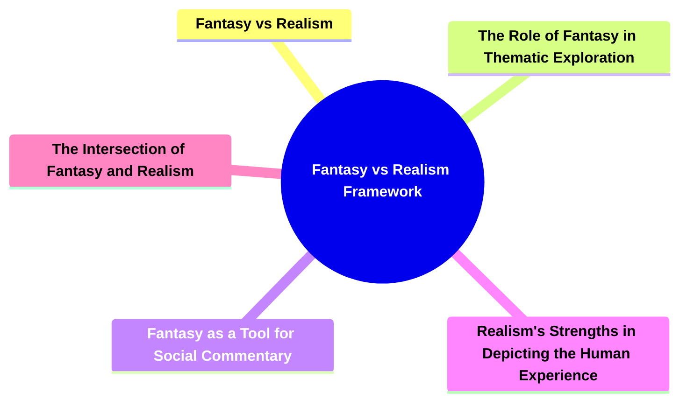

---

### 2. **Key Concepts**

#### 2.1. **Fantasy vs. Realism**
- **Definition**: Fantasy involves narratives that break from the rules of the real world, introducing impossible or supernatural elements like magic, alternate universes, and mythical creatures. Realism, on the other hand, is committed to representing life truthfully, focusing on ordinary, relatable experiences grounded in the observable world.


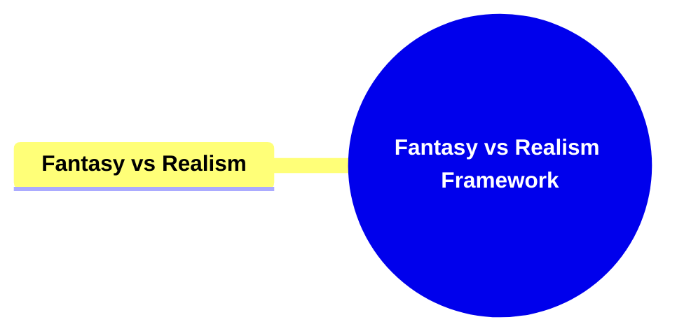


##### 2.1.1. **Components of Fantasy vs. Realism**

###### 2.1.1.1. **Imaginative**
  - **Definition**: Fantasy creates worlds and events beyond real-world logic, offering a space where the boundaries of reality are transcended and the impossible becomes possible.

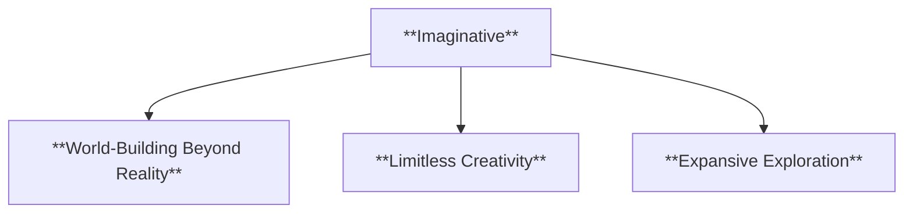

  - **Characteristics**:
    - **World-Building Beyond Reality**: The narrative introduces entirely new worlds, often with their own unique rules, landscapes, and histories that are separate from the real world.
    - **Limitless Creativity**: Fantasy allows for boundless creativity, where authors can construct scenarios, characters, and events that defy the laws of nature or reality.
    - **Expansive Exploration**: Fantasy often pushes the limits of human imagination, encouraging readers to explore themes, ideas, and possibilities that are not bound by the constraints of the physical world.


###### 2.1.1.2. **Supernatural Elements**
  - **Definition**: Features magic, mythical beings, or alternate realities, incorporating elements that do not exist in the real world to enrich the narrative and challenge the boundaries of reality.

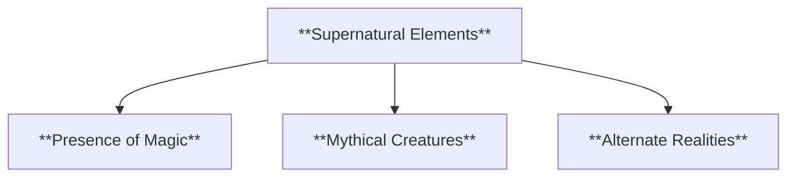


  - **Characteristics**:
    - **Presence of Magic**: The use of magical powers or phenomena that alter the rules of the world, often acting as key plot drivers or sources of conflict.
    - **Mythical Creatures**: Fantasy often includes beings like dragons, fairies, or otherworldly entities that enhance the sense of wonder and adventure in the story.
    - **Alternate Realities**: The narrative may take place in a parallel universe or dimension where the laws of physics or nature differ from those in the real world.


###### 2.1.1.3. **Grounded**
  - **Definition**: Realism depicts life as it is, focusing on everyday experiences and the observable world, where narratives are rooted in the ordinary and familiar.

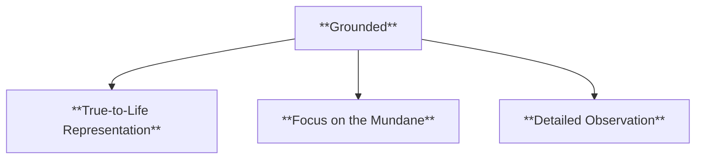

  - **Characteristics**:
    - **True-to-Life Representation**: Realism emphasizes the depiction of ordinary people and events, presenting the world in a way that closely mirrors real life.
    - **Focus on the Mundane**: The narrative often highlights the beauty, complexity, and struggles of everyday life, making the ordinary feel significant.
    - **Detailed Observation**: Realism relies on a careful and nuanced portrayal of social, political, and emotional aspects of human life, creating an immersive and relatable experience.


###### 2.1.1.4. **Believable**
  - **Definition**: Characters and settings in realism reflect the complexities of actual human life, portraying individuals and environments that feel authentic and relatable to the reader.

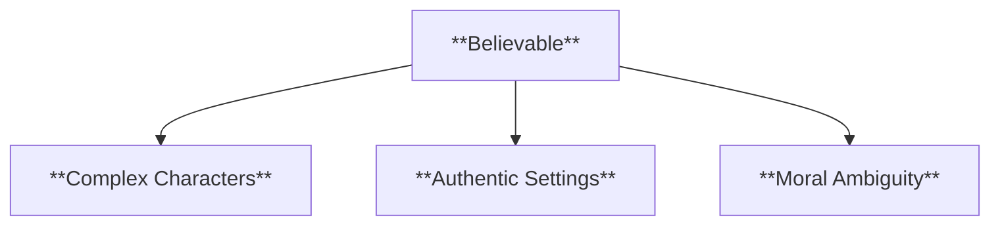

  - **Characteristics**:
    - **Complex Characters**: Characters are portrayed with depth and nuance, often grappling with real-world issues and emotions that resonate with readers.
    - **Authentic Settings**: The settings are described in detail, often mirroring real-world locations, environments, and social conditions to ground the story in a believable reality.
    - **Moral Ambiguity**: Realism often reflects the complexities of life, where characters make difficult decisions and outcomes are not always clear-cut, enhancing the believability of the narrative.

---
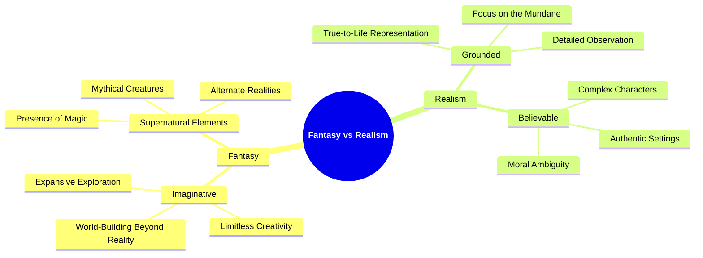

---

#### 2.2. **The Role of Fantasy in Thematic Exploration**
- **Definition**: Fantasy serves as a tool to examine complex, abstract themes beyond the limitations of realism.


  
##### 2.2.1. **Components of The Role of Fantasy in Thematic Exploration**

###### 2.2.1.1. **Expansive**
  - **Definition**: Fantasy broadens thematic scope, unbound by real-world constraints, allowing for the exploration of vast and diverse ideas that extend beyond the limitations of reality.

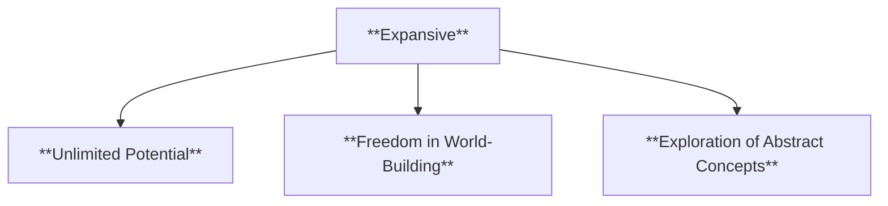

  - **Characteristics**:
    - **Unlimited Potential**: The lack of real-world restrictions enables fantasy to explore large-scale themes such as the nature of good and evil, the meaning of existence, or the infinite possibilities of different worlds.
    - **Freedom in World-Building**: Fantasy settings can be as expansive as the imagination allows, providing the opportunity to explore complex themes through new societies, creatures, and environments.
    - **Exploration of Abstract Concepts**: Fantasy often uses its limitless scope to delve into abstract or philosophical concepts, offering unique ways to interpret human experiences that go beyond what realism can offer.


###### 2.2.1.2. **Symbolic**
  - **Definition**: Fantasy often uses allegory or symbolism to explore deeper meanings, embedding layers of metaphor that reflect broader human experiences or societal concerns.

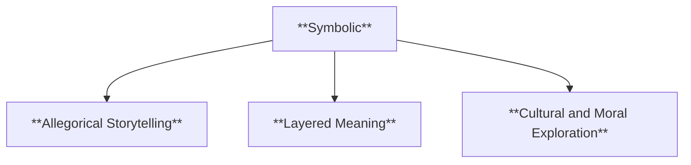

  - **Characteristics**:
    - **Allegorical Storytelling**: Fantasy narratives frequently use characters, events, or settings as symbols to represent larger ideas, such as the fight between good and evil, or the struggle for personal freedom.
    - **Layered Meaning**: Beneath the surface of fantastical elements lies symbolic representation, where magic, mythical creatures, or otherworldly events serve to express deeper themes or universal truths.
    - **Cultural and Moral Exploration**: Through symbolism, fantasy can reflect on cultural, social, or moral issues, often critiquing or mirroring real-world problems in an imaginative, metaphorical way.


---
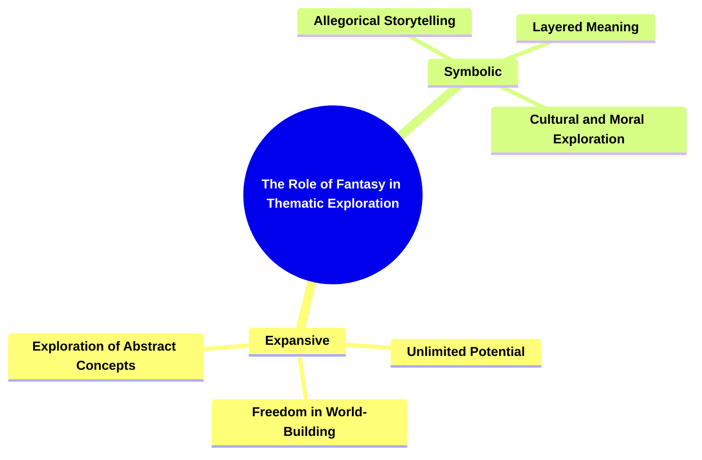

---

#### 2.3. **Fantasy as a Tool for Social Commentary**
- **Definition**: Despite its unreal settings, fantasy can provide sharp social critique by distancing real-world issues and presenting them in allegorical or metaphorical terms.

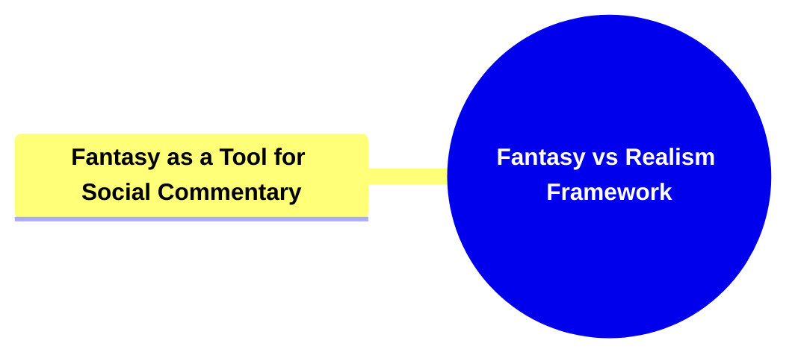


##### 2.3.1. **Components of Fantasy as a Tool for Social Commentary**

###### 2.3.1.1. **Detachment**
  - **Definition**: Creates distance from reality, allowing critical reflection on real-world issues by placing them in a fantastical or surreal context where they can be examined more freely.

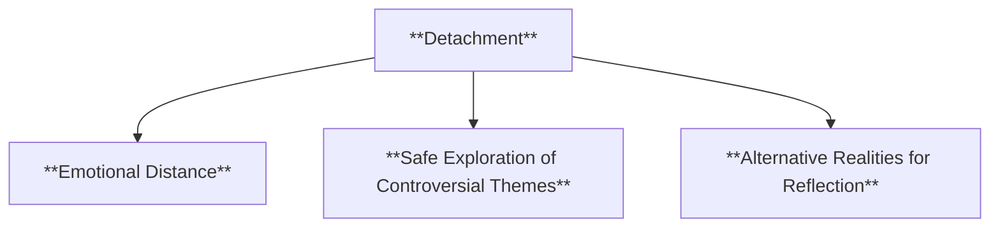

  - **Characteristics**:
    - **Emotional Distance**: By setting the narrative in a fantastical world, fantasy creates a buffer that allows readers to reflect on real-world issues without the immediate emotional weight or biases attached to them.
    - **Safe Exploration of Controversial Themes**: Fantasy enables the exploration of sensitive or controversial topics in a detached, imaginative setting, making it easier for readers to engage with difficult subjects from a fresh perspective.
    - **Alternative Realities for Reflection**: The distance from the real world encourages readers to reconsider societal norms or assumptions in light of the alternate realities presented.


###### 2.3.1.2. **Critical**
  - **Definition**: Fantasy can use surreal scenarios to critique societal structures, offering a fresh lens through which to question or challenge existing systems of power, culture, or morality.

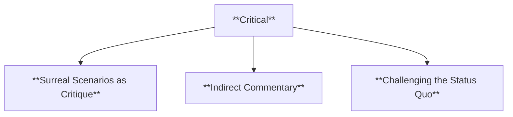

  - **Characteristics**:
    - **Surreal Scenarios as Critique**: Fantasy employs magical or surreal elements, such as alternate societies or supernatural events, to critique real-world institutions, hierarchies, or ideologies.
    - **Indirect Commentary**: Through allegory or metaphor, fantasy indirectly addresses societal issues such as inequality, corruption, or authoritarianism, allowing readers to engage with critical perspectives on familiar problems.
    - **Challenging the Status Quo**: Fantasy often questions the legitimacy of power structures or cultural norms, encouraging readers to rethink societal values by presenting alternative possibilities or highlighting injustices in exaggerated or symbolic forms.

---

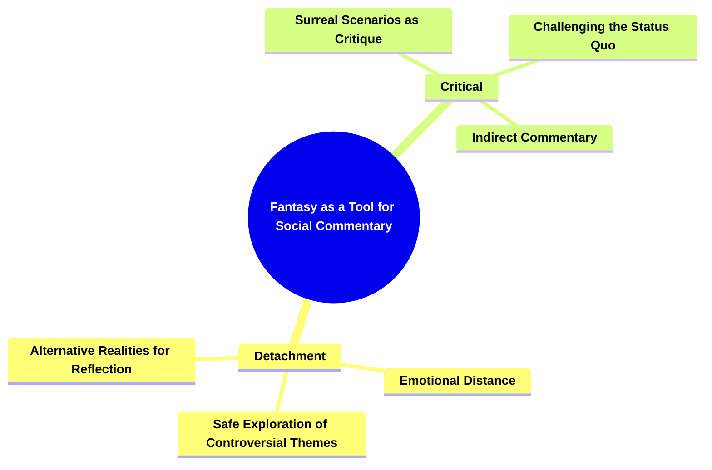
---


#### 2.4. **Realism’s Strengths in Depicting the Human Experience**
- **Definition**: Realism excels at depicting the human experience, offering a detailed and relatable portrayal of life's complexities.


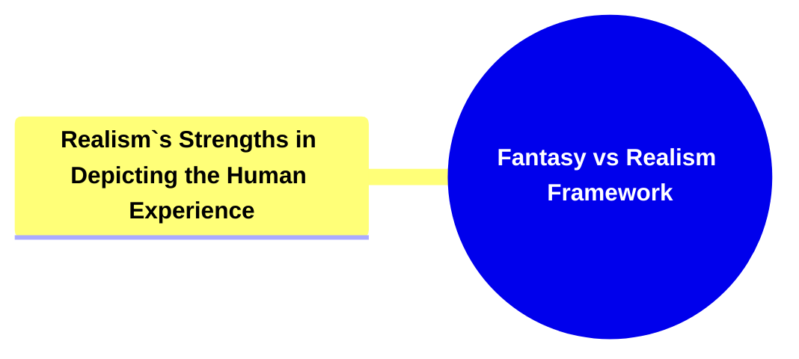


##### 2.4.1. **Components of Realism's Strengths in Depicting the Human Experience**

###### 2.4.1.1. **Authentic**
  - **Definition**: Reflects true-to-life situations and emotions, capturing the complexity and depth of real human experiences in a manner that feels genuine and believable.

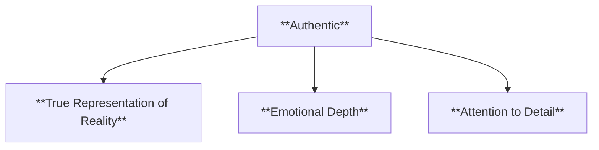

  - **Characteristics**:
    - **True Representation of Reality**: The narrative presents realistic depictions of everyday life, focusing on accurate portrayals of social, emotional, and psychological dynamics.
    - **Emotional Depth**: Characters are depicted with realistic emotions and responses to their circumstances, ensuring that their struggles, joys, and conflicts resonate with the audience on a genuine level.
    - **Attention to Detail**: Authenticity is achieved through a meticulous portrayal of settings, relationships, and life events that mirror the complexities of real life.


###### 2.4.1.2. **Relatable**
  - **Definition**: Offers experiences that are immediately recognizable to readers, making it easy for them to connect with the characters, situations, and themes of the story.

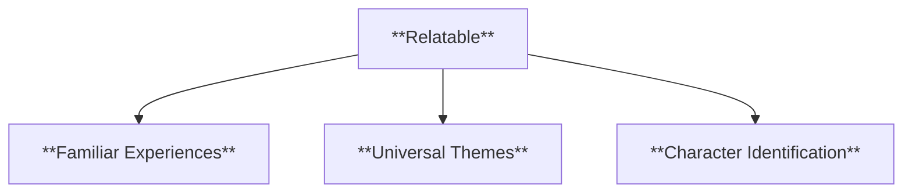


  - **Characteristics**:
    - **Familiar Experiences**: The narrative draws on situations and emotions that are common in everyday life, allowing readers to see themselves in the characters or scenarios.
    - **Universal Themes**: Relatable stories often explore themes such as love, loss, friendship, and conflict, which are familiar to most readers, fostering a sense of connection and empathy.
    - **Character Identification**: Readers can easily identify with the characters’ dilemmas, choices, and growth, as they reflect real-life challenges and decisions, creating a deeper emotional engagement with the story.

---

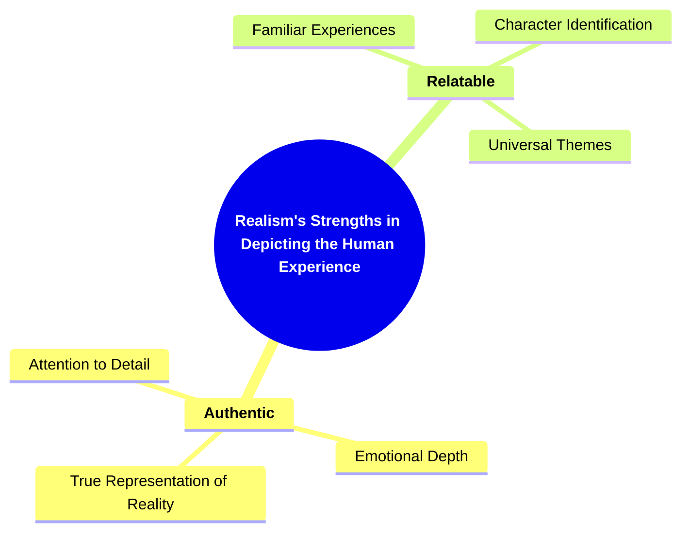

---

#### 2.5. **The Intersection of Fantasy and Realism**
- **Definition**: Some works blend fantasy and realism, creating narratives that blur the boundaries between the two, enhancing the depth of the story.

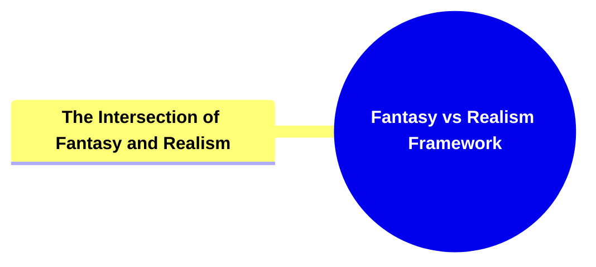


##### 2.5.1. **Components of The Intersection of Fantasy and Realism**

###### 2.5.1.1. **Hybrid**
  - **Definition**: Combines realistic settings with fantastical elements, blending the familiar world of realism with imaginative, magical, or supernatural components to create a unique narrative that straddles both genres.

```mermaid
flowchart TD;
    A[**Hybrid**] --> B[**Realistic Foundation with Fantastical Intrusion**];
    A --> C[**Seamless Integration**];
    A --> D[**Dual Reality**];
```

  - **Characteristics**:
    - **Realistic Foundation with Fantastical Intrusion**: The narrative is grounded in a realistic world that is recognizable to readers, but introduces fantastical elements—such as magic, mythical beings, or supernatural events—into the setting.
    - **Seamless Integration**: Fantasy and realism coexist in the story without feeling disjointed, creating a narrative where the ordinary and the extraordinary blend together naturally.
    - **Dual Reality**: The hybrid nature allows for exploration of both real-world concerns and otherworldly possibilities, giving the story a wider scope and broader thematic potential.


###### 2.5.1.2. **Layered**
  - **Definition**: Fantasy within realism deepens narrative complexity, adding multiple layers of meaning by juxtaposing real-world concerns with fantastical elements that often serve as metaphors or allegories.

```mermaid
flowchart TD;
    E[**Layered**] --> F[**Multiple Levels of Interpretation**];
    E --> G[**Complexity of Themes**];
    E --> H[**Rich Symbolism**];
```

  - **Characteristics**:
    - **Multiple Levels of Interpretation**: The combination of realism and fantasy allows for different interpretations of the narrative, where the fantastical elements provide symbolic or metaphorical depth to the realistic plotlines.
    - **Complexity of Themes**: By layering fantasy over realism, the narrative explores more complex themes, such as the clash between reality and imagination, or the impact of the supernatural on everyday life.
    - **Rich Symbolism**: The fantastical elements often symbolize deeper emotional, psychological, or philosophical ideas, creating a richer and more nuanced reading experience that goes beyond the surface narrative.

---

```mermaid
mindmap
  root((**The Intersection of Fantasy and Realism**))
    **Hybrid**
      **Realistic Foundation with Fantastical Intrusion**
      **Seamless Integration**
      **Dual Reality**
    **Layered**
      **Multiple Levels of Interpretation**
      **Complexity of Themes**
      **Rich Symbolism**
```

---
```mermaid
mindmap
  root((**Fantasy vs Realism Framework**))
    **Fantasy vs Realism**
      **Imaginative**
        World-Building Beyond Reality
        Limitless Creativity
        Expansive Exploration
      **Supernatural Elements**
        Presence of Magic
        Mythical Creatures
        Alternate Realities
      **Grounded**
        True-to-Life Representation
        Focus on the Mundane
        Detailed Observation
      **Believable**
        Complex Characters
        Authentic Settings
        Moral Ambiguity
    **The Role of Fantasy in Thematic Exploration**
      **Expansive**
        Unlimited Potential
        Freedom in World-Building
        Exploration of Abstract Concepts
      **Symbolic**
        Allegorical Storytelling
        Layered Meaning
        Cultural and Moral Exploration
    **Fantasy as a Tool for Social Commentary**
      **Detachment**
        Emotional Distance
        Safe Exploration of Controversial Themes
        Alternative Realities for Reflection
      **Critical**
        Surreal Scenarios as Critique
        Indirect Commentary
        Challenging the Status Quo
    **Realism's Strengths in Depicting the Human Experience**
      **Authentic**
        True Representation of Reality
        Emotional Depth
        Attention to Detail
      **Relatable**
        Familiar Experiences
        Universal Themes
        Character Identification
    **The Intersection of Fantasy and Realism**
      **Hybrid**
        Realistic Foundation with Fantastical Intrusion
        Seamless Integration
        Dual Reality
      **Layered**
        Multiple Levels of Interpretation
        Complexity of Themes
        Rich Symbolism

```

---

### 3. **Theoretical Significance in Narratology**
Forster’s framework on fantasy and realism highlights a crucial theoretical distinction in narratology—the balance between the depiction of reality and the boundless possibilities of imagination. His exploration sheds light on how both modes can serve different narrative functions, with realism focusing on the tangible and familiar, while fantasy opens up creative avenues to explore abstract ideas, alternate realities, and deeper psychological truths. Forster’s contribution underscores the versatility of literary forms in representing different aspects of the human experience.

---

### 4. **Conclusion**
Forster’s exploration of fantasy vs. realism underscores the value of both literary modes. Realism provides an authentic reflection of the world as we know it, while fantasy extends beyond reality, offering limitless imaginative possibilities. Together, these forms contribute to a fuller exploration of the human condition, with realism grounding readers in the familiar, and fantasy expanding their perception of what is possible in literature and life. This duality enriches the reader’s experience and allows for a deeper understanding of
