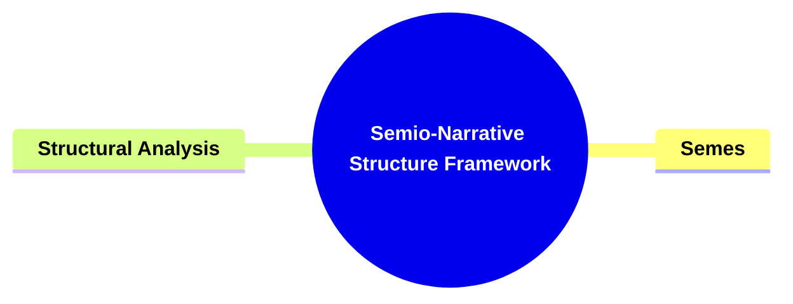
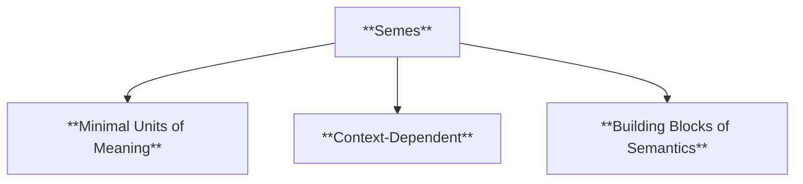
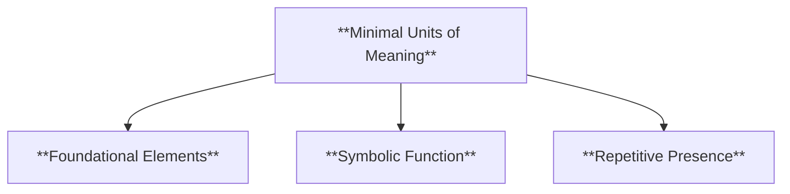
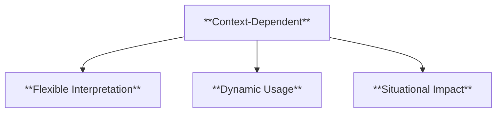
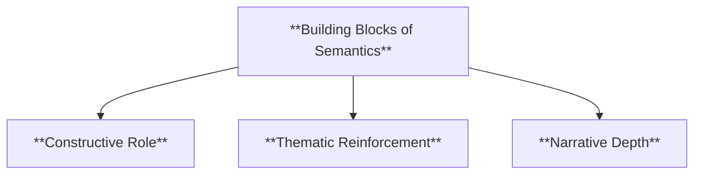
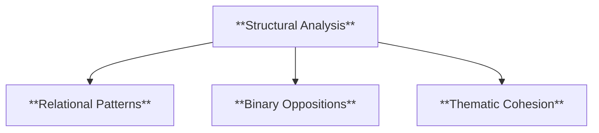
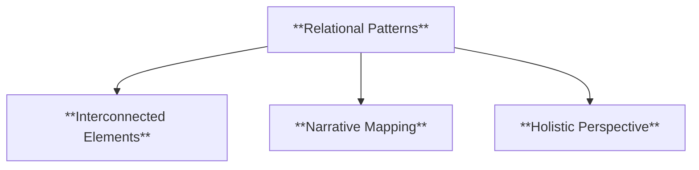
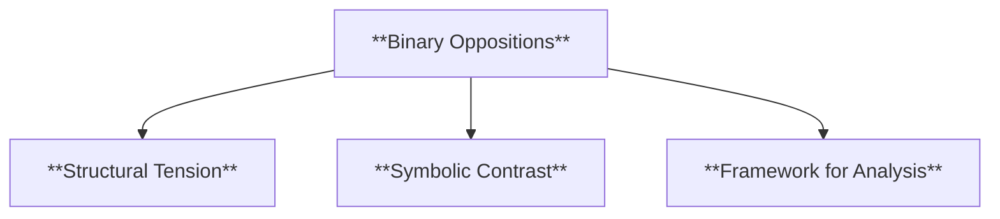
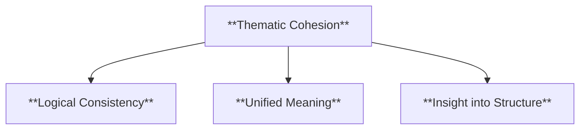
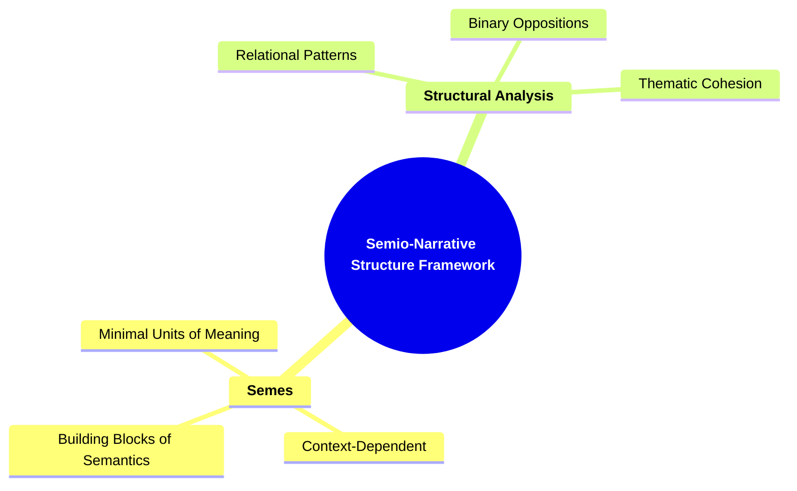

- [1. Title: **Greimas's Semio-Narrative Structure Framework**](#1-title-greimass-semio-narrative-structure-framework)
- [2. Key Concepts](#2-key-concepts)
  - [2.1. Semes](#21-semes)
    - [2.1.1. **Components of Semes**](#211-components-of-semes)
      - [2.1.1.1. **Minimal Units of Meaning**](#2111-minimal-units-of-meaning)
      - [2.1.1.2. **Context-Dependent**](#2112-context-dependent)
      - [2.1.1.3. **Building Blocks of Semantics**](#2113-building-blocks-of-semantics)
  - [2.2. Structural Analysis](#22-structural-analysis)
    - [2.2.1. **Components of Structural Analysis**](#221-components-of-structural-analysis)
      - [2.2.1.1. **Relational Patterns**](#2211-relational-patterns)
      - [2.2.1.2. **Binary Oppositions**](#2212-binary-oppositions)
      - [2.2.1.3. **Thematic Cohesion**](#2213-thematic-cohesion)
- [3. Theoretical Significance](#3-theoretical-significance)

---

---

---

### 1. Title: **Greimas's Semio-Narrative Structure Framework**

**The Semio-Narrative Structure**:
**Definition**: Algirdas Julien Greimas introduces the concept of the _semio-narrative structure_, a theoretical framework for understanding how meaning is generated and conveyed in narratives. According to Greimas, narratives are composed of fundamental units of meaning, known as semes, which are systematically organized into larger structures. These structures are interlinked through various relations, allowing for the complex generation, transmission, and interpretation of meaning within a narrative.

---

### 2. Key Concepts

#### 2.1. Semes

**Definition**:
Semes are the smallest indivisible units of meaning within a narrative. They function as the fundamental building blocks or atoms of the narrative’s semantic content, with each seme contributing a specific meaning or connotation to the larger narrative structure.

##### 2.1.1. **Components of Semes**

###### 2.1.1.1. **Minimal Units of Meaning**

- **Definition**: Semes are the most basic elements that carry meaning in a narrative, often manifesting as single words, images, or phrases.

- **Characteristics**
  - **Foundational Elements**: Serve as the smallest meaningful components that combine to form a coherent narrative.
  - **Symbolic Function**: Can represent ideas or emotions that add depth to the story when interpreted collectively.
  - **Repetitive Presence**: Often appear repeatedly to reinforce certain concepts or themes throughout the narrative.

###### 2.1.1.2. **Context-Dependent**

- **Definition**: The meaning of a seme is not fixed; it can vary depending on its context within the narrative.

- **Characteristics**
  - **Flexible Interpretation**: Changes in meaning based on the surrounding text or plot developments.
  - **Dynamic Usage**: Shifts its significance as the story evolves, contributing to the reader’s understanding of character or plot.
  - **Situational Impact**: The seme’s effect depends on where and how it is used within the story, affecting its thematic relevance.

###### 2.1.1.3. **Building Blocks of Semantics**

- **Definition**: Semes combine to create more complex units of meaning, contributing to the overall thematic and semantic coherence of a narrative.

- **Characteristics**
  - **Constructive Role**: Combine with other semes to build larger narrative units, like themes or symbols.
  - **Thematic Reinforcement**: Help create consistent themes by appearing in varied forms throughout the story.
  - **Narrative Depth**: Contribute to the richness of the narrative by layering meaning through repetition and combination.

---

#### 2.2. Structural Analysis

**Definition**:
Structural analysis in the semio-narrative framework examines the relationships and interactions between semes to understand how they contribute to the overall meaning of the narrative.

##### 2.2.1. **Components of Structural Analysis**

###### 2.2.1.1. **Relational Patterns**

- **Definition**: Structural analysis looks at how semes relate to one another, forming larger narrative structures like themes, motifs, and symbols.

- **Characteristics**
  - **Interconnected Elements**: Examines how individual semes connect to create cohesive themes or motifs within the narrative.
  - **Narrative Mapping**: Identifies relationships among various components to understand the structure of the story.
  - **Holistic Perspective**: Provides a view of how smaller units contribute to the overall meaning of the narrative.

###### 2.2.1.2. **Binary Oppositions**

- **Definition**: A key aspect is identifying binary oppositions (e.g., life/death, good/evil) that organize the narrative into contrasting elements.

- **Characteristics**
  - **Structural Tension**: Creates conflicts and contrasts that drive the narrative forward and deepen the reader’s engagement.
  - **Symbolic Contrast**: Highlights themes by positioning ideas or characters against each other to create meaning.
  - **Framework for Analysis**: Serves as a basis for understanding the narrative’s deeper philosophical or thematic structures.

###### 2.2.1.3. **Thematic Cohesion**

- **Definition**: Structural analysis reveals the underlying logic and thematic cohesion of the narrative.

- **Characteristics**
  - **Logical Consistency**: Shows how different narrative elements work together to reinforce a central theme.
  - **Unified Meaning**: Demonstrates how recurring motifs and patterns contribute to a seamless narrative experience.
  - **Insight into Structure**: Offers an understanding of how narrative elements align to present a coherent and compelling story.

---

---

### 3. Theoretical Significance

**Definition**:
Greimas's _semio-narrative structure_ framework is a key development in narrative theory, particularly within semiotics. It provides a systematic approach to analyzing the generation and organization of meaning in narratives, enabling the decoding of complex stories into their fundamental elements.

**Contextualization**:
This framework has had a significant impact on the study of narrative, especially in literary theory, film studies, and media analysis. Greimas’s approach helps scholars and critics dissect narratives, revealing the intricate ways in which meaning is constructed and communicated to the audience.

**Supporting Information**:

- **Influence on Structuralism**: Greimas's work contributed to the broader structuralist movement, which sought to uncover universal structures underlying human expression, including language and culture.
- **Semiotics and Media Analysis**: The semio-narrative structure framework has influenced narrative semiotics and is used to analyze literary texts, films, advertisements, and media.
- **Critical Reception**: While widely adopted for its systematic approach, some critique Greimas’s framework for its focus on structure over reader interpretation.

---
