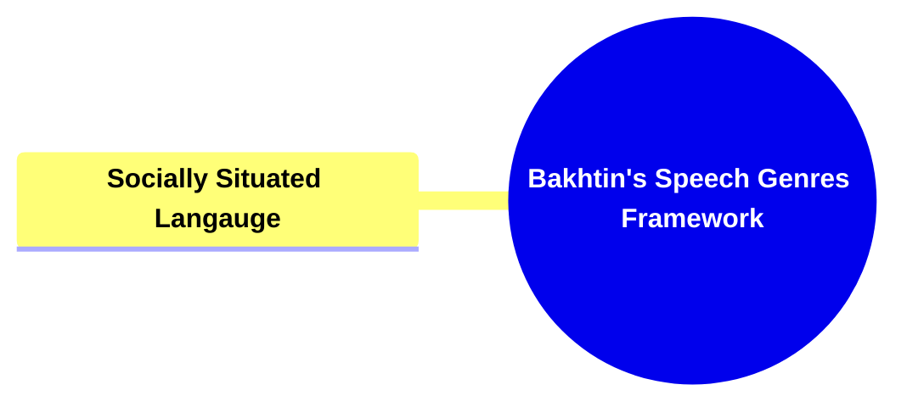
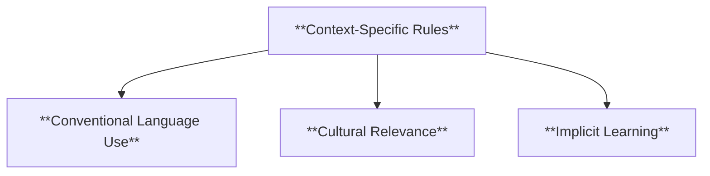
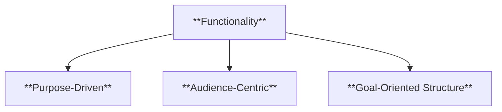
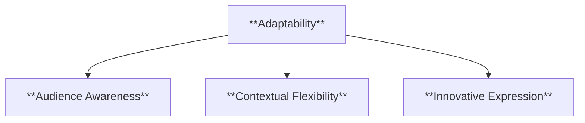
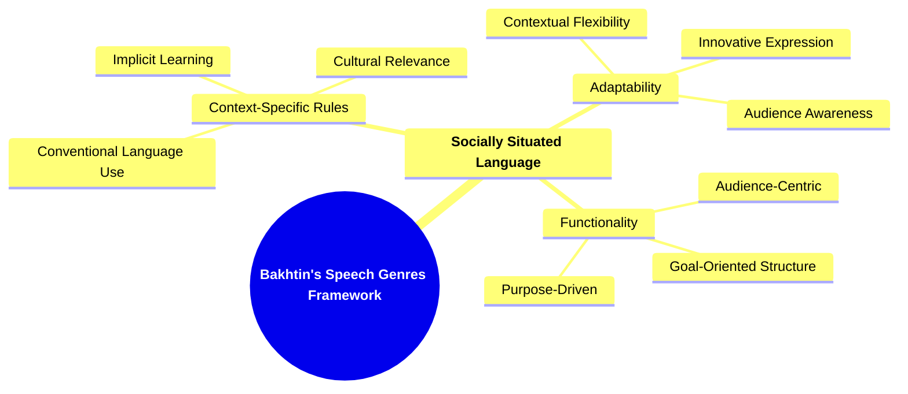

- [1. Title: **Bakhtin's Speech Genres Framework**](#1-title-bakhtins-speech-genres-framework)
- [2. **Key Concepts**:](#2-key-concepts)
  - [2.1. **Socially Situated Language**:](#21-socially-situated-language)
    - [2.1.1. **Components of Socially Situated Language**](#211-components-of-socially-situated-language)
      - [2.1.1.1. **Context-Specific Rules**](#2111-context-specific-rules)
      - [2.1.1.2. **Functionality**](#2112-functionality)
      - [2.1.1.3. **Adaptability**](#2113-adaptability)
- [3. **Theoretical Significance**:](#3-theoretical-significance)

---

---

### 1. Title: **Bakhtin's Speech Genres Framework**

- **Speech Genres**:
  - **Definition**: Mikhail Bakhtin’s concept of _speech genres_ refers to the various forms and styles of speech that are used in different social contexts. Unlike the more general idea of genres in literature, speech genres are specific to the types of communication that occur in everyday life, professional settings, and cultural rituals. Each speech genre is shaped by its particular social context and serves distinct communicative purposes, influencing both how language is used and how it is interpreted by others. Bakhtin’s exploration of speech genres broadens the understanding of language by highlighting its inherently social nature and the ways in which communication is tailored to specific contexts and functions.

### 2. **Key Concepts**:

#### 2.1. **Socially Situated Language**:

- **Definition**: Socially situated language refers to the idea that language use is deeply embedded in the social environment in which it occurs. Each speech genre has its own set of rules, conventions, and expectations that guide how language is produced and understood in a given context. These rules govern everything from the choice of vocabulary and tone to the structure of sentences and the forms of address. For example, the language used in a legal setting, a scientific conference, or a casual conversation with friends will differ significantly, reflecting the social norms and communicative goals of each context.

##### 2.1.1. **Components of Socially Situated Language**

###### 2.1.1.1. **Context-Specific Rules**

- **Definition**: Each speech genre has unique conventions that dictate appropriate language use, including formality, terminology, and structure. These rules are often implicit and are learned through social interaction and cultural immersion.

- **Characteristics**
  - **Conventional Language Use**: Follows established norms specific to the context, such as professional jargon or casual language.
  - **Cultural Relevance**: Reflects cultural practices and social expectations, guiding how speakers communicate effectively.
  - **Implicit Learning**: Acquired through social exposure and participation, often without formal instruction.

###### 2.1.1.2. **Functionality**

- **Definition**: Speech genres are functional, meaning they are designed to fulfill specific purposes within a social context. For instance, the genre of a business meeting is oriented towards decision-making and information exchange, while a wedding toast is geared towards celebration and emotional expression.

- **Characteristics**
  - **Purpose-Driven**: Each genre has a clear goal, such as informing, persuading, or entertaining, that shapes the language and structure used.
  - **Audience-Centric**: Tailored to meet the needs and expectations of the intended audience, enhancing communication effectiveness.
  - **Goal-Oriented Structure**: Organized in a way that best achieves its intended function, like a logical order in presentations or an emotive flow in speeches.

###### 2.1.1.3. **Adaptability**

- **Definition**: While speech genres have established conventions, they are also adaptable. Speakers can modify their language to suit different audiences or purposes, demonstrating the flexibility of language within social contexts.

- **Characteristics**
  - **Audience Awareness**: Adjusts language, tone, and formality based on the audience’s background and expectations.
  - **Contextual Flexibility**: Adapts to shifts in social or situational context, showing the speaker’s ability to navigate different communicative needs.
  - **Innovative Expression**: Allows for creative modifications while maintaining the core characteristics of the speech genre.

### 3. **Theoretical Significance**:

- **Impact on Discourse Analysis**: Bakhtin’s Speech Genres Framework has had a profound influence on discourse analysis, a field that studies how language is used in social contexts. By introducing the concept of speech genres, Bakhtin provided a tool for understanding how language functions differently across various social settings. This framework has been particularly useful in analyzing how power dynamics, social roles, and cultural norms are reflected in and reinforced by language use. Speech genres offer a way to categorize and analyze the diverse forms of communication that occur in everyday life, professional environments, and cultural practices, revealing the underlying social structures that shape discourse.
- **Application Across Disciplines**: While Bakhtin’s concept of speech genres originated in the study of literature and linguistics, it has been applied across a range of disciplines, including sociology, anthropology, communication studies, and education. In sociology and anthropology, speech genres are used to explore how language reflects and constructs social identities, cultural practices, and power relations. In communication studies, the concept is applied to analyze how different media and communication technologies influence the genres of speech that are used in digital environments, such as social media, email, and online forums. In education, understanding speech genres helps in teaching students how to navigate different communicative contexts, from academic writing to public speaking.
- **Supporting Information**:
  - **Interdisciplinary Influence**: Bakhtin’s framework has influenced fields such as cultural studies and media studies, where the analysis of speech genres is used to understand how language and communication practices vary across different cultural and media contexts. For example, the way language is used in political speeches, advertising, or news reporting can be studied as distinct speech genres, each with its own conventions and effects on the audience. In addition, speech genres are relevant in the study of multilingualism and cross-cultural communication, where different linguistic and cultural norms interact and sometimes clash.
  - **Critiques and Further Development**: While Bakhtin’s Speech Genres Framework is highly influential, some critics argue that it may overemphasize the stability and predictability of genres, potentially overlooking the fluid and evolving nature of language use. However, Bakhtin himself acknowledged that speech genres are not static; they are subject to change as social contexts evolve. Further developments in the study of speech genres have focused on how these genres adapt to new forms of communication, such as digital and hybrid genres that blend elements from different contexts. Despite these critiques, Bakhtin’s framework remains a foundational concept in the study of language and communication, offering valuable insights into the social dimensions of language use.

---

