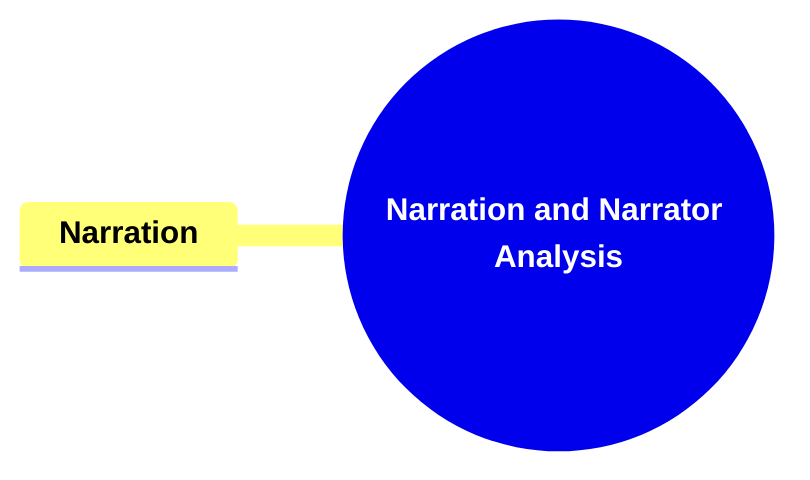
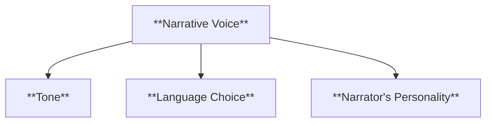
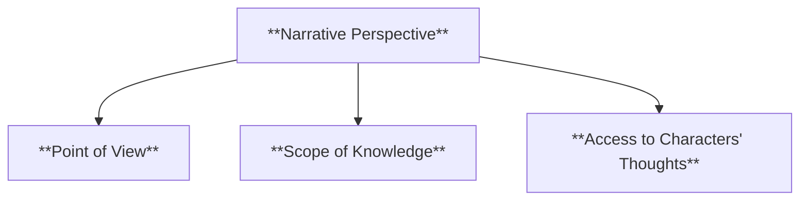
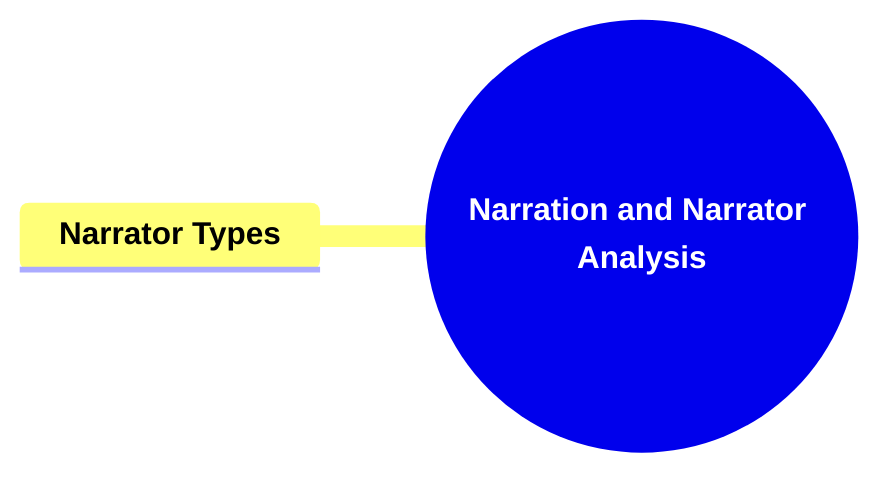
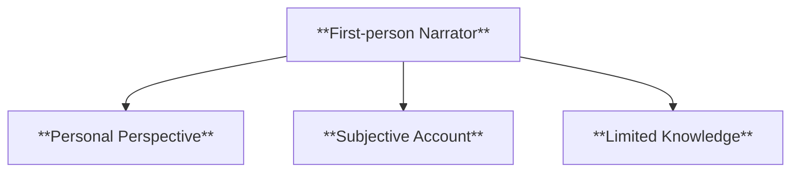
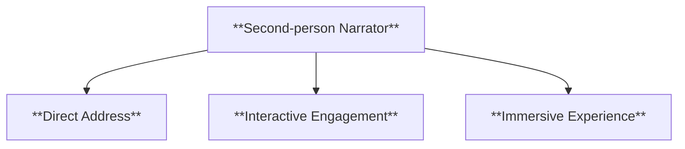
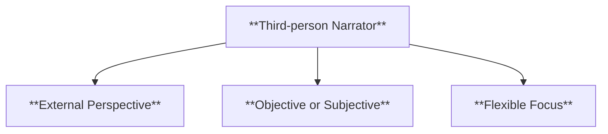
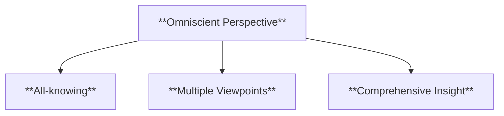
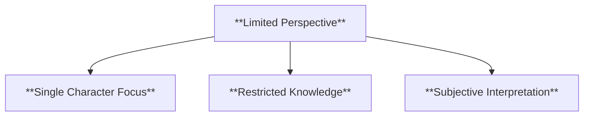
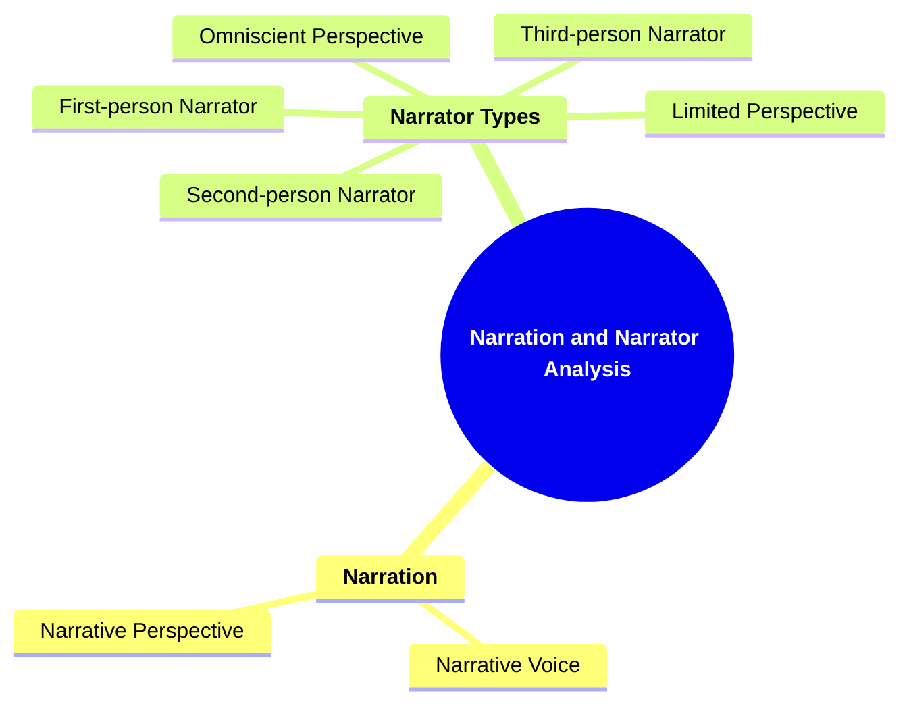

# 06 NA-3402 NARRATION AND NARRATOR ANALYSIS

### **Narration and Narrator Analysis**

- **Identifying who tells the story and examining their role, perspective, and reliability. This includes:**
  - **First-person Narrator**
  - **Second-person Narrator**
  - **Third-person Narrator**
  - **Omniscient and Limited Perspectives**

---

### **Key Concepts**

---

#### **Narration**

- **Definition**:
  - In narratology, narration refers to the method by which a story is conveyed to the audience. It encompasses the perspective, voice, and reliability of the storyteller, shaping how the narrative is perceived and interpreted.

##### **Components of Narration**

###### **Narrative Voice**

- **Definition**:
  - The distinctive style or persona through which the story is told. It includes elements like tone, language choice, and the narrator's personality.

- **Characteristics**:
  - **Tone**: The attitude conveyed by the narrator, such as sarcastic, formal, or humorous.
  - **Language Choice**: The selection of words and sentence structures that reflect the narrator's style.
  - **Narrator's Personality**: Traits and behaviors that define the narrator's character and influence the storytelling.

###### **Narrative Perspective**

- **Definition**:
  - The vantage point from which the story is told, determining the amount of information the audience receives and the level of insight into characters' thoughts and feelings.

- **Characteristics**:
  - **Point of View**: First-person, second-person, or third-person perspectives that shape the narrative angle.
  - **Scope of Knowledge**: Determines whether the narrator knows all, some, or limited information about the story events.
  - **Access to Characters' Thoughts**: Indicates whether the narrator can reveal the inner thoughts and emotions of characters.

---

#### **Narrator Types**

- **Definition**:
  - Classification of narrators based on their position relative to the story and the extent of their knowledge and reliability.

##### **Components of Narrator Types**

###### **First-person Narrator**

- **Definition**:
  - A narrator who tells the story from their own perspective, using first-person pronouns like "I" and "we." This narrator is typically a character within the story.

- **Characteristics**:
  - **Personal Perspective**: The story is filtered through the narrator's personal experiences and emotions.
  - **Subjective Account**: The narrator's biases and opinions influence the portrayal of events.
  - **Limited Knowledge**: The narrator only knows what they have experienced or observed.

###### **Second-person Narrator**

- **Definition**:
  - A narrator who addresses the audience directly using the second-person pronoun "you," making the reader a participant in the story.

- **Characteristics**:
  - **Direct Address**: The narrator speaks directly to the reader, creating a sense of involvement.
  - **Interactive Engagement**: Encourages the reader to imagine themselves within the narrative.
  - **Immersive Experience**: Enhances the feeling of being part of the story.

###### **Third-person Narrator**

- **Definition**:
  - A narrator who tells the story from an external perspective, using third-person pronouns like "he," "she," and "they." This narrator is not a character within the story.

- **Characteristics**:
  - **External Perspective**: Observes and describes events without being directly involved.
  - **Objective or Subjective**: Can maintain an unbiased stance or exhibit personal opinions.
  - **Flexible Focus**: Can shift attention between different characters and events.

###### **Omniscient Perspective**

- **Definition**:
  - A narrator who possesses complete knowledge of all aspects of the story, including characters' thoughts, feelings, and unseen events.

- **Characteristics**:
  - **All-knowing**: The narrator has access to all information within the story world.
  - **Multiple Viewpoints**: Can present the thoughts and feelings of various characters.
  - **Comprehensive Insight**: Provides a thorough understanding of events and motivations.

###### **Limited Perspective**

- **Definition**:
  - A narrator who has restricted knowledge, typically limited to the experiences and thoughts of a single character.

- **Characteristics**:
  - **Single Character Focus**: The narrative is confined to one character's viewpoint.
  - **Restricted Knowledge**: The narrator only knows what the focal character knows or perceives.
  - **Subjective Interpretation**: The story is influenced by the narrator's personal biases and misunderstandings.

---

### **Theoretical Significance**

- **Understanding Narrator Roles**:
  - Analyzing different types of narrators and their perspectives is fundamental in narratology for comprehending how stories are conveyed and how they influence the audience's perception.
- **Impact on Storytelling**:
  - The choice of narrator affects the reliability of the narrative, the depth of character development, and the overall engagement of the audience. It shapes the way information is revealed and how themes are explored.
- **Enhancing Critical Analysis**:
  - Differentiating between various narrative voices and perspectives allows scholars to dissect the effectiveness of storytelling techniques and the interplay between narrator and audience. It facilitates a deeper understanding of the narrative's construction and its intended impact.
- **Influence on Reader Interpretation**:
  - The narrator's reliability and perspective guide the reader's interpretation of events and characters. Understanding the narrator's role helps in identifying biases, uncovering hidden meanings, and appreciating the complexity of the narrative structure.

---

