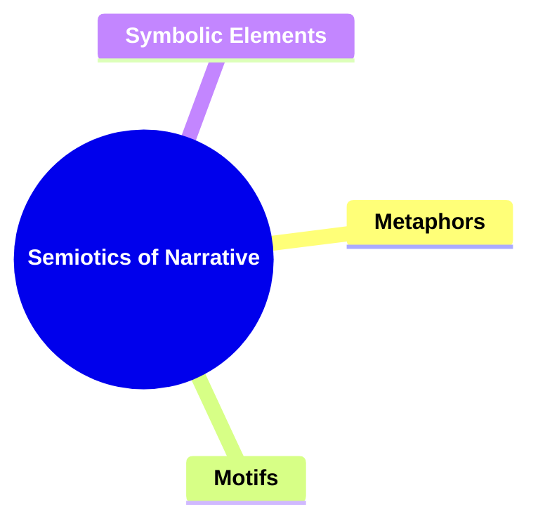
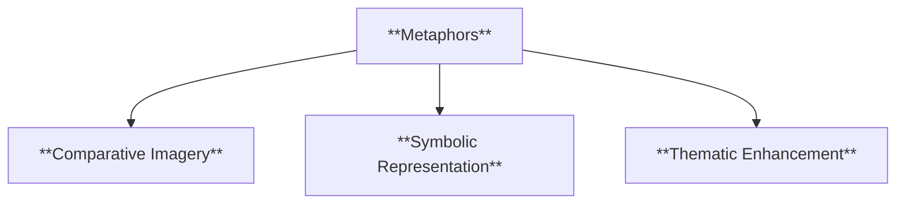
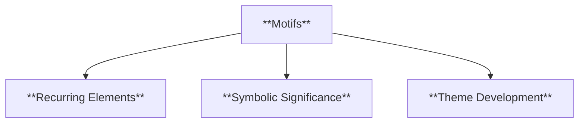
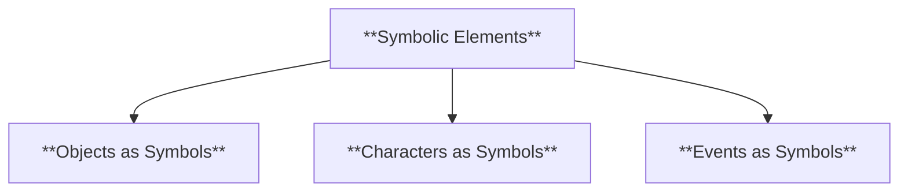
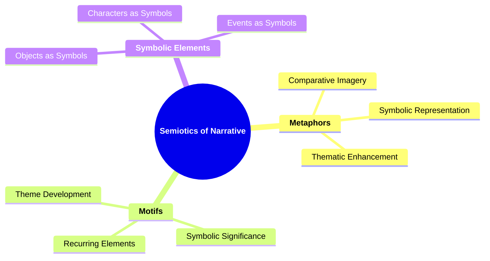

# 15 SN-3504 SEMIOTICS OF NARRATIVE

### **Semiotics of Narrative**

- **Studying the signs and symbols within a narrative and their contribution to meaning.**
  - **Focus**:
    - **Metaphors**
    - **Motifs**
    - **Symbolic Elements**
  - **Importance**: Explores how connections add layers of meaning.

---

### **Key Concepts**

---

#### **Semiotics of Narrative**

- **Definition**:
  - In narratology, **semiotics of narrative** refers to the study of signs and symbols within a narrative and how they contribute to the creation of meaning. This involves analyzing the use of metaphors, motifs, and other symbolic elements to understand the deeper layers of the story and the messages conveyed by the narrative.

##### **Components of Semiotics of Narrative**

###### **Metaphors**

- **Definition**:
  - Metaphors are figures of speech that describe an object or action in a way that isn’t literally true but helps explain an idea or make a comparison. In narratives, metaphors are used to convey deeper meanings and enhance the thematic elements of the story.

- **Characteristics**:
  - **Comparative Imagery**: Uses comparison between unlike things to highlight particular qualities.
  - **Symbolic Representation**: Represents abstract ideas through concrete images.
  - **Thematic Enhancement**: Strengthens the underlying themes by providing symbolic depth.

###### **Motifs**

- **Definition**:
  - Motifs are recurring elements, such as images, sounds, actions, or ideas, that have symbolic significance in a narrative. They help to develop and inform the theme and contribute to the narrative’s overall coherence.

- **Characteristics**:
  - **Recurring Elements**: Appear multiple times throughout the narrative, reinforcing their significance.
  - **Symbolic Significance**: Carry deeper meanings that relate to the narrative’s themes.
  - **Theme Development**: Aid in the exploration and reinforcement of central themes.

###### **Symbolic Elements**

- **Definition**:
  - Symbolic elements are objects, characters, or events that represent larger ideas, concepts, or themes within the narrative. They are used to convey complex meanings and enhance the narrative’s depth.

- **Characteristics**:
  - **Objects as Symbols**: Inanimate objects represent abstract concepts or ideas.
  - **Characters as Symbols**: Characters embody specific traits, ideologies, or thematic elements.
  - **Events as Symbols**: Significant events symbolize broader themes or ideas within the narrative.

---

### **Theoretical Significance**

- **Interpreting Symbolic Meanings**:

  - Semiotics of narrative allows for the interpretation of complex symbolic meanings within a story, providing deeper insights into the themes and messages conveyed by the narrative.

- **Enhancing Thematic Depth**:

  - Analyzing metaphors, motifs, and symbolic elements contributes to the thematic richness of the narrative, allowing for a more profound exploration of its core ideas.

- **Facilitating Critical Analysis**:

  - Understanding the use of signs and symbols aids scholars in critically analyzing how narratives construct meaning and engage readers through symbolic representation.

- **Influence on Reader Interpretation**:
  - Symbolic elements guide readers to interpret and find deeper meanings within the narrative, enhancing their engagement and connection with the story.

---

