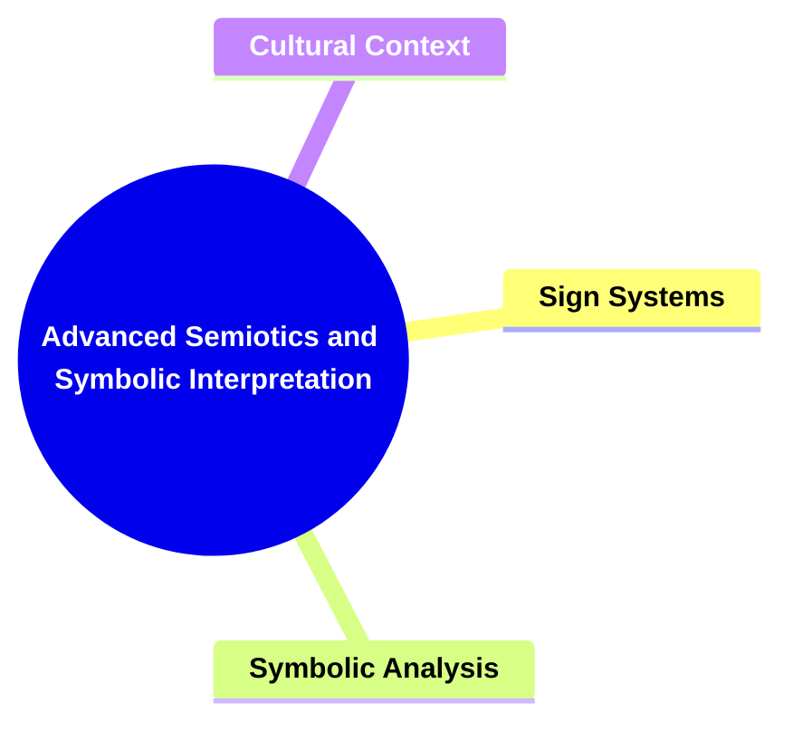
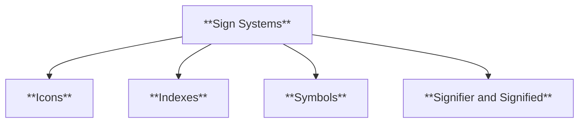
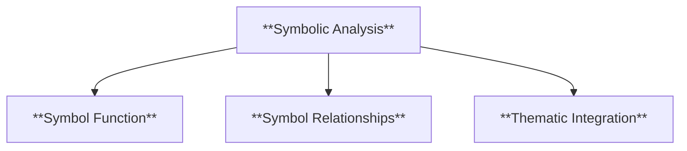
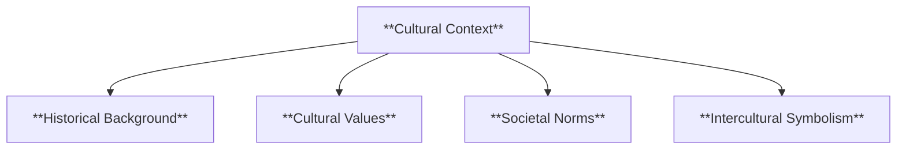
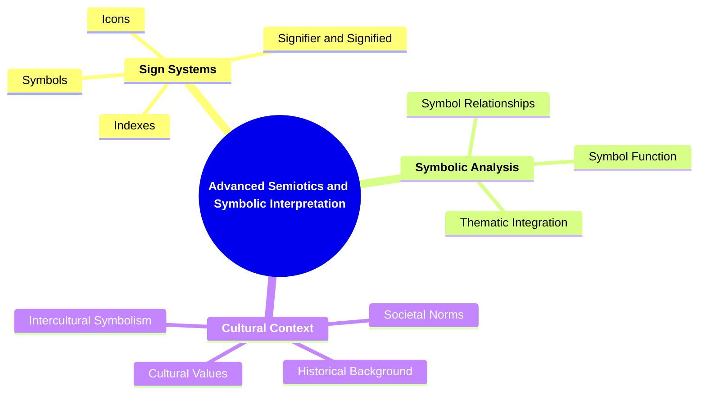

# 21 AS-3601 ADVANCED SEMIOTICS AND SYMBOLIC INTERPRETATION

### **Advanced Semiotics and Symbolic Interpretation**

- **Deep exploration of symbols and signs within cultural and historical contexts.**
  - **Application**: Interpreting complex symbolic systems in narratives.
  - **Importance**: Requires extensive knowledge of semiotics and cultural studies.

---

### **Key Concepts**

---

#### **Advanced Semiotics and Symbolic Interpretation**

- **Definition**:
  - In narratology, **advanced semiotics and symbolic interpretation** involve a thorough analysis of the signs and symbols embedded within a narrative. This includes understanding how symbols function within the story, their relationships to cultural and historical contexts, and their contributions to the overall meaning and themes of the narrative. Advanced semiotic analysis delves into the intricate systems of signs that convey deeper layers of meaning, enabling a more profound comprehension of the narrative's complexities.

##### **Components of Advanced Semiotics and Symbolic Interpretation**

###### **Sign Systems**

- **Definition**:
  - **Sign systems** are structured networks of signs that operate within a narrative to convey meaning. These systems consist of various sign types, including icons, indexes, and symbols, each playing a distinct role in the communication of ideas and themes.

- **Characteristics**:
  - **Icons**: Signs that resemble their referents, allowing for direct association (e.g., a photograph representing a person).
  - **Indexes**: Signs that indicate or point to something else, often based on a causal or physical connection (e.g., smoke as an index of fire).
  - **Symbols**: Arbitrary signs that have no inherent connection to their referents but are understood through cultural conventions (e.g., the color white symbolizing purity).
  - **Signifier and Signified**: The dual components of a sign, where the **signifier** is the form that the sign takes (e.g., word, image) and the **signified** is the concept it represents.

###### **Symbolic Analysis**

- **Definition**:
  - **Symbolic analysis** involves dissecting the symbols within a narrative to uncover their meanings and significance. This process examines how symbols interact with each other, their placement within the story, and their contribution to the narrative's thematic development.

- **Characteristics**:
  - **Symbol Function**: Understanding the role each symbol plays in advancing the narrative or highlighting specific themes.
  - **Symbol Relationships**: Analyzing how different symbols interconnect and influence each other within the narrative.
  - **Thematic Integration**: Assessing how symbols reinforce and develop the overarching themes and messages of the story.

###### **Cultural Context**

- **Definition**:
  - **Cultural context** refers to the societal, historical, and cultural background that shapes the meaning and interpretation of symbols within a narrative. It encompasses the values, beliefs, and norms of the culture in which the narrative is produced and consumed.

- **Characteristics**:
  - **Historical Background**: The specific time period and events that influence the narrative's symbols.
  - **Cultural Values**: The fundamental beliefs and principles that shape the interpretation of symbols.
  - **Societal Norms**: The accepted behaviors and standards within the culture that affect how symbols are perceived.
  - **Intercultural Symbolism**: The interaction and blending of symbols from different cultures within a narrative.

---

### **Theoretical Significance**

- **Deepening Narrative Understanding**:

  - Advanced semiotic and symbolic interpretation allows for a more nuanced understanding of narratives by uncovering the layered meanings behind symbols and signs. This deepens the analysis of how stories convey complex ideas and emotions.

- **Enhancing Thematic Exploration**:

  - By dissecting symbolic systems, scholars can explore how narratives develop and reinforce their themes. Symbols serve as vehicles for expressing abstract concepts, making themes more tangible and impactful.

- **Connecting to Cultural and Historical Contexts**:

  - Understanding the cultural and historical contexts of symbols enriches the interpretation of narratives. It situates stories within their broader societal frameworks, revealing how they reflect or challenge cultural norms and historical events.

- **Facilitating Comparative Analysis**:

  - Semiotic analysis enables the comparison of different narratives based on their use of symbols and signs. This comparative approach highlights universal storytelling elements and unique cultural expressions across various texts.

- **Supporting Critical Thought**:

  - Engaging with advanced semiotics fosters critical thinking about the ways narratives construct meaning. It encourages readers and scholars to question the implicit messages and ideological underpinnings conveyed through symbolic representations.

- **Influencing Narrative Construction**:
  - Insights from semiotic analysis inform the creation of more sophisticated and meaningful narratives. Authors can strategically employ symbols to enhance storytelling, deepen character development, and enrich thematic content.

---

