- [**1. Title: McKee’s The Art of Subtext Model**](#1-title-mckees-the-art-of-subtext-model)
  - [**1.1. Definition**](#11-definition)
- [**2. Key Concepts**](#2-key-concepts)
  - [**2.1. Subtext**](#21-subtext)
    - [**2.1.1. Components of Subtext**](#211-components-of-subtext)
      - [**2.1.1.1. Implied Meaning**](#2111-implied-meaning)
      - [**2.1.1.2. Emotional Resonance**](#2112-emotional-resonance)
      - [**2.1.1.3. Narrative Complexity**](#2113-narrative-complexity)
  - [**2.2. Techniques for Creating Subtext**](#22-techniques-for-creating-subtext)
    - [**2.2.1. Components of Techniques**](#221-components-of-techniques)
      - [**2.2.1.1. Symbolism**](#2211-symbolism)
      - [**2.2.1.2. Metaphor**](#2212-metaphor)
      - [**2.2.1.3. Irony**](#2213-irony)
      - [**2.2.1.4. Non-Verbal Cues**](#2214-non-verbal-cues)
- [**3. Implications of McKee’s The Art of Subtext Model**](#3-implications-of-mckees-the-art-of-subtext-model)
  - [**3.1. Enhanced Audience Engagement**](#31-enhanced-audience-engagement)
  - [**3.2. Increased Realism and Depth**](#32-increased-realism-and-depth)
  - [**3.3. Interpretative Freedom**](#33-interpretative-freedom)
- [**Core Components Overview**](#core-components-overview)

---

### **1. Title: McKee’s The Art of Subtext Model**

#### **1.1. Definition**

McKee’s The Art of Subtext Model focuses on conveying deeper meaning and emotion beneath the literal surface of dialogue and action. Subtext operates as an undercurrent, allowing writers to communicate themes, motivations, and emotional states indirectly, encouraging audiences to interpret, engage, and invest more deeply in the narrative.

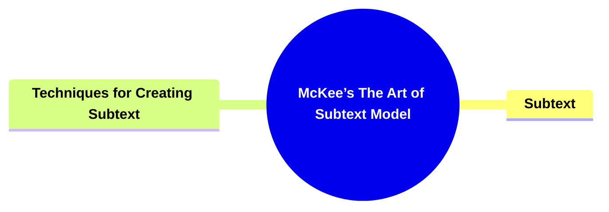

---

### **2. Key Concepts**

#### **2.1. Subtext**

- **Definition:**
  Subtext is the unstated meaning, emotion, or intention that lies beneath the explicit dialogue and visible actions. Instead of overt explanations, subtext relies on implication, symbol, and suggestion to convey depth and complexity.

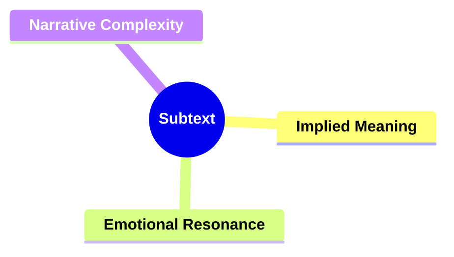

##### **2.1.1. Components of Subtext**

###### **2.1.1.1. Implied Meaning**

- **Definition:**
  Ideas, emotions, and intentions are hinted at rather than spelled out, allowing the audience to infer deeper truths.

- **Characteristics:**
  - **Indirection:** Information is revealed through suggestion, not direct exposition.
  - **Audience Engagement:** Viewers or readers actively piece together the underlying message.
  - **Intellectual Stimulation:** Encourages thoughtful interpretation and personal connection.

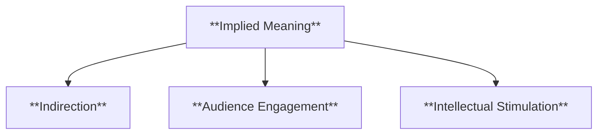

---

###### **2.1.1.2. Emotional Resonance**

- **Definition:**
  Subtext channels emotions beneath the surface, enabling characters to express complex feelings without stating them outright.

- **Characteristics:**
  - **Nuanced Characterization:** Characters become more believable and relatable as their inner struggles unfold subtly.
  - **Layered Interactions:** Relationships gain depth as tension and affection emerge through tone, gesture, and silence.
  - **Heightened Impact:** Emotions linger longer because audiences discover them organically.

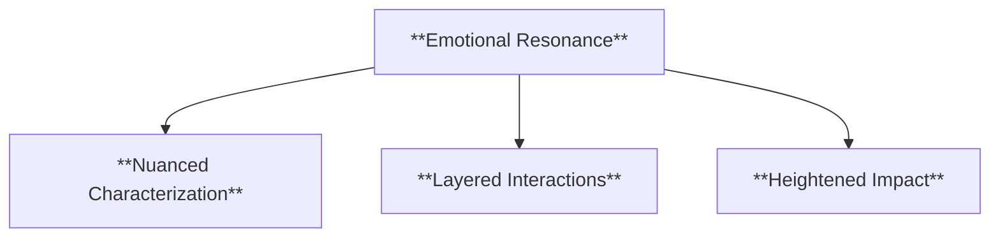

---

###### **2.1.1.3. Narrative Complexity**

- **Definition:**
  Subtext introduces multiple layers of interpretation, creating richer storytelling experiences.

- **Characteristics:**
  - **Symbolic Elements:** Symbols, metaphors, and motifs carry thematic weight.
  - **Ambiguity and Depth:** Multiple meanings coexist, inviting debate, reflection, and re-examination.
  - **Long-Lasting Appeal:** Subtextual stories often remain memorable as audiences revisit and reinterpret them over time.

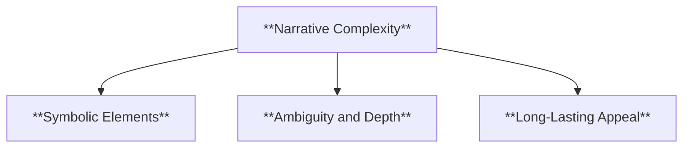

---

#### **2.2. Techniques for Creating Subtext**

- **Definition:**
  Writers employ various literary and cinematic techniques to infuse subtext into their narratives, guiding audiences toward underlying meanings without explicit statements.

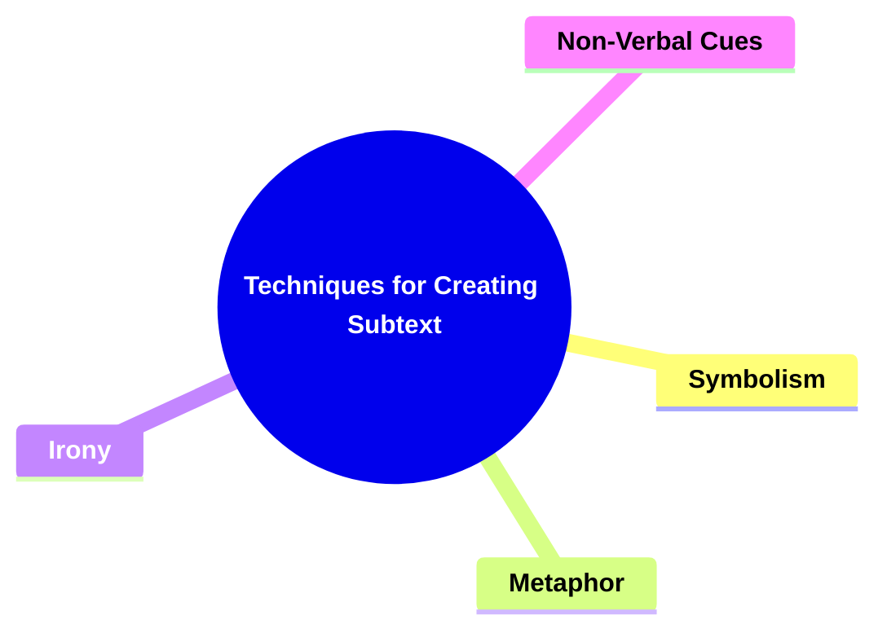

##### **2.2.1. Components of Techniques**

###### **2.2.1.1. Symbolism**

- **Definition:**
  Objects, settings, or recurring images represent larger concepts or emotions.

- **Characteristics:**
  - **Condensed Meaning:** A single symbol can convey complex ideas.
  - **Thematic Reinforcement:** Symbols underscore central messages.
  - **Visual and Literary Utility:** Symbols work in both descriptive prose and visual storytelling.

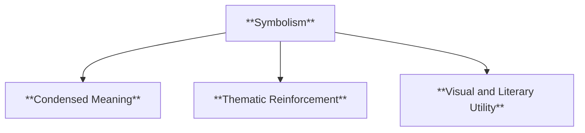

---

###### **2.2.1.2. Metaphor**

- **Definition:**
  Abstract ideas are expressed through concrete images or actions.

- **Characteristics:**
  - **Conceptual Clarity:** Metaphors simplify complex emotions or themes.
  - **Memorable Imagery:** Memorable comparisons make abstract notions tangible.
  - **Resonant Associations:** Metaphors encourage associative thinking, deepening engagement.

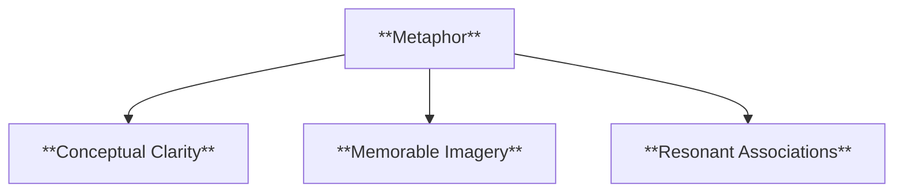

---

###### **2.2.1.3. Irony**

- **Definition:**
  Events or outcomes differ significantly from what is expected, revealing deeper meanings.

- **Characteristics:**
  - **Tension Between Expectation and Reality:** Contrasts surface impressions with underlying truths.
  - **Emotional Surprise:** Audiences reassess initial assumptions.
  - **Moral Complexity:** Irony can highlight ethical dilemmas and contradictions.

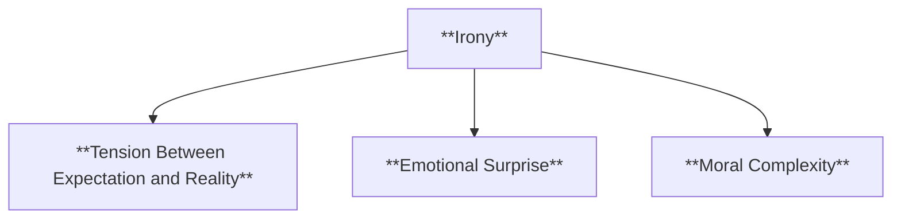

---

###### **2.2.1.4. Non-Verbal Cues**

- **Definition:**
  Body language, facial expressions, tone, and pauses communicate what words do not.

- **Characteristics:**
  - **Authentic Interaction:** Reflects real-life communication’s subtlety.
  - **Emotional Underpinnings:** Characters reveal true intentions through gesture and inflection.
  - **Dynamic Scenes:** Non-verbal signals enrich dialogue, adding tension and vulnerability.

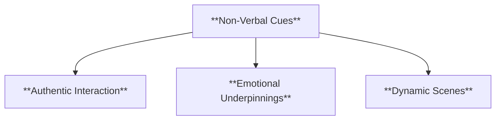

---

### **3. Implications of McKee’s The Art of Subtext Model**

#### **3.1. Enhanced Audience Engagement**

- **Description:**
  Subtext demands active audience participation, as viewers or readers must interpret and infer meaning. This involvement fosters greater emotional investment and makes the narrative more compelling.

#### **3.2. Increased Realism and Depth**

- **Description:**
  Characters and relationships reflect authentic human complexity, where much remains unspoken. Subtext thus grounds stories in believable human behavior, deepening their resonance.

#### **3.3. Interpretative Freedom**

- **Description:**
  Allowing room for personal interpretation ensures each audience member can find unique significance and relevance, making the story’s impact more profound and enduring.

---

### **Core Components Overview**

- **Subtext**

  - Implied Meaning
  - Emotional Resonance
  - Narrative Complexity

- **Techniques for Creating Subtext**
  - Symbolism
  - Metaphor
  - Irony
  - Non-Verbal Cues

---

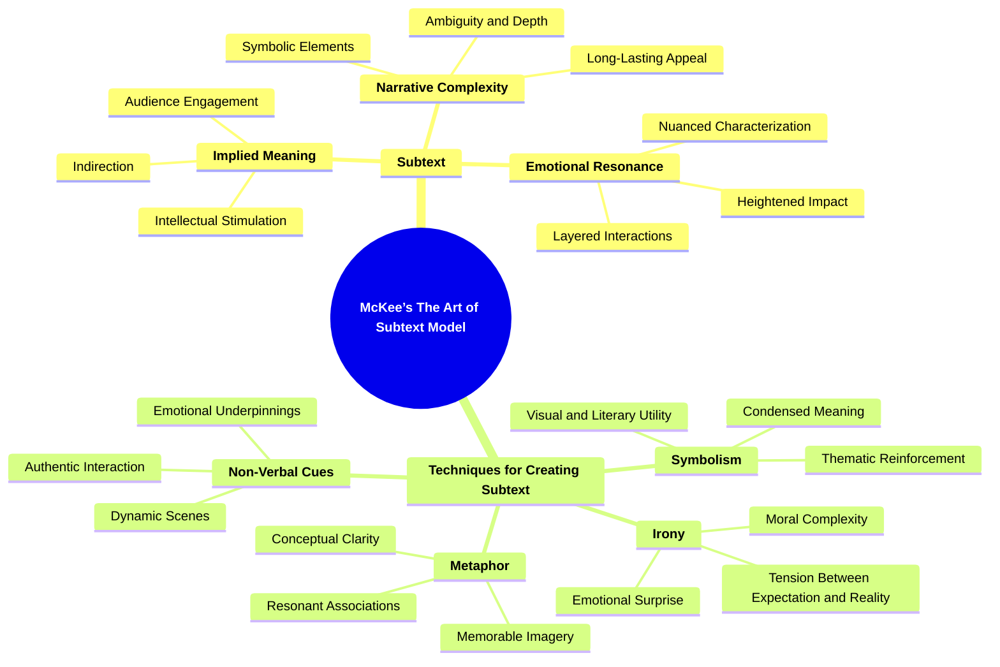
