- [1. Title: **Sternberg's Suspense, Curiosity, and Surprise Model**](#1-title-sternbergs-suspense-curiosity-and-surprise-model)
- [2. Key Concepts](#2-key-concepts)
  - [2.1. Suspense](#21-suspense)
    - [2.1.1. **Components of Suspense**](#211-components-of-suspense)
      - [2.1.1.1. **Anticipation**](#2111-anticipation)
      - [2.1.1.2. **Delayed Exposition**](#2112-delayed-exposition)
      - [2.1.1.3. **Emotional Tension**](#2113-emotional-tension)
  - [2.2. Curiosity](#22-curiosity)
    - [2.2.1. **Components of Curiosity**](#221-components-of-curiosity)
      - [2.2.1.1. **Information Seeking**](#2211-information-seeking)
      - [2.2.1.2. **Anachrony**](#2212-anachrony)
      - [2.2.1.3. **Mystery Engagement**](#2213-mystery-engagement)
  - [2.3. Surprise](#23-surprise)
    - [2.3.1. **Components of Surprise**](#231-components-of-surprise)
      - [2.3.1.1. **Unexpectedness**](#2311-unexpectedness)
      - [2.3.1.2. **Strategic Withholding**](#2312-strategic-withholding)
      - [2.3.1.3. **Reevaluation**](#2313-reevaluation)
    - [2.3.2. Implications of Suspense, Curiosity, and Surprise](#232-implications-of-suspense-curiosity-and-surprise)

---

---

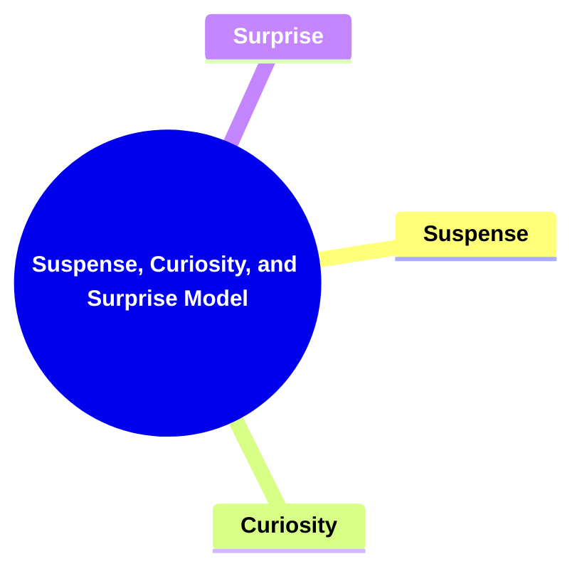

---

### 1. Title: **Sternberg's Suspense, Curiosity, and Surprise Model**

**Suspense, Curiosity, and Surprise**:
   **Definition**: Meir Sternberg’s *Suspense, Curiosity, and Surprise Model* examines the emotional and cognitive effects that narrative structures evoke in readers. Sternberg identifies three primary responses—suspense, curiosity, and surprise—that are essential to the reader’s engagement with the narrative. Each response shapes how readers interact with the story, influencing their emotional involvement and interpretative processes.

---

### 2. Key Concepts

#### 2.1. Suspense

**Definition**:
   Suspense is a state of heightened anticipation and tension about the outcome of an event that is yet to occur. It is generated by delaying or suspending the resolution of a critical narrative moment, creating a sense of uncertainty and emotional investment.

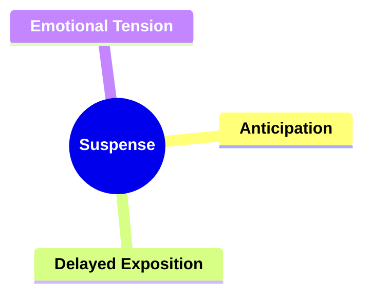

##### 2.1.1. **Components of Suspense**

###### 2.1.1.1. **Anticipation**
  - **Definition**: Readers anxiously await the outcome of an event.

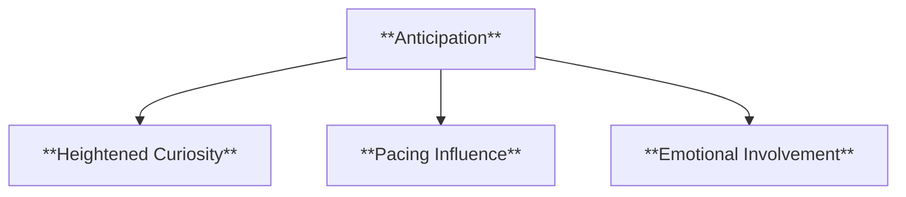

  - **Characteristics**
    - **Heightened Curiosity**: Keeps readers invested in the story by building up to key moments that promise a significant payoff.
    - **Pacing Influence**: Uses pacing to prolong the moment of revelation, sustaining interest over an extended period.
    - **Emotional Involvement**: Engages readers' emotions as they speculate and hope for specific outcomes, deepening their attachment to the narrative.

###### 2.1.1.2. **Delayed Exposition**
  - **Definition**: The resolution of key events is withheld to maintain suspense.

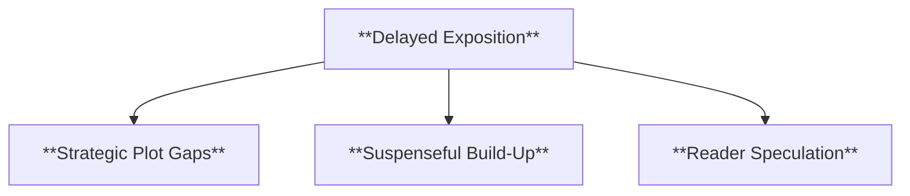

  - **Characteristics**
    - **Strategic Plot Gaps**: Creates gaps in the story where critical information is temporarily withheld.
    - **Suspenseful Build-Up**: Enhances tension by leading readers to anticipate what will happen when the missing information is finally revealed.
    - **Reader Speculation**: Encourages readers to theorize and form predictions, keeping them actively involved in the story.

###### 2.1.1.3. **Emotional Tension**
  - **Definition**: Readers become deeply engaged in the characters' fates.

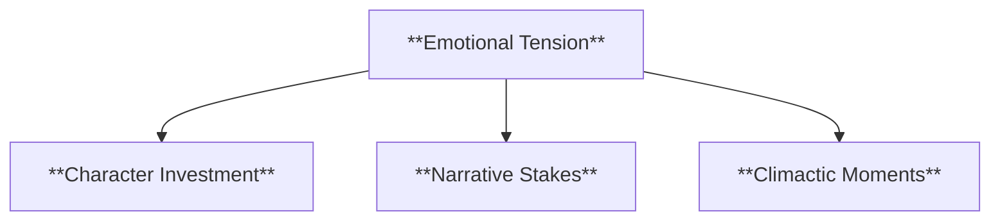

  - **Characteristics**
    - **Character Investment**: Develops strong emotional connections between readers and characters, making the stakes feel personal.
    - **Narrative Stakes**: Increases the importance of outcomes by ensuring that readers care deeply about what happens to the characters.
    - **Climactic Moments**: Uses high-stakes events to heighten emotional tension, holding readers' attention and eliciting strong reactions.

---

#### 2.2. Curiosity

**Definition**:
   Curiosity refers to the reader’s desire to uncover the causes or background of an event already presented in the narrative. It is often evoked by narratives that reveal effects before their causes, prompting the reader to seek out missing information.

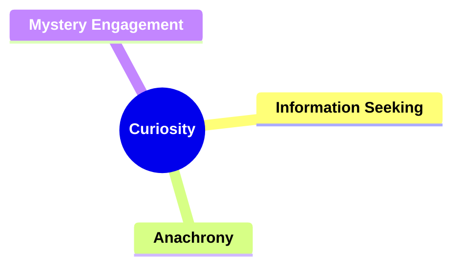

##### 2.2.1. **Components of Curiosity**

###### 2.2.1.1. **Information Seeking**
  - **Definition**: Readers look for explanations for the events presented.

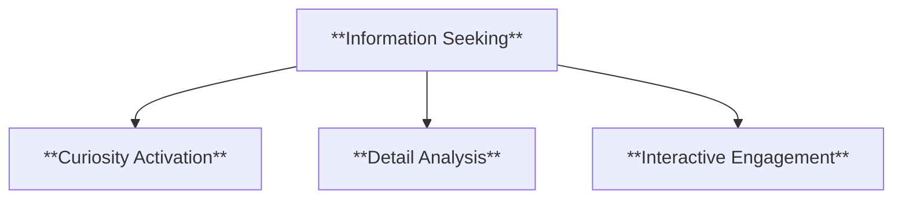

  - **Characteristics**
    - **Curiosity Activation**: Engages readers’ desire for clarity, prompting them to search for explanations within the text.
    - **Detail Analysis**: Encourages readers to pay close attention to small details that might reveal hidden clues or foreshadowing.
    - **Interactive Engagement**: Fosters a sense of participation as readers become detectives piecing together the story.

###### 2.2.1.2. **Anachrony**
  - **Definition**: Non-linear narratives provoke curiosity by showing outcomes before causes.

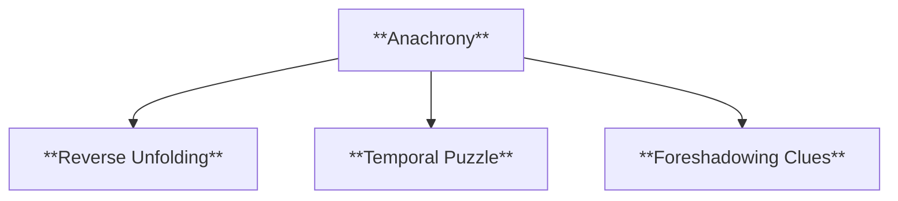

  - **Characteristics**
    - **Reverse Unfolding**: Reveals future events early on, prompting readers to seek out the backstory that led to those events.
    - **Temporal Puzzle**: Challenges readers to reconstruct the timeline, keeping them engaged through active involvement.
    - **Foreshadowing Clues**: Uses early outcomes to hint at later causes, creating anticipation for the explanation.

###### 2.2.1.3. **Mystery Engagement**
  - **Definition**: Readers are motivated by unanswered questions or mysteries.

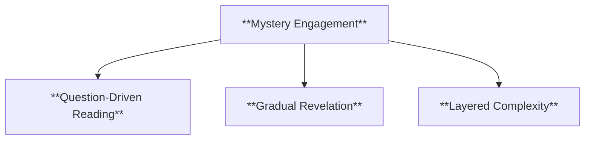

  - **Characteristics**
    - **Question-Driven Reading**: The narrative poses questions that drive readers to continue for answers.
    - **Gradual Revelation**: Discloses information piece by piece, maintaining intrigue and suspense.
    - **Layered Complexity**: Introduces multiple overlapping mysteries or unknowns to enrich the plot and reader experience.

---

#### 2.3. Surprise

**Definition**:
   Surprise is the reader’s reaction to an unexpected event or revelation within the narrative. It often results from the withholding of information or the use of misleading exposition, leading the reader to experience a sudden shift in understanding.

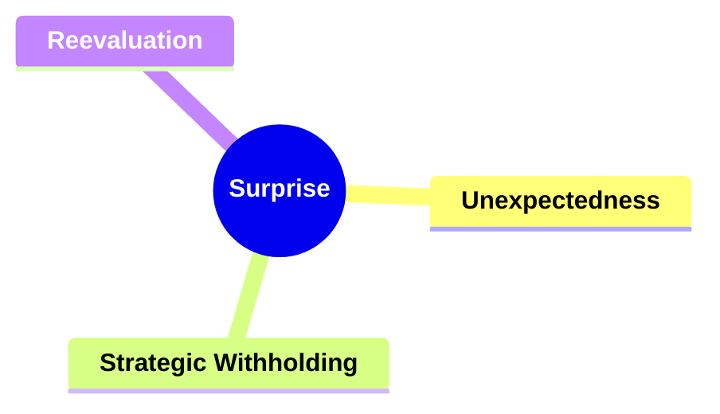

##### 2.3.1. **Components of Surprise**

###### 2.3.1.1. **Unexpectedness**
  - **Definition**: Surprise occurs when the narrative defies reader expectations.

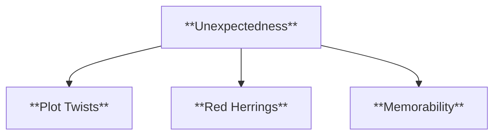

  - **Characteristics**
    - **Plot Twists**: Introduces sudden and unforeseen changes in the story that shock and engage readers.
    - **Red Herrings**: Uses misleading clues to create a sense of surprise when the real outcome is revealed.
    - **Memorability**: Ensures that surprising moments stand out in readers’ minds, making the story more impactful.

###### 2.3.1.2. **Strategic Withholding**
  - **Definition**: Surprise is created by controlling the flow of information.

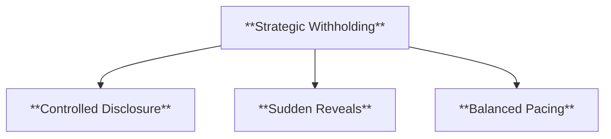

  - **Characteristics**
    - **Controlled Disclosure**: Releases key details at just the right moment to maximize shock value.
    - **Sudden Reveals**: Holds back critical information until a climactic moment, ensuring maximum impact.
    - **Balanced Pacing**: Uses timing to keep readers engaged, alternating between building suspense and delivering surprises.

###### 2.3.1.3. **Reevaluation**
  - **Definition**: Readers must reconsider earlier events in light of new information.

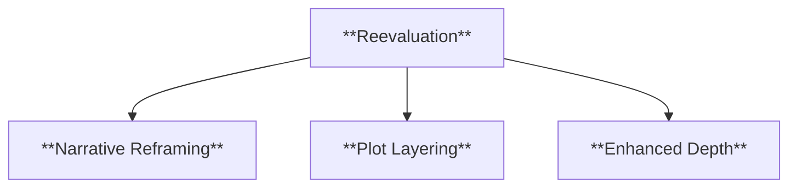

  - **Characteristics**
    - **Narrative Reframing**: Forces readers to see previous scenes or character actions in a new light.
    - **Plot Layering**: Adds complexity by making readers reassess their assumptions and piece together new interpretations.
    - **Enhanced Depth**: Deepens the story as readers explore the implications of the surprise and what it means for the narrative’s themes or character arcs.

---

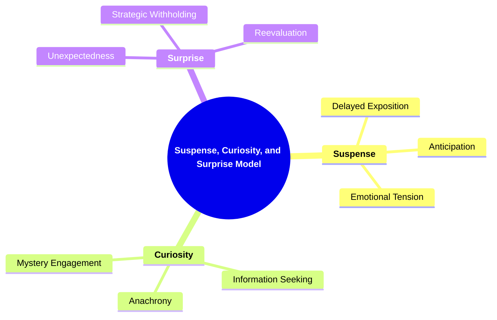

---
---

##### 2.3.2. Implications of Suspense, Curiosity, and Surprise

**Narrative Engagement**:
   Sternberg’s model is essential for understanding how narratives engage readers on both emotional and cognitive levels. Suspense, curiosity, and surprise drive reader engagement, shaping their emotional investment and influencing how they process and interpret the story.

**Collaborative or Future-Oriented Insight**:
   Sternberg’s framework applies across media, offering insights into effective storytelling techniques in literature, film, television, and digital media. Understanding these techniques allows creators to manipulate reader or audience expectations to enhance narrative engagement.

---
