- [**1. Title: McKee's Definition of Story Framework**](#1-title-mckees-definition-of-story-framework)
  - [**1.1. Definition**](#11-definition)
- [**2. Key Concepts**](#2-key-concepts)
  - [**2.1. Structured Narrative**](#21-structured-narrative)
    - [**2.1.1. Components of Structured Narrative**](#211-components-of-structured-narrative)
      - [**2.1.1.1. Narrative Structure**](#2111-narrative-structure)
      - [**2.1.1.2. Balance between Creativity and Planning**](#2112-balance-between-creativity-and-planning)
  - [**2.2. Character Arcs**](#22-character-arcs)
    - [**2.2.1. Components of Character Arcs**](#221-components-of-character-arcs)
      - [**2.2.1.1. Protagonist Development**](#2211-protagonist-development)
      - [**2.2.1.2. Supporting Characters**](#2212-supporting-characters)
  - [**2.3. Universal Themes**](#23-universal-themes)
    - [**2.3.1. Components of Universal Themes**](#231-components-of-universal-themes)
      - [**2.3.1.1. Emotional Resonance**](#2311-emotional-resonance)
      - [**2.3.1.2. Philosophical Insights**](#2312-philosophical-insights)
- [**3. Implications of McKee's Definition of Story Framework**](#3-implications-of-mckees-definition-of-story-framework)
  - [**3.1. Enhanced Narrative Coherence**](#31-enhanced-narrative-coherence)
  - [**3.2. Balanced Creative Process**](#32-balanced-creative-process)
- [**Core Components Overview**](#core-components-overview)

---

### **1. Title: McKee's Definition of Story Framework**

#### **1.1. Definition**

McKee's Definition of Story Framework posits that a story is a **structured narrative** that conveys meaning through the intricate interplay of characters, events, and ideas. This framework underscores storytelling as an art form that combines creativity with discipline. According to McKee, the essence of a great story lies in its ability to communicate universal truths and evoke deep emotional responses, achieved through carefully crafted narrative structures and character arcs.

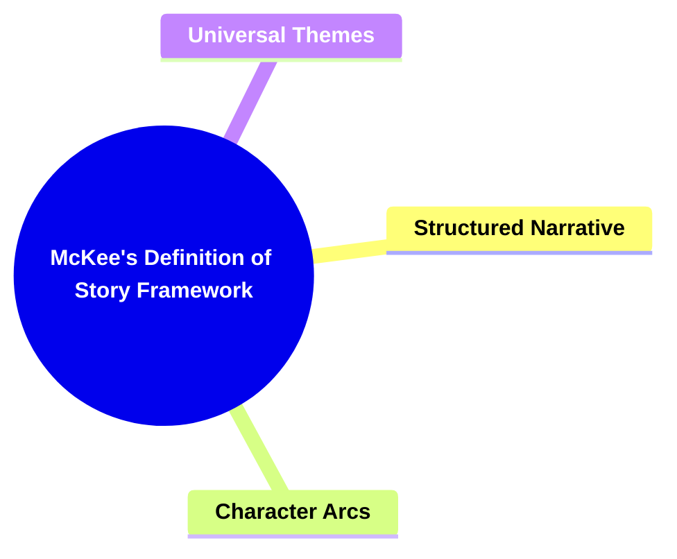

---

### **2. Key Concepts**

Outline the primary concepts or components that make up the framework. These should be broad enough to accommodate various subjects.

#### **2.1. Structured Narrative**

- **Definition:**
  A structured narrative refers to the organized framework that guides the progression of the story, ensuring coherence and impact through deliberate planning and arrangement of story elements.

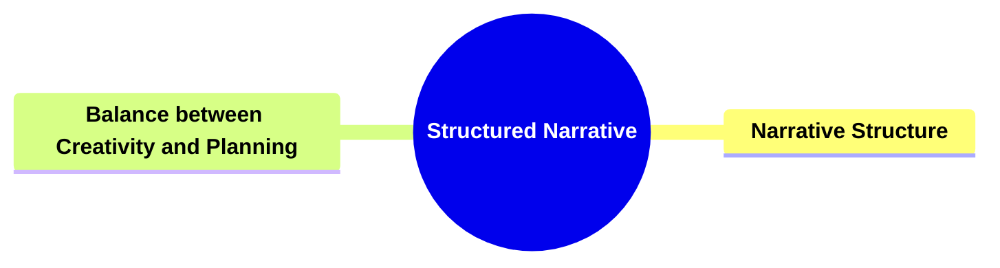

##### **2.1.1. Components of Structured Narrative**

###### **2.1.1.1. Narrative Structure**

- **Definition:**
  The arrangement of story elements (beginning, middle, end) that provides a roadmap for the story’s development.

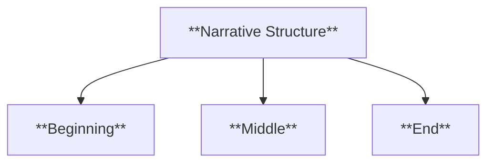

- **Characteristics:**
  - **Beginning:** Establishes setting and characters
  - **Middle:** Introduces conflict and development
  - **End:** Resolves conflicts and concludes the narrative

###### **2.1.1.2. Balance between Creativity and Planning**

- **Definition:**
  The equilibrium between spontaneous creative expression and deliberate structural planning in storytelling.

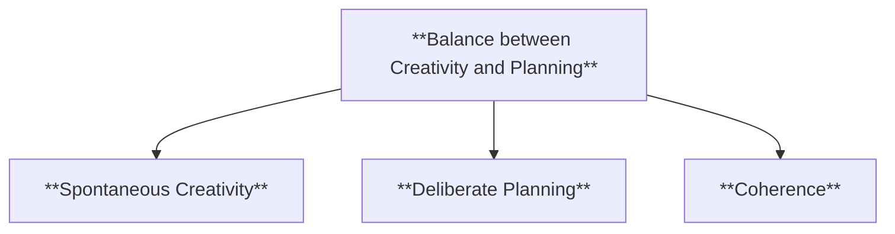

- **Characteristics:**
  - **Spontaneous Creativity:** Allows for innovative ideas and organic character development
  - **Deliberate Planning:** Ensures narrative coherence and alignment with thematic goals
  - **Coherence:** Maintains logical flow and consistency throughout the story

---

#### **2.2. Character Arcs**

- **Definition:**
  The development and transformation of characters throughout the story, contributing to the emotional depth and relatability of the narrative.

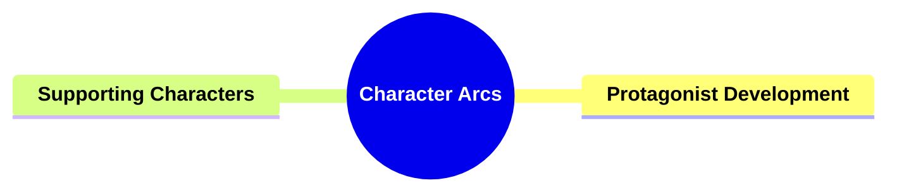

##### **2.2.1. Components of Character Arcs**

###### **2.2.1.1. Protagonist Development**

- **Definition:**
  The journey and growth of the main character, driving the story forward through personal challenges and changes.

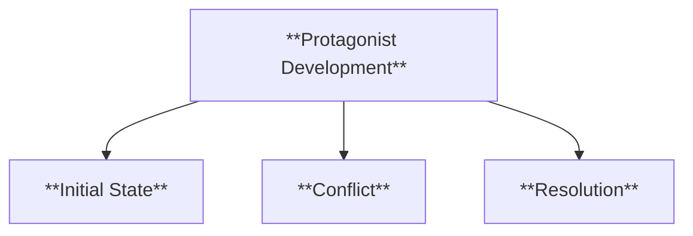

- **Characteristics:**
  - **Initial State:** Establishes the character's starting point
  - **Conflict:** Introduces challenges that provoke change
  - **Resolution:** Demonstrates the character's transformation

###### **2.2.1.2. Supporting Characters**

- **Definition:**
  Secondary characters that interact with the protagonist, influencing their journey and adding depth to the narrative.

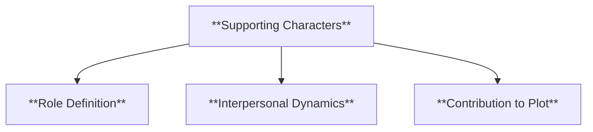

- **Characteristics:**
  - **Role Definition:** Clarifies each supporting character's purpose
  - **Interpersonal Dynamics:** Explores relationships and interactions
  - **Contribution to Plot:** Enhances the main narrative through actions and development

---

#### **2.3. Universal Themes**

- **Definition:**
  The fundamental ideas and messages that resonate on a human level, providing deeper meaning to the story.

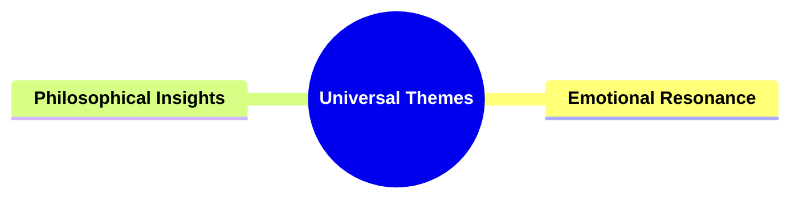

##### **2.3.1. Components of Universal Themes**

###### **2.3.1.1. Emotional Resonance**

- **Definition:**
  The ability of the story to evoke strong emotional responses from the audience.

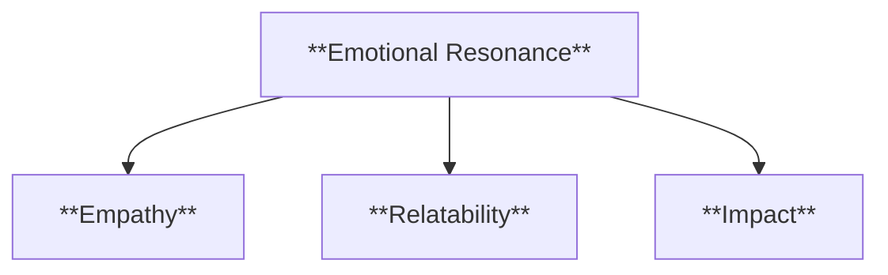

- **Characteristics:**
  - **Empathy:** Fosters a connection between the audience and characters
  - **Relatability:** Mirrors universal human experiences
  - **Impact:** Leaves a lasting impression on the audience

###### **2.3.1.2. Philosophical Insights**

- **Definition:**
  The exploration of profound questions and ideas that challenge the audience's perceptions and beliefs.

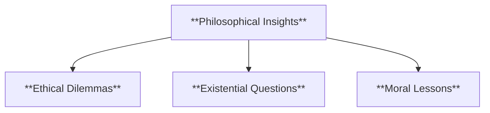

- **Characteristics:**
  - **Ethical Dilemmas:** Presents moral challenges for characters
  - **Existential Questions:** Delves into the nature of existence and purpose
  - **Moral Lessons:** Imparts valuable life lessons through the narrative

---

### **3. Implications of McKee's Definition of Story Framework**

#### **3.1. Enhanced Narrative Coherence**

- **Description:**
  By emphasizing a structured narrative, McKee's framework ensures that stories are logically organized and impactful, enhancing the overall coherence and effectiveness of the storytelling.

#### **3.2. Balanced Creative Process**

- **Description:**
  McKee advocates for a balance between creativity and planning, allowing storytellers to harness spontaneous ideas while maintaining a disciplined structure, resulting in stories that are both imaginative and well-crafted.

---

### **Core Components Overview**

- **Structured Narrative**

  - Narrative Structure
  - Balance between Creativity and Planning

- **Character Arcs**

  - Protagonist Development
  - Supporting Characters

- **Universal Themes**
  - Emotional Resonance
  - Philosophical Insights

---

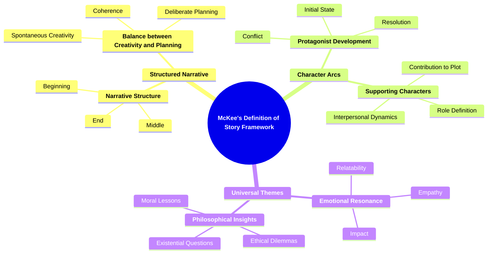
