- [**1. Title: McKee's Three Acts Model**](#1-title-mckees-three-acts-model)
  - [**1.1. Definition**](#11-definition)
- [**2. Key Concepts**](#2-key-concepts)
  - [**2.1. Act One (Setup)**](#21-act-one-setup)
    - [**2.1.1. Components of Act One (Setup)**](#211-components-of-act-one-setup)
      - [**2.1.1.1. Introduction of Characters and Setting**](#2111-introduction-of-characters-and-setting)
      - [**2.1.1.2. Inciting Incident**](#2112-inciting-incident)
      - [**2.1.1.3. Establishing Goals**](#2113-establishing-goals)
  - [**2.2. Act Two (Confrontation)**](#22-act-two-confrontation)
    - [**2.2.1. Components of Act Two (Confrontation)**](#221-components-of-act-two-confrontation)
      - [**2.2.1.1. Escalating Conflicts**](#2211-escalating-conflicts)
      - [**2.2.1.2. Character Development**](#2212-character-development)
      - [**2.2.1.3. Subplots and Plot Twists**](#2213-subplots-and-plot-twists)
  - [**2.3. Act Three (Resolution)**](#23-act-three-resolution)
    - [**2.3.1. Components of Act Three (Resolution)**](#231-components-of-act-three-resolution)
      - [**2.3.1.1. Climax**](#2311-climax)
      - [**2.3.1.2. Resolution of Subplots**](#2312-resolution-of-subplots)
      - [**2.3.1.3. Character Transformation**](#2313-character-transformation)
- [**3. Implications of McKee's Three Acts Model**](#3-implications-of-mckees-three-acts-model)
  - [**3.1. Structured Narrative Progression**](#31-structured-narrative-progression)
  - [**3.2. Enhanced Audience Engagement**](#32-enhanced-audience-engagement)
  - [**3.3. Facilitated Character and Theme Development**](#33-facilitated-character-and-theme-development)
- [**Core Components Overview**](#core-components-overview)

---

### **1. Title: McKee's Three Acts Model**

#### **1.1. Definition**

McKee's Three Acts Model, as detailed in his seminal book **"Story,"** presents the **three-act structure** as a timeless framework essential for storytelling. This structure divides a narrative into three distinct parts: **Setup**, **Confrontation**, and **Resolution**. Each act serves a specific purpose in developing the story, ensuring a coherent and engaging progression that maintains the audience's interest from beginning to end.

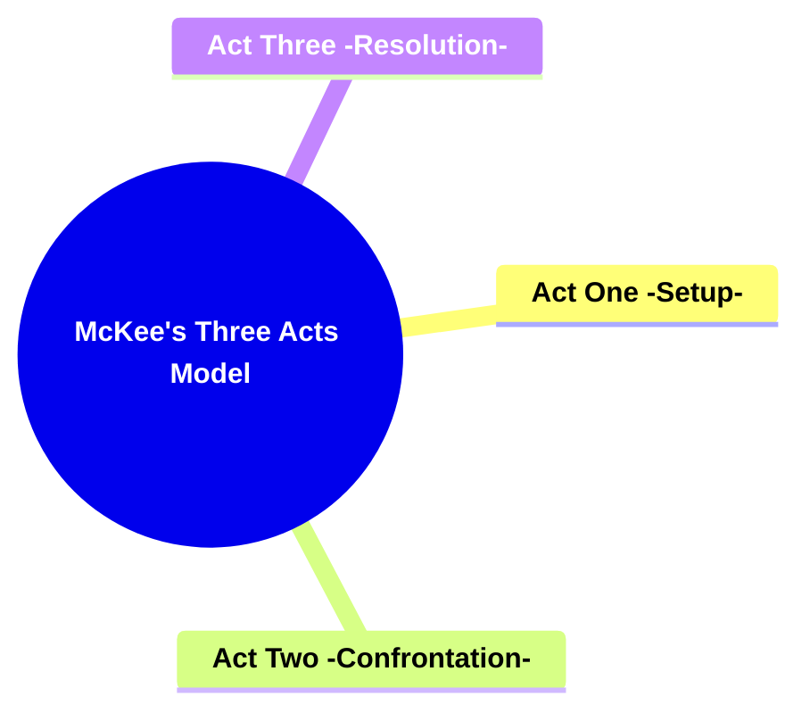

---

### **2. Key Concepts**

Outline the primary concepts or components that make up the framework. These should be broad enough to accommodate various subjects.

#### **2.1. Act One (Setup)**

- **Definition:**
  Act One, or the **Setup**, is the initial segment of the story where the protagonist, setting, and the inciting incident are introduced. This act establishes the foundation upon which the entire narrative is built, setting the stage for the ensuing conflict and character development.

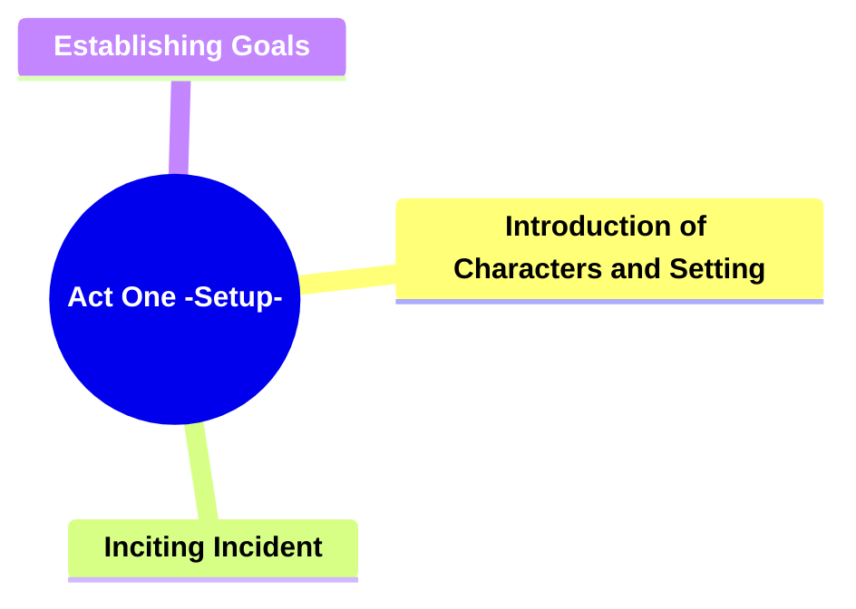

##### **2.1.1. Components of Act One (Setup)**

###### **2.1.1.1. Introduction of Characters and Setting**

- **Definition:**
  The process of presenting the main characters and the environment in which the story takes place, providing essential background information that grounds the narrative.

- **Characteristics:**
  - **Setting Introduction:** Clearly defines the physical, temporal, and social environment of the story.
  - **Contextual Details:** Provides background information that situates the story within a specific framework.
  - **Atmosphere Creation:** Establishes the mood and tone that influence the audience's perception of the narrative.

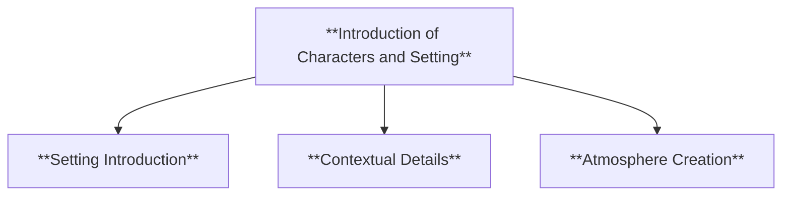

###### **2.1.1.2. Inciting Incident**

- **Definition:**
  An event that disrupts the protagonist's ordinary life, initiating the primary conflict and propelling the story into motion.

- **Characteristics:**
  - **Disruption of Status Quo:** Alters the protagonist's normal circumstances, creating a need for change.
  - **Conflict Introduction:** Introduces the main challenge or antagonist that the protagonist must face.
  - **Motivation for Action:** Sparks the protagonist's desire to pursue their goals, setting the narrative trajectory.

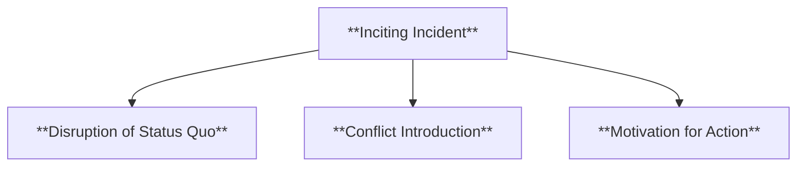

###### **2.1.1.3. Establishing Goals**

- **Definition:**
  Outlining the protagonist’s initial objectives and motivations, providing a clear direction for their actions and decisions throughout the story.

- **Characteristics:**
  - **Clear Objectives:** Defines what the protagonist aims to achieve, offering a sense of purpose.
  - **Motivational Drivers:** Explains the reasons behind the protagonist's goals, adding depth to their character.
  - **Foundation for Conflict:** Establishes the stakes and potential obstacles that will arise as the protagonist pursues their goals.

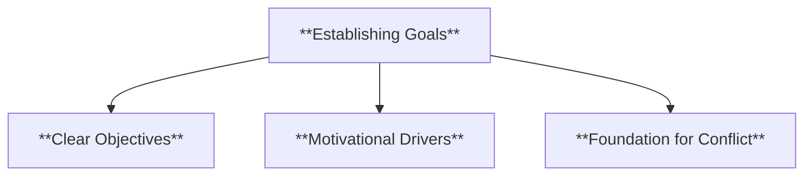

- **Example:** In _The Matrix_, Act One introduces Neo, the dystopian world, and the inciting incident where he is offered the truth about the Matrix.

- **Additional Example:** In _Jurassic Park_, Act One introduces the island, the dinosaurs, and the central characters, culminating in the inciting incident of the park's system failures and the dinosaurs escaping containment.

---

#### **2.2. Act Two (Confrontation)**

- **Definition:**
  Act Two, or the **Confrontation**, delves into the protagonist’s pursuit of their goals, encountering escalating conflicts and increasing stakes that test their resolve and adaptability.

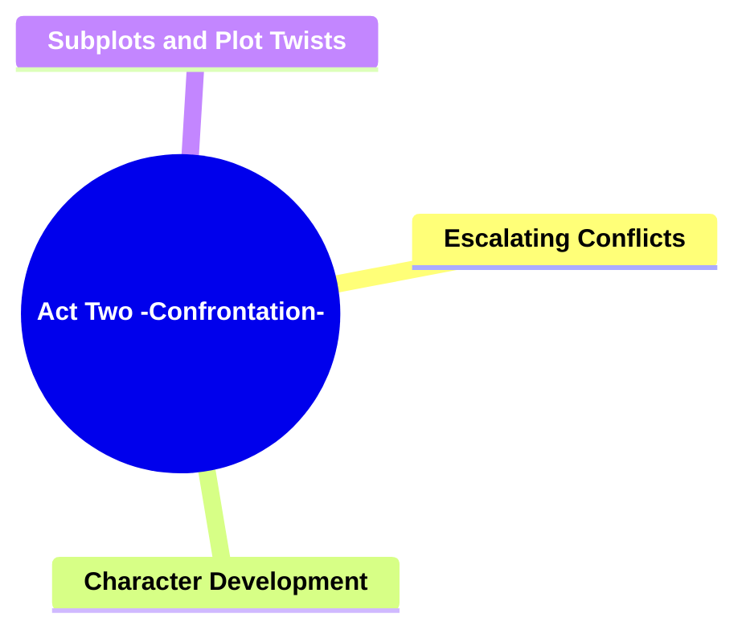

##### **2.2.1. Components of Act Two (Confrontation)**

###### **2.2.1.1. Escalating Conflicts**

- **Definition:**
  The series of challenges and obstacles that the protagonist faces, intensifying the central conflict and driving the narrative forward.

- **Characteristics:**
  - **Increasing Stakes:** Each conflict raises the importance and consequences of the protagonist’s actions.
  - **Varied Challenges:** Introduces different types of obstacles, both external and internal, to maintain narrative tension.
  - **Protagonist's Struggle:** Highlights the protagonist's efforts to overcome obstacles, showcasing their strengths and weaknesses.

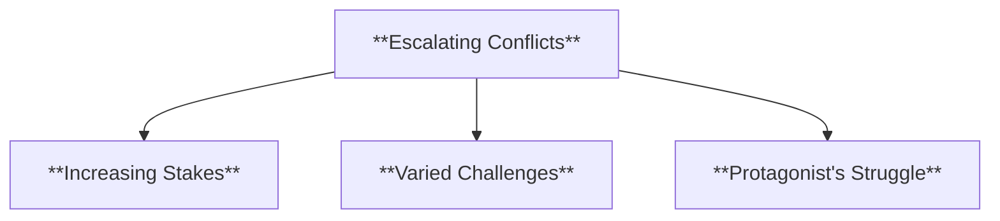

###### **2.2.1.2. Character Development**

- **Definition:**
  The deepening of relationships and the revelation of characters’ personalities and motivations, adding emotional depth to the narrative.

- **Characteristics:**
  - **Interpersonal Dynamics:** Explores interactions between characters, revealing alliances and conflicts.
  - **Personal Growth:** Shows how characters evolve in response to the challenges they face.
  - **Motivational Insights:** Provides a deeper understanding of what drives each character, enhancing their relatability.

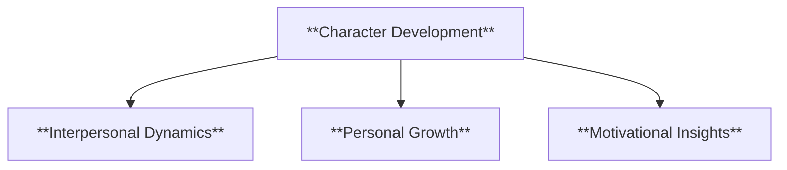

###### **2.2.1.3. Subplots and Plot Twists**

- **Definition:**
  The introduction of secondary storylines and unexpected turns that add complexity and maintain audience interest.

- **Characteristics:**
  - **Secondary Storylines:** Develops additional narratives that complement the main plot, enriching the overall story.
  - **Unexpected Developments:** Incorporates surprising events that alter the course of the narrative, keeping the audience engaged.
  - **Tension Maintenance:** Ensures that the story remains dynamic and unpredictable, preventing monotony.

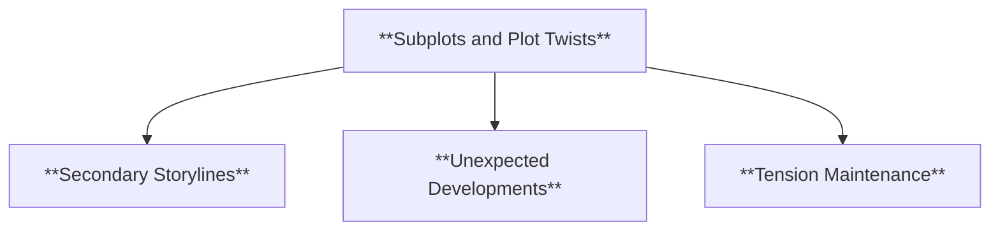

- **Example:** In _Indiana Jones: Raiders of the Lost Ark_, Act Two follows Indiana Jones as he faces various obstacles in his quest to find the Ark of the Covenant.

- **Additional Example:** In _The Dark Knight_, Act Two delves into Batman's struggle against the Joker, escalating conflicts that challenge his moral code and effectiveness as a hero.

---

#### **2.3. Act Three (Resolution)**

- **Definition:**
  Act Three, or the **Resolution**, serves to resolve the central conflict, bringing the story to a satisfying conclusion that addresses the protagonist's journey and transformation.

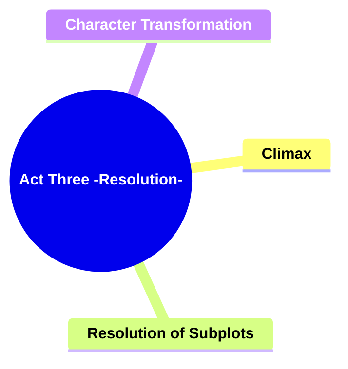

##### **2.3.1. Components of Act Three (Resolution)**

###### **2.3.1.1. Climax**

- **Definition:**
  The peak of the story’s tension where the main conflicts reach their most intense point, leading to the final showdown or pivotal moment.

- **Characteristics:**
  - **Highest Tension:** The most suspenseful and dramatic moment in the narrative.
  - **Conflict Confrontation:** The protagonist directly faces the primary antagonist or obstacle.
  - **Turning Point:** The outcome of the climax significantly impacts the direction of the story’s conclusion.

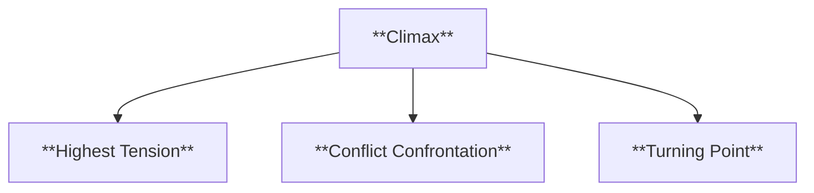

###### **2.3.1.2. Resolution of Subplots**

- **Definition:**
  The process of tying up loose ends and resolving secondary storylines, ensuring that all narrative threads are satisfactorily concluded.

- **Characteristics:**
  - **Subplot Closure:** Provides conclusions to secondary characters and their respective arcs.
  - **Consistency:** Ensures that the resolution aligns with the established narrative and character developments.
  - **Narrative Harmony:** Creates a unified ending where all elements of the story come together cohesively.

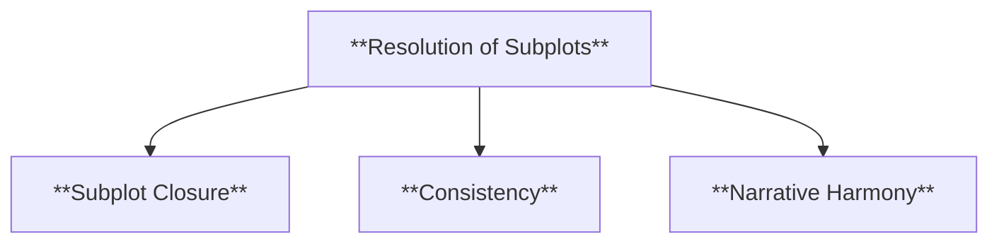

###### **2.3.1.3. Character Transformation**

- **Definition:**
  Showcases the protagonist’s growth and the changes they have undergone throughout the story, highlighting their journey and development.

- **Characteristics:**
  - **Personal Growth:** Demonstrates how the protagonist has evolved in response to the story’s events.
  - **Behavioral Changes:** Reflects shifts in the protagonist’s actions, decisions, and worldview.
  - **Emotional Resolution:** Conveys the protagonist’s internal changes, providing emotional closure to their arc.

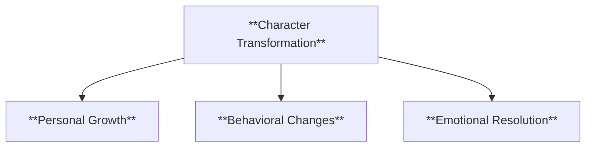

- **Example:** In _The Shawshank Redemption_, Act Three culminates in Andy Dufresne’s escape and the resolution of his friendship with Red.

- **Additional Example:** In _Avengers: Endgame_, Act Three resolves the central conflict of defeating Thanos, providing closure to several character arcs and restoring balance to the universe.

---

### **3. Implications of McKee's Three Acts Model**

#### **3.1. Structured Narrative Progression**

- **Description:**
  McKee's three-act model provides a clear and organized framework that guides the narrative progression. This structure ensures that the story flows logically from introduction to conflict and ultimately to resolution, enhancing the overall coherence and effectiveness of the storytelling.

#### **3.2. Enhanced Audience Engagement**

- **Description:**
  By adhering to the three-act structure, writers can maintain the audience's interest through a balanced distribution of exposition, rising action, and climax. This predictable yet flexible framework allows for the strategic placement of plot twists and character development, keeping the audience emotionally invested.

#### **3.3. Facilitated Character and Theme Development**

- **Description:**
  The three-act structure inherently supports the deepening of characters and the exploration of themes. Act One establishes the foundation, Act Two develops the complexities, and Act Three brings the characters' journeys and thematic elements to fruition, resulting in a more meaningful and resonant narrative.

---

### **Core Components Overview**

- **Act One (Setup)**

  - Introduction of Characters and Setting
  - Inciting Incident
  - Establishing Goals

- **Act Two (Confrontation)**

  - Escalating Conflicts
  - Character Development
  - Subplots and Plot Twists

- **Act Three (Resolution)**

  - Climax
  - Resolution of Subplots
  - Character Transformation

---

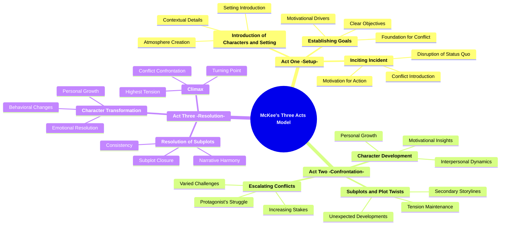
