- [**1. Title: McKee's Story Climax Framework**](#1-title-mckees-story-climax-framework)
  - [**1.1. Definition**](#11-definition)
- [**2. Key Concepts**](#2-key-concepts)
  - [**2.1. The Climax**](#21-the-climax)
    - [**2.1.1. Components of The Climax**](#211-components-of-the-climax)
      - [**2.1.1.1. Central Conflict Confrontation**](#2111-central-conflict-confrontation)
      - [**2.1.1.2. Culmination of Narrative Arc**](#2112-culmination-of-narrative-arc)
  - [**2.2. Characteristics of an Effective Climax**](#22-characteristics-of-an-effective-climax)
    - [**2.2.1. Components of Characteristics**](#221-components-of-characteristics)
      - [**2.2.1.1. Emotional Intensity**](#2211-emotional-intensity)
      - [**2.2.1.2. Inevitability and Surprise**](#2212-inevitability-and-surprise)
      - [**2.2.1.3. Resolution of Conflict**](#2213-resolution-of-conflict)
      - [**2.2.1.4. Character Transformation**](#2214-character-transformation)
  - [**2.3. Integration and Application**](#23-integration-and-application)
    - [**2.3.1. Components of Integration and Application**](#231-components-of-integration-and-application)
      - [**2.3.1.1. Alignment with Story Structure**](#2311-alignment-with-story-structure)
      - [**2.3.1.2. Balancing Predictability and Surprise**](#2312-balancing-predictability-and-surprise)
      - [**2.3.1.3. Delivering Emotional Payoff**](#2313-delivering-emotional-payoff)
- [**3. Implications of McKee’s Story Climax Framework**](#3-implications-of-mckees-story-climax-framework)
  - [**3.1. Structural Integrity**](#31-structural-integrity)
  - [**3.2. Audience Engagement**](#32-audience-engagement)
- [**Core Components Overview**](#core-components-overview)

---

### **1. Title: McKee's Story Climax Framework**

#### **1.1. Definition**

McKee’s Story Climax Framework defines the climax as the pinnacle of the narrative arc, where the central conflict reaches its peak, and the protagonist must confront the primary obstacle. The climax provides the emotional and narrative payoff that resolves the story’s buildup, leaving a lasting impression on the audience.

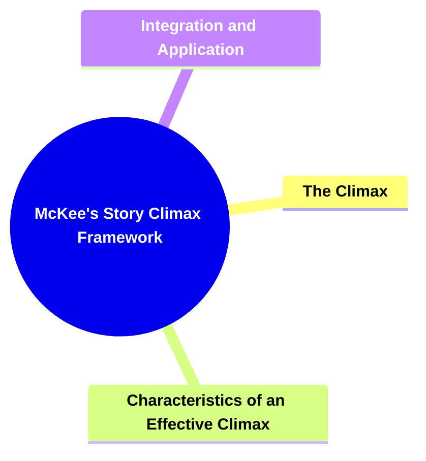

---

### **2. Key Concepts**

#### **2.1. The Climax**

- **Definition:**
  The climax is the culminating moment of the story, determining its outcome. It arises from all preceding events, placing the protagonist in direct confrontation with the central conflict.

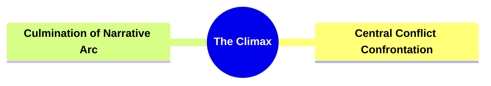

##### **2.1.1. Components of The Climax**

###### **2.1.1.1. Central Conflict Confrontation**

- **Definition:**
  The protagonist faces the main antagonist or obstacle, the issue that has fueled the narrative’s tension.

- **Characteristics:**
  - **High Stakes:** The protagonist’s actions here decide the story’s resolution.
  - **Direct Challenge:** No further avoidance or delay; the conflict is addressed head-on.
  - **Decisive Outcome:** The narrative’s primary question is answered.

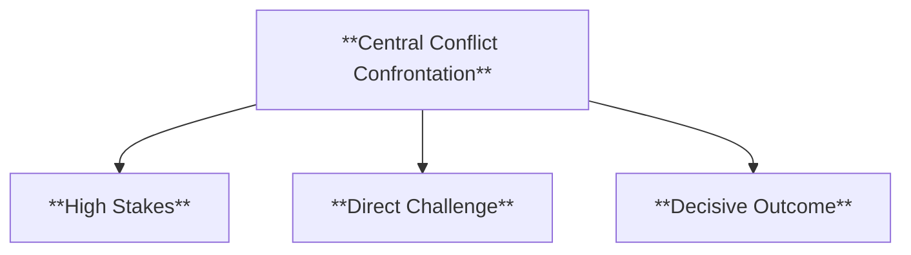

###### **2.1.1.2. Culmination of Narrative Arc**

- **Definition:**
  The climax brings all narrative threads to a focal point, integrating character arcs, themes, and plot developments.

- **Characteristics:**
  - **Integrated Story Elements:** All subplots and character arcs converge.
  - **Peak Tension:** Emotional intensity is at its highest.
  - **Transition to Resolution:** Sets the stage for the story’s conclusion.

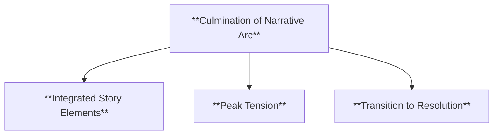

---

#### **2.2. Characteristics of an Effective Climax**

- **Definition:**
  Effective climaxes combine emotional intensity, a sense of both inevitability and surprise, resolution of conflict, and character transformation to deliver a satisfying conclusion.

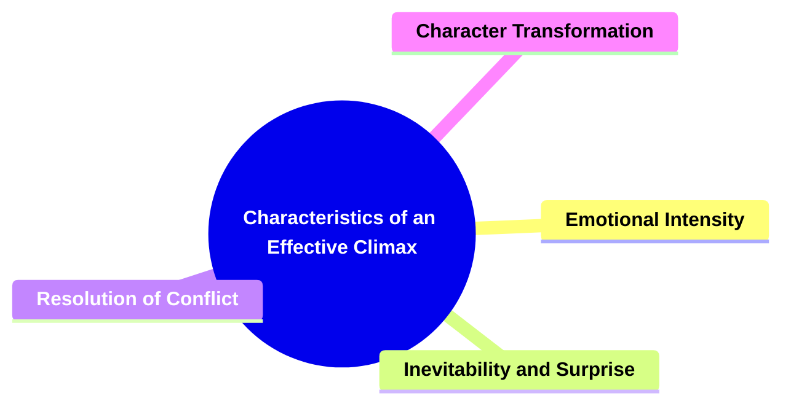

##### **2.2.1. Components of Characteristics**

###### **2.2.1.1. Emotional Intensity**

- **Definition:**
  The climax should evoke strong emotions, immersing the audience in the protagonist’s struggle.

- **Characteristics:**
  - **Deep Engagement:** The audience is fully invested in the outcome.
  - **Heightened Emotions:** Feelings of fear, hope, tension, or empathy are amplified.
  - **Memorable Impact:** Leaves a lasting emotional impression.

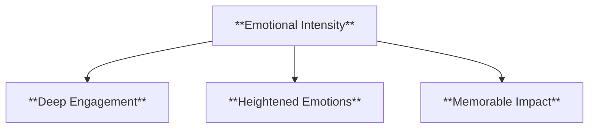

###### **2.2.1.2. Inevitability and Surprise**

- **Definition:**
  The climax feels like a natural result of the story while incorporating unexpected turns.

- **Characteristics:**
  - **Logical Progression:** Follows logically from earlier events.
  - **Unanticipated Twists:** Surprising elements maintain audience interest.
  - **Balanced Expectation:** Feels earned yet still fresh and exciting.

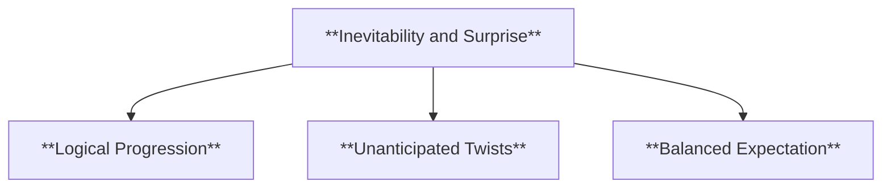

###### **2.2.1.3. Resolution of Conflict**

- **Definition:**
  The central conflict must be addressed and resolved, closing the narrative loop.

- **Characteristics:**
  - **Clear Outcome:** The protagonist either overcomes or fails against the challenge.
  - **No Loose Ends:** Major uncertainties are resolved.
  - **Narrative Closure:** The story’s main question is definitively answered.

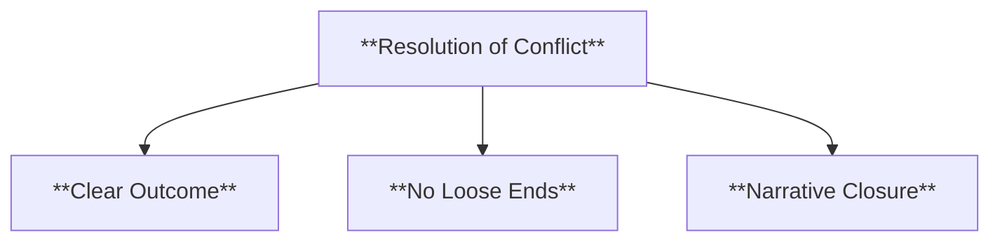

###### **2.2.1.4. Character Transformation**

- **Definition:**
  The climax highlights the protagonist’s growth, reflecting changes developed throughout the story.

- **Characteristics:**
  - **Personal Growth:** The protagonist’s internal journey is realized.
  - **Changed Perspective:** The character’s worldview evolves.
  - **Fulfilled Arc:** Completes the protagonist’s developmental trajectory.

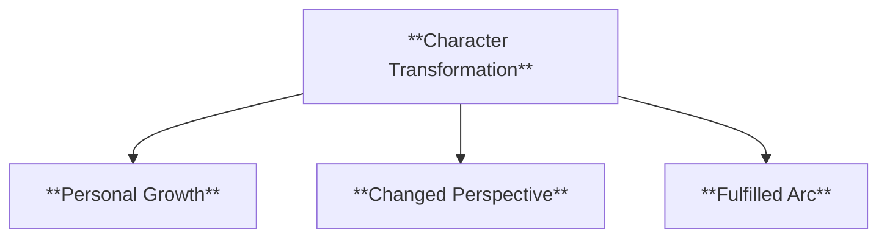

---

#### **2.3. Integration and Application**

- **Definition:**
  The climax’s effectiveness is enhanced by its alignment with the story structure, balanced predictability and surprise, and ability to deliver emotional payoff.

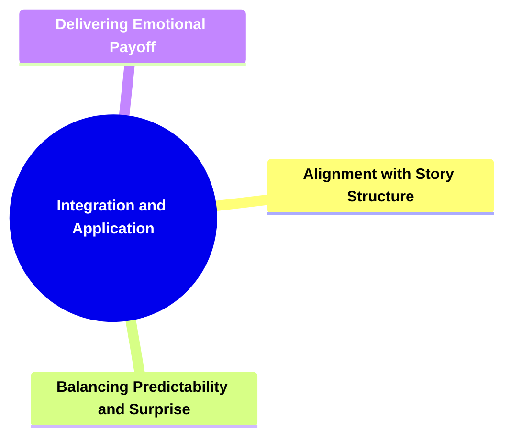

##### **2.3.1. Components of Integration and Application**

###### **2.3.1.1. Alignment with Story Structure**

- **Definition:**
  The climax fits seamlessly into the overall narrative framework, serving as the turning point toward resolution.

- **Characteristics:**
  - **Structural Cohesion:** The climax arises from earlier plot points.
  - **Narrative Harmony:** Works in tandem with acts and sequences.
  - **Guides Resolution:** Leads the story naturally into its conclusion.

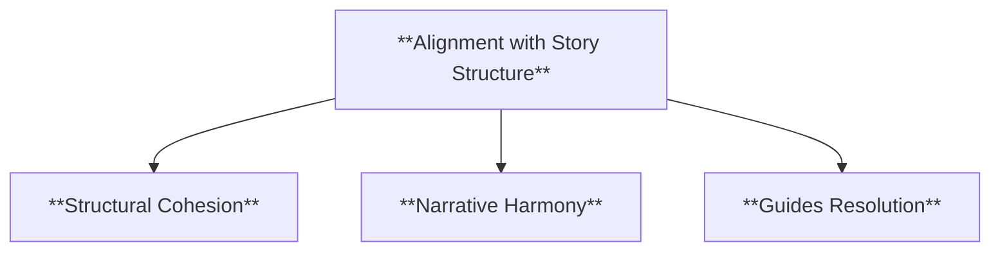

###### **2.3.1.2. Balancing Predictability and Surprise**

- **Definition:**
  The climax should be both logically consistent and contain elements that keep the audience engaged.

- **Characteristics:**
  - **Earned Outcome:** Feels justified by prior events.
  - **Unexpected Elements:** Surprises prevent stagnation.
  - **Enhanced Engagement:** Maintains audience attention and excitement.

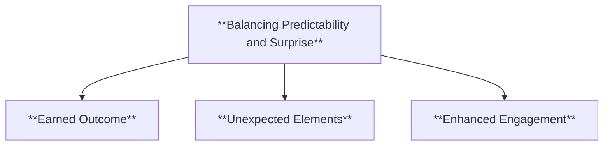

###### **2.3.1.3. Delivering Emotional Payoff**

- **Definition:**
  The climax ensures the audience’s investment is rewarded, providing closure and satisfaction.

- **Characteristics:**
  - **Emotional Closure:** Resolves emotional tensions built up over the narrative.
  - **Thematic Resonance:** Reinforces the story’s underlying themes.
  - **Memorable Finish:** Leaves a lasting impression that endures beyond the story’s end.

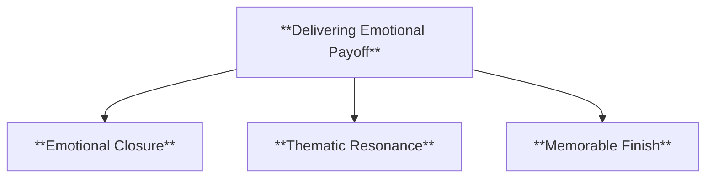

---

### **3. Implications of McKee’s Story Climax Framework**

#### **3.1. Structural Integrity**

- **Description:**
  Adhering to McKee’s framework ensures the climax functions as the narrative’s structural apex, enhancing overall cohesion.

#### **3.2. Audience Engagement**

- **Description:**
  A well-crafted climax captivates audiences, ensuring they remain emotionally invested and deeply affected by the story’s resolution.

---

### **Core Components Overview**

- **The Climax**

  - Central Conflict Confrontation
  - Culmination of Narrative Arc

- **Characteristics of an Effective Climax**

  - Emotional Intensity
  - Inevitability and Surprise
  - Resolution of Conflict
  - Character Transformation

- **Integration and Application**
  - Alignment with Story Structure
  - Balancing Predictability and Surprise
  - Delivering Emotional Payoff

---

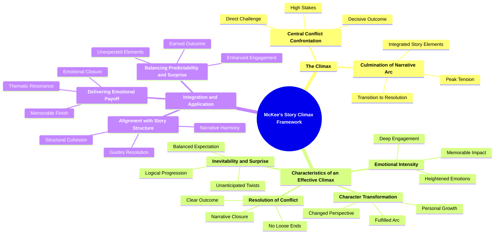
