- [1. Title: **Brooks's Intertextuality and Narrative Design Framework**](#1-title-brookss-intertextuality-and-narrative-design-framework)
- [2. **Key Concepts**](#2-key-concepts)
  - [2.1. **Intertextuality**](#21-intertextuality)
    - [2.1.1. **Components of Intertextuality**:](#211-components-of-intertextuality)
      - [2.1.1.1. **Networked**](#2111-networked)
      - [2.1.1.2. **Layered**](#2112-layered)
      - [2.1.1.3. **Relational**](#2113-relational)
  - [2.2. **Influence of Preceding Texts**](#22-influence-of-preceding-texts)
    - [2.2.1. **Components of Influence of Preceding Texts**](#221-components-of-influence-of-preceding-texts)
      - [2.2.1.1. **Dialogic**](#2211-dialogic)
      - [2.2.1.2. **Cumulative**](#2212-cumulative)
  - [2.3. **Allusion**](#23-allusion)
    - [2.3.1. **Components of Allusion**](#231-components-of-allusion)
      - [2.3.1.1. **Subtle**](#2311-subtle)
      - [2.3.1.2. **Intertextual**](#2312-intertextual)
      - [2.3.1.3. **Suggestive**](#2313-suggestive)
      - [2.3.1.4. **Cultural Resonance**](#2314-cultural-resonance)
  - [2.4. **Quotation**](#24-quotation)
    - [2.4.1. **Components of Quotation**:](#241-components-of-quotation)
      - [2.4.1.1. **Direct**](#2411-direct)
      - [2.4.1.2. **Contextual**](#2412-contextual)
      - [2.4.1.3. **Authority**](#2413-authority)
      - [2.4.1.4. **Interpretative**](#2414-interpretative)
  - [2.5. **Parody**](#25-parody)
    - [2.5.1. **Components of Parody**](#251-components-of-parody)
      - [2.5.1.1. **Critical**](#2511-critical)
      - [2.5.1.2. **Exaggerated**](#2512-exaggerated)
      - [2.5.1.3. **Humorous**](#2513-humorous)
      - [2.5.1.4. **Subversive**](#2514-subversive)
  - [2.6. **Pastiche**](#26-pastiche)
    - [2.6.1. **Components of Pastiche**:](#261-components-of-pastiche)
      - [2.6.1.1. **Celebratory**](#2611-celebratory)
      - [2.6.1.2. **Respectful**](#2612-respectful)
      - [2.6.1.3. **Genre-Bending**](#2613-genre-bending)
      - [2.6.1.4. **Nostalgic**](#2614-nostalgic)
  - [2.7. **Reinterpretation**](#27-reinterpretation)
    - [2.7.1. **Components of Reinterpretation**:](#271-components-of-reinterpretation)
      - [2.7.1.1. **Reinterpretive**](#2711-reinterpretive)
      - [2.7.1.2. **Critical Engagement**](#2712-critical-engagement)
      - [2.7.1.3. **Cultural Reflection**](#2713-cultural-reflection)
      - [2.7.1.4. **Alternative Perspective**](#2714-alternative-perspective)
  - [2.8. **Transformation**](#28-transformation)
    - [2.8.1. **Components of Transformation**:](#281-components-of-transformation)
      - [2.8.1.1. **Transformative**](#2811-transformative)
      - [2.8.1.2. **Radical Shifts**](#2812-radical-shifts)
      - [2.8.1.3. **Ideological Shift**](#2813-ideological-shift)
      - [2.8.1.4. **Creative Freedom**](#2814-creative-freedom)
- [3. **Implications of Brooks’s Intertextuality and Narrative Design Framework**](#3-implications-of-brookss-intertextuality-and-narrative-design-framework)

---

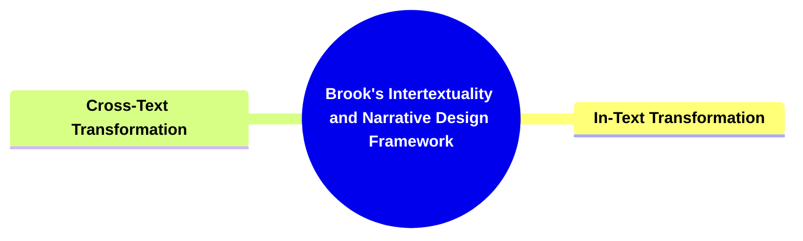

---

### 1. Title: **Brooks's Intertextuality and Narrative Design Framework**

- **Intertextuality and Narrative Design**:
  - **Definition**: Peter Brooks explores how narratives are intricately connected to other texts through intertextuality. He argues that stories are not created in isolation but are shaped by their relationships with other works, enhancing the reader’s understanding and engagement through a rich tapestry of interconnected meanings.

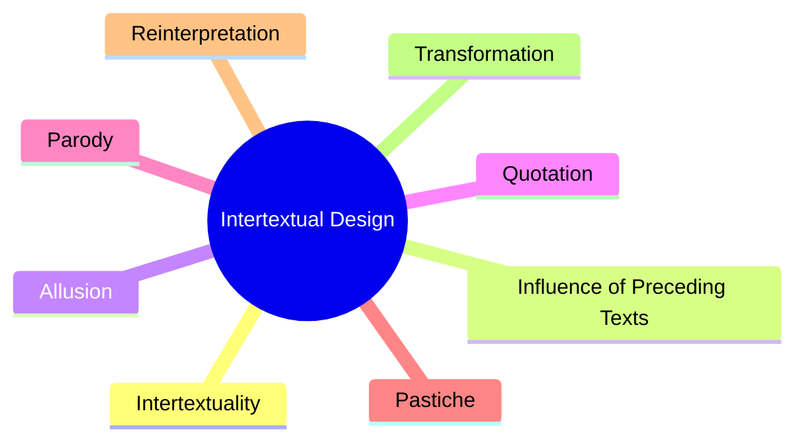

### 2. **Key Concepts**

#### 2.1. **Intertextuality**

- **Definition**:
  - Intertextuality refers to the ways in which a narrative draws upon, references, or responds to other texts. This interaction creates a network of meanings that informs and enriches the reader's experience, making the narrative part of a broader literary dialogue.

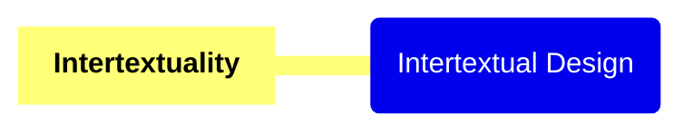

##### 2.1.1. **Components of Intertextuality**:

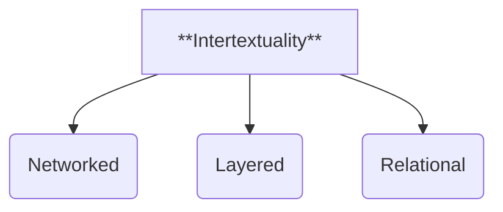

###### 2.1.1.1. **Networked**

- **Definition**: Refers to how texts are interconnected and influence each other within a literary tradition.

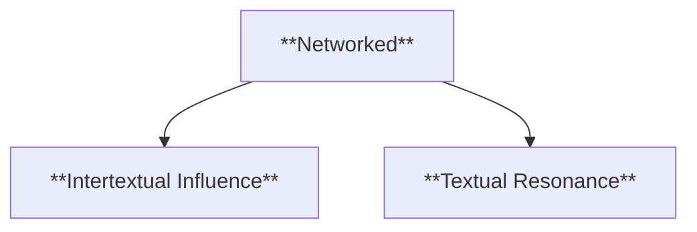

- **Characteristics**
  - **Intertextual Influence**: Texts are shaped by the influences of other narratives, drawing on existing conventions, themes, or motifs, and simultaneously contributing to the ongoing development of these elements within a literary tradition.
  - **Textual Resonance**: The interconnectedness of texts allows for resonance, where ideas, themes, or motifs from one text echo across others, creating a sense of continuity or expansion within a literary tradition.

###### 2.1.1.2. **Layered**

- **Definition**: Describes how texts contain multiple levels of meaning, often derived from references to earlier works.

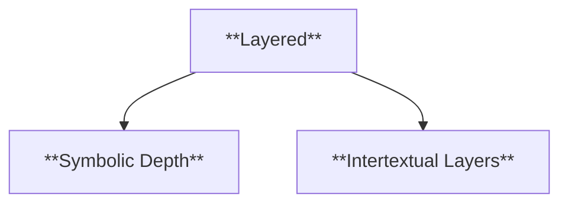

- **Characteristics**
  - **Intertextual Layers**: Texts draw upon earlier works to create additional layers of meaning, where references or allusions to prior stories contribute to a richer, more complex reading experience.
  - **Symbolic Depth**: Layered texts often use symbolism drawn from other works, where symbols or motifs take on additional meanings because of their connection to earlier stories or cultural narratives.

###### 2.1.1.3. **Relational**

- **Definition**: Focuses on how the meaning of a text is shaped by its connection and interaction with other works.

- **Characteristics**
  - **Contextual Dependency**: The meaning of a text is dependent on its relationship with other texts, where its themes, structure, or motifs are informed by external narratives that help define or contrast its message.
  - **Textual Dialogue**: Relational texts engage in a dialogue with other works, where they respond to, critique, or expand upon earlier narratives.

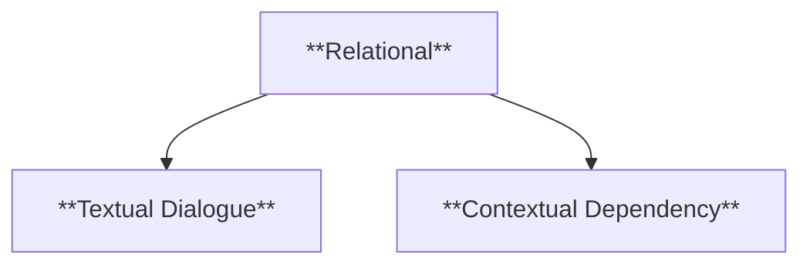

---

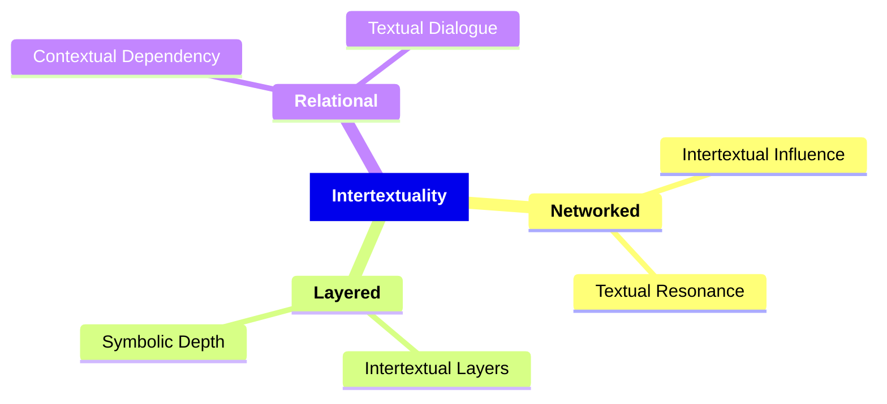

---

#### 2.2. **Influence of Preceding Texts**

- **Definition**:
  - A narrative often borrows themes, motifs, or stylistic elements from earlier works, entering into a dialogue with those texts. This can be a direct influence (as in adaptation) or a subtle echo through allusion.

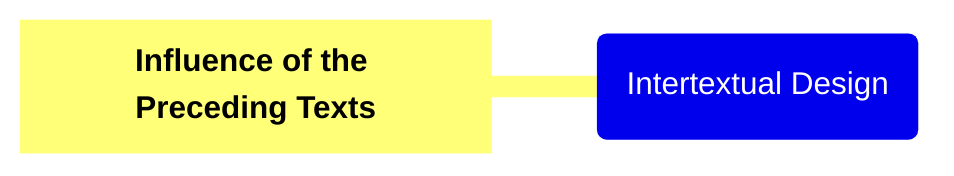

##### 2.2.1. **Components of Influence of Preceding Texts**

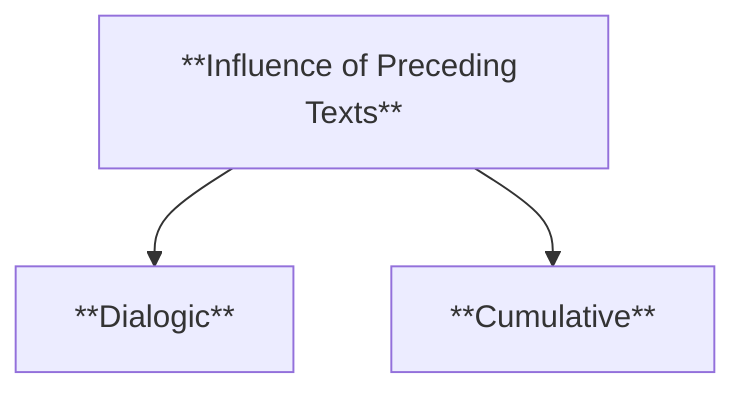

###### 2.2.1.1. **Dialogic**

- **Definition**: Refers to how texts engage in a conversation with previous works, either reflecting upon or critiquing them, creating a layered interaction across literary traditions.
- **Characteristics**
  - **Reflective Engagement**: Texts engage with earlier works by reflecting their themes, structures, or ideas, contributing to an ongoing literary dialogue.
  - **Critical Interaction**: Through critique or reinterpretation, a text can challenge or subvert the messages of earlier works, offering new perspectives or deeper analysis.

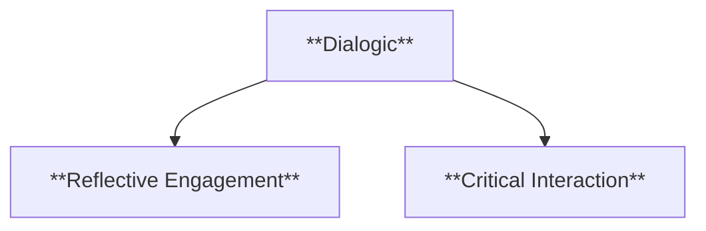

###### 2.2.1.2. **Cumulative**

- **Definition**: Successive works build on earlier narratives, adding complexity and depth to the ongoing literary tradition.
- **Characteristics**
  - **Narrative Expansion**: Each new work contributes to and expands upon the stories, ideas, or themes introduced in previous texts, enriching the broader narrative context.
  - **Layered Complexity**: As more works are added to the literary conversation, the complexity of ideas, motifs, and themes grows, creating a richer and more intricate intertextual web.

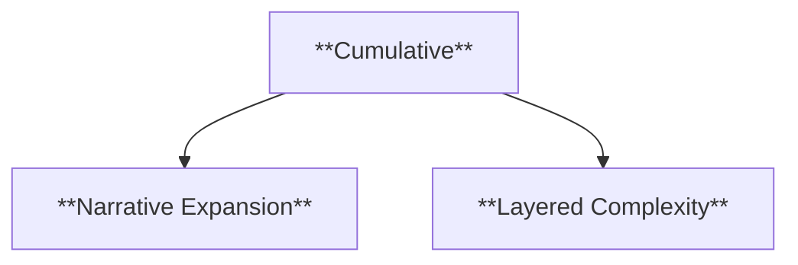

---

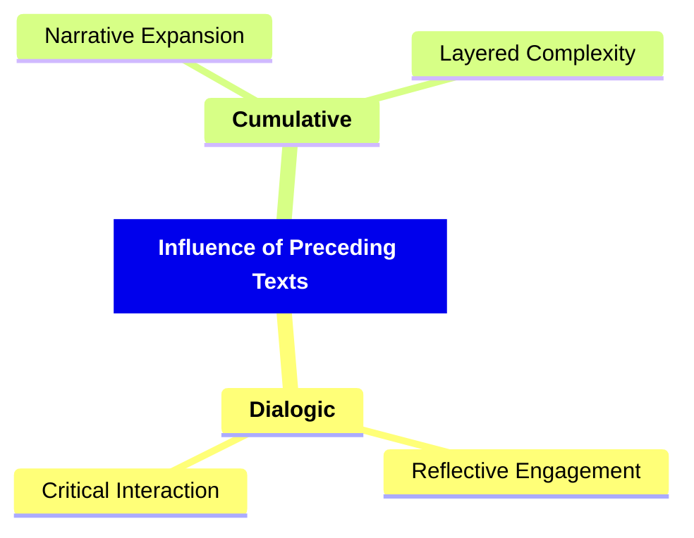

---

#### 2.3. **Allusion**

- **Definition**:
  - Allusion subtly references another work, expecting the reader to recognize the connection.

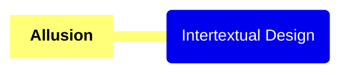

##### 2.3.1. **Components of Allusion**

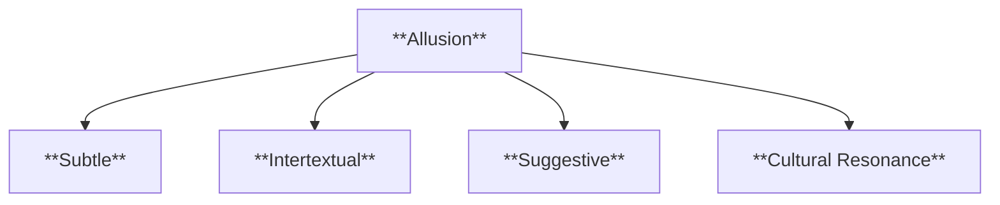

###### 2.3.1.1. **Subtle**

- **Definition**: Refers to allusions that are indirect or understated, requiring careful or close reading to uncover their full significance and meaning.
- **Characteristics**
  - **Hidden References**: These allusions are not immediately obvious and require the reader to actively engage with the text to recognize the underlying reference.
  - **Layered Interpretation**: The meaning may unfold slowly, with additional readings or knowledge revealing deeper significance.

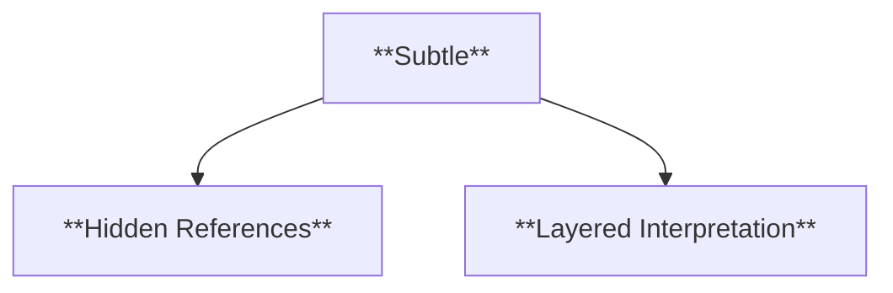

###### 2.3.1.2. **Intertextual**

- **Definition**: Relies on the reader’s familiarity with other works or concepts to fully understand the significance of the reference.
- **Characteristics**
  - **Contextual Dependency**: The allusion’s meaning is enhanced or fully realized only if the reader has prior knowledge of the referenced work or idea.
  - **Cultural Knowledge**: Familiarity with the cultural, historical, or literary context enriches the reader’s experience and deepens their understanding of the text.

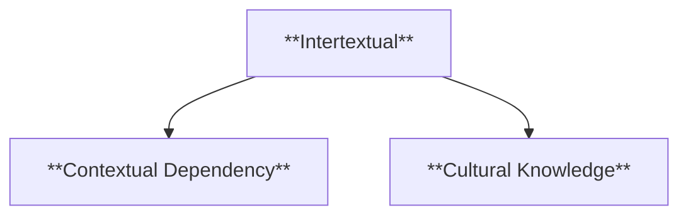

###### 2.3.1.3. **Suggestive**

- **Definition**: Implies deeper meaning through subtle hints, without explicitly stating the connection to other works or concepts.
- **Characteristics**
  - **Implied Meaning**: The text hints at deeper ideas or references without making them explicit, allowing the reader to infer the connections.
  - **Ambiguity**: The allusion leaves room for interpretation, encouraging the reader to draw their own conclusions about its significance.

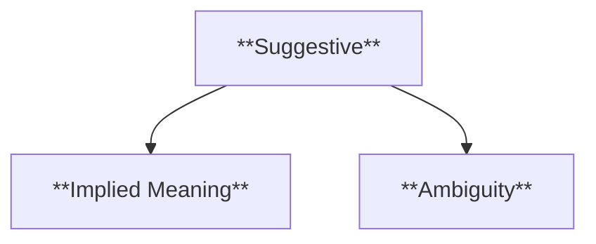

###### 2.3.1.4. **Cultural Resonance**

- **Definition**: Allusions that draw on shared cultural or literary knowledge to enhance the reader’s understanding and connection to the text.
- **Characteristics**
  - **Familiar References**: The text taps into commonly known stories, myths, or ideas that resonate with a broad audience, enriching the narrative.
  - **Collective Memory**: By invoking well-known cultural or literary references, the allusion enhances the emotional or intellectual engagement of the reader.

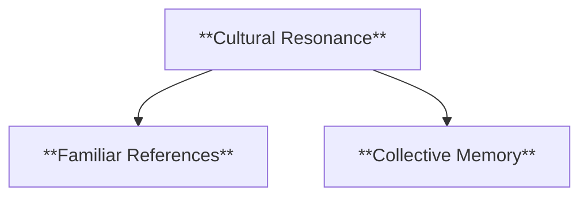

---

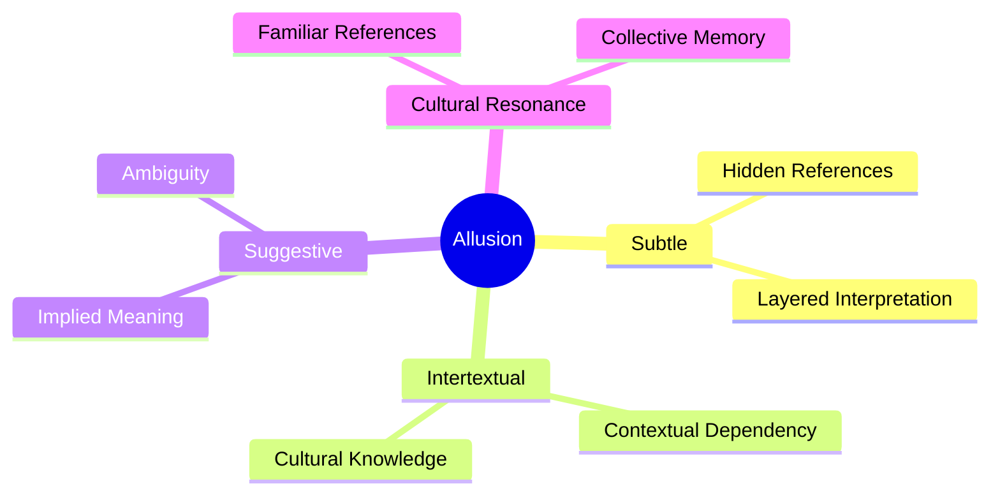

---

#### 2.4. **Quotation**

- **Definition**:
  - Quotation directly cites another text, often to draw a thematic parallel or contrast.

```mermaid
mindmap
  root(Intertextual Design)
    [**Quotation**]

```

##### 2.4.1. **Components of Quotation**:

###### 2.4.1.1. **Direct**

- **Definition**: Refers to quotations that explicitly reference another text, drawing clear connections between the quoted work and the current text.

```mermaid
flowchart TD;
    A[**Direct**] --> B[**Explicit Reference**];
    A --> C[**Thematic Highlighting**];
```

- **Characteristics**
  - **Explicit Reference**: The quotation directly cites another work, making the connection obvious and intentional.
  - **Thematic Highlighting**: By quoting a specific passage, the text underscores thematic similarities or contrasts between the two works.

###### 2.4.1.2. **Contextual**

- **Definition**: Requires knowledge of the quoted text to fully understand the reference and its deeper implications within the current text.

```mermaid
flowchart TD;
    A[**Contextual**] --> B[**Prior Knowledge**];
    A --> C[**Deeper Understanding**];
```

- **Characteristics**
  - **Prior Knowledge**: The meaning or significance of the quotation relies on the reader’s familiarity with the original source.
  - **Deeper Understanding**: Readers with knowledge of the quoted text can appreciate richer layers of meaning, enhancing their interpretation of the current narrative.

###### 2.4.1.3. **Authority**

- **Definition**: Lends credibility or weight to the current text by referencing an established or authoritative work, drawing on its cultural or intellectual significance.

```mermaid
flowchart TD;
    A[**Authority**] --> B[**Credibility**];
    A --> C[**Historical Weight**];
    A --> D[**Cultural Weight**];
```

- **Characteristics**
  - **Credibility**: By invoking a respected or classic source, the current text gains added legitimacy or persuasive power.
  - **Historical Weight**: Referencing an authoritative text connects the current work to a significant historical tradition. This linkage enhances the depth of the narrative by situating it within a continuum of historical events or ideas, providing a richer context and resonance with past occurrences.
  - **Cultural Weight**: Referencing an authoritative text ties the current work to a broader cultural or intellectual tradition. This connection enriches the narrative by embedding it within the shared beliefs, values, or artistic expressions of a particular culture, thereby deepening its relevance and impact on the audience.

###### 2.4.1.4. **Interpretative**

- **Definition**: Encourages the reader to interpret both the quoted text and the current text in relation to each other, fostering deeper comparative analysis.

```mermaid
flowchart TD;
    A[**Interpretative**] --> B[**Relational Understanding**];
    A --> C[**Cross-TExtual Engagement**];
```

- **Characteristics**
  - **Relational Understanding**: The reader is prompted to analyze how the quotation influences or reshapes the meaning of the current text.
  - **Cross-Textual Engagement**: Both the quoted text and the current work inform each other, creating a layered interpretative process for the reader.

---

```mermaid
mindmap
  root((**Quotation**))
    **Direct**
      Explicit Reference
      Thematic Highlighting
    **Contextual**
      Prior Knowledge
      Deeper Understanding
    **Authority**
      Historical Weight
      Credibility
      Cultural Weight
    **Interpretive**
      Relational Understanding
      Cross-Textual Engagement
```

---

#### 2.5. **Parody**

- **Definition**:
  - Parody imitates the style or content of another text for humorous or critical effect, often highlighting its absurdities.

```mermaid
mindmap
  root(Intertextual Design)
    [**Parody**]

```

##### 2.5.1. **Components of Parody**

###### 2.5.1.1. **Critical**

- **Definition**: Parody uses humor or irony as a tool to critique the original text, exposing its flaws, limitations, or underlying assumptions.

```mermaid
flowchart TD;
    A[**Critical**] --> B[**Irony**];
    A --> C[**Satire**];
    A --> D[**Analytical Edge**];
```

- **Characteristics**
  - **Irony**: Through humor and indirect expression, irony highlights contradictions or unexpected elements in the original work. This approach allows for a nuanced critique by presenting the work in a way that subtly exposes its underlying inconsistencies or absurdities.
  - **Satire**: By using humor with an exaggerated focus on flaws or weaknesses, satire delivers a more direct critical perspective. This technique amplifies particular aspects of the original work, often to mock or provoke thought about societal issues or human behaviors reflected within it.
  - **Analytical Edge**: Parody doesn’t just mock the original; it often provides an insightful commentary on the text’s deeper themes or cultural significance.

###### 2.5.1.2. **Exaggerated**

- **Definition**: Parodies often magnify or exaggerate certain traits or features of the original text to highlight their absurdity or excessiveness.

```mermaid
flowchart TD;
    A[**Exaggerated**] --> B[**Amplified Features**];
    A --> C[**Over-the-Top Representations**];
```

- **Characteristics**
  - **Amplified Features**: Specific traits, styles, or ideas from the original are exaggerated, drawing attention to their ridiculous or extreme nature.
  - **Over-the-Top Representation**: Parody employs overstatement to underscore flaws or emphasize particular aspects of the original in a humorous way.

###### 2.5.1.3. **Humorous**

- **Definition**: Parody employs humor to deconstruct the source material, using wit and comedic techniques to reveal new meanings or critiques.
- **Characteristics**
  - **Comedic Interpretation**: The humorous tone of parody is central to its approach, allowing it to disarm the audience while delivering a critique.
  - **Lighthearted Ridicule**: While parody often critiques the original, it does so with a sense of fun and humor, making the criticism more engaging and approachable.

```mermaid
flowchart TD;
    A[**Humorous**] --> B[**Comedic Interpretation**];
    A --> C[**Lighthearted Ridicule**];
```

###### 2.5.1.4. **Subversive**

```mermaid
flowchart TD;
    A[**Subversive**] --> B[**Ideological Challenge**];
    A --> C[**Reversal of Expectations**];
```

- **Definition**: Parody challenges the conventions, ideologies, or values represented in the original text, often questioning or undermining established norms.
- **Characteristics**
  - **Ideological Challenge**: Parody can expose the underlying values or assumptions in the original, offering a new perspective that subverts dominant cultural or societal narratives.
  - **Reversal of Expectations**: By turning the original text’s message or style on its head, parody encourages the audience to rethink conventional ideas and narratives.

---

```mermaid
mindmap
  root((**Parody**))
      **Critical**
        Irony
        Satire
        Analytical Edge
      **Exaggerated**
        Amplified Features
        Over-the-Top Representations
      **Humorous**
        Comedic Interpretation
        Lighthearted Ridicule
      **Subversive**
        Ideological Challenge
        Reversal of Expectations
```

---

#### 2.6. **Pastiche**

- **Definition**:
  - Pastiche imitates another text without the critical edge, celebrating the original.

```mermaid
mindmap
  root(Intertextual Design)
    [**Pastiche**]

```

##### 2.6.1. **Components of Pastiche**:

###### 2.6.1.1. **Celebratory**

- **Definition**: Pastiche pays homage to the original work without offering any critique, celebrating its style, themes, or conventions in a positive and appreciative manner.

```mermaid
flowchart TD;
    A[**Celebratory**] --> B[**Admiration**];
    A --> C[**Affirmation of Legacy**];
```

- **Characteristics**
  - **Admiration**: The purpose of pastiche is to show admiration for the original, often replicating its distinctive features without seeking to deconstruct or critique them.
  - **Affirmation of Legacy**: By celebrating the original, pastiche affirms the value and influence of the source material within its cultural or artistic context.

###### 2.6.1.2. **Respectful**

- **Definition**: Pastiche imitates the style or content of the source text in a respectful and admiring manner, carefully reproducing its elements to honor the original.

```mermaid
flowchart TD;
    A[**Respectful**] --> B[**Faithful Imitation**];
    A --> C[**Non-Critical**];
```

- **Characteristics**
  - **Faithful Imitation**: The pastiche closely follows the form, style, or tone of the original, emphasizing authenticity and respect.
  - **Non-Critical**: Unlike parody, pastiche refrains from satire or critique, instead offering a sincere reproduction that highlights the strengths of the original.

###### 2.6.1.3. **Genre-Bending**

- **Definition**: Pastiche often blends elements from multiple sources or genres to create a new work that respects the original while also introducing innovative combinations of styles.

```mermaid
flowchart TD;
    D[**Genre-Bending**] --> E[**Fusion of Styles**];
    D --> F[**Creative Innovation**];
```

- **Characteristics**
  - **Fusion of Styles**: The pastiche brings together characteristics from various genres or sources, creating a hybrid form that remains true to the originals while offering something fresh.
  - **Creative Innovation**: By mixing genres or sources, pastiche allows for creative exploration while still maintaining reverence for the works being referenced.

###### 2.6.1.4. **Nostalgic**

- **Definition**: Pastiche evokes a sense of nostalgia for the original by replicating its form, style, or atmosphere, appealing to the audience's emotional connection with the past.

```mermaid
flowchart TD;
    G[**Nostalgic**] --> H[**Recreation of the Past**];
    G --> I[**Emotional Engagement**];
```

- **Characteristics**
  - **Recreation of the Past**: The work aims to replicate or evoke the feel of the original, triggering a sense of longing for the time or context in which the original was created.
  - **Emotional Engagement**: Nostalgic pastiche taps into the audience’s memories and emotions, using familiar styles or forms to create a sentimental connection.

---

```mermaid
mindmap
  root((**Pastiche**))
    **Celebratory**
      Admiration
      Affirmation of Legacy
    **Respectful**
      Faithful Imitation
      Non-Critical
    **Genre-Bending**
      Fusion of Styles
      Creative Innovation
    **Nostalgic**
      Recreation of the Past
      Emotional Engagement
```

---

#### 2.7. **Reinterpretation**

- **Definition**:
  - Reinterpretation involves revisiting earlier narratives to offer new interpretations or critiques.

```mermaid
mindmap
  root(Intertextual Design)
    [**Reinterpretation**]

```

##### 2.7.1. **Components of Reinterpretation**:

###### 2.7.1.1. **Reinterpretive**

```mermaid
flowchart TD;
    A[**Reinterpretive**] --> B[**New Contextualization**];
    A --> C[**Evolving Meaning**];
```

- **Definition**: Texts revisit earlier works to offer new perspectives, reexamining their themes, characters, or events in light of contemporary contexts or new understandings.
- **Characteristics**
  - **New Contextualization**: The original work is placed in a new context, allowing for fresh interpretations that may differ from or expand upon the original meaning.
  - **Evolving Meaning**: By reinterpreting the earlier text, the past work gains new significance or relevance for a modern audience.

###### 2.7.1.2. **Critical Engagement**

- **Definition**: Texts analyze and critique the ideologies, themes, or assumptions of the original text, offering a thoughtful and often challenging engagement with its content.

```mermaid
flowchart TD;
    D[**Critical Engagement**] --> E[**Ideological Critique**];
    D --> F[**Deconstruction**];
```

- **Characteristics**
  - **Ideological Critique**: The new work critiques the political, social, or moral assumptions present in the original, exposing biases or blind spots.
  - **Deconstruction**: Through careful analysis, the text dissects the original’s themes or narratives, encouraging the reader to question or rethink their significance.

###### 2.7.1.3. **Cultural Reflection**

- **Definition**: Reflects the cultural, social, or political concerns of a later time, using the original text as a mirror to comment on or respond to contemporary issues.

```mermaid
flowchart TD;
    G[**Cultural Reflection**] --> H[**Modern Lens**];
    G --> I[**Social Commentary**];
```

- **Characteristics**
  - **Modern Lens**: The reinterpretation is shaped by the concerns and values of the current cultural moment, addressing issues that may not have been considered in the original context.
  - **Social Commentary**: The new text serves as a platform for discussing ongoing cultural, social, or political conversations through the reinterpretation of past works.

###### 2.7.1.4. **Alternative Perspective**

- **Definition**: Offers a new lens through which to view the original narrative, often by shifting the focus to different characters, themes, or viewpoints that were previously marginalized or overlooked.

```mermaid
flowchart TD;
    J[**Alternative Perspective**] --> K[**Shifted Focus**];
    J --> L[**New Narrative Voice**];
```

- **Characteristics**
  - **Shifted Focus**: The reinterpretation may emphasize minor characters, alternative themes, or different narrative angles that were underrepresented in the original text.
  - **New Narrative Voice**: The new perspective allows for a reimagined narrative that challenges or complements the original, providing a richer, more inclusive understanding.

---

```mermaid
mindmap
  root((**Reinterpretation**))
    **Reinterpretive**
      New Contextualization
      Evolving Meaning
    **Critical Engagement**
      Ideological Critique
      Deconstruction
    **Cultural Reflection**
      Modern Lens
      Social Commentary
    **Alternative Perspective**
      Shifted Focus
      New Narrative Voice
```

#### 2.8. **Transformation**

- **Definition**:
  - Transformation alters key elements of earlier narratives to reflect different cultural or ideological contexts.

```mermaid
mindmap
  root(Intertextual Design)
    [**Transformation**]

```

##### 2.8.1. **Components of Transformation**:

###### 2.8.1.1. **Transformative**

- **Definition**: New works alter themes, characters, or events from earlier texts, transforming the original narrative to fit a new creative vision or thematic direction.

```mermaid
flowchart TD;
    A[**Transformative**] --> B[**Narrative Evolution**];
    A --> C[**Thematic Reworking**];
```

- **Characteristics**
  - **Narrative Evolution**: Themes, plotlines, or character arcs are significantly changed to create something new and distinct from the original text.
  - **Thematic Reworking**: The new work reinterprets or shifts the focus of the original themes, offering a different perspective or purpose.

###### 2.8.1.2. **Radical Shifts**

- **Definition**: May change key aspects of the original, such as the setting, gender, or role of characters, often leading to a completely new narrative framework.

```mermaid
flowchart TD;
    D[**Radical Shifts**] --> E[**Substantial Reimagining**];
    D --> F[**Role Reversals**];
```

- **Characteristics**
  - **Substantial Reimagining**: The setting, character traits, or key events of the original text are radically altered to create a fresh narrative context.
  - **Role Reversals**: Characters may undergo role changes, such as shifts in gender, status, or personality, to challenge or explore new narrative dynamics.

###### 2.8.1.3. **Ideological Shift**

- **Definition**: Reflects new ideologies or values, often contrasting with the original text’s assumptions, presenting a work that aligns with more contemporary or alternative viewpoints.

```mermaid
flowchart TD;
    G[**Ideological Shift**] --> H[**Contrasting Values**];
    G --> I[**Modern Ideals**];
```

- **Characteristics**
  - **Contrasting Values**: The new work introduces a set of ideologies or principles that challenge or contradict the original, offering a critique or reflection of changing social values.
  - **Modern Ideals**: Often infused with modern cultural, political, or social concerns, allowing the work to engage with current ideologies that differ from those of the original.

###### 2.8.1.4. **Creative Freedom**

- **Definition**: Allows for the complete reshaping of the original narrative to fit new contexts, offering creative liberty to alter or reinterpret every aspect of the text.

```mermaid
flowchart TD;
    J[**Creative Freedom**] --> K[**Unrestricted Adaptation**];
    J --> L[**Experimental Approach**];
```

- **Characteristics**
  - **Unrestricted Adaptation**: The original narrative can be fully reimagined, with the author free to change the plot, characters, and themes to suit new creative goals or contexts.
  - **Experimental Approach**: The new work may adopt innovative or unconventional methods, reflecting the author’s complete freedom in transforming the source material.

---

```mermaid
mindmap
  root((**Transformation**))
    **Transformative**
      Narrative Evolution
      Thematic Reworking
    **Radical Shifts**
      Substantial Reimagining
      Role Reversals
    **Ideological Shift**
      Contrasting Values
      Modern Ideals
    **Creative Freedom**
      Unrestricted Adaptation
      Experimental Approach
```

---

```mermaid
mindmap
  root((**Intertextual Design**))
    **Intertextuality**
      Direct Reference
      Implicit Reference
      Contextual Engagement
    **Influence of Preceding Texts**
      Literary Heritage
      Canonical Influence
      Evolution of Themes
    **Allusion**
      Historical Reference
      Mythological Allusion
      Cultural Reference
    **Quotation**
      Verbatim Inclusion
      Modified Quotation
      Embedded Context
    **Parody**
      Critical
        Irony
        Satire
        Analytical Edge
      Exaggerated
        Amplified Features
        Over-the-Top Representations
      Humorous
        Comedic Interpretation
        Lighthearted Ridicule
      Subversive
        Ideological Challenge
        Reversal of Expectations
    **Pastiche**
      Celebratory
        Admiration
        Affirmation of Legacy
      Respectful
        Faithful Imitation
        Non-Critical
      Genre-Bending
        Fusion of Styles
        Creative Innovation
      Nostalgic
        Recreation of the Past
        Emotional Engagement
    **Reinterpretation**
      Reinterpretive
        New Contextualization
        Evolving Meaning
      Critical Engagement
        Ideological Critique
        Deconstruction
      Cultural Reflection
        Modern Lens
        Social Commentary
      Alternative Perspective
        Shifted Focus
        New Narrative Voice
    **Transformation**
      Transformative
        Narrative Evolution
        Thematic Reworking
      Radical Shifts
        Substantial Reimagining
        Role Reversals
      Ideological Shift
        Contrasting Values
        Modern Ideals
      Creative Freedom
        Unrestricted Adaptation
        Experimental Approach
```

---

### 3. **Implications of Brooks’s Intertextuality and Narrative Design Framework**

- **Interconnected Meaning**:
  - Brooks’s framework emphasizes that narratives are part of a broader literary network, where meaning is enriched by connections to other texts. This intertextual approach encourages readers to explore how stories engage with the past, transforming and reinterpreting familiar themes, characters, and structures.
- **Collaborative Storytelling**:
  - By understanding intertextuality, readers can appreciate how storytelling is a collaborative process that spans generations, where each narrative contributes to and is shaped by the works that preceded it. This framework highlights the richness and complexity of narratives that engage with the broader literary tradition.
