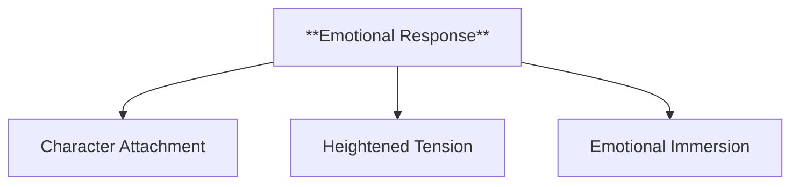
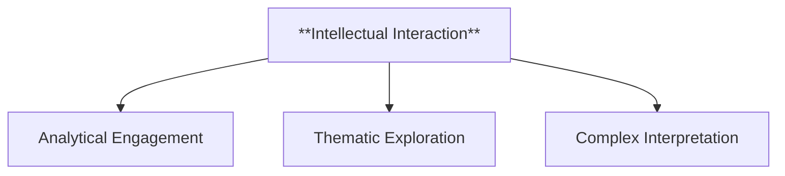
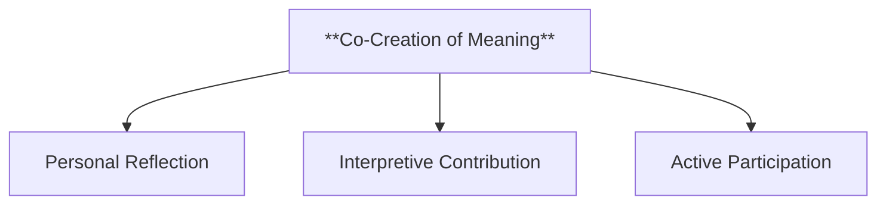
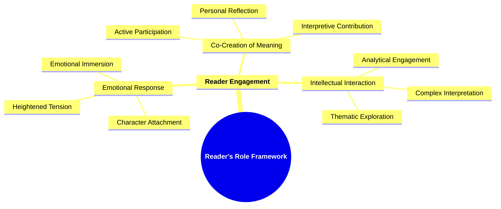

- [1. **Title: Forster's Reader's Role Framework**](#1-title-forsters-readers-role-framework)
- [2. **Key Concepts**](#2-key-concepts)
  - [2.1. **Reader Engagement**](#21-reader-engagement)
    - [2.1.1. **Components of Reader Engagement**](#211-components-of-reader-engagement)
      - [2.1.1.1. **Emotional Response**](#2111-emotional-response)
      - [2.1.1.2. **Intellectual Interaction**](#2112-intellectual-interaction)
      - [2.1.1.3. **Co-Creation of Meaning**](#2113-co-creation-of-meaning)
- [3. Theoretical Significance](#3-theoretical-significance)
- [4. Implications of **Forster's Reader's Role Framework**](#4-implications-of-forsters-readers-role-framework)

---
### 1. **Title: Forster's Reader's Role Framework**

**The Reader’s Role**:
   **Definition**: E.M. Forster’s *Reader’s Role Framework*, as articulated in *"Aspects of the Novel,"* emphasizes that the reader plays an essential part in creating the meaning and value of a novel. Forster argues that a novel’s success depends not only on its formal elements, such as plot or character, but also on how it engages the reader emotionally and intellectually. The reader’s responses, reflections, and emotional connections are central to how a narrative is experienced and interpreted.

---

### 2. **Key Concepts**

#### 2.1. **Reader Engagement**

**Definition**:
   Reader engagement refers to the active involvement of the reader in interacting with the narrative. It highlights the reader's role in experiencing and shaping the emotional and intellectual depth of a novel.

##### 2.1.1. **Components of Reader Engagement**

###### 2.1.1.1. **Emotional Response**
- **Definition**: The novel evokes strong feelings in the reader, such as empathy for characters or tension in the plot.

  - **Characteristics**
    - **Character Attachment**: Readers develop strong connections to characters, experiencing their joys and struggles as their own.
    - **Heightened Tension**: Plot developments and conflicts generate suspense or excitement, drawing readers deeper into the story.
    - **Emotional Immersion**: Evokes feelings such as sadness, anger, or joy, making the reading experience more engaging and memorable.

###### 2.1.1.2. **Intellectual Interaction**
- **Definition**: Readers think critically about the novel's themes, analyzing its messages and underlying ideas.

  - **Characteristics**
    - **Analytical Engagement**: Prompts readers to question the story’s deeper meanings and the author’s intent.
    - **Thematic Exploration**: Encourages examination of the novel’s central themes, moral questions, and philosophical implications.
    - **Complex Interpretation**: Invites readers to dissect narrative techniques, symbols, and motifs to understand the broader context and significance.

###### 2.1.1.3. **Co-Creation of Meaning**
- **Definition**: The reader helps create meaning through their interpretations, reflections, and emotional investment.

  - **Characteristics**
    - **Personal Reflection**: Readers project their own experiences and beliefs onto the story, adding layers of personal meaning.
    - **Interpretive Contribution**: Each reader’s unique perspective contributes to a varied understanding of the narrative’s significance.
    - **Active Participation**: Engages readers as collaborators in storytelling, where their thoughts and feelings help shape the novel’s impact.

---

---

### 3. Theoretical Significance

**Impact on Literary Criticism**:
   Forster’s focus on the reader’s engagement has influenced literary criticism by shifting attention to the reader's role in interpreting texts. This approach laid the groundwork for reader-response theory, which emphasizes that meaning emerges from the interaction between reader and narrative.

**Influence on Narrative Theory**:
   Forster's framework also contributed to narrative theory, particularly in understanding how stories evoke specific emotional and intellectual responses. Analyzing the reader's role allows for a deeper exploration of how narratives resonate with audiences.

**Application Across Media**:
   Forster’s ideas about reader engagement apply not only to novels but also to film, television, and digital media. In all these forms, the audience's emotional and intellectual involvement is key to the success of the narrative. His framework provides a valuable tool for understanding how stories can maximize audience participation.

**Supporting Information**:
   - **Evolution of Reader-Response Theory**: Scholars like Wolfgang Iser and Stanley Fish built on Forster’s insights, further exploring how readers shape a text’s meaning. Their work expanded on the idea that interpretation is a collaborative process.
   - **Critiques and Development**: While some critics argue that focusing on reader engagement undervalues formal elements of the text, many modern approaches seek to balance the reader's role with an appreciation of the text’s structure and the author’s intent.

---

### 4. Implications of **Forster's Reader's Role Framework**

**Participatory Reading**:
   Forster’s framework encourages an active, participatory approach to reading, where readers are not passive consumers but collaborators in creating the narrative's meaning.

**Multiplicity of Interpretations**:
   Forster’s ideas suggest that no single interpretation of a text is definitive. Readers bring their own perspectives to the narrative, resulting in a rich diversity of meanings.

---
