- [**1. Title: McKee's Audience Expectation Framework**](#1-title-mckees-audience-expectation-framework)
  - [**1.1. Definition**](#11-definition)
- [**2. Key Concepts**](#2-key-concepts)
  - [**2.1. Understanding Genre Conventions**](#21-understanding-genre-conventions)
    - [**2.1.1. Components of Understanding Genre Conventions**](#211-components-of-understanding-genre-conventions)
      - [**2.1.1.1. Purpose**](#2111-purpose)
      - [**2.1.1.2. Application**](#2112-application)
      - [**2.1.1.3. Example**](#2113-example)
  - [**2.2. Subverting Expectations**](#22-subverting-expectations)
    - [**2.2.1. Components of Subverting Expectations**](#221-components-of-subverting-expectations)
      - [**2.2.1.1. Purpose**](#2211-purpose)
      - [**2.2.1.2. Application**](#2212-application)
      - [**2.2.1.3. Example**](#2213-example)
  - [**2.3. Genre Fusion**](#23-genre-fusion)
    - [**2.3.1. Components of Genre Fusion**](#231-components-of-genre-fusion)
      - [**2.3.1.1. Purpose**](#2311-purpose)
      - [**2.3.1.2. Application**](#2312-application)
      - [**2.3.1.3. Example**](#2313-example)
- [**3. Implications of McKee’s Audience Expectation Framework**](#3-implications-of-mckees-audience-expectation-framework)
  - [**3.1. Fulfilling and Challenging Expectations**](#31-fulfilling-and-challenging-expectations)
  - [**3.2. Emotional Resonance and Engagement**](#32-emotional-resonance-and-engagement)
  - [**3.3. Narrative Evolution**](#33-narrative-evolution)
- [**Core Components Overview**](#core-components-overview)

---

### **1. Title: McKee's Audience Expectation Framework**

#### **1.1. Definition**

McKee’s Audience Expectation Framework focuses on understanding, fulfilling, and strategically subverting the preconceived notions and anticipations that audiences bring to a narrative. By recognizing genre conventions, exploring innovative twists, and merging multiple genres, this framework enables writers to create stories that are both familiar and fresh, ensuring deep emotional resonance and sustained engagement.

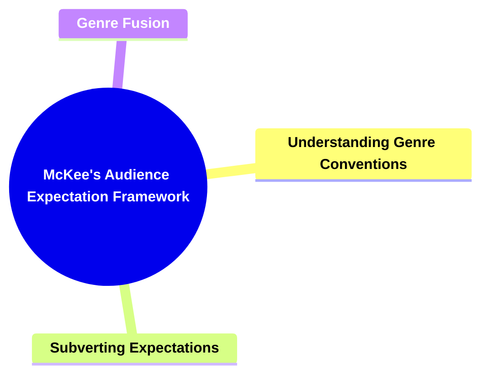

---

### **2. Key Concepts**

#### **2.1. Understanding Genre Conventions**

- **Definition:**
  Recognizing and aligning with the thematic and structural norms associated with a particular genre, ensuring that fundamental audience expectations are met.

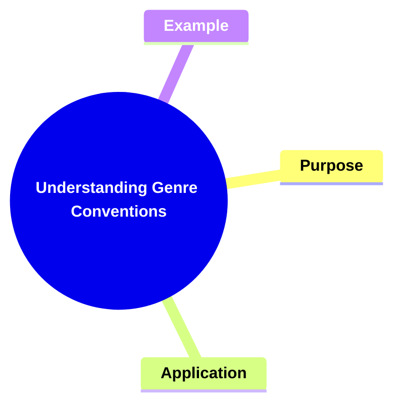

##### **2.1.1. Components of Understanding Genre Conventions**

###### **2.1.1.1. Purpose**

- **Definition:**
  Establishes a baseline of familiarity and trust, setting the tone and style that the audience expects within the chosen genre.

- **Characteristics:**
  - **Predictable Framework:** Offers a known pattern of narrative events.
  - **Thematic Consistency:** Maintains core themes and archetypes.
  - **Audience Comfort:** Provides a sense of reliability, enhancing initial engagement.

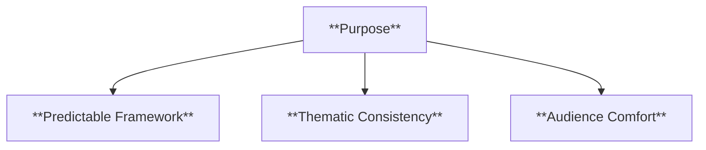

###### **2.1.1.2. Application**

- **Definition:**
  The deliberate inclusion of genre-specific elements—such as character roles, plot structures, or stylistic cues—to meet audience anticipations.

- **Characteristics:**
  - **Genre Markers:** Incorporates recognizable tropes and motifs.
  - **Structural Integrity:** Retains narrative coherence within the genre’s boundaries.
  - **Initial Satisfaction:** Satisfies fundamental audience desires for certain story beats.

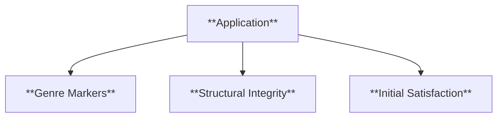

###### **2.1.1.3. Example**

- **Definition:**
  Illustrations of genre conventions in practice, demonstrating how adhering to expectations enhances audience involvement.

- **Characteristics:**
  - **Horror Conventions (e.g., _The Exorcist_):** Suspense, fear, and supernatural elements.
  - **Clear Genre Signals:** Audience recognizes expected patterns, heightening immersion.
  - **Reinforced Engagement:** Viewers feel prepared for the emotional journey.

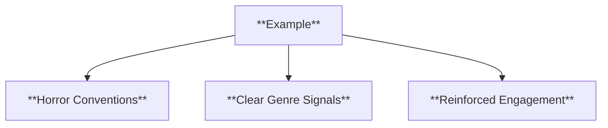

---

#### **2.2. Subverting Expectations**

- **Definition:**
  Challenging and altering established genre norms to introduce surprise, complexity, and originality, thus preventing predictability and stagnation.

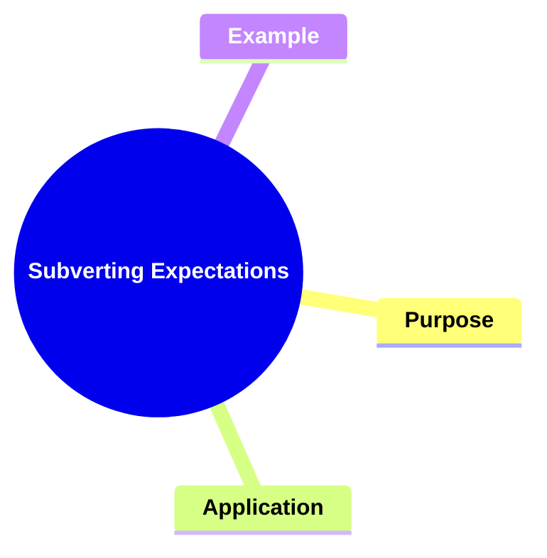

##### **2.2.1. Components of Subverting Expectations**

###### **2.2.1.1. Purpose**

- **Definition:**
  To break away from standard formulas and offer new angles, keeping the audience alert and intrigued.

- **Characteristics:**
  - **Innovative Twists:** Unexpected narrative turns that defy genre clichés.
  - **Enhanced Originality:** Distinguishes the story from typical genre entries.
  - **Sustained Curiosity:** Audiences remain engaged through continual unpredictability.

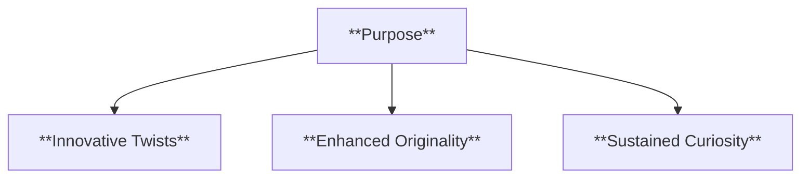

###### **2.2.1.2. Application**

- **Definition:**
  The intentional addition of unconventional elements or commentary, reshaping audience perceptions and broadening narrative scope.

- **Characteristics:**
  - **Reframed Archetypes:** Familiar roles reimagined with fresh traits.
  - **Layered Themes:** Incorporation of deeper societal or moral questions.
  - **Complex Character Dynamics:** Subversions reveal hidden motivations or conflicts.

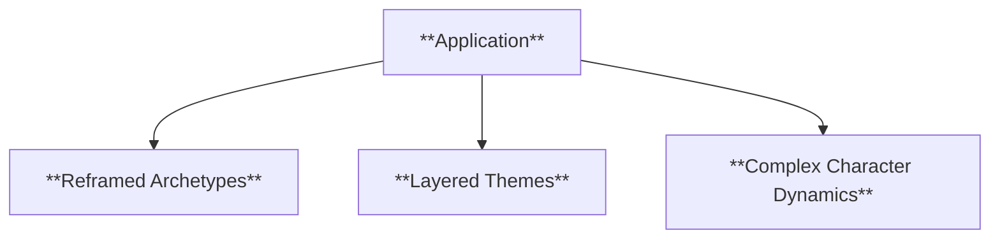

###### **2.2.1.3. Example**

- **Definition:**
  Demonstrations of how subversion revitalizes a familiar genre, offering audiences a uniquely resonant experience.

- **Characteristics:**
  - **_Get Out_ (Horror Genre):** Integrates social commentary on racism into horror tropes.
  - **Multi-Dimensional Impact:** Genre expectations are met but also expanded.
  - **Audience Engagement:** Surprise elements forge a more memorable and impactful narrative.

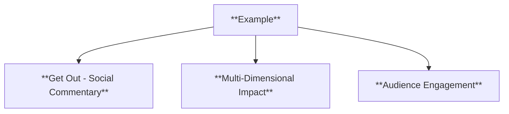

---

#### **2.3. Genre Fusion**

- **Definition:**
  Combining elements from multiple genres to create hybrid narratives that appeal to a wide range of audience preferences, encouraging both familiarity and freshness.

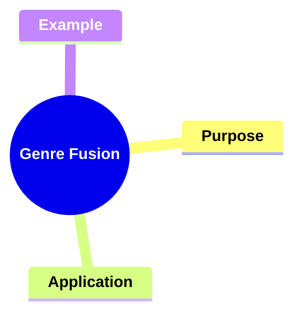

##### **2.3.1. Components of Genre Fusion**

###### **2.3.1.1. Purpose**

- **Definition:**
  To integrate diverse genre attributes, delivering layered experiences that satisfy multiple audience expectations simultaneously.

- **Characteristics:**
  - **Cross-Pollination:** Blending motifs, structures, and styles from different genres.
  - **Broader Appeal:** Attracts varied audiences with diverse tastes.
  - **Narrative Complexity:** Multiple thematic strands coexist, enriching the story world.

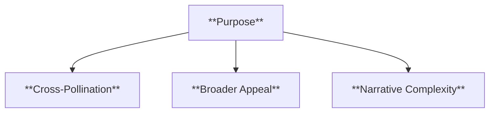

###### **2.3.1.2. Application**

- **Definition:**
  The deliberate construction of multi-genre narratives, orchestrating various genre elements to produce unique storytelling landscapes.

- **Characteristics:**
  - **Harmonized Elements:** Ensures that each genre component complements the others.
  - **Dynamic Interactions:** Contrasting motifs heighten emotional and intellectual engagement.
  - **Expansive Storytelling:** Enhanced flexibility and innovation in plot and character design.

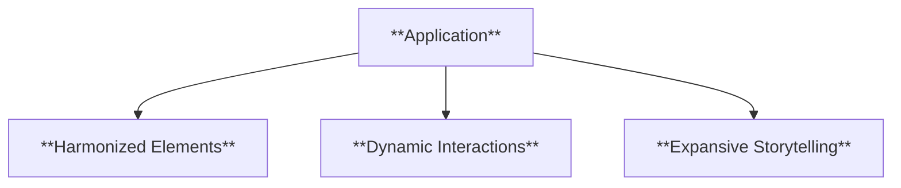

###### **2.3.1.3. Example**

- **Definition:**
  Illustrations of successful genre fusion that broaden narrative possibilities and audience appeal.

- **Characteristics:**
  - **_Blade Runner 2049_ (Sci-Fi + Noir):** Merges futuristic technology with noir’s moral ambiguity.
  - **Layered Atmosphere:** Creates a rich environment that transcends singular genre limits.
  - **Memorable Identity:** A distinctive narrative identity emerges from the fusion.

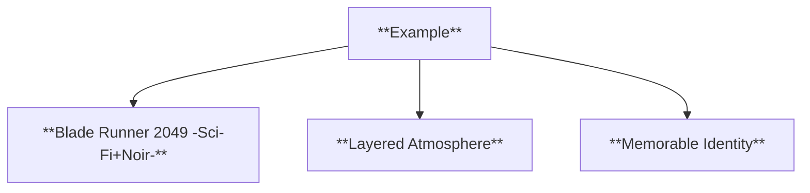

---

### **3. Implications of McKee’s Audience Expectation Framework**

#### **3.1. Fulfilling and Challenging Expectations**

- **Description:**
  Balancing adherence to known genre conventions with strategic subversion and fusion allows storytellers to meet audience desires while continually surprising them. This equilibrium ensures that stories remain accessible, yet innovative and thought-provoking.

#### **3.2. Emotional Resonance and Engagement**

- **Description:**
  By meeting initial expectations, audiences gain comfort and trust in the narrative. Through subverting and fusing genres, writers provoke emotional reactions and deeper investment, resulting in sustained audience engagement and memorable storytelling experiences.

#### **3.3. Narrative Evolution**

- **Description:**
  Incorporating fresh genre elements and defying predictability encourages the evolution of storytelling forms. As creators innovate within and across genres, they expand narrative possibilities, influencing future works and audience perceptions.

---

### **Core Components Overview**

- **Understanding Genre Conventions**

  - Purpose: Establishes familiarity and thematic cohesion.
  - Application: Aligns narrative elements with recognized patterns.
  - Example: Horror films using suspense and fear.

- **Subverting Expectations**

  - Purpose: Introduces originality and unexpected turns.
  - Application: Twists familiar patterns to engage and surprise audiences.
  - Example: _Get Out_ adding social commentary to horror themes.

- **Genre Fusion**
  - Purpose: Combines attributes from multiple genres for depth and variety.
  - Application: Harmonizes distinct genre elements for a richer narrative.
  - Example: _Blade Runner 2049_ merging sci-fi and noir for a unique blend.

---

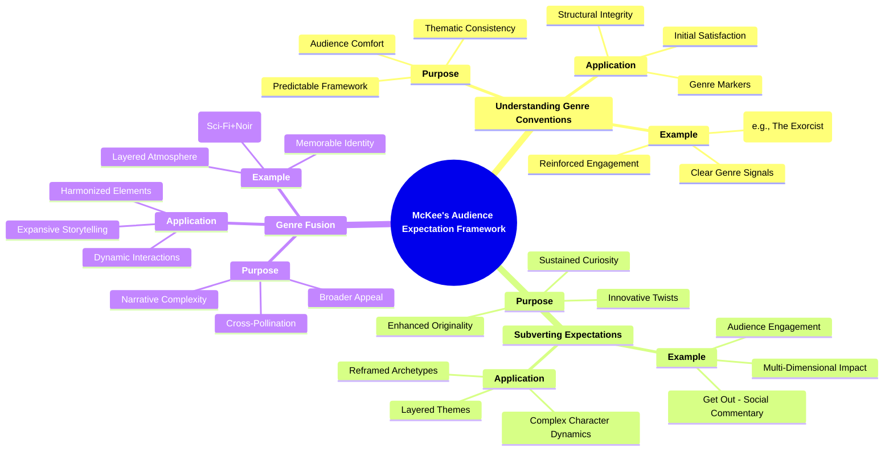
