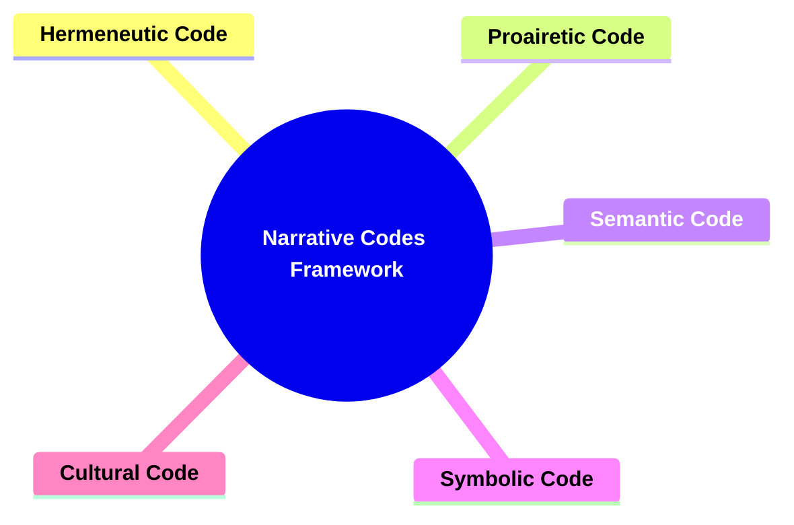
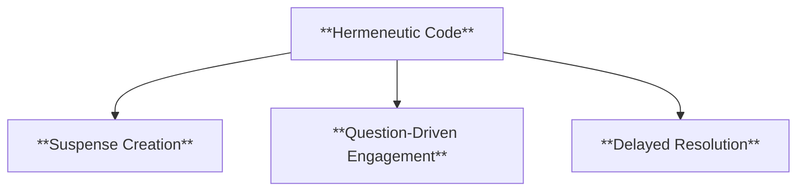
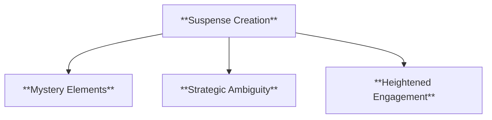
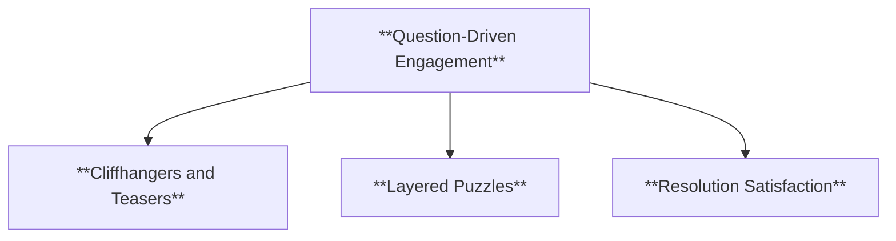
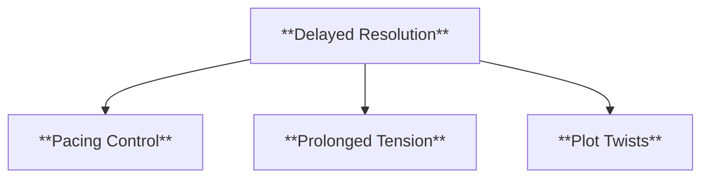
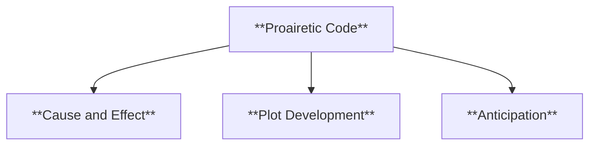
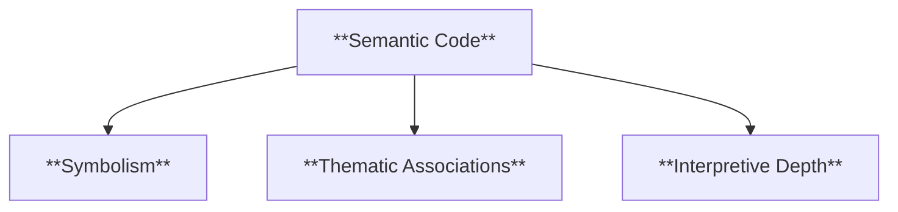
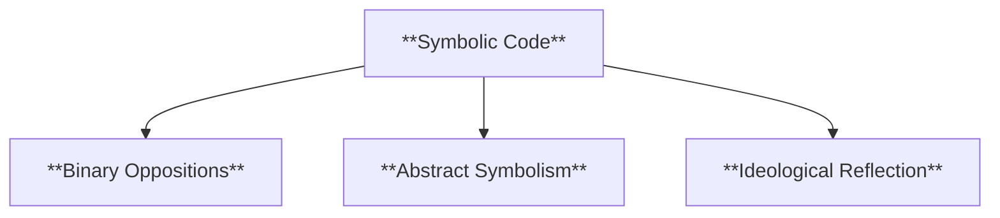
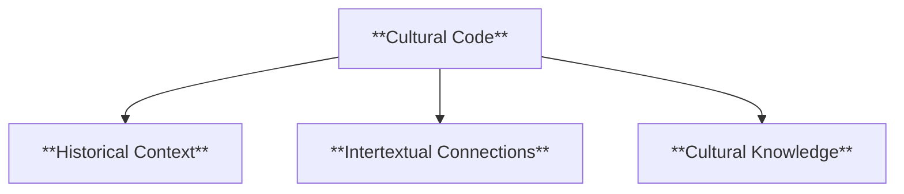
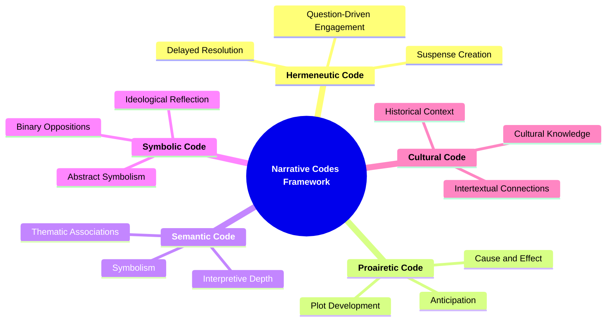

- [1. Title: **Barthes's Narrative Codes Framework**](#1-title-barthess-narrative-codes-framework)
- [2. Key Concepts](#2-key-concepts)
  - [2.1. Hermeneutic Code](#21-hermeneutic-code)
    - [2.1.1. **Components of Hermenutic Code**](#211-components-of-hermenutic-code)
      - [2.1.1.1. **Suspense Creation**](#2111-suspense-creation)
      - [2.1.1.2. **Question-Driven Engagement**](#2112-question-driven-engagement)
      - [2.1.1.3. **Delayed Resolution**](#2113-delayed-resolution)
  - [2.2. Proairetic Code](#22-proairetic-code)
    - [2.2.1. **Components of Proairetic Code**](#221-components-of-proairetic-code)
      - [2.2.1.1. **Cause and Effect**](#2211-cause-and-effect)
      - [2.2.1.2. **Plot Development**](#2212-plot-development)
      - [2.2.1.3. **Anticipation**](#2213-anticipation)
  - [2.3. Semantic Code](#23-semantic-code)
    - [2.3.1. **Components of Semantic Code**](#231-components-of-semantic-code)
      - [2.3.1.1. **Symbolism**](#2311-symbolism)
      - [2.3.1.2. **Thematic Associations**](#2312-thematic-associations)
      - [2.3.1.3. **Interpretive Depth**](#2313-interpretive-depth)
  - [2.4. Symbolic Code](#24-symbolic-code)
    - [2.4.1. **Components of Symbolic Code**](#241-components-of-symbolic-code)
      - [2.4.1.1. **Binary Oppositions**](#2411-binary-oppositions)
      - [2.4.1.2. **Abstract Symbolism**](#2412-abstract-symbolism)
      - [2.4.1.3. **Ideological Reflection**](#2413-ideological-reflection)
  - [2.5. Cultural Code](#25-cultural-code)
    - [2.5.1. **Components of Cultural Code**](#251-components-of-cultural-code)
      - [2.5.1.1. **Historical Context**](#2511-historical-context)
      - [2.5.1.2. **Intertextual Connections**](#2512-intertextual-connections)
      - [2.5.1.3. **Cultural Knowledge**](#2513-cultural-knowledge)

---

---
### 1. Title: **Barthes's Narrative Codes Framework**

**Narrative Codes**:
   **Definition**: Roland Barthes introduces the concept of *narrative codes* as systems of meaning that guide the interpretation of narratives. These codes function as the underlying structures that shape how a narrative is understood, allowing readers to decode various layers of meaning within a text.

---

### 2. Key Concepts

#### 2.1. Hermeneutic Code

**Definition**:
   The hermeneutic code relates to the elements of a narrative that generate mystery or suspense. It prompts the audience to ask questions and seek answers as the story unfolds, often driving the reader’s engagement by delaying the resolution of key plot points.

##### 2.1.1. **Components of Hermenutic Code**

###### 2.1.1.1. **Suspense Creation**
  - **Definition**: The hermeneutic code creates narrative tension by withholding information, encouraging the reader to keep guessing.

  - **Characteristics**
    - **Mystery Elements**: Introduces questions or puzzles that compel readers to search for answers throughout the story.
    - **Strategic Ambiguity**: Withholds certain details to create uncertainty and build interest in the narrative’s outcome.
    - **Heightened Engagement**: Keeps readers invested by leading them to anticipate future revelations.

###### 2.1.1.2. **Question-Driven Engagement**
  - **Definition**: This code engages readers through unanswered questions that gradually get resolved.

  - **Characteristics**
    - **Cliffhangers and Teasers**: Incorporates scenes that end with unresolved questions, encouraging readers to continue.
    - **Layered Puzzles**: Introduces multiple questions that may be answered at different stages, sustaining reader curiosity.
    - **Resolution Satisfaction**: Provides eventual answers that give readers a sense of closure or satisfaction.

###### 2.1.1.3. **Delayed Resolution**
  - **Definition**: The narrative strategically delays revealing key plot points to maintain intrigue.

  - **Characteristics**
    - **Pacing Control**: Manipulates the speed of the narrative by stretching out the time before a question is answered.
    - **Prolonged Tension**: Builds suspense as readers wait for significant information or outcomes.
    - **Plot Twists**: Uses the delay to prepare for surprising or impactful revelations.

---

#### 2.2. Proairetic Code

**Definition**:
   This code refers to the actions and events within a narrative that propel the plot forward. It creates expectations in the audience regarding future events, contributing to the momentum and pacing of the narrative.

##### 2.2.1. **Components of Proairetic Code**
###### 2.2.1.1. **Cause and Effect**
  - **Definition**: The proairetic code is responsible for the narrative’s forward motion, where actions lead to subsequent events.
  - **Characteristics**
    - **Logical Progression**: Events unfold in a sequence where one action triggers another, ensuring a cohesive plot.
    - **Action-Based Structure**: Emphasizes what happens next, maintaining momentum and reader engagement.
    - **Narrative Drive**: Propels the story forward by showing consequences that result from characters’ decisions and actions.

###### 2.2.1.2. **Plot Development**
  - **Definition**: This code ensures that each event contributes to the unfolding of the story.
  - **Characteristics**
    - **Sequential Events**: Structures the narrative so that each action logically connects to the next, building complexity.
    - **Significant Moments**: Highlights turning points that mark progress in the story, reinforcing its overall arc.
    - **Scene Coherence**: Maintains continuity and flow, avoiding narrative fragmentation.

###### 2.2.1.3. **Anticipation**
  - **Definition**: It builds anticipation in the reader by signaling that certain actions will have consequences later in the narrative.
  - **Characteristics**
    - **Foreshadowing**: Suggests that specific actions will lead to future events, creating suspense and reader interest.
    - **Tension Building**: Uses hints or cues that something significant is about to happen, increasing excitement.
    - **Expectations Set**: Prepares readers for upcoming developments, making the narrative more engaging and cohesive.

---

#### 2.3. Semantic Code

**Definition**:
   The semantic code concerns the connotations and associations evoked by specific elements within the narrative. These can be related to themes, symbols, or motifs that carry additional meaning beyond their literal interpretation.

##### 2.3.1. **Components of Semantic Code**

###### 2.3.1.1. **Symbolism**
  - **Definition**: Elements in the narrative represent deeper meanings or themes.
  - **Characteristics**
    - **Layered Significance**: Simple objects or events take on complex meanings, adding depth to the narrative.
    - **Thematic Enhancement**: Reinforces central themes by using repeated symbols throughout the story.
    - **Reader Interpretation**: Invites readers to discern symbolic meanings, enriching the reading experience.

###### 2.3.1.2. **Thematic Associations**
  - **Definition**: Repeated motifs or symbols create layers of meaning that contribute to the narrative's thematic complexity.
  - **Characteristics**
    - **Motif Recurrence**: Uses repeated imagery or ideas to highlight and connect thematic elements.
    - **Conceptual Depth**: Builds an interconnected web of themes that support and amplify the main narrative.
    - **Resonant Imagery**: Employs visual or conceptual motifs that linger with the reader, emphasizing underlying themes.

###### 2.3.1.3. **Interpretive Depth**
  - **Definition**: The semantic code adds richness to the story by allowing readers to find significance in recurring symbols or themes.
  - **Characteristics**
    - **Analytical Engagement**: Encourages readers to seek out symbolic meanings that go beyond the surface.
    - **Complex Narrative Layering**: Adds intricacies that invite different interpretations and reflections.
    - **Personal Connection**: Enables readers to project their own experiences onto the symbolic elements, deepening their engagement.

---

#### 2.4. Symbolic Code

**Definition**:
   This code deals with deeper, more abstract meanings within the narrative, often structured around binary oppositions or underlying ideological conflicts. It highlights the symbolic dimensions of the narrative, where certain elements stand for broader concepts or ideas.

##### 2.4.1. **Components of Symbolic Code**
###### 2.4.1.1. **Binary Oppositions**
  - **Definition**: Central conflicts in the narrative are often expressed through opposing forces or ideas, such as good vs. evil.
  - **Characteristics**
    - **Contrast and Conflict**: Highlights thematic dichotomies that drive the plot and define characters’ motivations.
    - **Thematic Tension**: Reinforces the narrative’s main conflicts by presenting them as opposing ideas or principles.
    - **Character Dynamics**: Often positions characters on different sides of the opposition, creating tension and development.

###### 2.4.1.2. **Abstract Symbolism**
  - **Definition**: Elements of the story represent complex ideas or philosophies.
  - **Characteristics**
    - **Concept Representation**: Uses characters, settings, or objects to symbolize abstract ideas, such as freedom or fate.
    - **Philosophical Undertones**: Infuses the narrative with deeper ideological meanings, prompting thought and discussion.
    - **Multi-Layered Meaning**: Adds interpretive complexity by weaving symbolic elements into the plot and character development.

###### 2.4.1.3. **Ideological Reflection**
  - **Definition**: The symbolic code often reflects deeper societal, cultural, or philosophical conflicts.
  - **Characteristics**
    - **Societal Commentary**: Uses symbolism to critique or reflect cultural norms and social issues.
    - **Cultural Significance**: Embeds symbols that resonate with historical or cultural references, adding depth.
    - **Thematic Relevance**: Aligns symbolic elements with the story’s overarching messages, reinforcing its ideological themes.

---

#### 2.5. Cultural Code

**Definition**:
   The cultural code encompasses the references and knowledge that the narrative assumes the audience possesses. It draws from broader cultural contexts, including historical, social, or literary knowledge that informs the reader’s understanding of the narrative.

---

---
##### 2.5.1. **Components of Cultural Code**

###### 2.5.1.1. **Historical Context**
  - **Definition**: Narratives often reference historical events or periods, expecting the reader to understand their significance.
  - **Characteristics**
    - **Embedded References**: Includes allusions to real historical events or figures to ground the story in a specific time or place.
    - **Authenticity**: Adds realism and depth to the narrative by anchoring it within a recognizable historical framework.
    - **Layered Understanding**: Enhances reader comprehension by requiring knowledge of historical events to fully appreciate the narrative’s subtext.

###### 2.5.1.2. **Intertextual Connections**
  - **Definition**: The cultural code includes references to other texts or cultural traditions that enrich the story’s meaning.
  - **Characteristics**
    - **Literary Echoes**: Draws on other works or well-known stories to create a dialogue between texts.
    - **Depth Through Allusion**: Engages readers who are familiar with the referenced works, providing additional insight and appreciation.
    - **Thematic Parallels**: Uses references to reinforce or contrast themes within the narrative, adding interpretative layers.

###### 2.5.1.3. **Cultural Knowledge**
  - **Definition**: The code relies on the reader’s familiarity with broader cultural, social, or literary knowledge to fully grasp the text.
  - **Characteristics**
    - **Reader’s Background**: Assumes that readers come with a certain level of cultural literacy, which enriches their understanding.
    - **Shared Symbols**: Utilizes symbols and references that resonate with cultural or social knowledge, adding meaning.
    - **Narrative Depth**: Invites readers to engage with the text on multiple levels, depending on their familiarity with cultural touchstones.