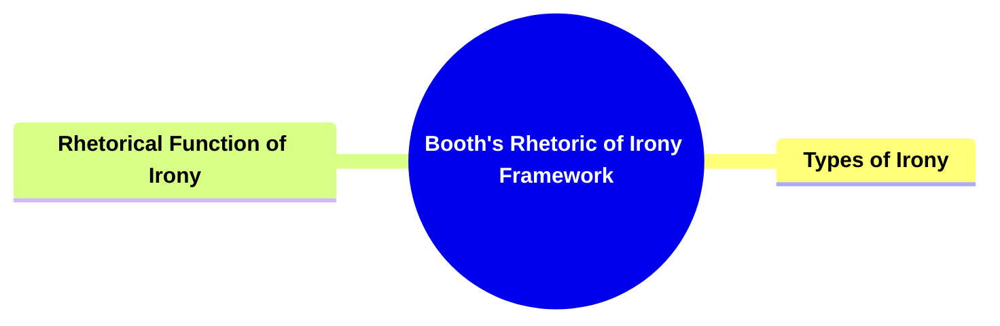
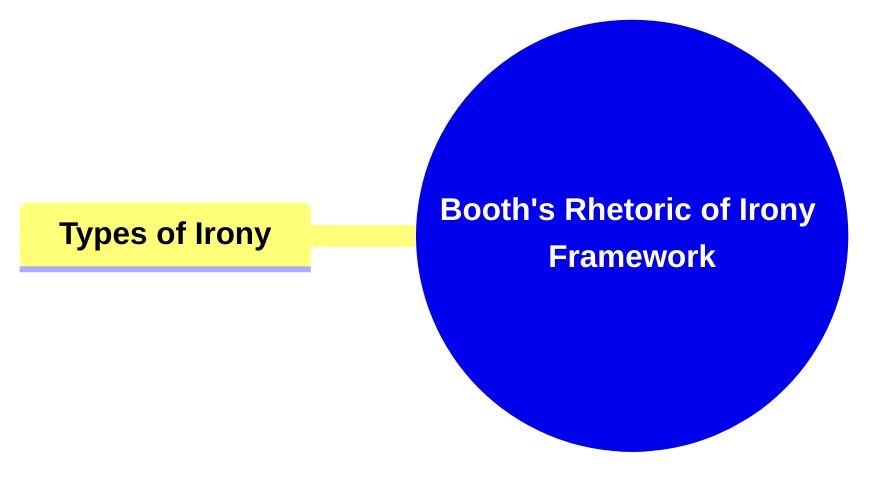
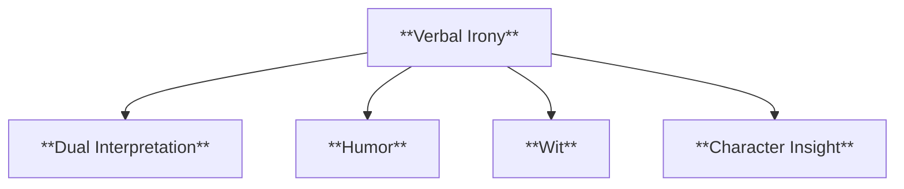
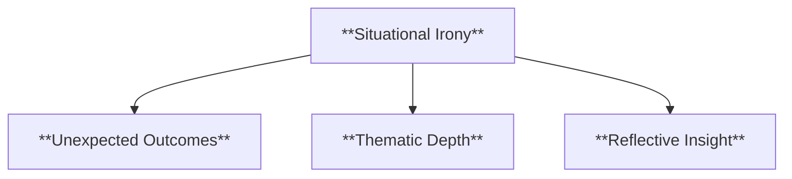
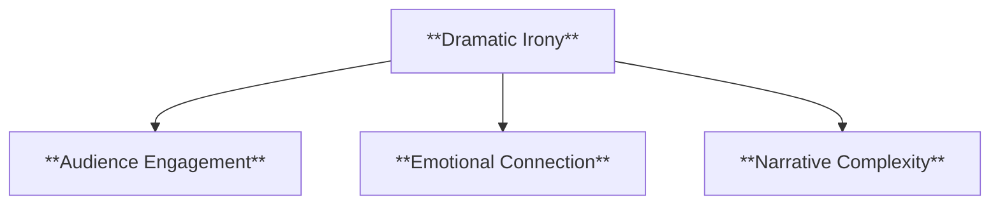
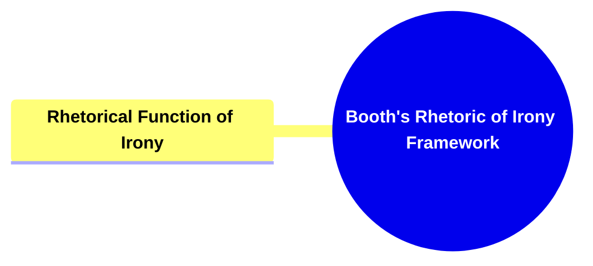
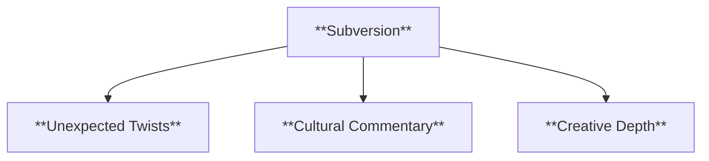
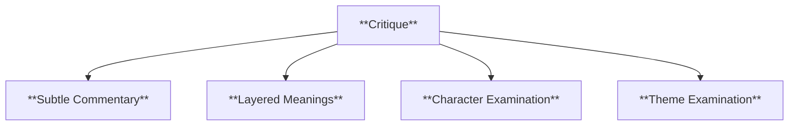
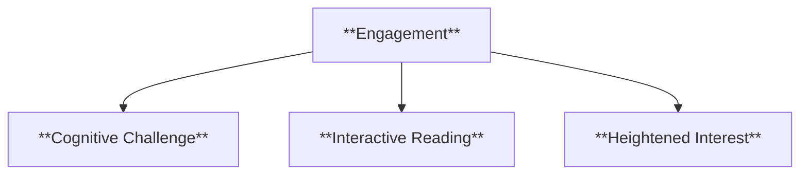
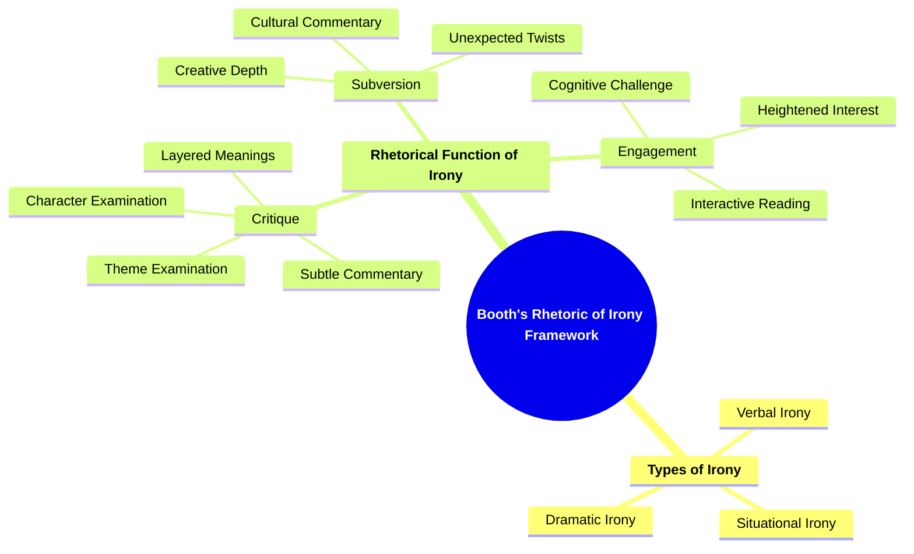

- [1. Title: **Booth's Rhetoric of Irony Framework**](#1-title-booths-rhetoric-of-irony-framework)
- [2. Key Concepts](#2-key-concepts)
  - [2.1. Types of Irony](#21-types-of-irony)
    - [2.1.1. **Components of Types of Irony**](#211-components-of-types-of-irony)
      - [2.1.1.1. **Verbal Irony**](#2111-verbal-irony)
      - [2.1.1.2. **Situational Irony**](#2112-situational-irony)
      - [2.1.1.3. **Dramatic Irony**](#2113-dramatic-irony)
  - [2.2. Rhetorical Function of Irony](#22-rhetorical-function-of-irony)
    - [2.2.1. **Components of Rhetorical Function of Irony**](#221-components-of-rhetorical-function-of-irony)
      - [2.2.1.1. **Subversion**](#2211-subversion)
      - [2.2.1.2. **Critique**](#2212-critique)
      - [2.2.1.3. **Engagement**](#2213-engagement)
    - [2.2.2. Implications of Booth’s Rhetoric of Irony Framework](#222-implications-of-booths-rhetoric-of-irony-framework)

---

---

### 1. Title: **Booth's Rhetoric of Irony Framework**

**A Rhetoric of Irony**:
**Definition**: In _"A Rhetoric of Irony"_ (1974), Wayne C. Booth explores the nuanced use of irony in narrative fiction. He investigates how authors use irony to create layers of meaning, inviting readers to engage in complex interpretive tasks that go beyond the surface level of the text.

---

### 2. Key Concepts

#### 2.1. Types of Irony

**Definition**:
Booth categorizes irony into several types, each serving different functions within a narrative. These types include:

##### 2.1.1. **Components of Types of Irony**

###### 2.1.1.1. **Verbal Irony**

- **Definition**: Where the intended meaning of a statement is opposite to its literal meaning.

- **Characteristics**
  - **Dual Interpretation**: The literal meaning contrasts with the underlying, intended message, creating a nuanced layer of understanding.
  - **Humor**: Light-hearted or amusing elements introduced to make dialogue or narration more engaging and enjoyable.
  - **Wit**: Clever or sharp remarks that add sarcasm or intellectual playfulness, enhancing the appeal of dialogue or narration.
  - **Character Insight**: Provides insight into a character’s true thoughts or intentions, revealing deeper aspects of their personality.

###### 2.1.1.2. **Situational Irony**

- **Definition**: Where there is a discrepancy between what is expected to happen and what actually occurs.

- **Characteristics**
  - **Unexpected Outcomes**: Creates surprise and engages readers by subverting their expectations.
  - **Thematic Depth**: Highlights contrasts between human intentions and uncontrollable outcomes, emphasizing themes like fate or unpredictability.
  - **Reflective Insight**: Prompts readers to reflect on the unpredictability of life or events within the narrative.

###### 2.1.1.3. **Dramatic Irony**

- **Definition**: Where the audience knows something that the characters do not, creating tension or humor.

- **Characteristics**
  - **Audience Engagement**: Creates suspense or humor as readers anticipate characters’ reactions to the revealed information.
  - **Emotional Connection**: Builds empathy or frustration as readers watch characters navigate situations with incomplete knowledge.
  - **Narrative Complexity**: Enhances the plot by adding layers of meaning, making the story more intricate and compelling.

---

#### 2.2. Rhetorical Function of Irony

**Definition**:
Irony is not merely a stylistic device but a rhetorical tool used by authors to influence the reader’s understanding of the narrative. It can critique characters, narrative structures, or societal norms.

##### 2.2.1. **Components of Rhetorical Function of Irony**

###### 2.2.1.1. **Subversion**

- **Definition**: Irony often subverts established norms, challenging societal or cultural expectations.

- **Characteristics**
  - **Unexpected Twists**: Changes familiar scenarios by adding ironic elements, making the story unpredictable.
  - **Cultural Commentary**: Uses irony to question or satirize societal norms, adding a layer of critique.
  - **Creative Depth**: Enhances storytelling by diverging from conventional plot developments, keeping readers intrigued.

###### 2.2.1.2. **Critique**

- **Definition**: Irony allows for indirect criticism of characters, events, or broader thematic concerns.

- **Characteristics**
  - **Subtle Commentary**: Offers a nuanced way to critique without overtly stating an opinion.
  - **Layered Meanings**: Enables multiple interpretations, allowing readers to discern underlying criticisms.
  - **Character Examination**: Focuses on revealing flaws or contradictions within individual characters, adding depth to their portrayal.
  - **Theme Examination**: Explores flaws or contradictions within societal structures, emphasizing underlying messages in the narrative.

###### 2.2.1.3. **Engagement**

- **Definition**: Irony increases reader involvement by demanding a more active interpretive process.

- **Characteristics**
  - **Cognitive Challenge**: Encourages readers to read between the lines and grasp implied meanings.
  - **Interactive Reading**: Involves readers in discovering the true intentions behind ironic statements or situations.
  - **Heightened Interest**: Keeps readers engaged as they look for deeper significance and appreciate the layers of meaning.

---

##### 2.2.2. Implications of Booth’s Rhetoric of Irony Framework

**Key Insight**:
Booth’s framework shows that irony is a crucial rhetorical tool in narrative fiction, not just for adding complexity but for actively engaging readers in the interpretive process. Understanding the various types of irony helps readers appreciate the depth of a narrative and its underlying critiques.

**Collaborative or Future-Oriented Insight**:
As narratives evolve, especially in modern and postmodern literature, Booth’s framework remains relevant for understanding how irony functions to challenge reader expectations and foster deeper engagement with the text.

---

