- [1. Title: **Booth's Showing vs. Telling Framework**](#1-title-booths-showing-vs-telling-framework)
- [2. Key Concepts](#2-key-concepts)
  - [2.1. Showing](#21-showing)
    - [2.1.1. **Components of Showing**](#211-components-of-showing)
      - [2.1.1.1. **Direct Action**](#2111-direct-action)
      - [2.1.1.2. **Dialogue**](#2112-dialogue)
      - [2.1.1.3. **Character Actions**](#2113-character-actions)
      - [2.1.1.4. **Sensory Descriptions**](#2114-sensory-descriptions)
  - [2.2. Telling](#22-telling)
    - [2.2.1. **Components of Telling**](#221-components-of-telling)
      - [2.2.1.1. **Narrative Commentary**](#2211-narrative-commentary)
      - [2.2.1.2. **Direct Characterization**](#2212-direct-characterization)
      - [2.2.1.3. **Expository Passages**](#2213-expository-passages)
      - [2.2.1.4. **Thematic Explication**](#2214-thematic-explication)
  - [2.3. Booth's Perspective on Showing vs. Telling](#23-booths-perspective-on-showing-vs-telling)

---

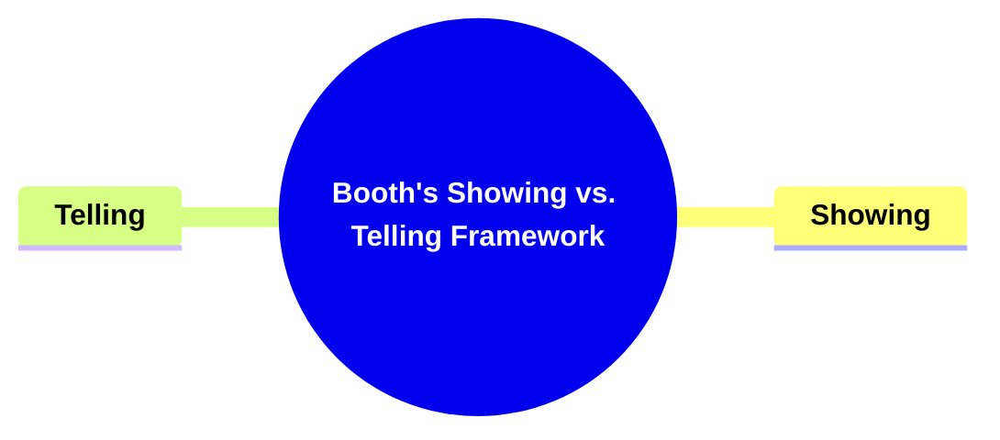

---

### 1. Title: **Booth's Showing vs. Telling Framework**

**Showing vs. Telling**:
**Definition**: Booth explores the dichotomy between _showing_ and _telling_ in narrative fiction, two fundamental techniques used in storytelling. These approaches represent different ways of conveying information and engaging the reader, each with its own strengths and potential drawbacks.

---

### 2. Key Concepts

#### 2.1. Showing

**Definition**:
Showing involves presenting events, actions, and dialogue directly within the narrative, without overt interpretation or commentary from the narrator. It allows readers to observe the story as it unfolds, drawing their own conclusions from the characters' behaviors, dialogue, and interactions.

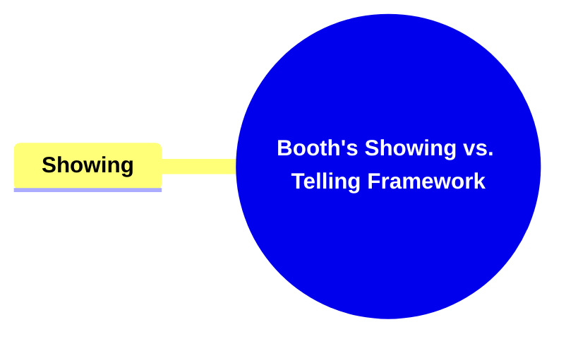

##### 2.1.1. **Components of Showing**

###### 2.1.1.1. **Direct Action**

- **Definition**: Events are depicted as they happen in real-time, without interruption or commentary.

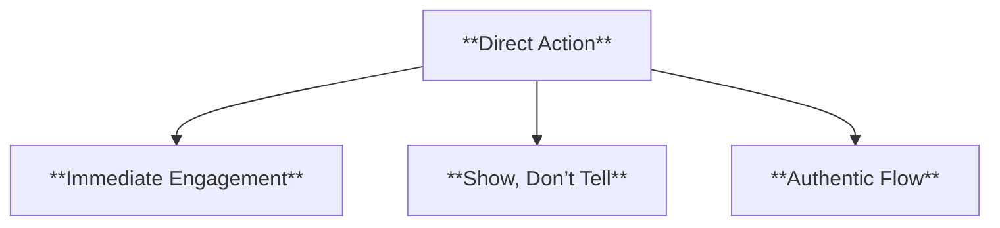

- **Characteristics**
  - **Immediate Engagement**: Creates a sense of urgency and immediacy, pulling readers into the action.
  - **Show, Don’t Tell**: Demonstrates events through direct depiction, allowing readers to experience the story firsthand.
  - **Authentic Flow**: Maintains a continuous narrative without authorial intrusion, enhancing realism.

###### 2.1.1.2. **Dialogue**

- **Definition**: Conversations are presented as they occur, allowing readers to infer meaning and subtext.

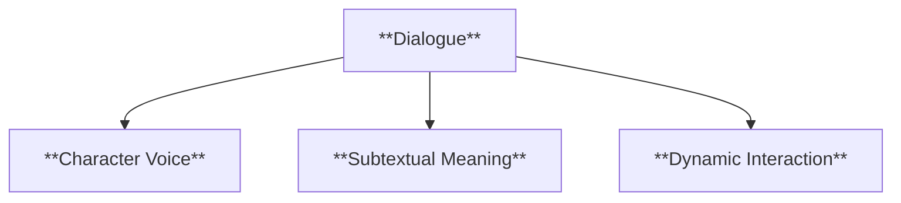

- **Characteristics**
  - **Character Voice**: Provides insight into characters’ personalities and relationships through their speech.
  - **Subtextual Meaning**: Allows readers to read between the lines and understand deeper motivations or conflicts.
  - **Dynamic Interaction**: Conveys character dynamics and advances the plot through real-time interaction.

###### 2.1.1.3. **Character Actions**

- **Definition**: Characters’ behaviors and decisions are shown directly, allowing readers to interpret them based on their actions.

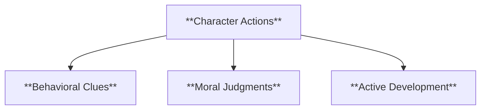

- **Characteristics**
  - **Behavioral Clues**: Offers readers hints about character traits through their actions.
  - **Moral Judgments**: Enables readers to form opinions about characters based on what they do, not just what they say.
  - **Active Development**: Progresses the story by focusing on characters’ decisions and their consequences.

###### 2.1.1.4. **Sensory Descriptions**

- **Definition**: Detailed depictions of sensory experiences (sight, sound, smell, taste, touch) create vivid, immersive settings.

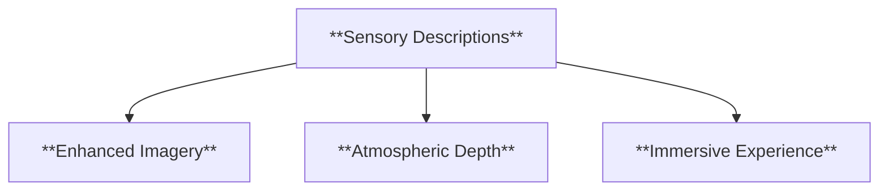

- **Characteristics**
  - **Enhanced Imagery**: Brings scenes to life by appealing to the reader’s senses.
  - **Atmospheric Depth**: Builds the mood and tone through rich, descriptive language.
  - **Immersive Experience**: Helps readers feel more connected to the narrative world by vividly describing sensory details.

---

#### 2.2. Telling

**Definition**:
Telling occurs when the narrator or author provides direct commentary, interpretation, or explanation of events, characters, or themes. It guides the reader’s understanding by explicitly stating what is happening or how to interpret it.

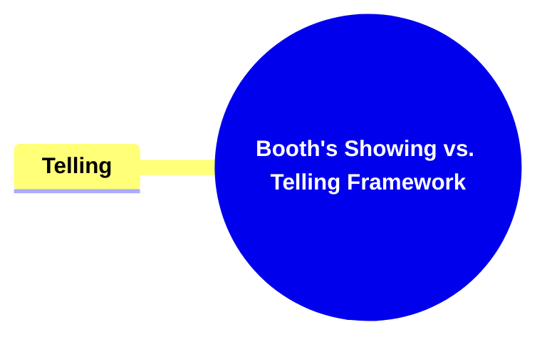

##### 2.2.1. **Components of Telling**

###### 2.2.1.1. **Narrative Commentary**

- **Definition**: The narrator provides insights or explanations about characters, events, or settings.

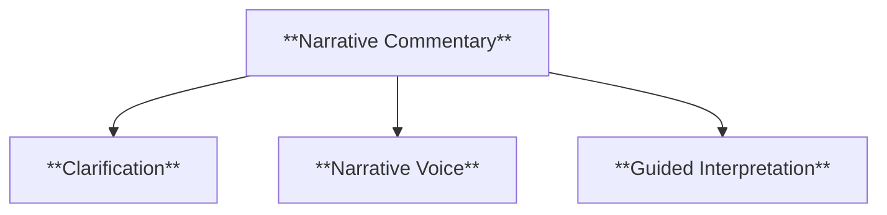

- **Characteristics**
  - **Clarification**: Offers readers a clearer understanding of complex events or motivations.
  - **Narrative Voice**: Establishes the tone and perspective of the story through the narrator’s insights.
  - **Guided Interpretation**: Directs readers on how to perceive certain aspects of the story.

###### 2.2.1.2. **Direct Characterization**

- **Definition**: The narrator explicitly describes a character’s traits, motivations, or inner thoughts.

- **Characteristics**
  - **Explicit Details**: Provides straightforward information about a character’s nature or intentions.
  - **Reader Guidance**: Helps readers understand characters without ambiguity.
  - **Insight into Motivation**: Clarifies why a character behaves a certain way through direct explanation.

###### 2.2.1.3. **Expository Passages**

- **Definition**: The author provides background information or context to help readers understand the narrative.

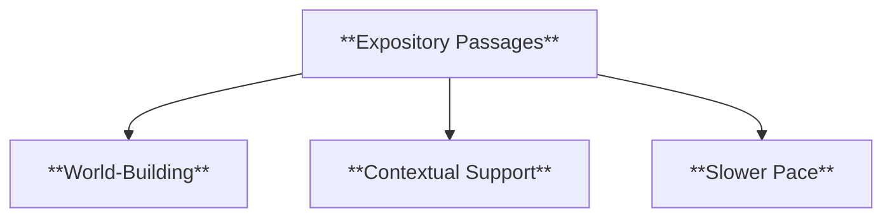

- **Characteristics**
  - **World-Building**: Introduces setting, history, or background that enriches the story’s context.
  - **Contextual Support**: Offers explanations that enhance readers’ comprehension of the plot or characters.
  - **Slower Pace**: Temporarily shifts from action to provide necessary details, aiding narrative flow.

###### 2.2.1.4. **Thematic Explication**

- **Definition**: The narrator or author explicitly states the themes or moral lessons of the narrative.

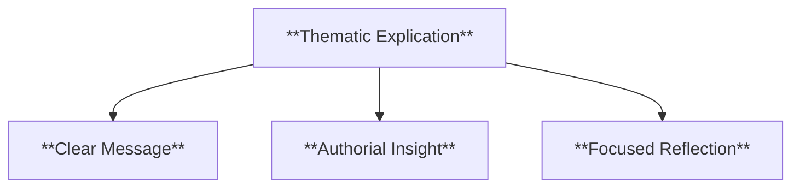

- **Characteristics**
  - **Clear Message**: Ensures readers understand the story’s central themes or morals.
  - **Authorial Insight**: Highlights the author’s intent or interpretation of the narrative’s meaning.
  - **Focused Reflection**: Encourages readers to consider the deeper implications of the story’s events.

---

#### 2.3. Booth's Perspective on Showing vs. Telling

**Rhetorical Choices**:

- **Definition**: Booth argues that both showing and telling are rhetorical strategies, employed to achieve specific effects in narrative fiction.

**Characteristics**:

- **Balance**: Effective narratives often balance both techniques to achieve depth and clarity.
- **Engagement vs. Clarity**: Showing engages the reader more actively, while telling provides clarity and efficiency in delivering information.
- **Flexibility**: Skilled authors can switch between showing and telling based on the needs of the narrative, allowing for a more dynamic reading experience.

**Contextualization**:
Booth emphasizes that showing and telling are not opposing techniques, but complementary tools that authors use to shape the reader’s experience. A balanced approach, where both methods are applied thoughtfully, can enhance narrative complexity and ensure the reader remains engaged while still grasping the author’s intended meaning.

---

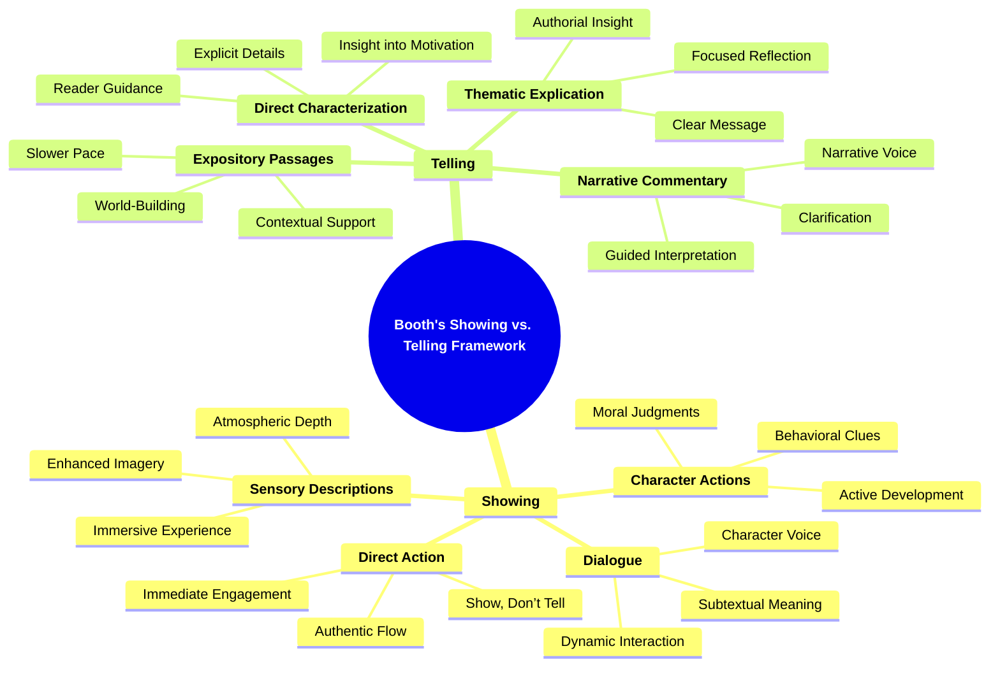
