- [**Greimas's Semiotic Square Model**](#greimass-semiotic-square-model)
  - [**Binary Oppositions**](#binary-oppositions)
  - [**Conceptual Relationships**](#conceptual-relationships)
- [1. Title: **Greimas's Semiotic Square Model**](#1-title-greimass-semiotic-square-model)
- [2. Key Concepts](#2-key-concepts)
  - [2.1. Binary Oppositions](#21-binary-oppositions)
    - [2.1.1. **Components of Binary Oppositions**](#211-components-of-binary-oppositions)
      - [2.1.1.1. **Dualistic Nature**](#2111-dualistic-nature)
      - [2.1.1.2. **Structural Function**](#2112-structural-function)
      - [2.1.1.3. **Resolution**](#2113-resolution)
      - [2.1.1.4. **Maintenance**](#2114-maintenance)
  - [2.2. Conceptual Relationships](#22-conceptual-relationships)
    - [2.2.1. **Components of Conceptual Relationships**](#221-components-of-conceptual-relationships)
      - [2.2.1.1. **Contradictory Relationships**](#2211-contradictory-relationships)
      - [2.2.1.2. **Contrary Relationships**](#2212-contrary-relationships)
      - [2.2.1.3. **Complementary Relationships**](#2213-complementary-relationships)
      - [2.2.1.4. **Mediation**](#2214-mediation)
- [3. Theoretical Significance](#3-theoretical-significance)
- [4. Conclusion](#4-conclusion)

---

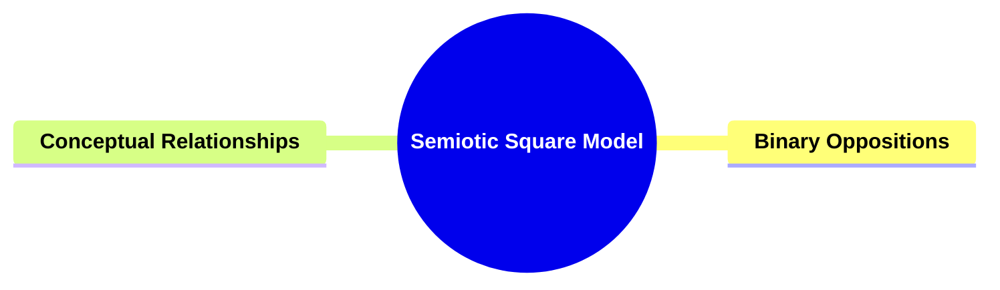

---

### **Greimas's Semiotic Square Model**

**The Semiotic Square**:
   **Definition**: Algirdas Julien Greimas's *semiotic square* is a tool in semiotics used to map relationships between contrasting and complementary concepts in a narrative. It represents oppositions, contradictions, and complementarities, facilitating an analytical exploration of the semantic structures that inform narratives.

---

#### **Binary Oppositions**
- **Definition**: Pairs of opposing concepts that structure narratives. The semiotic square analyzes these oppositions to highlight how they generate meaning and conflict.

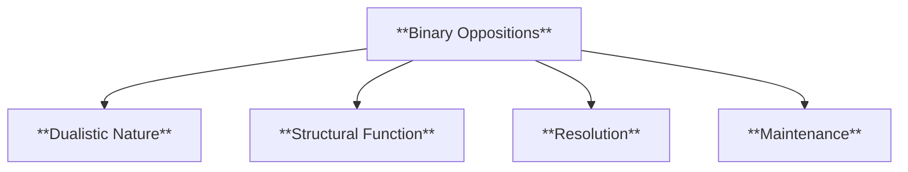

---

#### **Conceptual Relationships**
- **Definition**: Beyond binary oppositions, the semiotic square examines relationships between contradictory, contrary, and complementary concepts, identifying mediating concepts that bridge opposites.

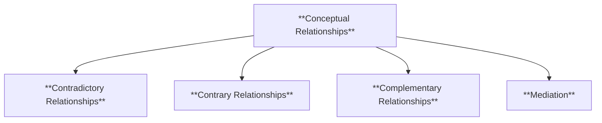

---

---

### 1. Title: **Greimas's Semiotic Square Model**

**The Semiotic Square**:
   **Definition**: Algirdas Julien Greimas's *semiotic square* is a conceptual tool used in semiotics to map the relationships between contrasting and complementary concepts in a narrative. It visually represents oppositions, contradictions, and complementarities between key terms or ideas, allowing for an analytical exploration of the underlying semantic structures that inform narratives.

---

### 2. Key Concepts

#### 2.1. Binary Oppositions

**Definition**:
   Binary oppositions are pairs of opposing concepts that drive the structure of narratives. The semiotic square is effective in analyzing these oppositions—such as good vs. evil or life vs. death—and highlights how these pairs generate meaning and conflict in the story.

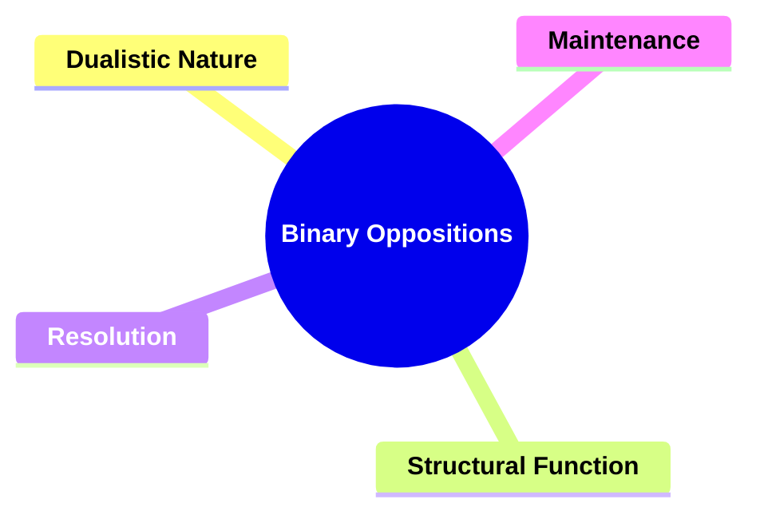

##### 2.1.1. **Components of Binary Oppositions**

###### 2.1.1.1. **Dualistic Nature**
  - **Definition**: Binary oppositions represent contrasting extremes of a spectrum, with each concept defined in relation to its opposite (e.g., good vs. evil).

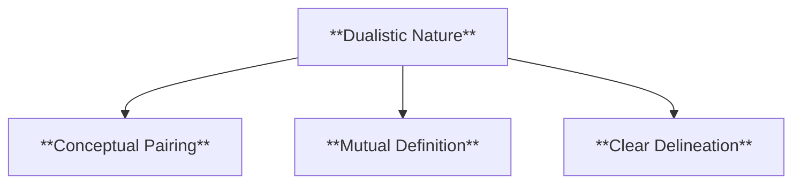

  - **Characteristics**
    - **Conceptual Pairing**: Establishes two opposing ideas that help frame the narrative’s themes and conflicts.
    - **Mutual Definition**: Each concept’s identity is dependent on its relationship with its counterpart, enhancing thematic depth.
    - **Clear Delineation**: Provides clear contrasts that guide reader interpretation and highlight character or plot motivations.

###### 2.1.1.2. **Structural Function**
  - **Definition**: Binary oppositions often shape the plot, character development, and themes of a narrative, creating the tension necessary for conflict and resolution.

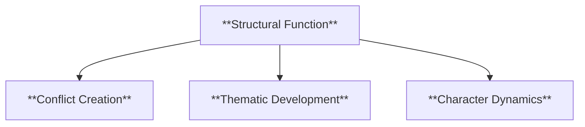

  - **Characteristics**
    - **Conflict Creation**: Drives the narrative by setting opposing forces against each other, fueling the story’s central tension.
    - **Thematic Development**: Helps to explore complex themes by positioning contrasting ideas, encouraging deeper analysis.
    - **Character Dynamics**: Influences characters’ roles and relationships, often positioning them as embodiments of these opposing forces.

###### 2.1.1.3. **Resolution**
  - **Definition**: The process by which binary oppositions in a narrative are resolved, often leading to a definitive conclusion (e.g., good triumphs over evil).

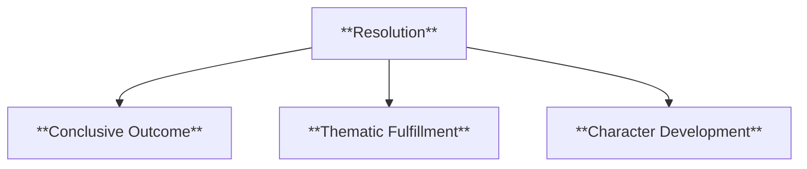

  - **Characteristics**
    - **Conclusive Outcome**: Provides a clear end to the conflict, offering closure for the narrative and its characters.
    - **Thematic Fulfillment**: Reinforces the narrative’s central message by resolving the opposition in a way that aligns with the story’s moral or philosophical stance.
    - **Character Development**: Allows for significant growth or change in characters as they navigate and ultimately resolve the opposing forces.

###### 2.1.1.4. **Maintenance**
  - **Definition**: The narrative choice to sustain the tension between binary oppositions without definitive resolution, portraying an ongoing struggle (e.g., the continuous battle between life and death).

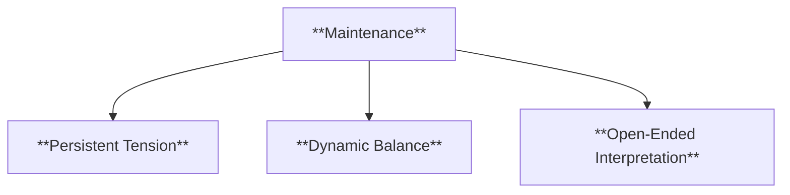

  - **Characteristics**
    - **Persistent Tension**: Keeps the conflict alive, adding complexity and realism to the narrative by reflecting life’s unresolved struggles.
    - **Dynamic Balance**: Illustrates the coexistence of opposing forces, showing how characters or themes are influenced by their interactions.
    - **Open-Ended Interpretation**: Encourages readers to ponder the implications of an unresolved conflict, fostering deeper engagement and varied interpretations.

---

#### 2.2. Conceptual Relationships

**Definition**:
   Beyond binary oppositions, the semiotic square explores the relationships between contradictory, contrary, and complementary concepts. It identifies mediating concepts that bridge opposites, providing insight into how interconnected ideas contribute to a narrative’s complexity.

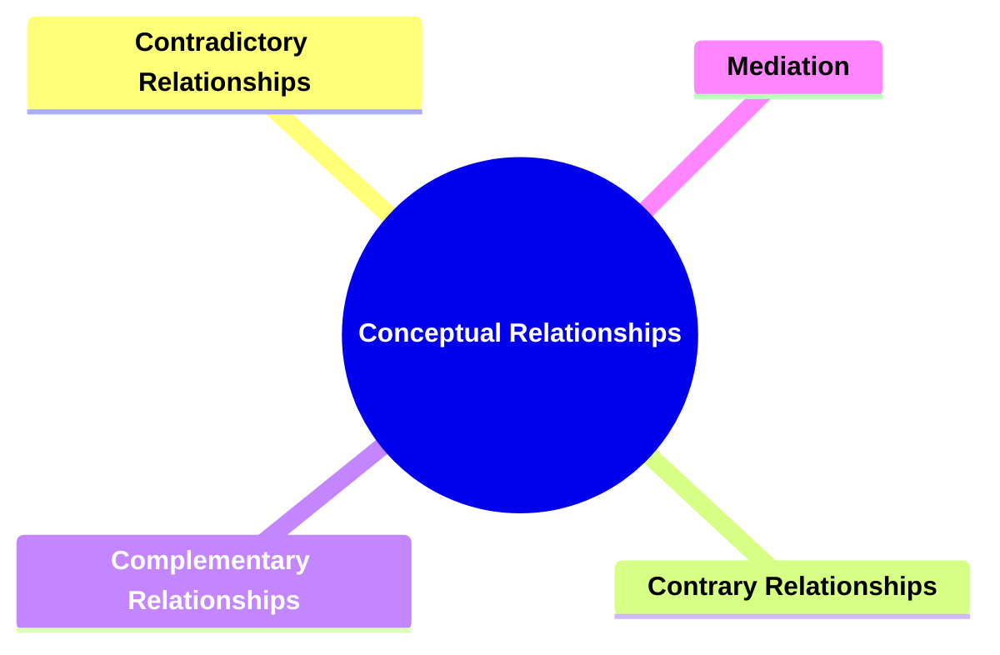

##### 2.2.1. **Components of Conceptual Relationships**

###### 2.2.1.1. **Contradictory Relationships**
  - **Definition**: These involve mutually exclusive concepts (e.g., life vs. death) that cannot coexist within the same context.

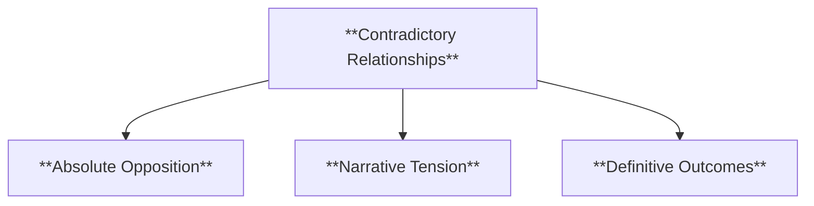

  - **Characteristics**
    - **Absolute Opposition**: Presents concepts that are fundamentally incompatible, creating a stark conflict.
    - **Narrative Tension**: Drives strong narrative stakes as characters or events embody one extreme over the other.
    - **Definitive Outcomes**: Often requires a clear resolution, emphasizing the triumph of one side over the other.

###### 2.2.1.2. **Contrary Relationships**
  - **Definition**: These represent opposing ideas that are not entirely contradictory, allowing for intermediary states (e.g., life vs. non-life).

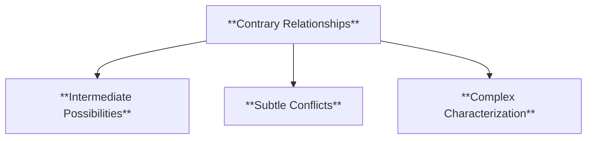

  - **Characteristics**
    - **Intermediate Possibilities**: Allows for shades of meaning or states that lie between the two opposites.
    - **Subtle Conflicts**: Creates more nuanced conflicts or themes that can explore the spectrum between the opposing ideas.
    - **Complex Characterization**: Enables characters to embody traits that blend aspects of both opposites, adding depth to their development.

###### 2.2.1.3. **Complementary Relationships**
  - **Definition**: Concepts that enhance or complete each other (e.g., light and shadow) and function together to create balance.

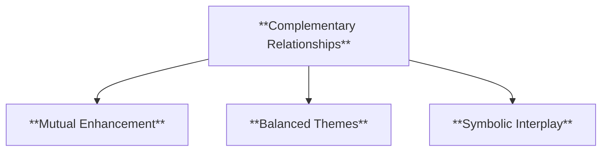

  - **Characteristics**
    - **Mutual Enhancement**: Each concept strengthens the significance of the other, adding richness to the narrative.
    - **Balanced Themes**: Portrays interdependence, emphasizing how opposing forces are necessary for a cohesive whole.
    - **Symbolic Interplay**: Uses the relationship to reinforce thematic elements and illustrate the interconnectedness of the narrative’s ideas.

###### 2.2.1.4. **Mediation**
  - **Definition**: A mediating term that reconciles or synthesizes opposites, offering a more nuanced understanding of how these relationships operate within the narrative.

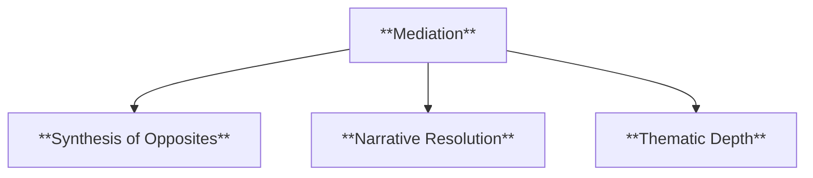
  - **Characteristics**
    - **Synthesis of Opposites**: Introduces elements or ideas that bridge the gap between two conflicting forces.
    - **Narrative Resolution**: Provides a way to resolve tension without completely eliminating either side of the opposition.
    - **Thematic Depth**: Adds layers to the story by showcasing how apparent opposites can be reconciled or coexist within a larger framework.

---

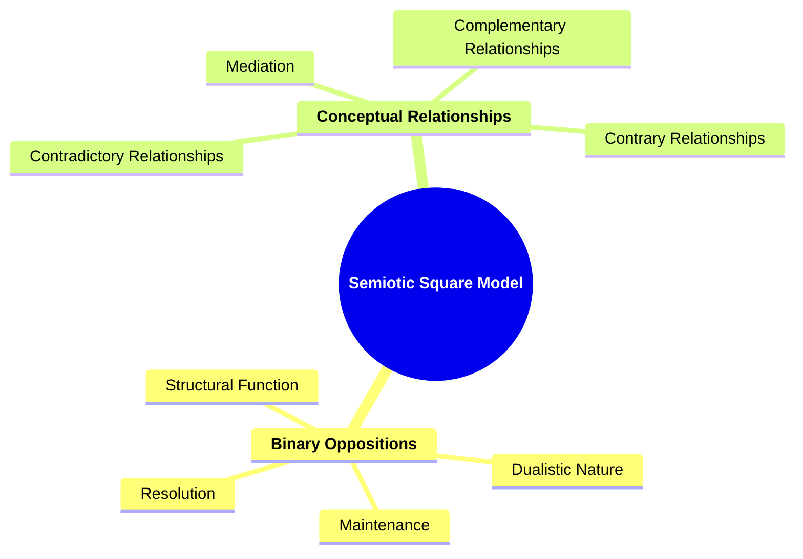

### 3. Theoretical Significance

**Greimas’s Contribution to Semiotics**:
   - **Structural Analysis**: The semiotic square is an essential tool in Greimas’s structuralist approach to narrative analysis, providing a clear method for mapping the underlying conceptual frameworks that shape narratives.
   - **Semantic Exploration**: By visually representing conceptual oppositions and relationships, the semiotic square allows for a more detailed exploration of the ways narratives generate and negotiate meaning.
   - **Influence on Structuralism**: Greimas’s model contributes significantly to structuralist theory, which seeks to uncover the deep structures that govern all forms of human expression, including language, myth, and narrative.

**Application in Narrative Analysis**:
   - **Analyzing Narrative Structures**: The semiotic square is useful for dissecting complex narratives, revealing how opposing concepts are managed and what mediating ideas emerge from their interaction.
   - **Beyond Literature**: The model’s applications extend to anthropology, philosophy, and cultural studies, where it helps map the conceptual frameworks underlying myths, rituals, and cultural narratives.
   - **Criticism and Adaptations**: While praised for its clarity, some critics argue that the semiotic square can oversimplify relationships by fitting them into a rigid framework. However, its flexibility allows theorists to adapt it for more fluid or nuanced analyses.

---

### 4. Conclusion

**Integrating the Semiotic Square**:
   Greimas’s semiotic square offers a powerful method for analyzing narrative structures, allowing for a detailed exploration of how oppositions, contradictions, and relationships between concepts contribute to meaning. It provides both clarity and depth, making it an essential tool in semiotics.

**Greimas’s Lasting Impact**:
   The semiotic square continues to be a vital tool in narrative analysis, offering insights into how meaning is constructed through the interaction of concepts. As narratives evolve in new mediums and forms, Greimas’s model remains a foundational element in the study of semiotics and structuralism.

---

