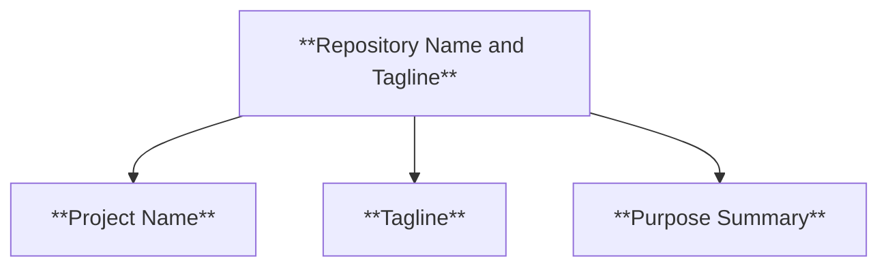
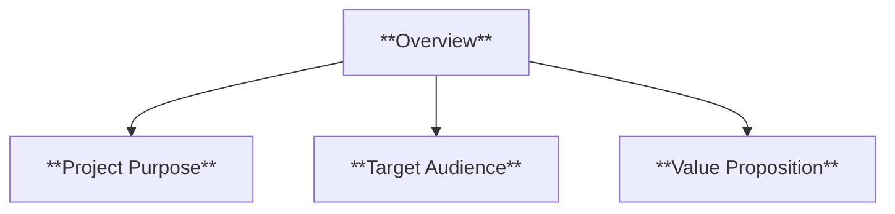
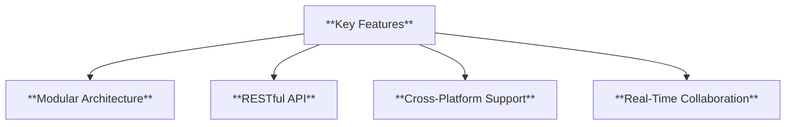
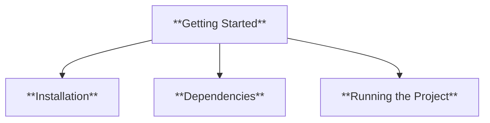
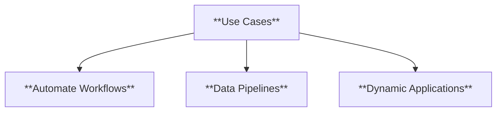
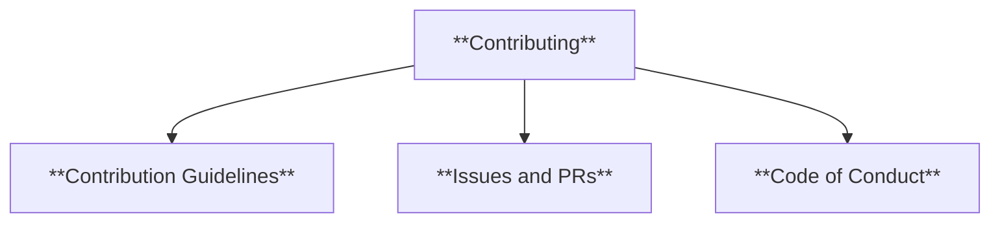
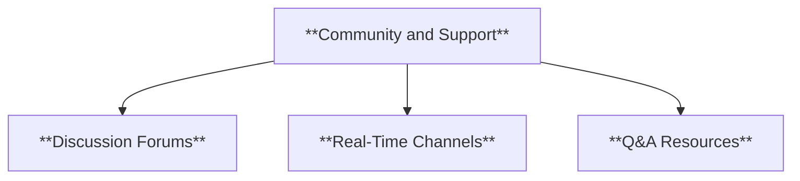
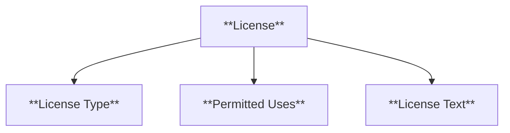
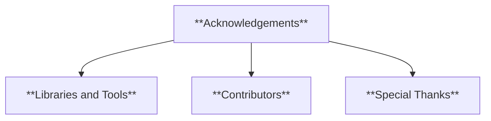
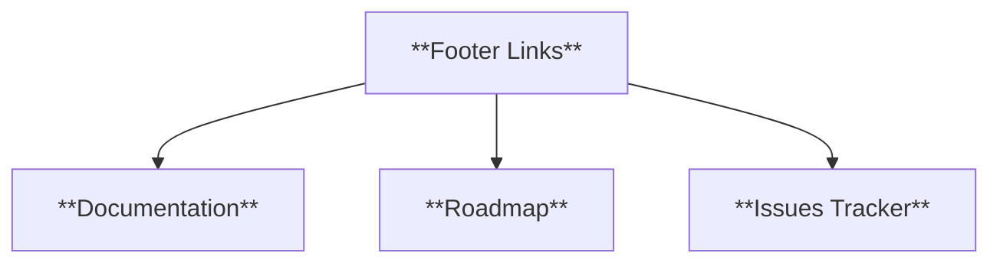

### **What is [Business Name]? (Open Source Project)**

#### **1. Repository Name and Tagline**

- **Definition**: The project’s name and a brief, descriptive tagline summarizing its purpose.



- **Characteristics**:
  - **Project Name**: The official title of the repository.
  - **Tagline**: A one-line description to engage and inform.
  - **Purpose Summary**: Brief explanation of the project's core function.

---

#### **2. Overview**

- **Definition**: A concise summary of the project, its target audience, and why it exists.



- **Characteristics**:
  - **Project Purpose**: The main goal or problem the project addresses.
  - **Target Audience**: Developers, organizations, or hobbyists.
  - **Value Proposition**: The unique benefit or advantage it provides.

---

#### **3. Key Features**

- **Definition**: Highlights the primary functionalities and technical strengths.



- **Characteristics**:
  - **Modular Architecture**: Enables flexible integration.
  - **RESTful API**: Facilitates seamless communication.
  - **Cross-Platform Support**: Compatible across major operating systems.
  - **Real-Time Collaboration**: Includes tools like version control.

---

#### **4. Getting Started**

- **Definition**: Step-by-step guide to setting up and using the project.



- **Characteristics**:
  - **Installation**: Instructions to clone and set up the repository.
  - **Dependencies**: Required tools or libraries for functionality.
  - **Running the Project**: Commands to execute the application.

---

#### **5. Use Cases**

- **Definition**: Examples of practical applications or problems the project solves.



- **Characteristics**:
  - **Automate Workflows**: Streamlines processes like CI/CD.
  - **Data Pipelines**: Handles large-scale data operations.
  - **Dynamic Applications**: Powers versatile, scalable applications.

---

#### **6. Contributing**

- **Definition**: Guidelines for users to contribute to the project.



- **Characteristics**:
  - **Contribution Guidelines**: Steps to propose changes or add features.
  - **Issues and PRs**: Clear processes for submitting issues and pull requests.
  - **Code of Conduct**: Defines acceptable behavior within the community.

---

#### **7. Community and Support**

- **Definition**: Resources and channels for user engagement and help.



- **Characteristics**:
  - **Discussion Forums**: Platforms for collaboration and Q&A.
  - **Real-Time Channels**: Communication via Discord or Slack.
  - **Q&A Resources**: FAQs and troubleshooting guides.

---

#### **8. License**

- **Definition**: Details of the open-source license governing the project.



- **Characteristics**:
  - **License Type**: Specifies the license (e.g., MIT, GPL).
  - **Permitted Uses**: Defines freedoms and restrictions.
  - **License Text**: Direct link to the full license file.

---

#### **9. Acknowledgements**

- **Definition**: Credits for tools, frameworks, and contributors.



- **Characteristics**:
  - **Libraries and Tools**: Lists dependencies with licenses.
  - **Contributors**: Recognizes individuals who shaped the project.
  - **Special Thanks**: Highlights organizations or significant supporters.

---

#### **10. Footer and Links**

- **Definition**: Quick navigation to key resources.



- **Characteristics**:
  - **Documentation**: Full project guides and API references.
  - **Roadmap**: Future development plans and milestones.
  - **Issues Tracker**: Direct access to report bugs or request features.

---

### **Mindmap Summary**

```mermaid
mindmap
  root((**What is [Business Name]?**))
    **Repository Name**
      Project Name
      Tagline
      Purpose
    **Overview**
      Project Purpose
      Target Audience
      Value Proposition
    **Key Features**
      Modular Architecture
      RESTful API
      Cross-Platform Support
      Real-Time Collaboration
    **Getting Started**
      Installation
      Dependencies
      Running the Project
    **Use Cases**
      Automate Workflows
      Data Pipelines
      Dynamic Applications
    **Contributing**
      Contribution Guidelines
      Issues and PRs
      Code of Conduct
    **Community**
      Discussion Forums
      Real-Time Channels
      Q&A Resources
    **License**
      License Type
      Permitted Uses
      License Text
    **Acknowledgements**
      Libraries and Tools
      Contributors
      Special Thanks
    **Footer Links**
      Documentation
      Roadmap
      Issues Tracker
```

This layout ensures your open-source project page is developer-friendly, engaging, and aligned with GitHub's best practices.
