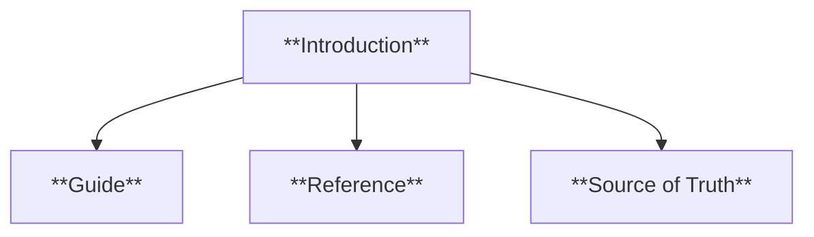
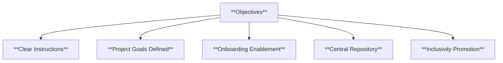
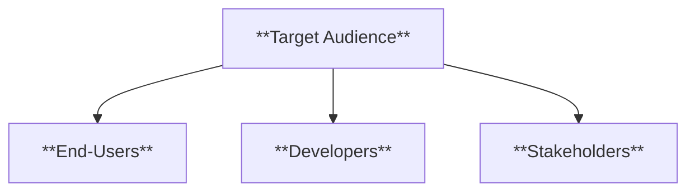
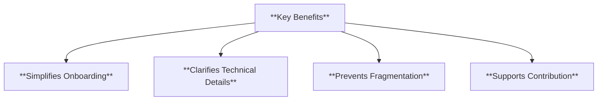
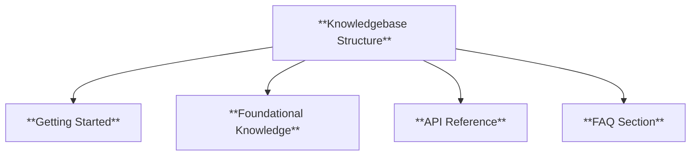
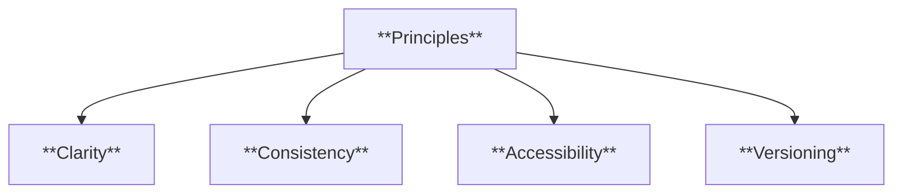
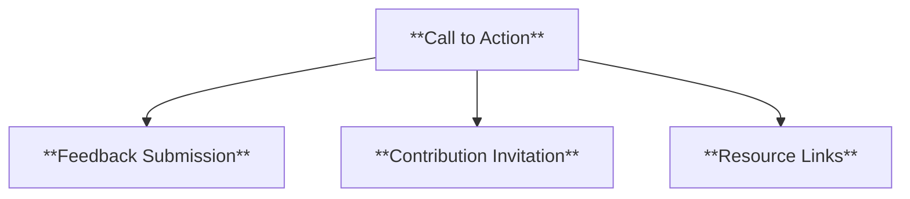
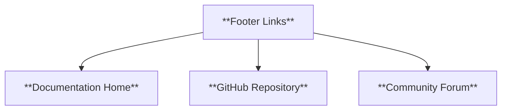
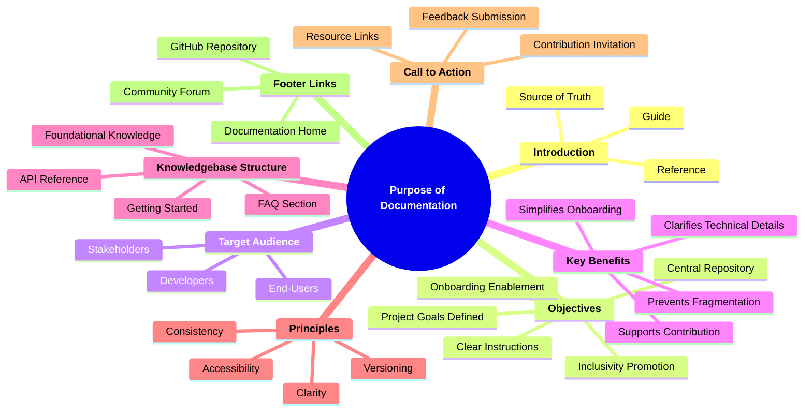

### **The Purpose of Documentation**

#### **1. Introduction**

- **Definition**: Explanation of why documentation exists and its overarching importance for the project.

- **Characteristics**:
  - **Guide**: Provides clear, actionable instructions for users.
  - **Reference**: Serves as a central resource for technical and conceptual understanding.
  - **Source of Truth**: Ensures consistency in project information and updates.

---

#### **2. Objectives of the Documentation**

- **Definition**: The key goals of creating and maintaining the documentation.

- **Characteristics**:
  - **Clear Instructions**: Simplifies user interaction with the project.
  - **Project Goals Defined**: Explains the vision and structure.
  - **Onboarding Enablement**: Facilitates a smooth start for new users and contributors.
  - **Central Repository**: Prevents fragmentation of information.
  - **Inclusivity Promotion**: Encourages diverse participation and accessibility.

---

#### **3. Target Audience**

- **Definition**: Identifies who the documentation is for and their specific needs.

- **Characteristics**:
  - **End-Users**: Focus on usability and practical implementation.
  - **Developers**: Address technical requirements and architecture.
  - **Stakeholders**: Provide insight into the project’s objectives and progress.

---

#### **4. Key Benefits of the Knowledgebase**

- **Definition**: Describes how documentation addresses common challenges.

- **Characteristics**:
  - **Simplifies Onboarding**: Guides users through initial steps effectively.
  - **Clarifies Technical Details**: Provides clear explanations of complex topics.
  - **Prevents Fragmentation**: Consolidates scattered information into one source.
  - **Supports Contribution**: Lowers barriers for contributors to engage.

---

#### **5. Structure of the Knowledgebase**

- **Definition**: Explains how the documentation is organized for easy navigation.

- **Characteristics**:
  - **Getting Started**: Provides basic guides for first-time users.
  - **Foundational Knowledge**: Contextualizes the project’s principles and objectives.
  - **API Reference**: Offers detailed technical information for developers.
  - **FAQ Section**: Answers common questions and resolves issues quickly.

---

#### **6. Principles of Good Documentation**

- **Definition**: Reinforces the values that define effective documentation.

- **Characteristics**:
  - **Clarity**: Simple, precise, and unambiguous instructions.
  - **Consistency**: Standardized terminology and formatting.
  - **Accessibility**: Ensures inclusivity and easy comprehension.
  - **Versioning**: Tracks changes and aligns with project updates.

---

#### **7. Call to Action**

- **Definition**: Encourages engagement and contributions to improve the documentation.

- **Characteristics**:
  - **Feedback Submission**: Allows users to report issues or suggest improvements.
  - **Contribution Invitation**: Welcomes contributors to enhance the project.
  - **Resource Links**: Provides access to contribution guidelines and related documentation.

---

#### **8. Footer**

- **Definition**: Includes quick links to additional resources and community forums.

- **Characteristics**:
  - **Documentation Home**: Directs users to the main knowledgebase page.
  - **GitHub Repository**: Connects to the project’s source code.
  - **Community Forum**: Facilitates discussions and Q&A among users.

---

### **Mindmap Summary**

This structure ensures the purpose of documentation is clearly communicated and actionable while fostering engagement and collaboration.
