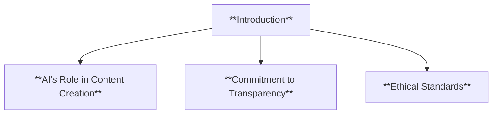
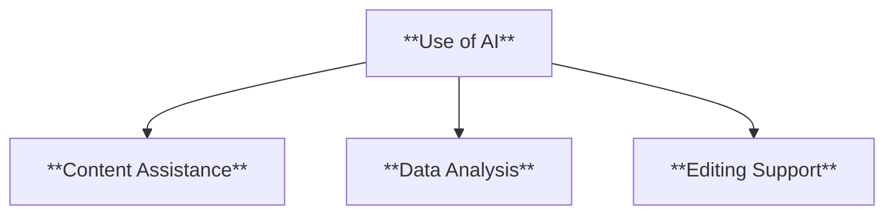
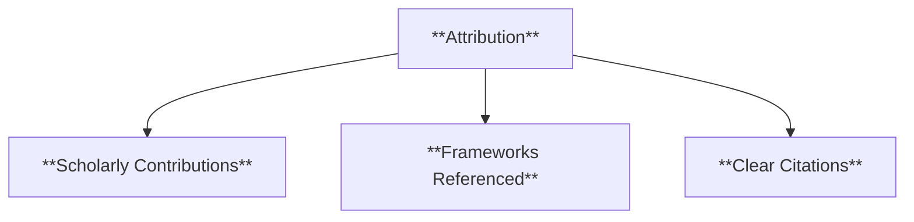
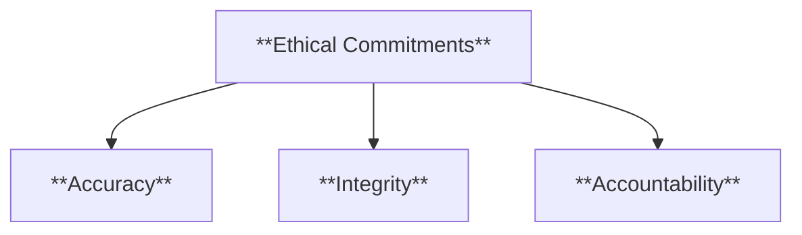
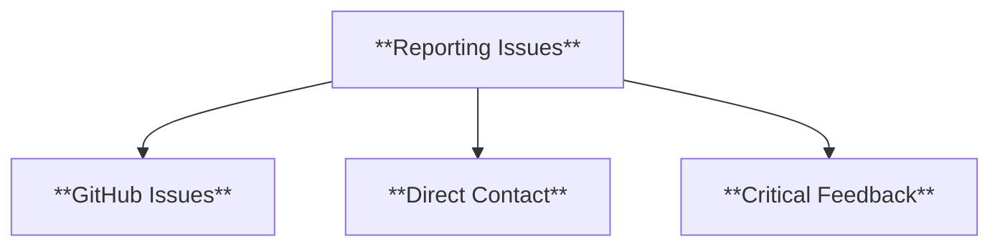
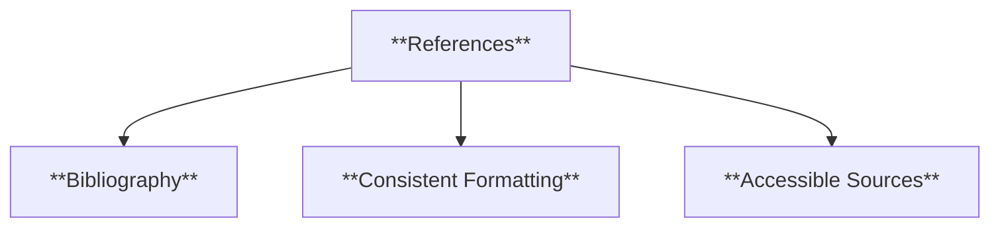
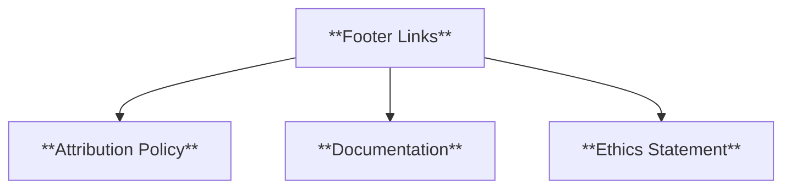
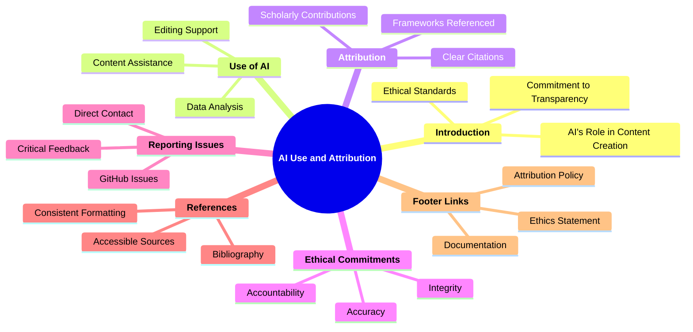

### **Disclosure of AI Use and Attribution**

#### **1. Introduction**

- **Definition**: Explanation of the role of AI in the project and the importance of transparency and ethical standards.

- **Characteristics**:
  - **AI's Role in Content Creation**: Highlights how AI supported the project.
  - **Commitment to Transparency**: Emphasizes openness about AI's involvement.
  - **Ethical Standards**: Focuses on maintaining integrity in knowledge dissemination.

---

#### **2. Use of AI in the Project**

- **Definition**: Details how AI tools were employed and their limitations.

- **Characteristics**:
  - **Content Assistance**: Used for generating initial drafts or summaries.
  - **Data Analysis**: Applied to extract patterns or trends from research.
  - **Editing Support**: Enhanced grammar, clarity, and coherence in text.

---

#### **3. Attribution to Researchers and Scholars**

- **Definition**: Acknowledges scholarly contributions and sources that informed the project.

- **Characteristics**:
  - **Scholarly Contributions**: Highlights the work of key researchers.
  - **Frameworks Referenced**: Credits specific theories or methodologies.
  - **Clear Citations**: Provides proper references for all sources used.

---

#### **4. Ethical Commitments**

- **Definition**: Outlines the project's ethical practices in using AI and attributing sources.

- **Characteristics**:
  - **Accuracy**: Ensures alignment with verified research.
  - **Integrity**: Avoids plagiarism with proper attribution.
  - **Accountability**: Employs human oversight to validate AI outputs.

---

#### **5. Reporting Errors or Omissions**

- **Definition**: Provides channels for reporting issues related to AI usage or attribution.

- **Characteristics**:
  - **GitHub Issues**: Preferred method for public issue reporting.
  - **Direct Contact**: Confidential or urgent concerns addressed via email.
  - **Critical Feedback**: Focuses on errors, omissions, or inaccuracies.

---

#### **6. References and Citations**

- **Definition**: Lists all references and sources used in the project.

- **Characteristics**:
  - **Bibliography**: Comprehensive list of sources.
  - **Consistent Formatting**: Ensures clarity and professionalism.
  - **Accessible Sources**: Provides links to referenced works where applicable.

---

#### **7. Footer Links**

- **Definition**: Directs users to related policies and resources.

- **Characteristics**:
  - **Attribution Policy**: Clear guidelines on attribution practices.
  - **Documentation**: Link to the full project documentation.
  - **Ethics Statement**: Reinforces the project's commitment to ethical standards.

---

### **Mindmap Summary**

This structure ensures clear communication about AI usage and proper attribution while fostering transparency and maintaining ethical standards.
