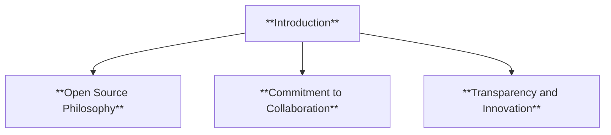
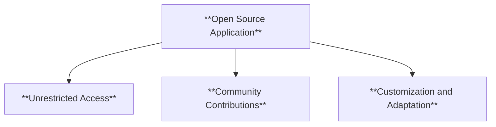
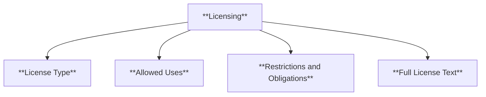
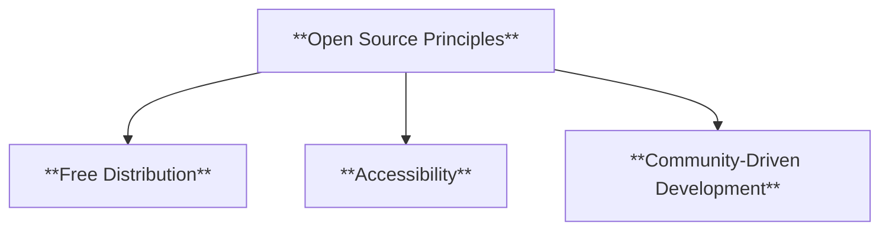
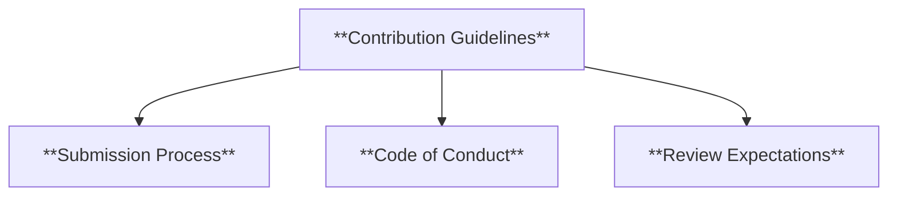
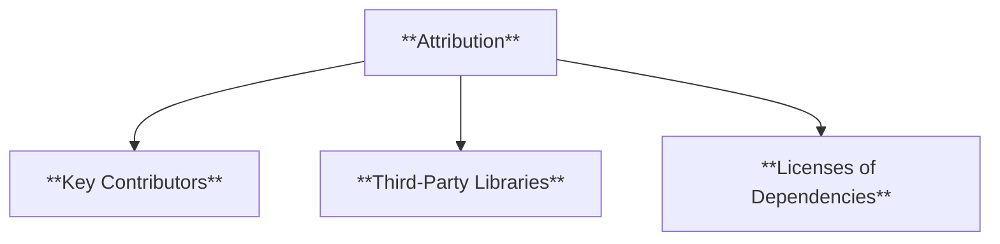
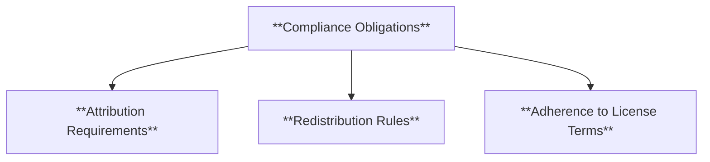
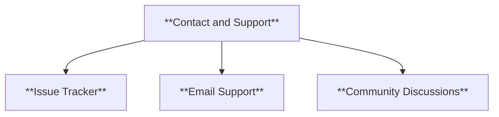
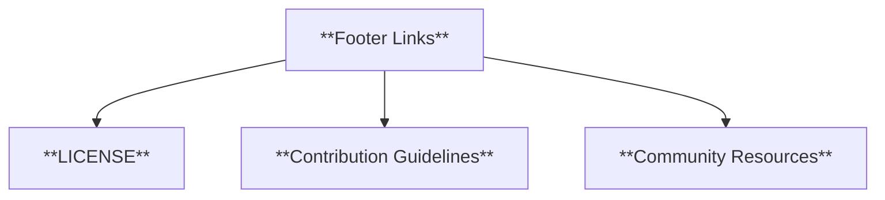
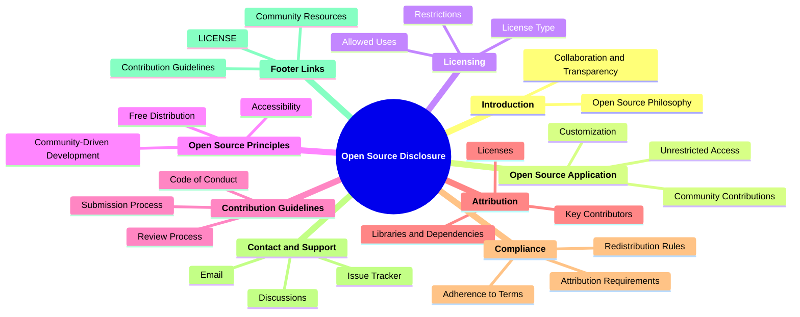

### **Open Source Disclosure and Licensing**

#### **1. Introduction**

- **Definition**: Explanation of the project’s open-source nature and commitment to transparency, collaboration, and innovation.

- **Characteristics**:
  - **Open Source Philosophy**: Emphasizes freedom to use, modify, and share.
  - **Commitment to Collaboration**: Encourages community involvement and contributions.
  - **Transparency and Innovation**: Ensures openness in development processes.

---

#### **2. What Does Open Source Mean for [Project Name]?**

- **Definition**: How the open-source philosophy is applied specifically to the project.

- **Characteristics**:
  - **Unrestricted Access**: Free to view, use, and distribute the source code.
  - **Community Contributions**: Welcomes input from the global developer community.
  - **Customization and Adaptation**: Users can modify the software to meet their needs.

---

#### **3. Licensing**

- **Definition**: Details about the specific license governing the project and its implications.

- **Characteristics**:
  - **License Type**: Specifies the license (e.g., MIT, GPL, Apache 2.0).
  - **Allowed Uses**: Details freedoms for modification and redistribution.
  - **Restrictions and Obligations**: Lists conditions such as attribution or retaining license text.

---

#### **4. Key Open Source Principles**

- **Definition**: Core values and practices that define the project’s approach to open source.

- **Characteristics**:
  - **Free Distribution**: Anyone can use, modify, and share the software.
  - **Accessibility**: Prioritizes ease of access and inclusivity.
  - **Community-Driven Development**: Relies on collaborative contributions.

---

#### **5. Community and Contribution Guidelines**

- **Definition**: Provides instructions for users to participate and contribute.

- **Characteristics**:
  - **Submission Process**: Step-by-step guide for submitting issues or pull requests.
  - **Code of Conduct**: Defines acceptable behavior for contributors.
  - **Review Expectations**: Outlines the process for reviewing and merging contributions.

---

#### **6. Attribution and Acknowledgements**

- **Definition**: Recognizing contributors and dependencies used in the project.

- **Characteristics**:
  - **Key Contributors**: Lists individuals or groups who contributed significantly.
  - **Third-Party Libraries**: Acknowledges dependencies with links and license information.
  - **Licenses of Dependencies**: Ensures proper compliance with external licenses.

---

#### **7. Compliance and Obligations**

- **Definition**: Explains user responsibilities under the license.

- **Characteristics**:
  - **Attribution Requirements**: Properly credit original authors.
  - **Redistribution Rules**: Retain license text and comply with terms.
  - **Adherence to License Terms**: Users must follow specific licensing conditions.

---

#### **8. Contact and Support**

- **Definition**: Channels for users to ask questions or report issues.

- **Characteristics**:
  - **Issue Tracker**: Use GitHub or other tools for reporting bugs or concerns.
  - **Email Support**: Direct contact for more complex inquiries.
  - **Community Discussions**: Engage with other users and contributors.

---

#### **9. Footer Links**

- **Definition**: Links to key resources for easy navigation.

- **Characteristics**:
  - **LICENSE**: Direct link to the license file.
  - **Contribution Guidelines**: Instructions for contributing.
  - **Community Resources**: Access to discussions, FAQs, or related documentation.

---

### **Mindmap Summary**

This structured approach ensures clarity, transparency, and compliance for open-source projects.
