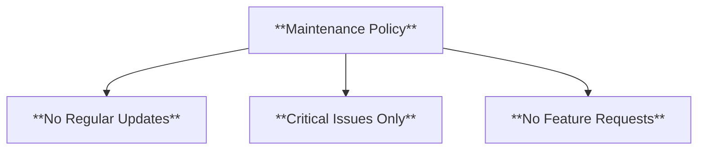
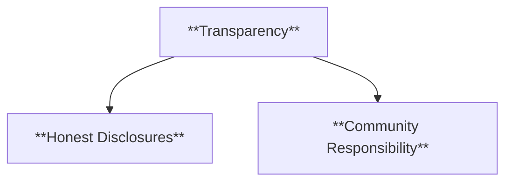
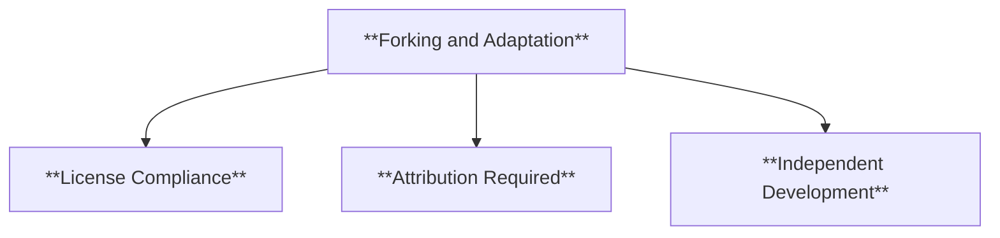
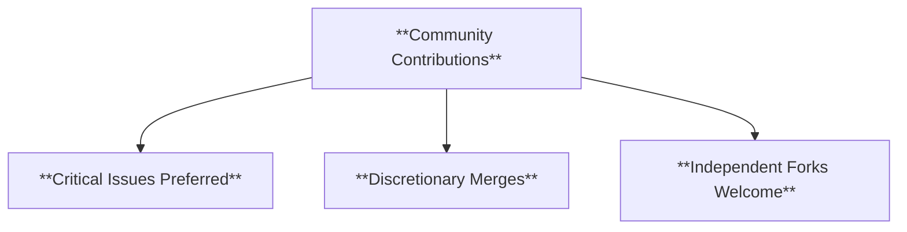
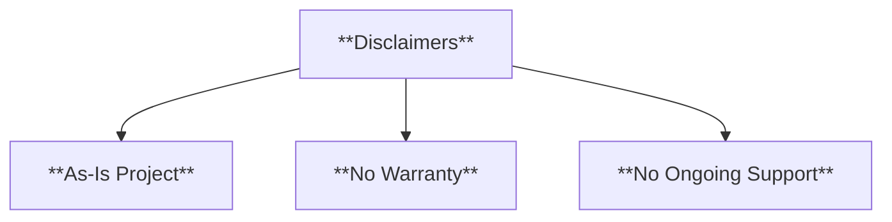
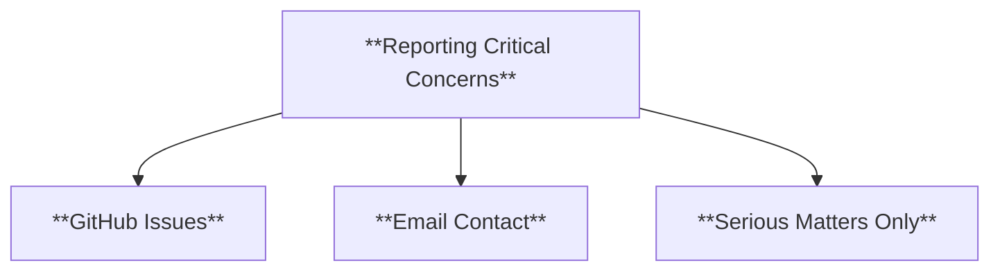
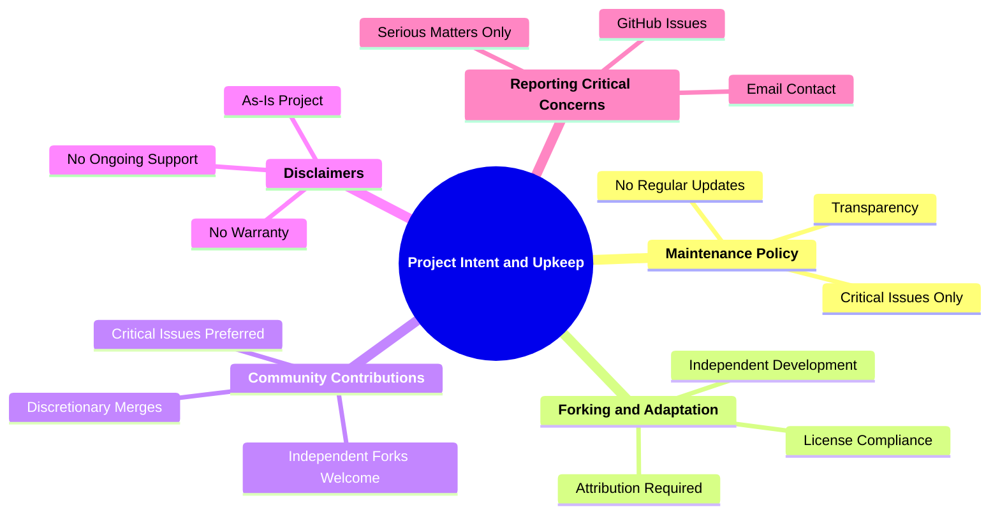

### **Notice of Intent and Project Upkeep**

#### **1. Project Intent**

- **Definition**: This section outlines the creator's goals for the project, emphasizing its nature as a proof of concept or reference tool rather than an actively maintained application.

  **Example**:

  > "[Project Name] is intended as a proof of concept to demonstrate [specific goal or technology]. It serves as a reference for developers and researchers, rather than a fully maintained production application."

---

### **2. Maintenance Policy**

#### 2.1. **Scope of Maintenance**

- **Definition**: Clear statement about the extent of maintenance and the creator's responsibilities.

- **Characteristics**:
  - **No Regular Updates**: The project will not receive periodic updates or improvements.
  - **Critical Issues Only**: Serious bugs or vulnerabilities may be addressed.
  - **No Feature Requests**: Requests for new features or enhancements will not be considered.

#### 2.2. **Transparency**

- **Definition**: The creator's position on prioritizing updates and addressing concerns.

- **Characteristics**:
  - **Honest Disclosures**: Users are informed about the project's limited scope.
  - **Community Responsibility**: Encourages users to adapt or improve the project independently.

---

### **3. Forking and Adaptation**

#### 3.1. **Encouraging Forks**

- **Definition**: Open invitation for the community to fork and adapt the project as needed.

- **Characteristics**:
  - **License Compliance**: Forks must adhere to the project’s license.
  - **Attribution Required**: Proper credit must be given to the original author.
  - **Independent Development**: Fork maintainers are responsible for ongoing updates.

---

### **4. Community Contributions**

#### 4.1. **Contribution Policy**

- **Definition**: Guidelines for contributions, emphasizing the limited likelihood of inclusion in the main project.

- **Characteristics**:
  - **Critical Issues Preferred**: Contributions addressing critical problems may be reviewed.
  - **Discretionary Merges**: The creator retains the right to accept or reject contributions.
  - **Independent Forks Welcome**: Contributions are encouraged to be forked into new projects.

---

### **5. Disclaimers**

#### 5.1. **Limitations**

- **Definition**: Disclaimer about the project's as-is nature and the absence of guarantees.

- **Characteristics**:
  - **As-Is Project**: Provided without guarantees of functionality or updates.
  - **No Warranty**: No legal or practical responsibility for issues or consequences.
  - **No Ongoing Support**: Users should not expect long-term maintenance.

---

### **6. Reporting Critical Concerns**

#### 6.1. **Channels for Reporting**

- **Definition**: Instructions for reporting serious concerns, such as security vulnerabilities.

- **Characteristics**:
  - **GitHub Issues**: Preferred channel for public issue reporting.
  - **Email Contact**: Direct contact for confidential or urgent concerns.
  - **Serious Matters Only**: Focus on critical bugs or vulnerabilities.

---

### **7. Theoretical Significance**

- **Definition**: Explanation of the project’s value as a reference or learning tool.

This template provides a clear framework for disclosing the project's limited maintenance intent and encouraging community-driven development while managing expectations effectively.
