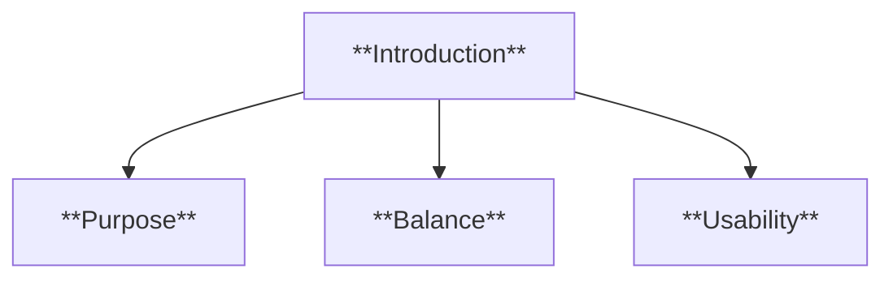
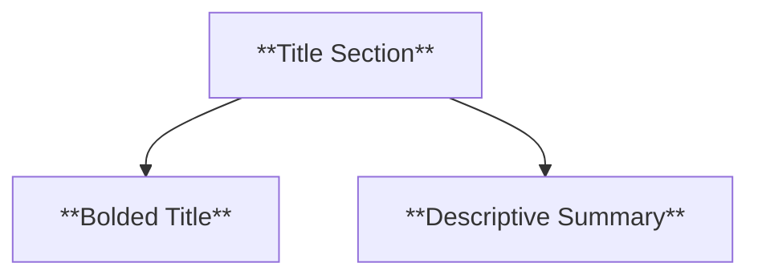
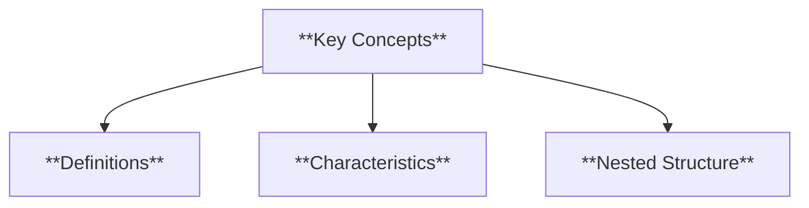
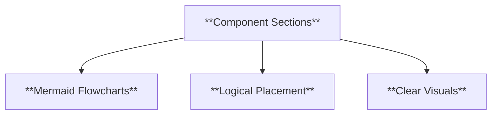
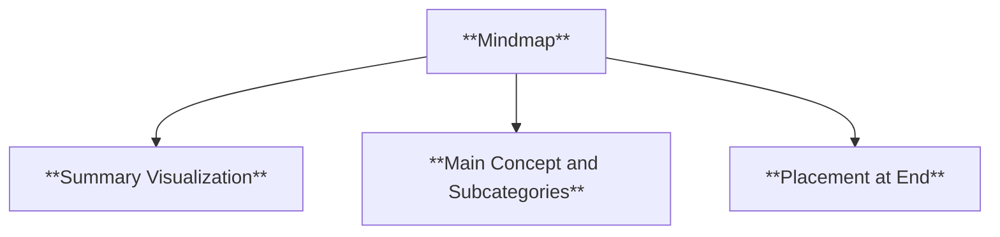
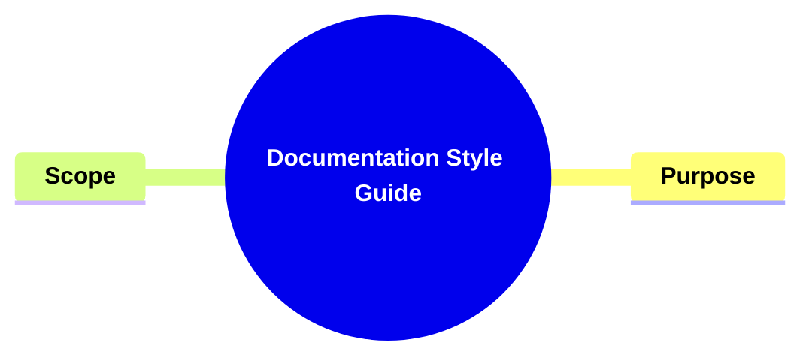
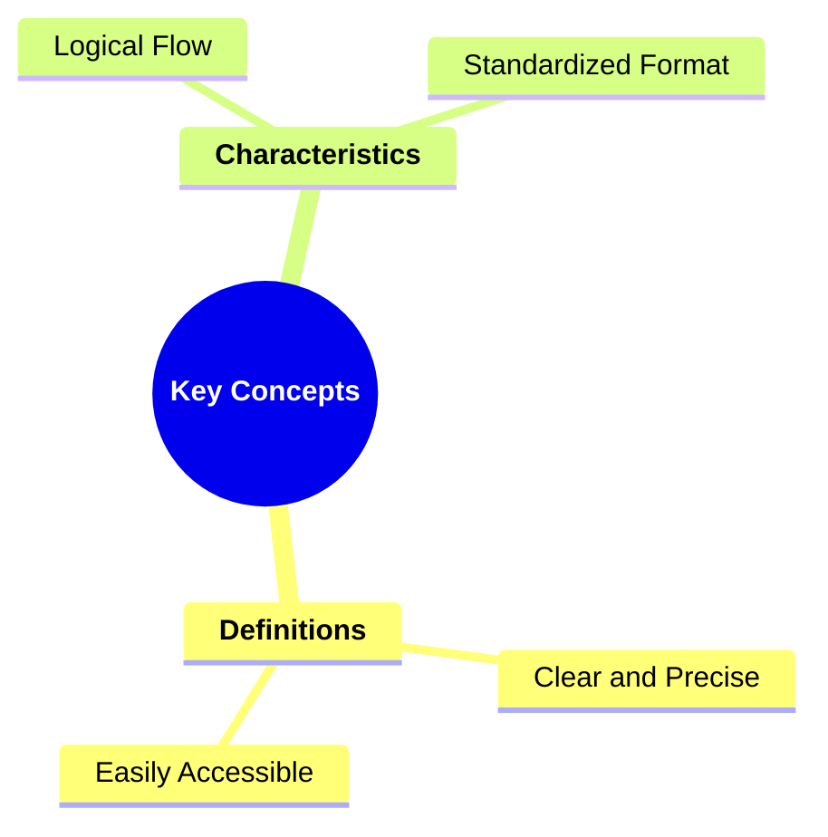
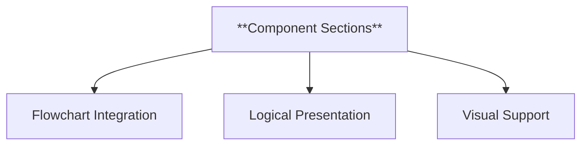
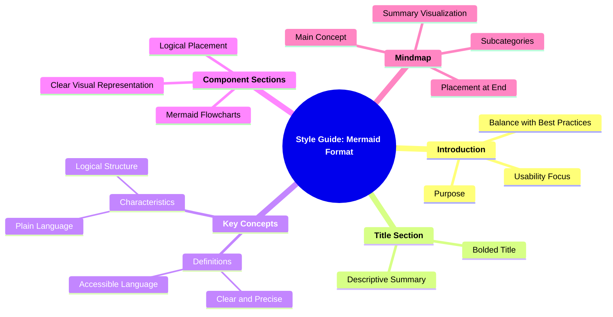

### **Style Guide: Applying the Mermaid Format**

#### **1. Introduction**

The purpose of this style guide is to provide clear guidelines for structuring documentation using the **Mermaid Format**, tailored for creating accessible, well-organized, and visually structured knowledgebases. This guide balances the unique elements of the Mermaid Format with general best practices for style guides, ensuring clarity and usability.



- **Characteristics**:
  - **Purpose**: Outlines the reason for adopting the Mermaid Format in documentation.
  - **Balance**: Integrates Mermaid principles with industry-standard practices.
  - **Usability**: Focuses on creating intuitive and accessible documentation.

---

#### **2. Title Section**

- **Definition**: A bolded title with a description summarizing the document's content.



- **Best Practices**:
  - **Clarity**: Ensure the title reflects the primary topic or purpose.
  - **Conciseness**: The description should provide an immediate understanding of the content.

---

#### **3. Key Concepts Section**

- **Definition**: Organized with nested headings, defining each concept and its characteristics.



- **Best Practices**:
  - **Hierarchy**: Use clear, logical nesting to show relationships between concepts.
  - **Accessibility**: Write definitions and characteristics in plain language.

---

#### **4. Component Sections**

- **Definition**: Each component features a flowchart in Mermaid syntax, visually representing its structure.



- **Best Practices**:
  - **Relevance**: Ensure flowcharts align with the associated text.
  - **Simplicity**: Keep flowcharts easy to interpret, avoiding excessive complexity.

---

#### **5. Mindmap**

- **Definition**: A summary mindmap placed at the document’s end, visually organizing the main concept and subcategories.



- **Best Practices**:
  - **Completeness**: Cover all main sections and their relationships.
  - **Placement**: Position the mindmap consistently at the bottom of the document.

---

### **Application of the Mermaid Format**

#### **1. Title Section**

**Example**:



- **Explanation**: A clear title section enhances readability and establishes the document's focus.

---

#### **2. Key Concepts Section**

**Example**:



- **Explanation**: The Key Concepts section should articulate foundational ideas and their attributes to provide a comprehensive understanding.

---

#### **3. Component Sections**

**Example**:



- **Explanation**: Visual representations (flowcharts) simplify complex ideas, ensuring users grasp essential components quickly.

---

#### **4. Mindmap**

**Example**:

```mermaid
mindmap
  root((**Summary Mindmap**))
    **Main Concept**
      Title Section
      Key Concepts
      Component Sections
      Mindmap
```

- **Explanation**: A summary mindmap consolidates the document’s structure, serving as a quick reference for users.

---

### **Complete Mindmap for the Style Guide**



This formatted guide ensures that the Mermaid Format is applied consistently and effectively while aligning with general best practices for creating accessible, user-friendly documentation.
