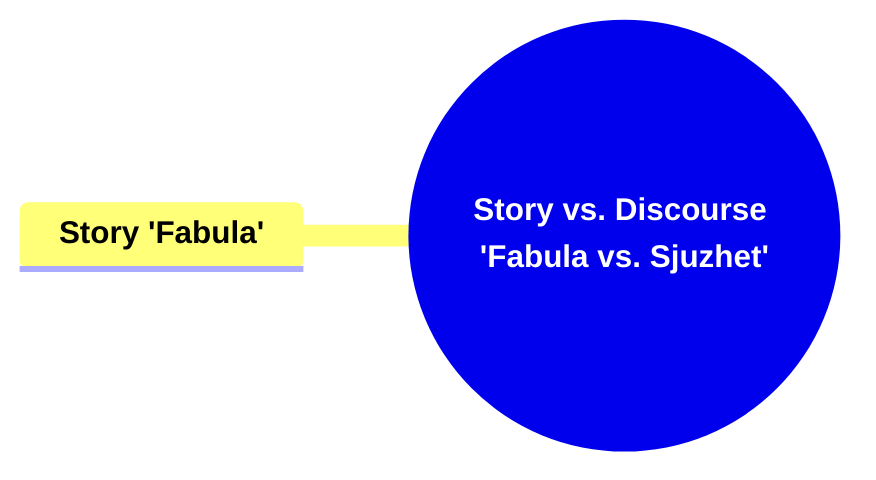
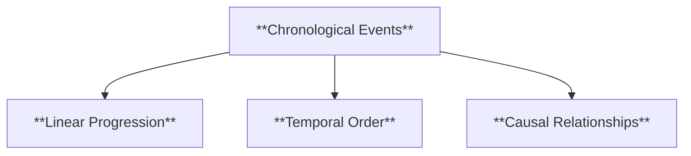
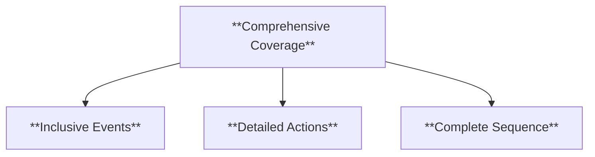
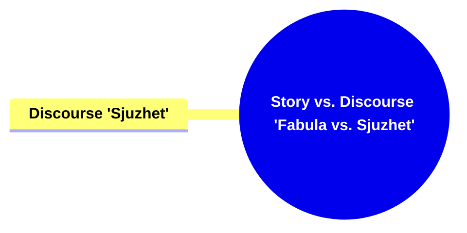
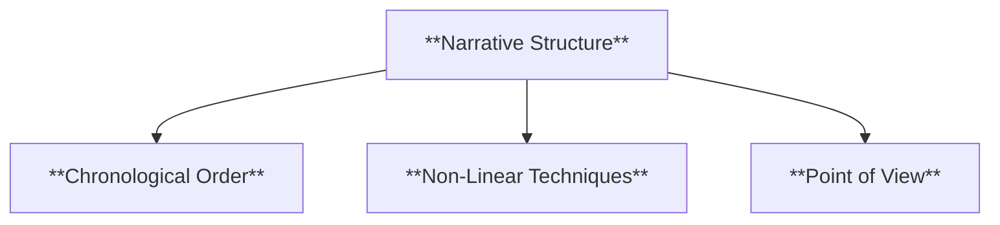
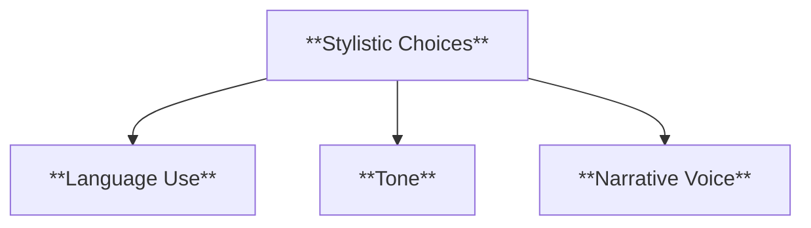
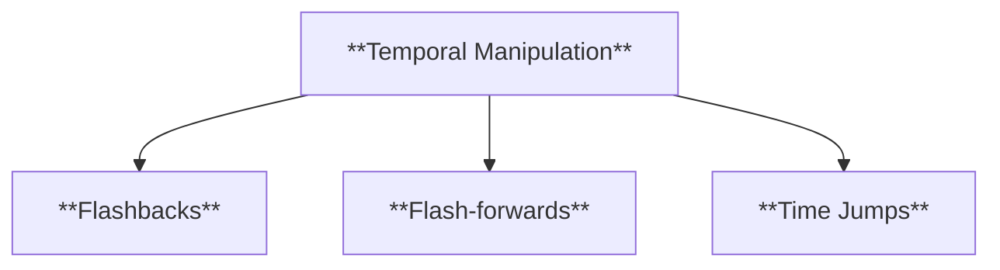
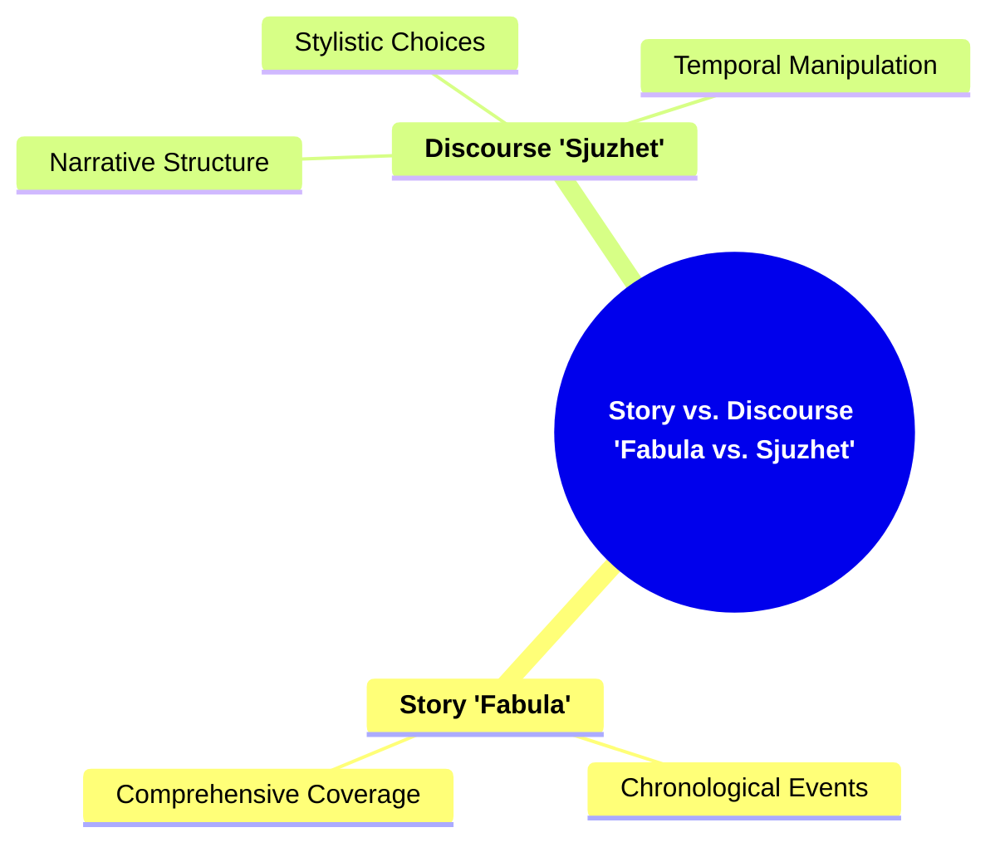

## **SD002 Story vs. Discourse (Fabula vs. Sjuzhet)**

- **Story (Fabula)**: The raw chronological sequence of events in a narrative.
- **Discourse (Sjuzhet)**: The way these events are presented or structured in the narrative.

This competency involves differentiating between the actual events and their representation.

---

### **Key Concepts**

---

#### **Story (Fabula)**

- **Definition**:
  - In narratology, _fabula_ refers to the chronological sequence of events as they would occur in reality, independent of how they are presented in the narrative. It encompasses all the actions, events, and experiences that make up the narrative's content.

##### **Components of Story (Fabula)**

###### **Chronological Events**

- **Definition**:
  - The sequence of events as they unfold in time, without any manipulation of order or structure.

- **Characteristics**:
  - **Linear Progression**: Events follow a straight timeline from beginning to end.
  - **Temporal Order**: Maintains the natural order of time.
  - **Causal Relationships**: Each event is caused by preceding events, establishing a logical flow.

###### **Comprehensive Coverage**

- **Definition**:
  - The entirety of events and actions that constitute the narrative's content, without omission or alteration.

- **Characteristics**:
  - **Inclusive Events**: All significant events are accounted for.
  - **Detailed Actions**: Provides a thorough account of actions and occurrences.
  - **Complete Sequence**: Ensures no gaps in the narrative timeline.

---

#### **Discourse (Sjuzhet)**

- **Definition**:
  - _Sjuzhet_ refers to the narrative techniques and structures used to present the _fabula_. It involves the arrangement, presentation, and manipulation of the story's events to create a particular effect or meaning.

##### **Components of Discourse (Sjuzhet)**

###### **Narrative Structure**

- **Definition**:
  - The framework that dictates how the _fabula_ is organized and presented, including the order of events, pacing, and narrative techniques.

- **Characteristics**:
  - **Chronological Order**: Events are presented in the order they occur.
  - **Non-Linear Techniques**: Utilizes flashbacks, foreshadowing, or other devices to alter the sequence.
  - **Point of View**: The perspective from which the story is told, affecting how events are interpreted.

###### **Stylistic Choices**

- **Definition**:
  - The decisions made by the narrator regarding language, tone, and narrative voice to shape the presentation of the _fabula_.

- **Characteristics**:
  - **Language Use**: The selection of words and sentence structures to convey the story.
  - **Tone**: The attitude or mood expressed through the narrative.
  - **Narrative Voice**: The persona or perspective through which the story is communicated.

###### **Temporal Manipulation**

- **Definition**:
  - Techniques used to alter the perception of time within the narrative, such as flashbacks, flash-forwards, or time jumps.

- **Characteristics**:
  - **Flashbacks**: Scenes set in a time earlier than the main narrative.
  - **Flash-forwards**: Scenes that project the narrative into the future.
  - **Time Jumps**: Skipping over periods of time to advance the story.

---

### **Theoretical Significance**

- **Differentiating Story and Discourse**:

  - In narratology, distinguishing between _fabula_ and _sjuzhet_ is crucial for understanding how narratives are constructed and how meaning is conveyed. It allows for a deeper analysis of both the content of the story and the methods used to present it.

- **Analysis of Narrative Techniques**:

  - By separating the raw sequence of events from their presentation, scholars can examine the effectiveness of various narrative techniques and how they influence the audience's perception and engagement.

- **Enhancing Narrative Comprehension**:
  - Understanding the distinction between story and discourse facilitates a more nuanced appreciation of a narrative's structure and the artistic choices that shape its delivery and impact.

---

---
