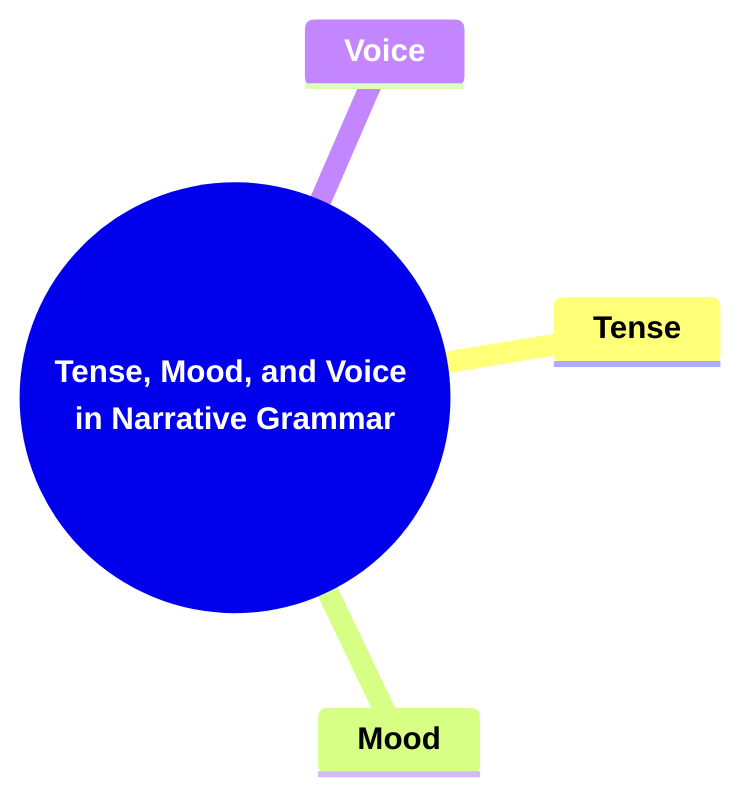
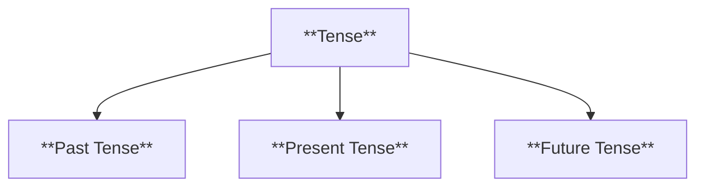
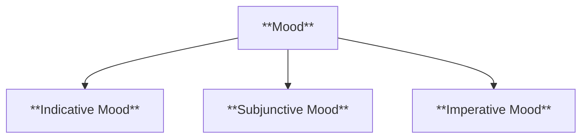
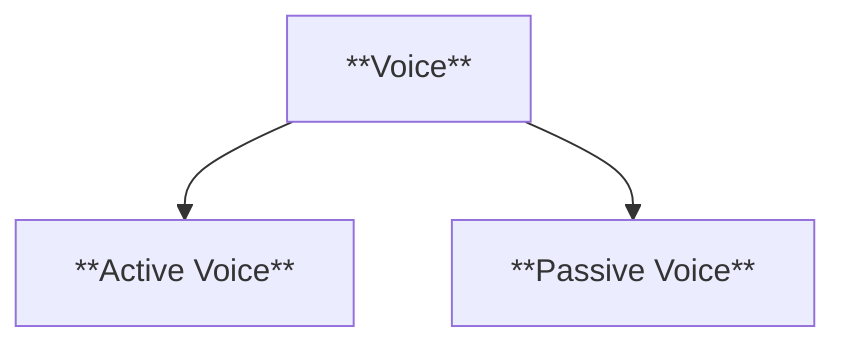
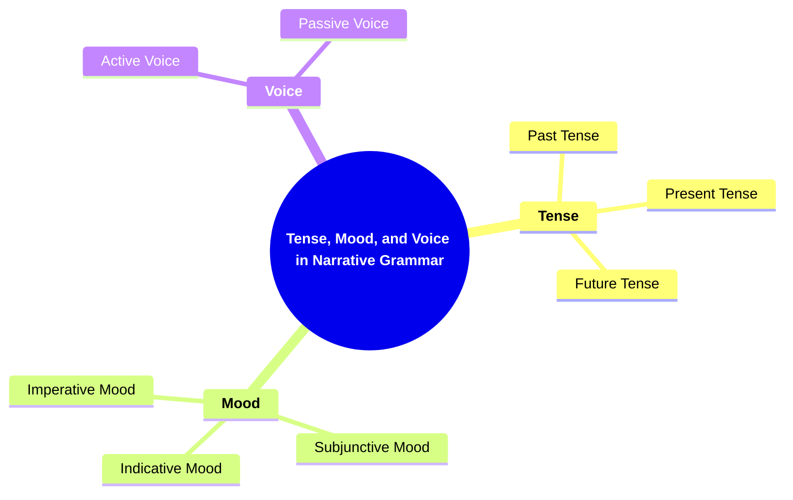

# 11 TMV-3407 TENSE, MOOD, AND VOICE IN NARRATIVE GRAMMAR

### **Tense, Mood, and Voice in Narrative Grammar**

- **Understanding how grammatical choices affect the narrative.**
  - **Components**:
    - **Tense**: Past, present, future.
    - **Mood**: Indicative, subjunctive, imperative.
    - **Voice**: Active, passive.
  - **Importance**: Builds on narrative voice and structure; introduces grammatical analysis.

---

### **Key Concepts**

---

#### **Tense, Mood, and Voice in Narrative Grammar**

- **Definition**:
  - In narratology, tense, mood, and voice are grammatical elements that influence how a narrative is conveyed and perceived. These choices affect the timing of events, the speaker's attitude, and the relationship between the subject and the action, thereby shaping the overall narrative style and effectiveness.

##### **Components of Tense, Mood, and Voice**

###### **Tense**

- **Definition**:
  - Tense refers to the grammatical expression of time in a narrative, indicating when events occur relative to the moment of narration.

- **Characteristics**:
  - **Past Tense**: Describes events that have already occurred. It is the most commonly used tense in narratives, providing a sense of history and reflection.
  - **Present Tense**: Portrays events as happening in real-time, creating immediacy and intimacy with the reader.
  - **Future Tense**: Indicates events that will occur, often used to foreshadow or speculate about upcoming developments in the narrative.

###### **Mood**

- **Definition**:
  - Mood conveys the speaker's attitude toward the action or state described in the narrative, influencing the tone and emotional resonance.

- **Characteristics**:
  - **Indicative Mood**: States facts or asks questions, providing a straightforward and factual tone.
  - **Subjunctive Mood**: Expresses wishes, doubts, or hypothetical scenarios, adding a layer of uncertainty or desire.
  - **Imperative Mood**: Issues commands or requests, creating a sense of urgency or authority.

###### **Voice**

- **Definition**:
  - Voice indicates the relationship between the subject and the action of the verb, affecting how agency and responsibility are perceived within the narrative.

- **Characteristics**:
  - **Active Voice**: The subject performs the action, leading to a clear and direct narrative style.
  - **Passive Voice**: The subject receives the action, which can create distance or emphasize the action over the actor.

---

### **Theoretical Significance**

- **Impact on Narrative Style**:

  - The choices of tense, mood, and voice significantly shape the narrative style, influencing how readers engage with the story. For instance, a present-tense narrative can create a sense of urgency, while a past-tense narrative offers a reflective tone.

- **Influence on Reader Perception**:

  - Grammatical choices affect the reader's perception of time, causality, and character agency. Active voice tends to make characters appear more proactive, whereas passive voice can obscure responsibility or highlight actions.

- **Enhancing Thematic Expression**:

  - Mood can be used to underscore themes such as hope, despair, or determination. For example, the subjunctive mood may highlight characters' aspirations or fears, enriching the narrative's emotional depth.

- **Facilitating Narrative Cohesion**:

  - Consistent use of tense, mood, and voice contributes to narrative coherence, ensuring that the story flows logically and maintains a unified tone. It helps in establishing the narrative voice and maintaining consistency throughout the text.

- **Supporting Character Development**:
  - Grammatical choices can reflect and enhance character development. A character's dialogue in the indicative mood may reveal their straightforward nature, while their use of the subjunctive mood might indicate introspection or doubt.

---

