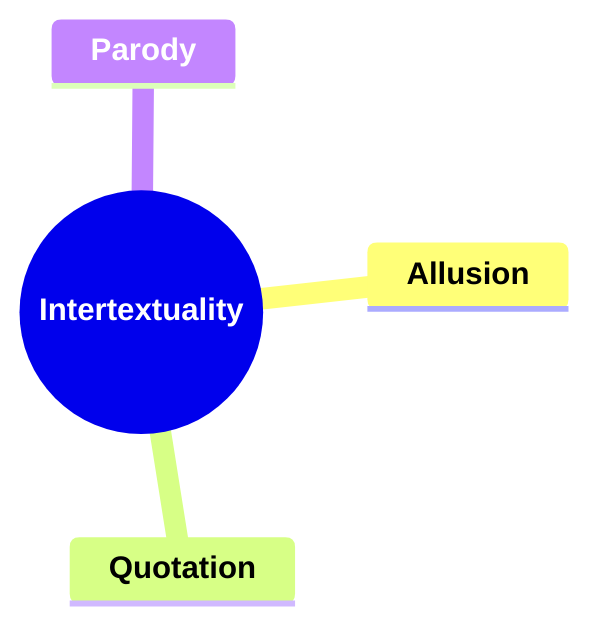
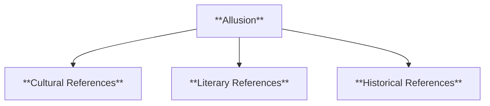
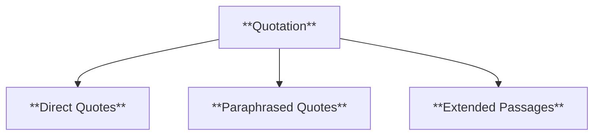
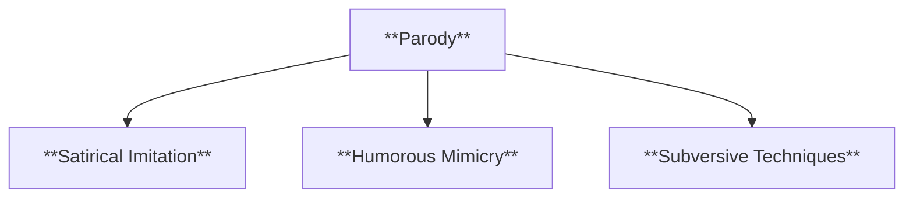
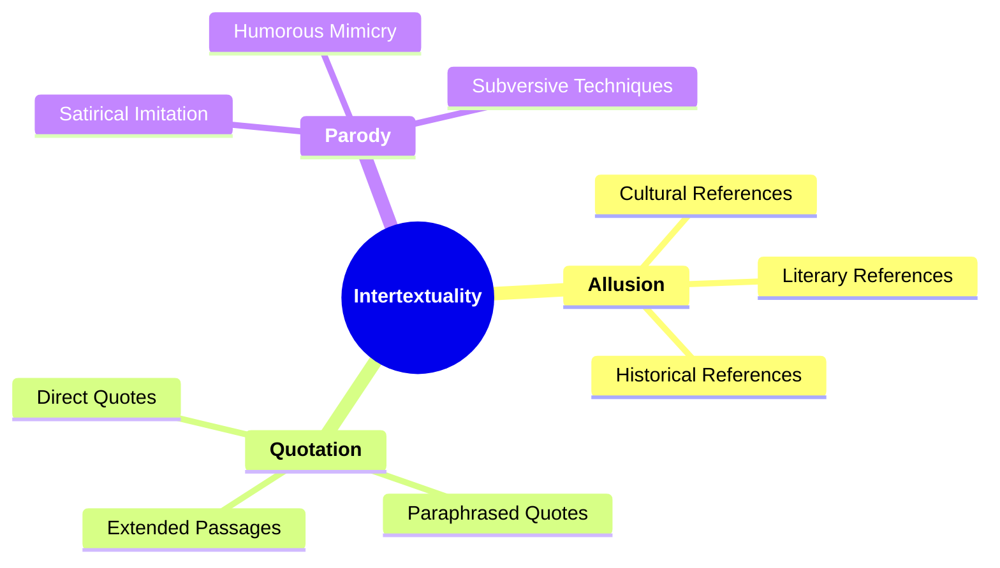

# 13 INT-3502 INTERTEXTUALITY

### **Intertextuality**

- **Identifying references or connections to other texts within a narrative.**
  - **Aspects**:
    - **Allusion**
    - **Quotation**
    - **Parody**
  - **Importance**: Explores how connections add layers of meaning.

---

### **Key Concepts**

---

#### **Intertextuality**

- **Definition**:
  - In narratology, intertextuality refers to the ways in which a narrative references, incorporates, or is influenced by other texts. These references can enrich the narrative by adding depth, context, and multiple layers of meaning, allowing for a more complex and engaging storytelling experience.

##### **Components of Intertextuality**

###### **Allusion**

- **Definition**:
  - An allusion is an indirect or passing reference to another text, person, event, or work of art within a narrative. It relies on the reader's recognition of the reference to add meaning or significance to the narrative.

- **Characteristics**:
  - **Cultural References**: References to widely recognized cultural elements, such as myths, legends, or popular media.
  - **Literary References**: References to other literary works, authors, or characters.
  - **Historical References**: Allusions to historical events or figures that provide context or parallel to the narrative.

###### **Quotation**

- **Definition**:
  - Quotation involves directly incorporating exact phrases, sentences, or passages from other texts into a narrative. This can serve various purposes, such as providing evidence, evoking a certain tone, or highlighting a connection between the texts.

- **Characteristics**:
  - **Direct Quotes**: Exact words taken from another text, usually enclosed in quotation marks.
  - **Paraphrased Quotes**: Restated or reworded versions of original text, maintaining the original meaning.
  - **Extended Passages**: Longer excerpts that provide detailed context or significant meaning within the narrative.

###### **Parody**

- **Definition**:
  - Parody involves imitating or mimicking the style, tone, or content of another text, often in a humorous or satirical manner. It can serve to critique, pay homage, or subvert the original text's themes or methods.

- **Characteristics**:
  - **Satirical Imitation**: Uses humor and exaggeration to criticize or mock the original text.
  - **Humorous Mimicry**: Light-hearted imitation that playfully references the source material.
  - **Subversive Techniques**: Challenges or undermines the original text's conventions or messages through imitation.

---

### **Theoretical Significance**

- **Adding Layers of Meaning**:

  - Intertextuality enriches narratives by embedding additional meanings and connections through references to other texts. This layering allows readers to engage with the narrative on multiple levels, recognizing and interpreting the intertextual references to deepen their understanding.

- **Enhancing Thematic Complexity**:

  - By incorporating elements from other works, intertextuality can introduce complex themes and ideas, fostering a more nuanced and multifaceted narrative. It enables authors to draw parallels, contrasts, and dialogues between their work and existing texts.

- **Facilitating Reader Engagement**:

  - Recognizing intertextual references can enhance reader engagement by creating a sense of familiarity and resonance. It encourages readers to make connections, drawing on their knowledge and experiences with other texts to enrich their interpretation of the narrative.

- **Influencing Narrative Style and Structure**:

  - The use of intertextuality affects the narrative's style and structure, introducing elements like allusion, quotation, and parody that shape the storytelling approach. It allows for creative narrative techniques that can innovate or challenge traditional storytelling norms.

- **Supporting Authorial Intent and Commentary**:
  - Intertextual references can serve as a means for authors to comment on, critique, or pay homage to other works. It provides a platform for dialogue between texts, allowing authors to position their narratives within a broader literary and cultural context.

---

