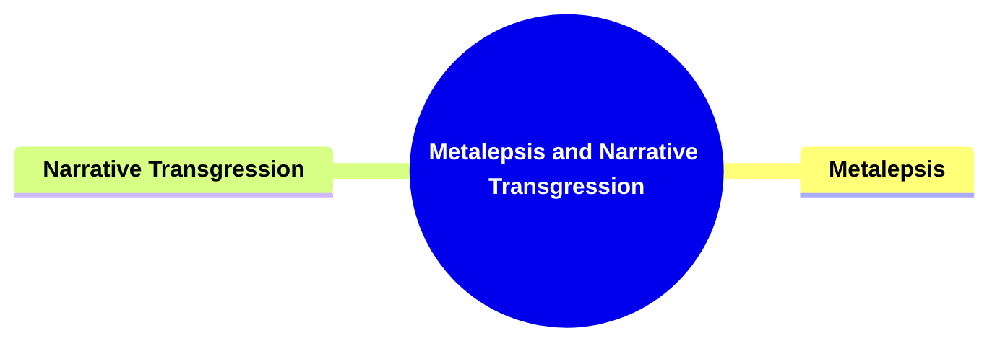
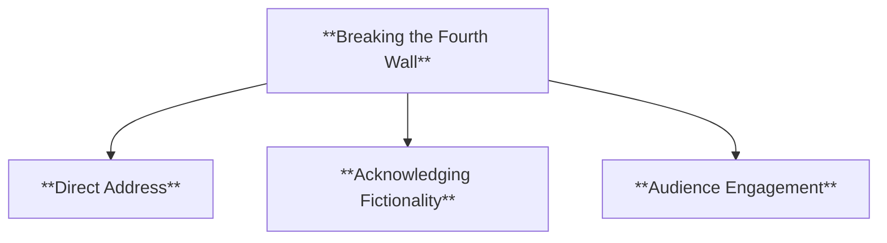
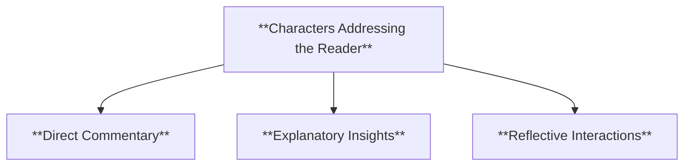
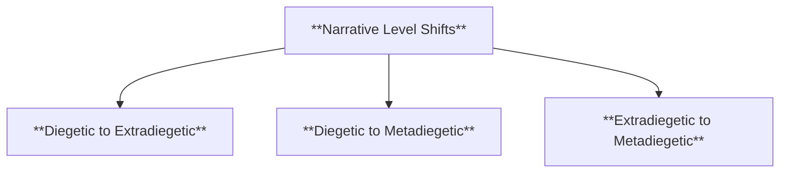
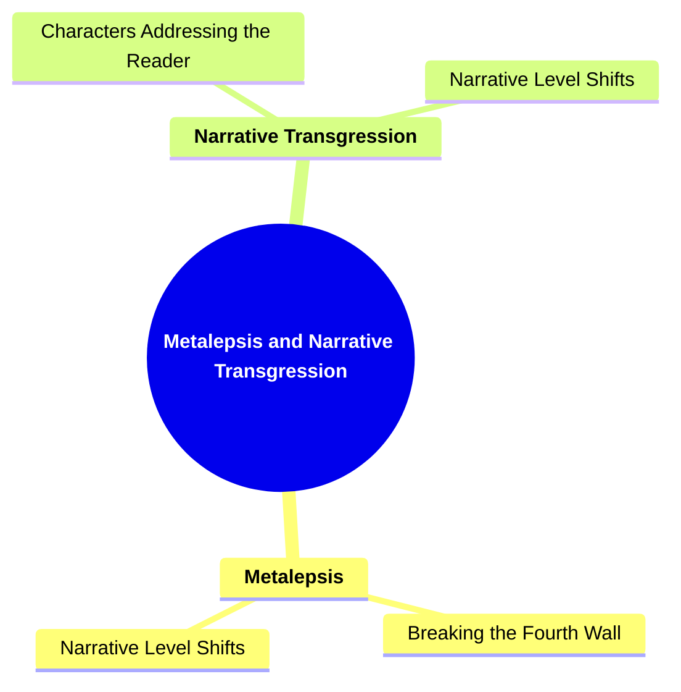

# 19 MT-3508 METALEPSIS AND NARRATIVE TRANSGRESSION

### **Metalepsis and Narrative Transgression**

- **Diegesis**: Narrative told through the narrator's description.
- **Mimesis**: Narrative shown through direct representation, such as dialogue.

**Application**: Understanding the balance between showing and telling.

---

### **Key Concepts**

---

#### **Metalepsis and Narrative Transgression**

- **Definition**:
  - In narratology, **metalepsis** and **narrative transgression** refer to techniques where the narrative breaks its own boundaries, creating shifts between different narrative levels or directly interacting with the audience. This can involve crossing diegetic limits, breaking the fourth wall, or having characters acknowledge their fictional nature, thereby challenging traditional narrative conventions and enhancing the complexity of the storytelling.

##### **Components of Metalepsis and Narrative Transgression**

###### **Breaking the Fourth Wall**

- **Definition**:
  - Breaking the fourth wall involves the narrator or characters directly addressing the audience, acknowledging their existence within a narrative framework. This technique disrupts the illusion of reality within the story and creates a direct connection between the narrative and the audience.

- **Characteristics**:
  - **Direct Address**: Characters speak directly to the reader or viewer, creating an interactive dynamic.
  - **Acknowledging Fictionality**: The narrative or characters recognize that they are part of a constructed story.
  - **Audience Engagement**: Enhances the connection between the audience and the narrative by making them active participants.

###### **Characters Addressing the Reader**

- **Definition**:
  - This involves characters within the narrative directly speaking to the reader, offering commentary, explanations, or reflections that go beyond the immediate scope of the plot. It serves to create a meta-narrative layer and can deepen the audience's understanding of the characters and story.

- **Characteristics**:
  - **Direct Commentary**: Characters provide opinions or observations about the events unfolding.
  - **Explanatory Insights**: Offers additional context or background information that is not revealed through the main narrative.
  - **Reflective Interactions**: Characters contemplate their actions or the story's themes, enhancing the narrative's depth.

###### **Narrative Level Shifts**

- **Definition**:
  - Shifts between different narrative levels occur when the story moves between the primary narrative world (diegetic) and other levels, such as stories within the story (metadiegetic) or the narrator's own level (extradiegetic). These shifts can create complex narrative structures and add layers of meaning.

- **Characteristics**:
  - **Diegetic to Extradiegetic**: Transitioning from the story's internal world to the narrator's external commentary.
  - **Diegetic to Metadiegetic**: Introducing secondary stories or subplots within the main narrative.
  - **Extradiegetic to Metadiegetic**: The narrator introduces or engages with internal stories, blending different narrative layers.

---

### **Theoretical Significance**

- **Challenging Narrative Boundaries**:

  - Metalepsis and narrative transgression push the limits of traditional narrative structures by blurring the lines between the story and the audience. This challenges the conventional separation of fiction and reality, creating a more interactive and multifaceted storytelling experience.

- **Enhancing Narrative Complexity**:

  - By introducing shifts between narrative levels and direct interactions with the audience, these techniques add layers of complexity to the narrative. This can enrich the storytelling by providing multiple perspectives and deeper thematic exploration.

- **Facilitating Reader Engagement**:

  - Breaking the fourth wall and having characters address the reader can make the audience feel more involved in the narrative. This engagement can lead to a more immersive and compelling experience, as readers become active participants in the story.

- **Promoting Meta-Narrative Awareness**:

  - These techniques encourage readers to become aware of the narrative's constructed nature. This meta-awareness can lead to a deeper understanding of the storytelling process and the author's intentions, fostering critical thinking and analysis.

- **Supporting Thematic Development**:

  - Metalepsis and narrative transgression can be used to highlight and reinforce the story's themes. For example, addressing the reader directly might emphasize themes of reality versus fiction, or the nature of storytelling itself.

- **Influence on Narrative Techniques**:
  - Understanding these concepts provides insight into innovative narrative techniques that disrupt traditional storytelling. This knowledge is valuable for both analyzing existing narratives and developing new, creative storytelling methods.

---

