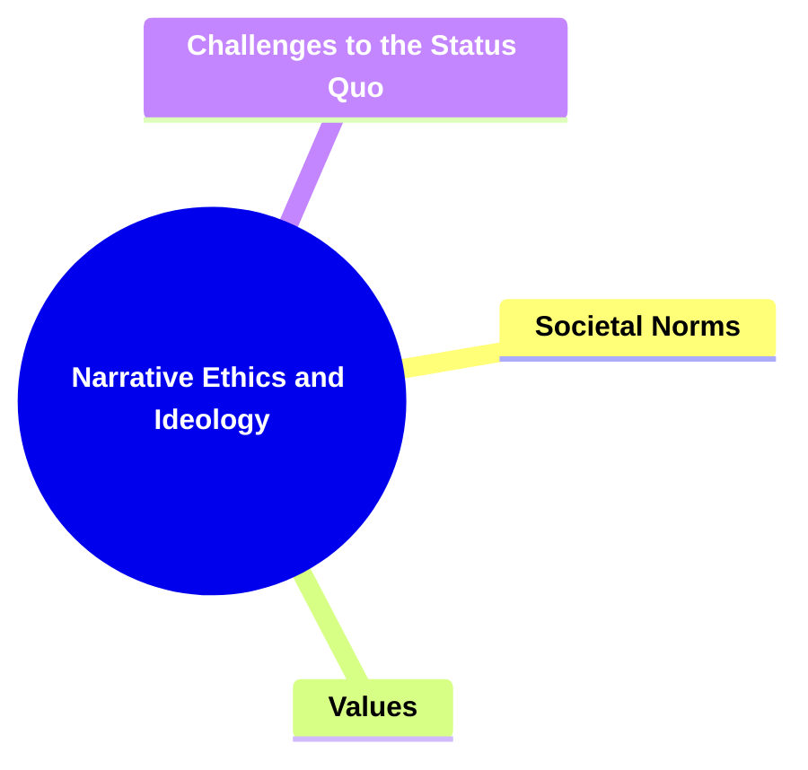
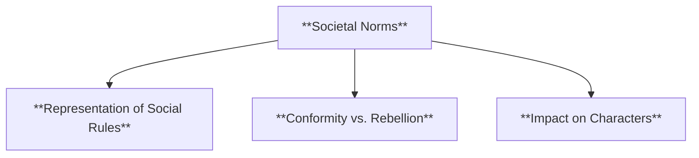
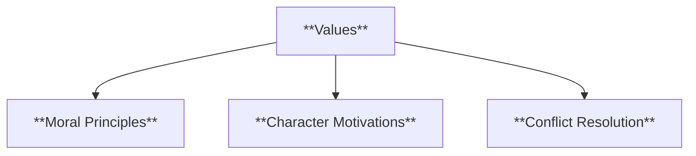
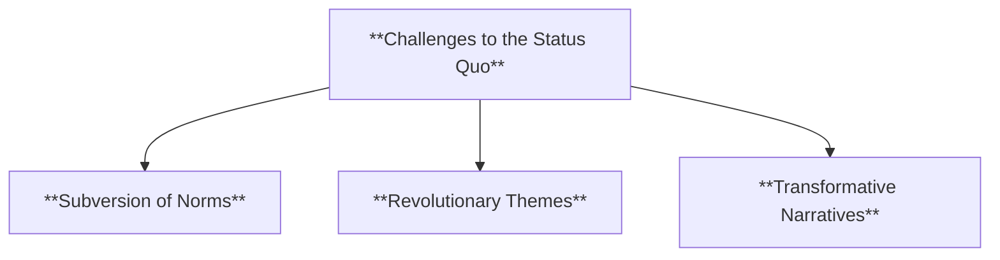
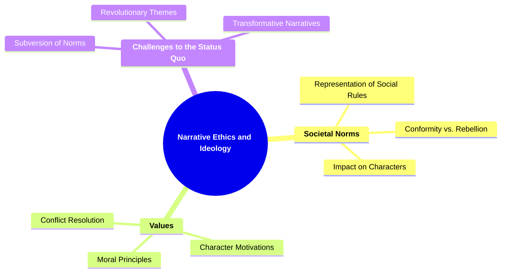

# 20 NE-3509 NARRATIVE ETHICS IDEOLOGY

### **Narrative Ethics and Ideology**

- **Analyzing moral, ethical, and ideological messages conveyed through the narrative.**
  - **Focus**:
    - **Societal Norms**
    - **Values**
    - **Challenges to the Status Quo**
  - **Importance**: Involves critical thinking about societal norms and values.

---

### **Key Concepts**

---

#### **Narrative Ethics and Ideology**

- **Definition**:
  - In narratology, **narrative ethics and ideology** pertain to the examination of moral, ethical, and ideological messages embedded within a narrative. This involves analyzing how stories reflect, reinforce, or challenge societal norms and values, and how they convey underlying ideologies that influence the audience's perception and understanding of the world.

##### **Components of Narrative Ethics and Ideology**

###### **Societal Norms**

- **Definition**:
  - **Societal norms** are the accepted behaviors, rules, and standards within a given society that characters in a narrative are expected to follow or react against. Analyzing how a narrative portrays these norms can reveal underlying messages about conformity, rebellion, and social expectations.

- **Characteristics**:
  - **Representation of Social Rules**: How the narrative depicts the accepted behaviors and regulations of the society within the story.
  - **Conformity vs. Rebellion**: The tension between adhering to societal norms and characters' resistance against them.
  - **Impact on Characters**: How societal norms influence character development, motivations, and actions.

###### **Values**

- **Definition**:
  - **Values** are the principles or standards of behavior that are considered important or desirable within the narrative's context. Analyzing the values presented in a narrative helps in understanding the moral framework and the message the story conveys regarding what is right or wrong, good or bad.

- **Characteristics**:
  - **Moral Principles**: The ethical guidelines that characters adhere to or violate.
  - **Character Motivations**: How values drive characters' decisions and actions.
  - **Conflict Resolution**: The role of values in how conflicts are resolved within the narrative.

###### **Challenges to the Status Quo**

- **Definition**:
  - **Challenges to the status quo** involve narratives that question, critique, or subvert existing societal structures, norms, and ideologies. This analysis focuses on how stories represent resistance, change, and transformation within the societal framework.

- **Characteristics**:
  - **Subversion of Norms**: How the narrative overturns or questions established societal rules.
  - **Revolutionary Themes**: Themes that advocate for significant change or upheaval in the societal structure.
  - **Transformative Narratives**: Stories that depict transformation or evolution of characters and society.

---

### **Theoretical Significance**

- **Importance of Narrative Ethics and Ideology**:

  - In narratology, examining narrative ethics and ideology is vital for understanding how stories reflect and influence societal values and norms. This analysis reveals the moral and ethical dimensions of narratives, highlighting how stories can reinforce, challenge, or reshape the audience's perceptions of right and wrong.

- **Application in Narratological Analysis**:

  - Scholars utilize narrative ethics and ideology analysis to dissect the moral messages and ideological underpinnings of narratives. This involves examining how characters embody or defy societal norms, how values are portrayed through the plot and character actions, and how the narrative may challenge the status quo.

- **Critical Thinking about Societal Norms and Values**:

  - Analyzing narrative ethics and ideology fosters critical thinking about the societal norms and values presented in stories. It encourages readers to question the ethical implications of character actions, the representation of social structures, and the narrative's stance on various ideological issues.

- **Enhancing Thematic Depth**:
  - Understanding the ethical and ideological dimensions of a narrative adds layers of thematic complexity, enabling a more profound exploration of the story's messages and the societal issues it addresses.

---

