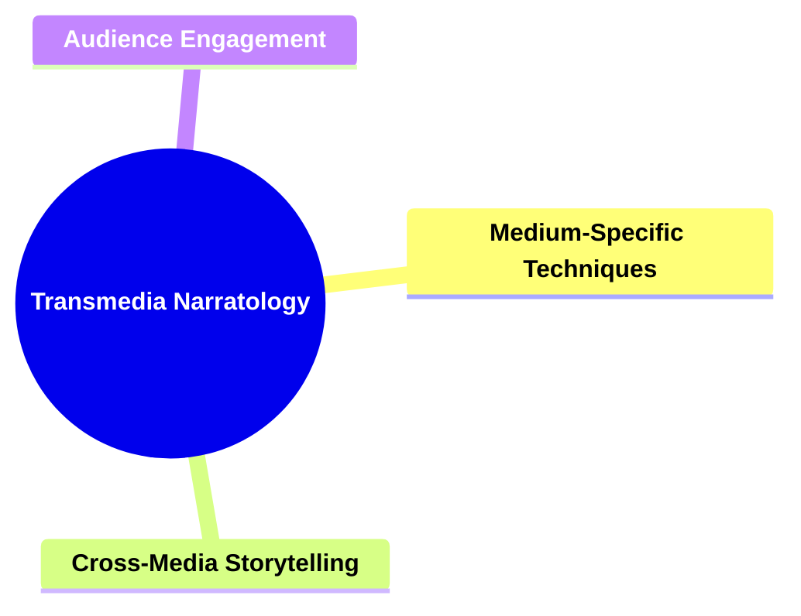
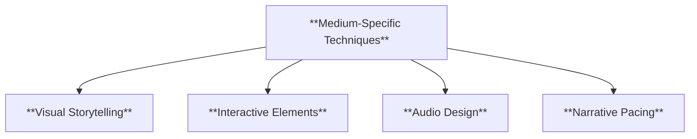
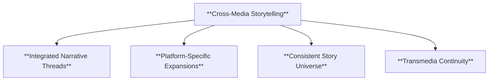
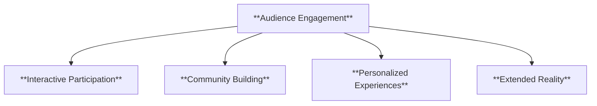
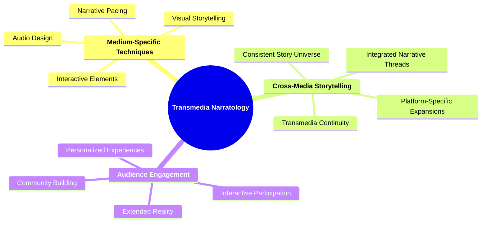

# 22 TN-3602 TRANSMEDIA NARRATOLOGY

### **Transmedia Narratology**

- **Studying narratives across multiple media platforms.**
  - **Considerations**:
    - **Medium-Specific Techniques**
    - **Cross-Media Storytelling**
    - **Audience Engagement**
  - **Importance**: Involves understanding various media forms and their narrative techniques.

---

### **Key Concepts**

---

#### **Transmedia Narratology**

- **Definition**:
  - In narratology, **transmedia narratology** examines how narratives are extended and distributed across multiple media platforms. This approach explores the unique storytelling techniques inherent to each medium and how they interconnect to create a cohesive and immersive narrative experience. Transmedia narratology emphasizes the expansion of a single narrative universe through diverse media forms, enhancing depth, engagement, and audience interaction.

##### **Components of Transmedia Narratology**

###### **Medium-Specific Techniques**

- **Definition**:
  - **Medium-specific techniques** refer to the unique narrative tools and methods that are inherent to each distinct media platform. These techniques leverage the strengths and capabilities of the medium to enhance storytelling and engage the audience effectively.

- **Characteristics**:
  - **Visual Storytelling**: Utilizes imagery, cinematography, and visual effects to convey narrative elements.
  - **Interactive Elements**: Incorporates user participation and decision-making to influence the story's progression.
  - **Audio Design**: Employs sound effects, music, and dialogue to enhance the emotional and atmospheric aspects of the narrative.
  - **Narrative Pacing**: Adjusts the speed and rhythm of the story delivery to suit the medium's consumption patterns.

###### **Cross-Media Storytelling**

- **Definition**:
  - **Cross-media storytelling** involves the seamless integration of a narrative across multiple media platforms, such as books, films, video games, and social media. This approach ensures that each medium contributes uniquely to the overall story, creating a unified and expansive narrative experience.

- **Characteristics**:
  - **Integrated Narrative Threads**: Story elements that connect and flow across different media platforms.
  - **Platform-Specific Expansions**: Unique additions or perspectives offered by each medium, enriching the main narrative.
  - **Consistent Story Universe**: A unified setting and lore that remains coherent across all media forms.
  - **Transmedia Continuity**: Maintaining consistency in characters, plotlines, and thematic elements throughout the narrative extensions.

###### **Audience Engagement**

- **Definition**:
  - **Audience engagement** in transmedia narratology focuses on creating interactive and participatory experiences for the audience. It leverages multiple platforms to foster deeper connections, encourage active involvement, and enhance the overall immersion in the narrative.

- **Characteristics**:
  - **Interactive Participation**: Allows audiences to influence or contribute to the narrative through choices and actions.
  - **Community Building**: Encourages the formation of audience communities that interact and share their experiences.
  - **Personalized Experiences**: Offers tailored content and story pathways based on individual audience preferences.
  - **Extended Reality**: Utilizes augmented and virtual reality to create immersive narrative environments.

---

### **Theoretical Significance**

- **Understanding Diverse Media Forms**:

  - Transmedia narratology provides a framework for analyzing how different media forms contribute uniquely to storytelling. It highlights the strengths and limitations of each medium, allowing for a more comprehensive understanding of narrative techniques.

- **Enhancing Narrative Complexity**:

  - By distributing a narrative across multiple platforms, transmedia storytelling adds layers of complexity and depth. This approach enables the exploration of various perspectives and subplots, enriching the main storyline.

- **Facilitating Audience Interaction**:

  - Transmedia narratives engage audiences in interactive and participatory ways, fostering a more active and invested readership. This interaction enhances the emotional and intellectual connection between the audience and the story.

- **Promoting Narrative Cohesion**:

  - The integration of multiple media forms ensures a cohesive and unified narrative experience. Transmedia narratology emphasizes the importance of maintaining consistency across platforms, which reinforces the story's internal logic and believability.

- **Influencing Modern Storytelling Practices**:

  - Understanding transmedia narratology is essential for contemporary storytellers who aim to create expansive and interconnected narrative universes. It informs the development of cross-platform strategies that maximize audience reach and engagement.

- **Supporting Comparative Analysis**:
  - Transmedia narratology allows scholars to compare how the same narrative is adapted and expanded across different media. This comparative approach reveals how media-specific techniques influence the storytelling process and audience reception.

---

