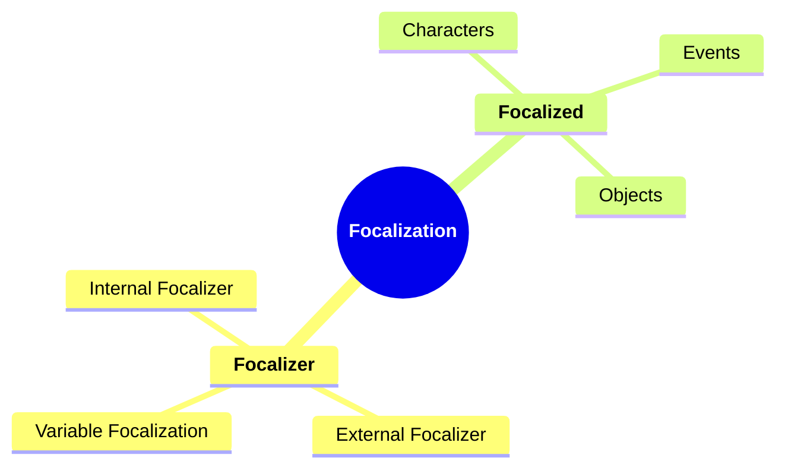
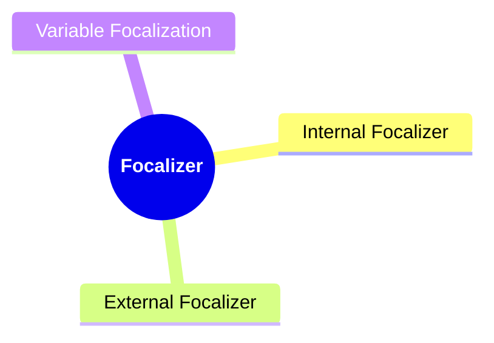
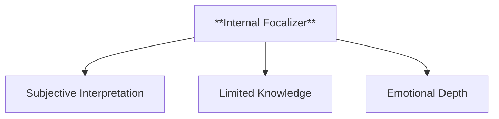
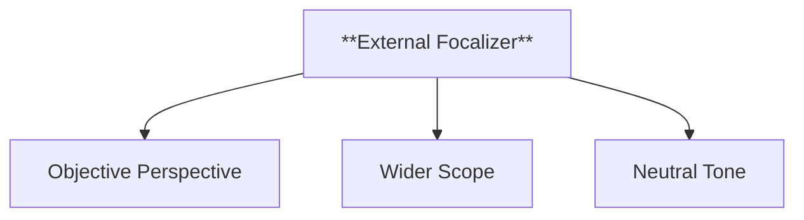
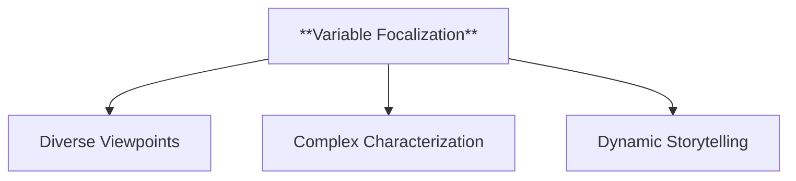
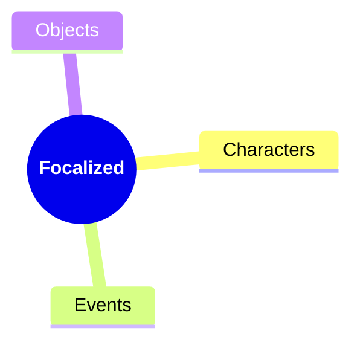
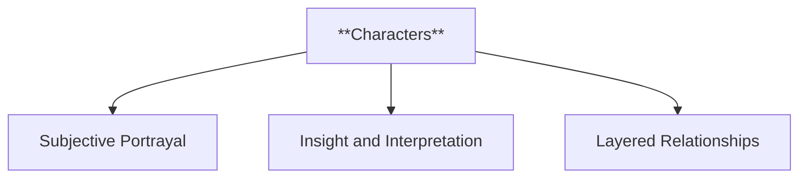
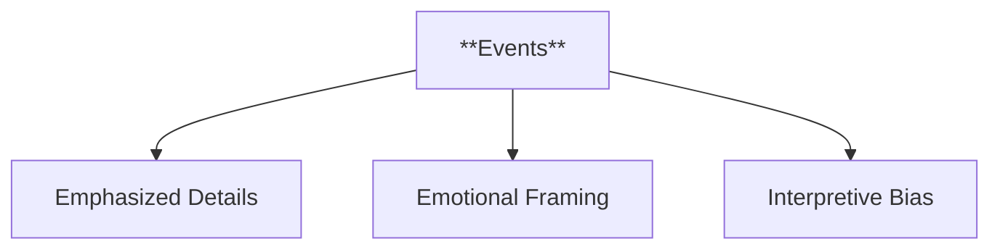
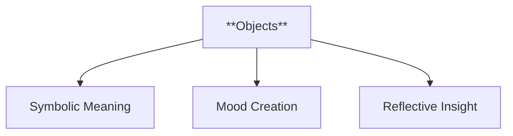
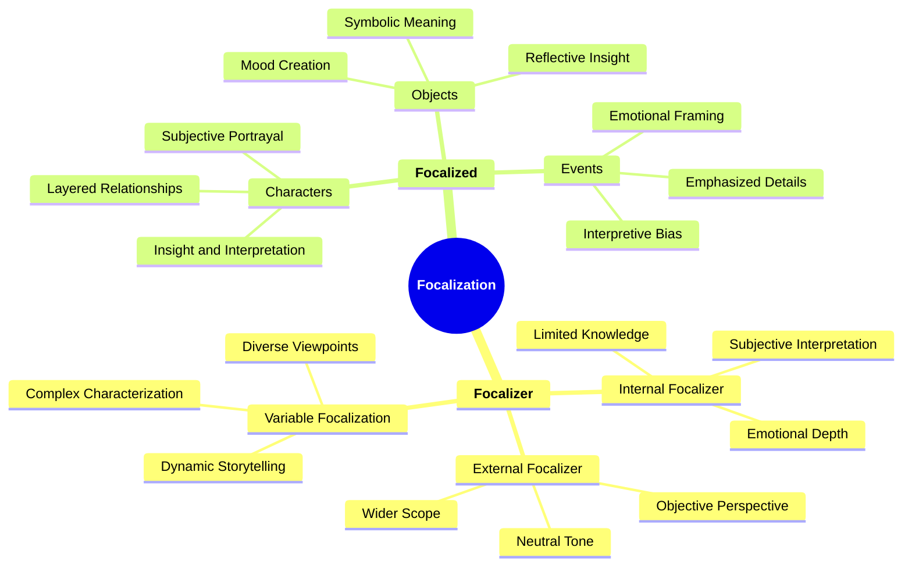

- [1. **Title: Bal's Focalization Framework**](#1-title-bals-focalization-framework)
- [2. **Key Concepts**](#2-key-concepts)
  - [2.1. **Focalizer**](#21-focalizer)
    - [2.1.1. **Components of Focalizer**](#211-components-of-focalizer)
      - [2.1.1.1. **Internal Focalizer**](#2111-internal-focalizer)
      - [2.1.1.2. **External Focalizer**](#2112-external-focalizer)
      - [2.1.1.3. **Variable Focalization**](#2113-variable-focalization)
  - [2.2. **Focalized**](#22-focalized)
    - [2.2.1. **Components of Focalized**](#221-components-of-focalized)
      - [2.2.1.1. **Characters**](#2211-characters)
      - [2.2.1.2. **Events**](#2212-events)
      - [2.2.1.3. **Objects**](#2213-objects)
- [3. Implications of **Focalization**](#3-implications-of-focalization)

---
### 1. **Title: Bal's Focalization Framework**

**Focalization**:
   **Definition**: Mieke Bal’s *Focalization Framework* provides a comprehensive analysis of how perspectives are constructed in narratives. Focalization distinguishes between the *focalizer* (who sees) and the *focalized* (what is seen). This distinction allows for a more nuanced understanding of narrative perspectives, revealing how different viewpoints influence the reader’s interpretation and engagement with the story.

---

### 2. **Key Concepts**

#### 2.1. **Focalizer**

**Definition**:
   The *focalizer* is the entity through whose perspective the narrative events and characters are presented. It can be a character within the story (internal focalizer) or an external narrator (external focalizer).

##### 2.1.1. **Components of Focalizer**

###### 2.1.1.1. **Internal Focalizer**
- **Definition**: The narrative is filtered through the subjective perspective of a character within the story, reflecting their thoughts, emotions, and biases.

  - **Characteristics**
    - **Subjective Interpretation**: Offers a personal account shaped by the focal character’s beliefs.
    - **Limited Knowledge**: Restricts the view to what the character perceives.
    - **Emotional Depth**: Reveals internal conflicts and motivations.

---

###### 2.1.1.2. **External Focalizer**
- **Definition**: The story is presented by an external narrator who offers a broader, more objective view of events.

  - **Characteristics**
    - **Objective Perspective**: Provides detached, factual descriptions.
    - **Wider Scope**: Gives a comprehensive overview.
    - **Neutral Tone**: Maintains impartiality.

---

###### 2.1.1.3. **Variable Focalization**
- **Definition**: The narrative shifts between different focalizers, providing multiple perspectives on events and characters.

  - **Characteristics**
    - **Diverse Viewpoints**: Shows events from multiple perspectives.
    - **Complex Characterization**: Highlights different interpretations.
    - **Dynamic Storytelling**: Creates a layered narrative structure.

---

#### 2.2. **Focalized**

**Definition**:
   The *focalized* refers to the object, character, or event that is perceived by the focalizer. It is what the focalizer focuses on within the narrative.

##### 2.2.1. **Components of Focalized**

###### 2.2.1.1. **Characters**
- **Definition**: The focalized can be another character, whose portrayal is shaped by the focalizer’s perspective.

  - **Characteristics**
    - **Subjective Portrayal**: Shaped by the focalizer’s emotions and biases.
    - **Insight and Interpretation**: Offers unique character insights.
    - **Layered Relationships**: Reveals dynamics and conflicts.

---

###### 2.2.1.2. **Events**
- **Definition**: Events in the narrative can also be focalized, with the focalizer determining how these events are presented.

  - **Characteristics**
    - **Emphasized Details**: Focuses on specific event elements.
    - **Emotional Framing**: Adds the focalizer’s emotional view.
    - **Interpretive Bias**: Shapes perception through subjective focus.

---

###### 2.2.1.3. **Objects**
- **Definition**: Non-human elements like settings or symbols can be focalized, revealing their thematic significance through the focalizer’s perception.

  - **Characteristics**
    - **Symbolic Meaning**: Adds thematic depth.
    - **Mood Creation**: Establishes tone and atmosphere.
    - **Reflective Insight**: Reflects focalizer’s state of mind.

---

---

### 3. Implications of **Focalization**

**Narrative Structure and Perspective**:
   Bal’s *Focalization Framework* has had a profound impact on narrative theory, offering a precise method for analyzing how perspectives are constructed in narratives. Her framework has enhanced the understanding of how subjective viewpoints shape the reader’s engagement with the story.

**Application Across Genres and Media**:
   While developed in the context of literary analysis, Bal’s framework applies across various media, such as film, theater, and digital storytelling. In these media, focalization shapes how the audience experiences the narrative, guiding attention and interpretation.

---
