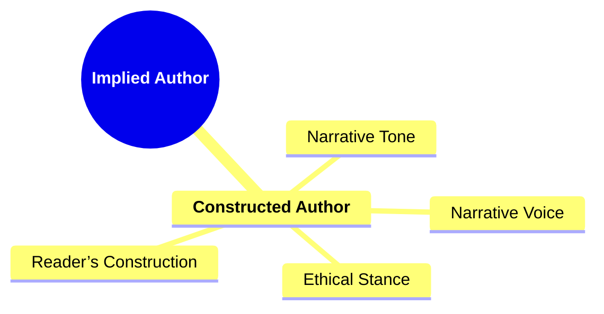
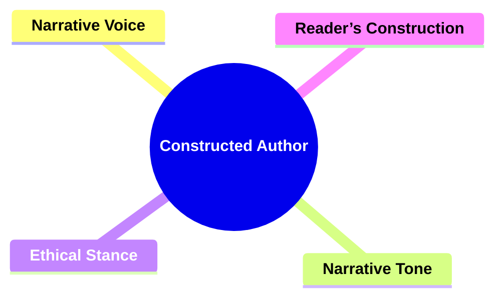
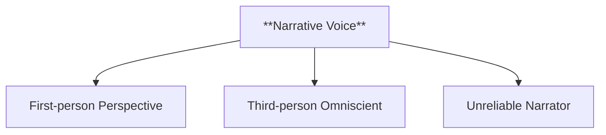
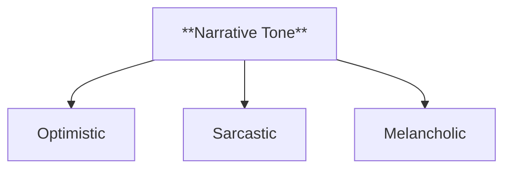
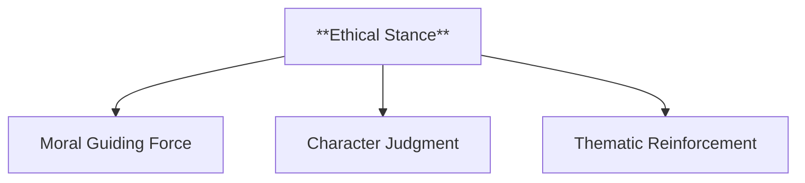
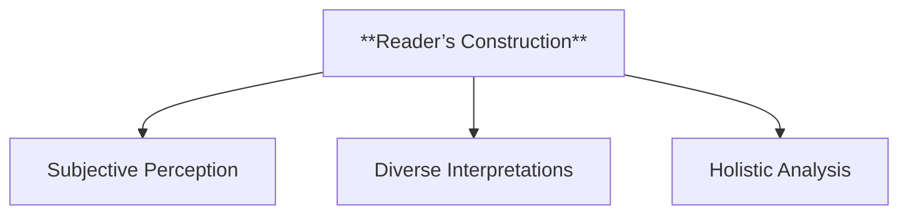
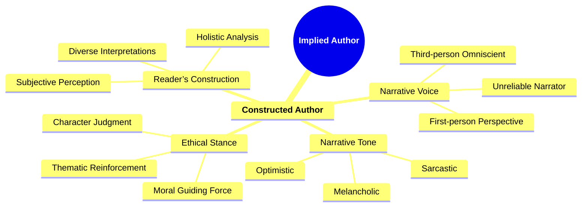

- [1. **Title: Booth's Implied Author Model**](#1-title-booths-implied-author-model)
- [2. **Key Concepts**](#2-key-concepts)
  - [2.1. **Constructed Author**](#21-constructed-author)
    - [2.1.1. **Components of Constructed Author**](#211-components-of-constructed-author)
      - [2.1.1.1. **Narrative Voice**](#2111-narrative-voice)
      - [2.1.1.2. **Narrative Tone**](#2112-narrative-tone)
      - [2.1.1.3. **Ethical Stance**](#2113-ethical-stance)
      - [2.1.1.4. **Reader’s Construction**](#2114-readers-construction)
- [3. Implications of Implied Author](#3-implications-of-implied-author)

### 1. **Title: Booth's Implied Author Model**

**Implied Author**:
**Definition**: Wayne C. Booth’s concept of the _implied author_ refers to the narrative persona that emerges from the text, distinct from both the real author and the narrator. The implied author reflects the version of the author that the reader perceives through the narrative’s tone, style, and ethical stance, acting as a mediator between the author’s intentions and the reader’s interpretation.

---

### 2. **Key Concepts**

#### 2.1. **Constructed Author**

**Definition**:
The implied author is the construct the reader infers from the narrative elements, such as tone, style, and character presentation. It represents the values and intentions conveyed through the story and is distinct from the real author’s personal views.

##### 2.1.1. **Components of Constructed Author**

###### 2.1.1.1. **Narrative Voice**

- **Definition**: The unique perspective and style through which the story is told, often reflecting the narrator’s personality, background, and reliability.

- **Characteristics**
  - **First-person Perspective**: Provides a personal, subjective view from the narrator’s point of view.
  - **Third-person Omniscient**: Offers insight into multiple characters’ thoughts and experiences.
  - **Unreliable Narrator**: Adds complexity by presenting a narrator whose perspective may be biased or misleading.

---

###### 2.1.1.2. **Narrative Tone**

- **Definition**: The mood or attitude conveyed by the narrator’s voice, setting the emotional framework for readers.

- **Characteristics**
  - **Optimistic**: Imbues the story with a hopeful outlook.
  - **Sarcastic**: Conveys irony or humor, often critiquing characters or situations.
  - **Melancholic**: Creates a reflective or sorrowful atmosphere.

---

###### 2.1.1.3. **Ethical Stance**

- **Definition**: The implied author embodies the moral and ethical framework of the narrative.

- **Characteristics**
  - **Moral Guiding Force**: Reflects the narrative’s principles.
  - **Character Judgment**: Influences how readers perceive character actions.
  - **Thematic Reinforcement**: Aligns actions with the implied author’s values.

---

###### 2.1.1.4. **Reader’s Construction**

- **Definition**: The implied author is inferred by the reader based on the narrative elements.

- **Characteristics**
  - **Subjective Perception**: Allows readers to form their own idea of the implied author.
  - **Diverse Interpretations**: Leads to varied reader understandings.
  - **Holistic Analysis**: Emerges from narrative voice, tone, and structure.

---

### 3. Implications of Implied Author

**Impact on Narrative Theory**:
Booth’s Implied Author Model challenges traditional views of authorial intent by suggesting that meaning is shaped by how the narrative is constructed and interpreted, not solely by the real author’s intentions. This concept has significantly influenced narrative ethics and the analysis of how narratives communicate moral and ideological messages.

**Application Across Genres and Media**:
The concept applies to various media beyond literature. In film, for example, the implied author can be inferred from directorial choices, while in digital media, design elements guide the user’s perception of the narrative. Understanding the implied author is crucial in analyzing how stories communicate their ethical stance across different formats.

**Supporting Information**:

- **Interdisciplinary Influence**: The implied author concept is used in film studies to analyze directorial voice and in communication theory to explore how media creators shape narrative values. It also informs ethical discussions about how narratives influence social attitudes.
- **Critiques and Further Development**: Critics argue that the implied author is an abstract concept, which may lead to overinterpretation. Additionally, the subjectivity of the reader’s construction raises questions about variability in interpretation. Despite these critiques, the implied author remains a key concept in understanding the complex relationship between the narrative, the author, and the reader.

---
