- [1. Title: **Rimmon-Kenan's Narrative Levels Framework**](#1-title-rimmon-kenans-narrative-levels-framework)
- [2. Key Concepts](#2-key-concepts)
  - [2.1. Extradiegetic Level](#21-extradiegetic-level)
    - [2.1.1. **Components of Extradiegetic Level**](#211-components-of-extradiegetic-level)
      - [2.1.1.1. **Narrative Authority**](#2111-narrative-authority)
      - [2.1.1.2. **Framing Device**](#2112-framing-device)
      - [2.1.1.3. **Narrative Distance**](#2113-narrative-distance)
  - [2.2. Intradiegetic Level](#22-intradiegetic-level)
    - [2.2.1. **Components of Intradiegetic Level**](#221-components-of-intradiegetic-level)
      - [2.2.1.1. **Embedded Narratives**](#2211-embedded-narratives)
      - [2.2.1.2. **Character Perspective**](#2212-character-perspective)
      - [2.2.1.3. **Narrative Depth**](#2213-narrative-depth)
      - [2.2.1.4. **Multiplicity**](#2214-multiplicity)
  - [2.3. Metalepsis](#23-metalepsis)
    - [2.3.1. **Components of Metalepsis**](#231-components-of-metalepsis)
      - [2.3.1.1. **Boundary Transgression**](#2311-boundary-transgression)
      - [2.3.1.2. **Narrative Playfulness**](#2312-narrative-playfulness)
      - [2.3.1.3. **Thematic Implications**](#2313-thematic-implications)
    - [2.3.2. Implications of **Narrative Levels**](#232-implications-of-narrative-levels)

---

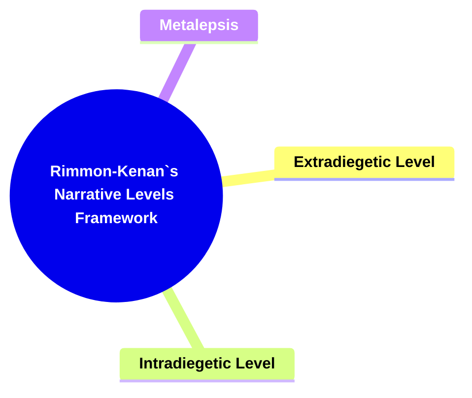

### 1. Title: **Rimmon-Kenan's Narrative Levels Framework**

**Narrative Levels**:
**Definition**: Shlomith Rimmon-Kenan explores the concept of narrative levels, which refer to the different layers or planes of narration within a story. This framework includes the distinction between extradiegetic and intradiegetic levels, as well as the phenomenon of metalepsis, which complicates the relationship between these levels.

---

### 2. Key Concepts

#### 2.1. Extradiegetic Level

**Definition**:
The extradiegetic level refers to narration that occurs outside the story world. This is typically the primary level of narration, where the narrator is not a character within the narrative but exists externally to tell the story.

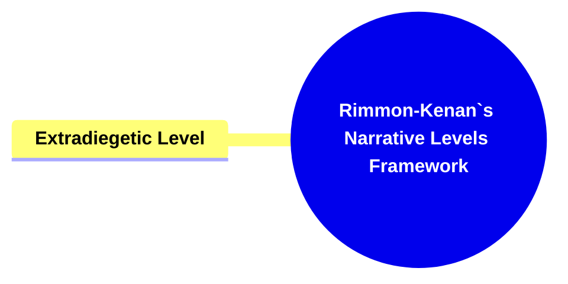

##### 2.1.1. **Components of Extradiegetic Level**

###### 2.1.1.1. **Narrative Authority**

- **Definition**: The extradiegetic narrator holds authority, controlling the flow of information and influencing the reader’s understanding of the story.

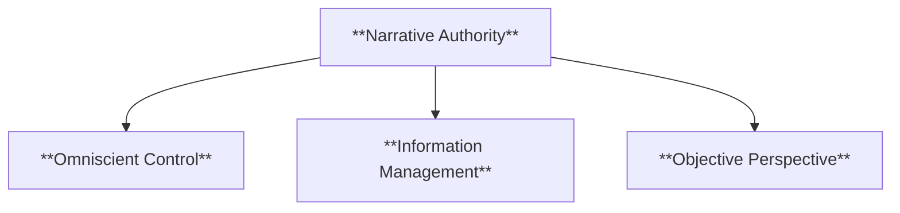

- **Characteristics**
  - **Omniscient Control**: Provides comprehensive insights, often knowing more than any character in the story.
  - **Information Management**: Decides what details to reveal or withhold, guiding reader perception.
  - **Objective Perspective**: Often maintains a neutral, authoritative tone that influences how the reader interprets the narrative.

###### 2.1.1.2. **Framing Device**

- **Definition**: The extradiegetic level often serves as a framing device, introducing the intradiegetic narrative and setting its context.

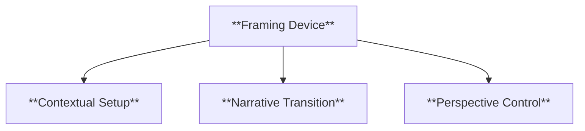

- **Characteristics**
  - **Contextual Setup**: Establishes the setting and background for the main story.
  - **Narrative Transition**: Provides a bridge between different narrative levels, enhancing structure.
  - **Perspective Control**: Offers a broader view that frames the main story within a larger narrative.

###### 2.1.1.3. **Narrative Distance**

- **Definition**: The extradiegetic narrator typically maintains a certain distance from the events of the story, providing an overarching perspective.

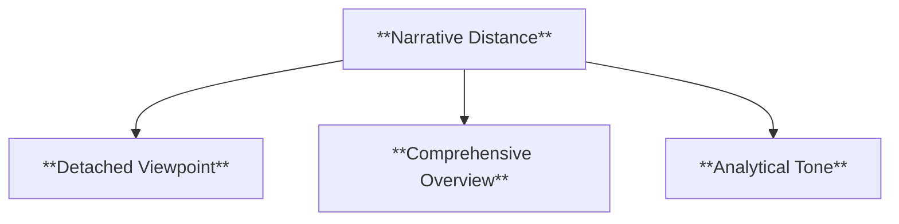

- **Characteristics**
  - **Detached Viewpoint**: Observes the story from outside, offering an unbiased account.
  - **Comprehensive Overview**: Presents a complete view of the story, beyond the characters’ subjective experiences.
  - **Analytical Tone**: Often allows for reflective or interpretative commentary on the story’s events.

---

#### 2.2. Intradiegetic Level

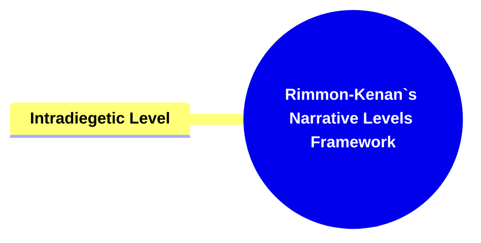

**Definition**:
The intradiegetic level refers to narration that occurs within the story world, often involving characters who narrate stories inside the main narrative. These embedded narratives add layers to the storytelling.

##### 2.2.1. **Components of Intradiegetic Level**

###### 2.2.1.1. **Embedded Narratives**

- **Definition**: These are stories told by characters within the story, contributing backstory or parallel plotlines.

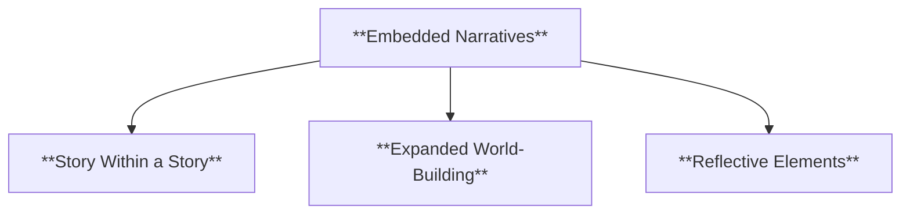

- **Characteristics**
  - **Story Within a Story**: Adds layers by having characters narrate sub-stories.
  - **Expanded World-Building**: Deepens the main narrative by introducing subplots or histories.
  - **Reflective Elements**: May echo or contrast the main plot, adding thematic richness.

###### 2.2.1.2. **Character Perspective**

- **Definition**: The intradiegetic narrator, being a character within the narrative, often provides a subjective or biased account of events. **Characteristics** **Personal Bias**: Narration reflects the character’s beliefs, motivations, and limitations. **Limited Knowledge**: The character only recounts events they are aware of, influencing reliability. **Emotional Insight**: Provides an intimate view of the character’s internal world and emotions.

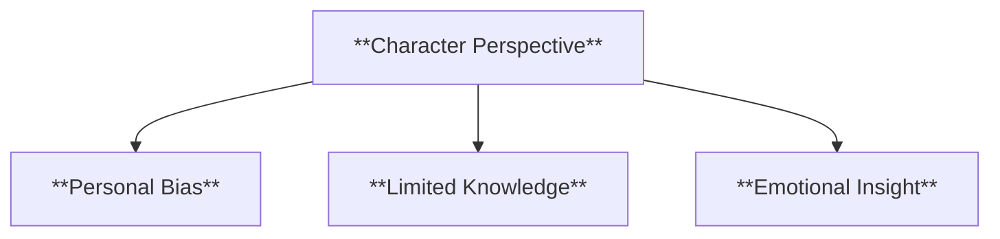

###### 2.2.1.3. **Narrative Depth**

- **Definition**: A narrative technique that adds layers to the story, providing greater richness and complexity through subplots, backstories, or internal reflections.

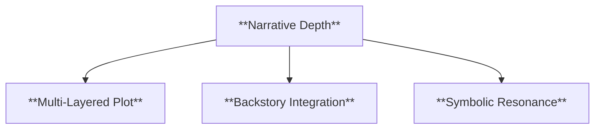

- **Characteristics**
  - **Multi-Layered Plot**: Includes subplots and embedded narratives that enhance the primary storyline.
  - **Backstory Integration**: Reveals character histories and motives gradually, adding depth to their present actions.
  - **Symbolic Resonance**: Uses symbolic elements within the narrative to provide deeper thematic meanings.

###### 2.2.1.4. **Multiplicity**

- **Definition**: The presence of various perspectives, voices, or storylines that coexist within the narrative, allowing for a more dynamic and multifaceted reading experience.

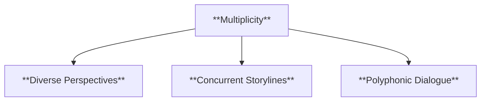

- **Characteristics**
  - **Diverse Perspectives**: Integrates multiple characters' viewpoints, offering contrasting or complementary insights.
  - **Concurrent Storylines**: Presents parallel or intersecting storylines, each contributing to the overall narrative.
  - **Polyphonic Dialogue**: Uses a range of voices to create a tapestry of opinions, beliefs, and ideas within the story.

---

#### 2.3. Metalepsis

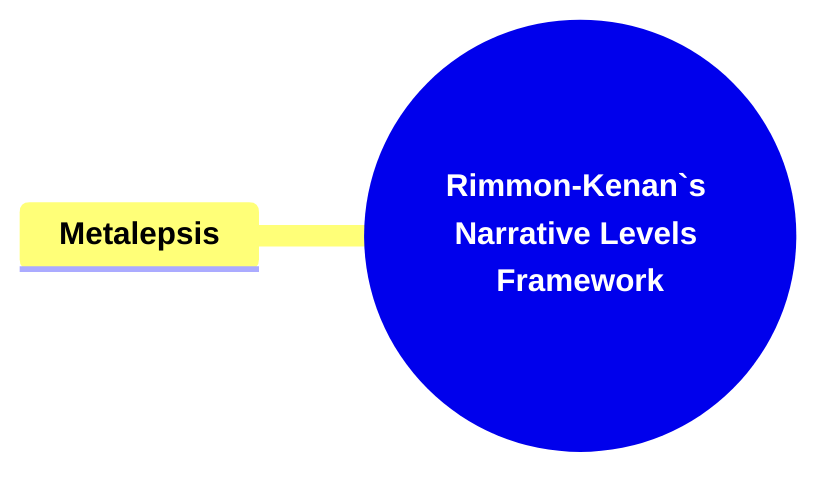

**Definition**:
Metalepsis occurs when the boundaries between different narrative levels are transgressed, such as when a character interacts with the narrator or steps outside their narrative world.

##### 2.3.1. **Components of Metalepsis**

###### 2.3.1.1. **Boundary Transgression**

- **Definition**: This involves breaking the narrative "fourth wall" by crossing between narrative levels.

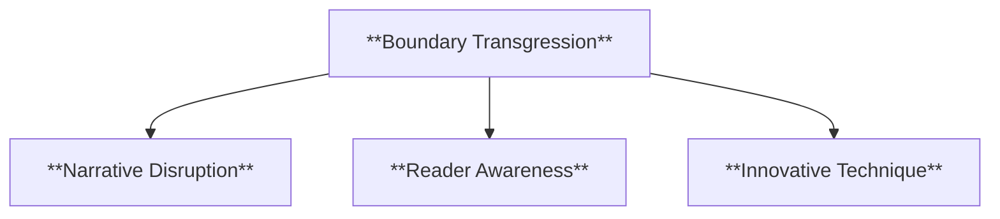

- **Characteristics**
  - **Narrative Disruption**: Blurs the line between different narrative layers, creating surprise or intrigue.
  - **Reader Awareness**: Makes readers conscious of the narrative as a constructed work.
  - **Innovative Technique**: Often used for experimental storytelling or postmodern effects.

###### 2.3.1.2. **Narrative Playfulness**

- **Definition**: Metalepsis introduces a playful or experimental quality to the narrative, making the reader aware of its constructed nature.

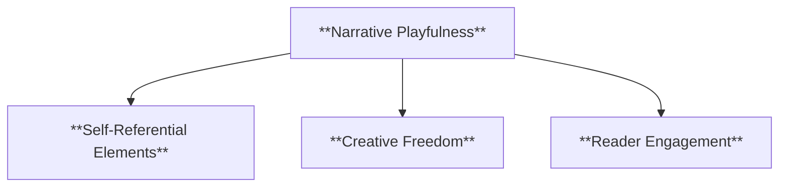

- **Characteristics**
  - **Self-Referential Elements**: Highlights the fictionality of the narrative through breaking conventions.
  - **Creative Freedom**: Encourages an unconventional approach to storytelling.
  - **Reader Engagement**: Invites readers to question the nature of the story and its boundaries.

###### 2.3.1.3. **Thematic Implications**

- **Definition**: Metalepsis often explores themes like reality vs. fiction, the power of storytelling, and narrative limits.

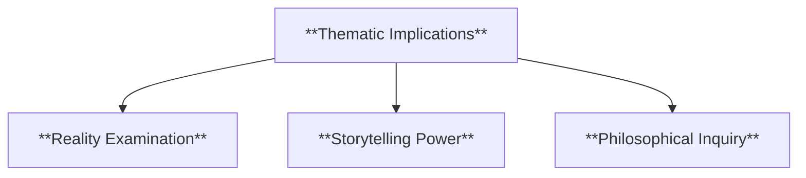

- **Characteristics**
  - **Reality Examination**: Challenges the reader’s understanding of what is real within the story.
  - **Storytelling Power**: Highlights the control the narrator or author has over the story world.
  - **Philosophical Inquiry**: Raises questions about narrative construction and perception.

---

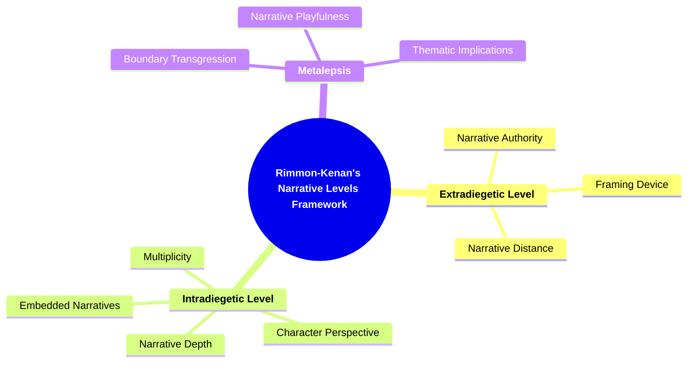

---

##### 2.3.2. Implications of **Narrative Levels**

**Key Insight or Implication**:
Rimmon-Kenan’s framework highlights the complexity of narrative structures by analyzing how different levels of narration interact. This offers a deeper understanding of how stories are constructed and deconstructed, providing insight into the relationship between the reader, narrator, and narrative.

**Collaborative or Future-Oriented Insight**:
The exploration of narrative levels continues to influence the analysis of postmodern and experimental literature, where the boundaries between narrative layers are often blurred. Rimmon-Kenan’s model remains relevant for analyzing narratives that play with traditional structures.

---
