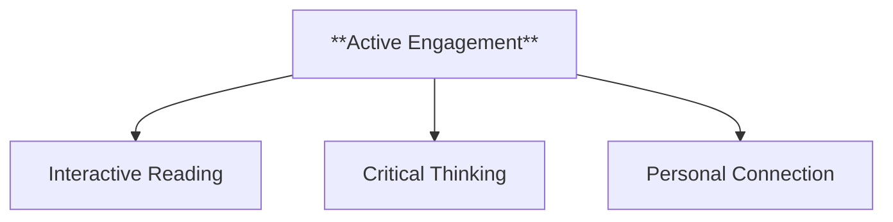
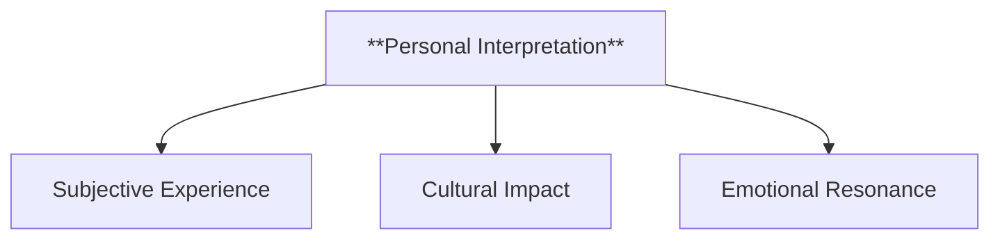
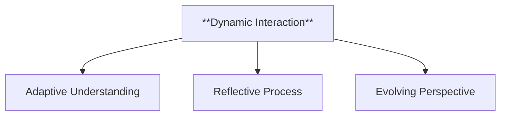
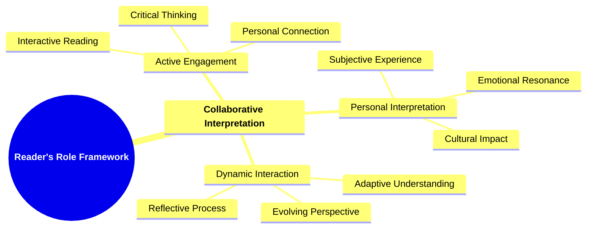

- [1. **Title: Booth's Reader's Role Framework**](#1-title-booths-readers-role-framework)
- [2. **Key Concepts**](#2-key-concepts)
  - [2.1. **Collaborative Interpretation**](#21-collaborative-interpretation)
    - [2.1.1. **Components of Collaborative Interpretation**](#211-components-of-collaborative-interpretation)
      - [2.1.1.1. **Active Engagement**](#2111-active-engagement)
      - [2.1.1.2. **Personal Interpretation**](#2112-personal-interpretation)
      - [2.1.1.3. **Dynamic Interaction**](#2113-dynamic-interaction)
- [3. Theoretical Significance](#3-theoretical-significance)
    - [3.0.1. **Components of Theoretical Significance**](#301-components-of-theoretical-significance)
- [4. Implications of **The Reader’s Role Framework**](#4-implications-of-the-readers-role-framework)

---
### 1. **Title: Booth's Reader's Role Framework**

**The Reader’s Role**:
   **Definition**: Wayne C. Booth’s *Reader's Role Framework* emphasizes the active role of the reader in shaping the meaning of a narrative. Booth argues that the reader is not a passive recipient but an active participant who collaborates with the implied author to construct and interpret the narrative’s meaning. This interaction creates a dynamic process of meaning-making where personal experiences, cultural background, and emotional responses shape the reader’s interpretation of the text.

---

### 2. **Key Concepts**

#### 2.1. **Collaborative Interpretation**

**Definition**:
   Collaborative interpretation refers to the idea that the reader actively engages with the narrative, bringing their own experiences and values to bear on the text, which allows for the co-creation of meaning alongside the implied author.

##### 2.1.1. **Components of Collaborative Interpretation**

###### 2.1.1.1. **Active Engagement**
- **Definition**: The reader questions, interprets, and interacts with the text, shaping the meaning through a personal lens.

  - **Characteristics**
    - **Interactive Reading**: Encourages readers to actively analyze the narrative, considering different angles and possibilities.
    - **Critical Thinking**: Involves questioning the author’s intent, narrative reliability, and thematic implications.
    - **Personal Connection**: Engages readers in a way that allows them to project their own beliefs and experiences onto the story, making it more meaningful.

###### 2.1.1.2. **Personal Interpretation**
- **Definition**: Each reader's understanding of the narrative is influenced by their unique context, including cultural and emotional factors.

  - **Characteristics**
    - **Subjective Experience**: Leads to diverse interpretations as readers bring their individual backgrounds and emotions into play.
    - **Cultural Impact**: The reader’s social and cultural environment shapes how they relate to characters, themes, and plot developments.
    - **Emotional Resonance**: Personal feelings and past experiences color the reader’s perception, making certain elements stand out more than others.

###### 2.1.1.3. **Dynamic Interaction**
- **Definition**: As the story progresses, the reader’s interpretation may evolve with new insights or perspectives gained from the unfolding narrative.

  - **Characteristics**
    - **Adaptive Understanding**: The reader’s perception shifts as the plot reveals new information or developments.
    - **Reflective Process**: Readers reconsider earlier events and details in light of new insights, leading to a deeper comprehension of the story.
    - **Evolving Perspective**: The interaction between the reader and the text is fluid, allowing interpretations to change as the narrative progresses.

---

---

### 3. Theoretical Significance

**Reader-Response Theory**:
   Booth’s framework anticipates reader-response theory, which posits that meaning is created through the interaction between reader and text. The reader’s interpretation is essential to the overall understanding of the narrative, rather than meaning being an inherent property of the text itself.

##### 3.0.1. **Components of Theoretical Significance**

**Implied Author Concept**:
   Booth introduces the concept of the implied author, a figure inferred by the reader based on the text’s tone, style, and moral stance. The implied author serves as a guide to the narrative, mediating between the real author’s intent and the reader’s interpretation.

**Impact on Literary Criticism**:
   By emphasizing the reader’s role, Booth’s framework has significantly influenced literary criticism, allowing for a broader range of interpretations. It opens up the possibility of exploring how different readers from diverse backgrounds engage with a text and arrive at varying conclusions.

**Supporting Information**:
   - **Cross-Disciplinary Influence**: Booth’s ideas have influenced fields such as communication studies, where the interaction between the sender (author) and receiver (reader) is a key area of analysis.
   - **Critiques and Developments**: Critics of Booth’s framework argue that it may overemphasize the reader’s role in creating meaning. Post-structuralism and deconstruction seek to balance this by exploring how language and the text itself contribute to meaning-making independently of the reader’s influence. Despite this, Booth’s framework remains foundational in understanding the reader’s active role in interpretation.

---

### 4. Implications of **The Reader’s Role Framework**

**Active Reading**:
   Booth’s framework highlights the importance of readers engaging with texts critically and thoughtfully. Active reading encourages the reader to question the narrative, infer meanings, and engage in a dialogue with the text, making reading a participatory and evolving process.

**Multiplicity of Meanings**:
   Since readers bring their unique perspectives to the narrative, Booth’s framework emphasizes that no single interpretation is definitive. Multiple meanings can coexist, enriching the text’s complexity and depth through diverse readings.

---
