- [1. **Title: Rimmon-Kenan's Focalization Framework**](#1-title-rimmon-kenans-focalization-framework)
- [2. **Key Concepts**](#2-key-concepts)
  - [2.1. **Focalizer**](#21-focalizer)
    - [2.1.1. **Components of Focalizer**](#211-components-of-focalizer)
      - [2.1.1.1. **Internal Focalization**](#2111-internal-focalization)
      - [2.1.1.2. **External Focalization**](#2112-external-focalization)
      - [2.1.1.3. **Variable Focalization**](#2113-variable-focalization)
  - [2.2. **Focalized**](#22-focalized)
    - [2.2.1. **Components of Focalized**](#221-components-of-focalized)
      - [2.2.1.1. **Characters**](#2211-characters)
      - [2.2.1.2. **Events**](#2212-events)
      - [2.2.1.3. **Objects**](#2213-objects)
      - [2.2.1.4. **Settings**](#2214-settings)
- [3. Implications of Focalization](#3-implications-of-focalization)

---
### 1. **Title: Rimmon-Kenan's Focalization Framework**

**Focalization**:
   **Definition**: *Focalization* refers to the perspective through which events in a narrative are perceived, focusing on who sees or experiences the story's events. Developed by Shlomith Rimmon-Kenan, this concept emphasizes the role of the *focalizer* and how it shapes the reader’s understanding and interpretation of the narrative.

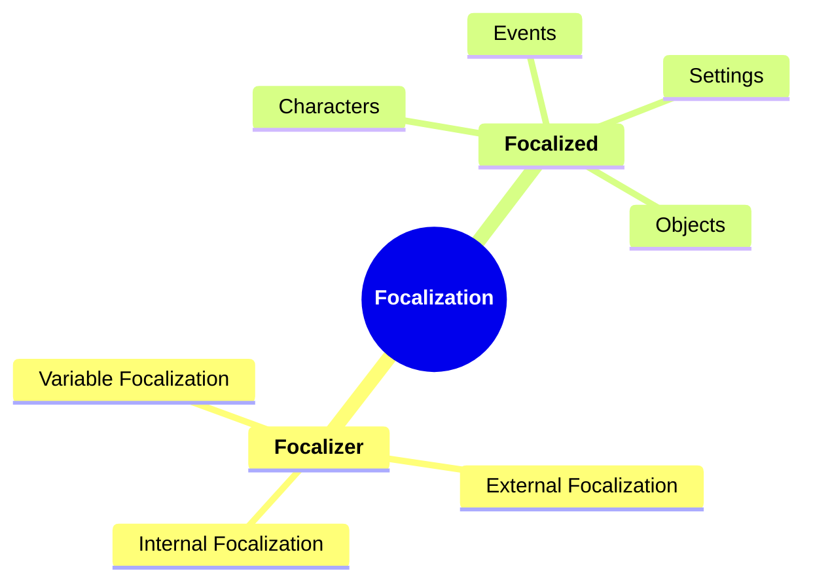

---

### 2. **Key Concepts**

#### 2.1. **Focalizer**

**Definition**:
   The *focalizer* is the entity whose perspective frames the narrative. This can be an internal character within the story (internal focalizer) or an external observer (external focalizer) whose viewpoint dictates what the reader sees and experiences.

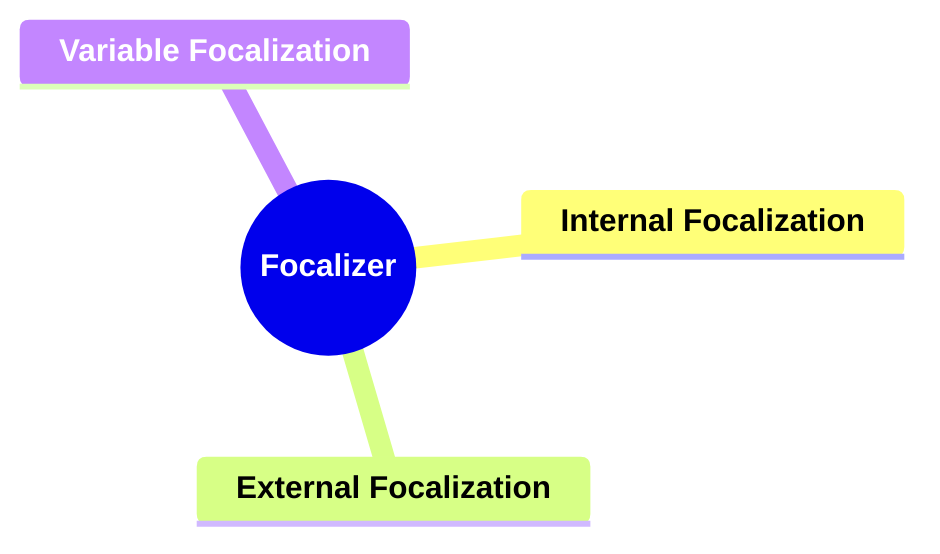

##### 2.1.1. **Components of Focalizer**

###### 2.1.1.1. **Internal Focalization**
- **Definition**: A character within the story, providing a subjective view of events based on their thoughts, feelings, and experiences.

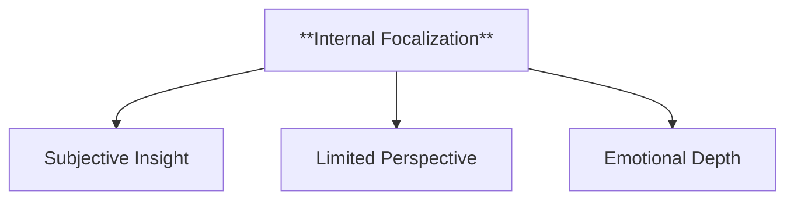

  - **Characteristics**
    - **Subjective Insight**: Offers a personal and emotionally colored interpretation of events.
    - **Limited Perspective**: Restricts the narrative to the focal character’s knowledge.
    - **Emotional Depth**: Reveals the character’s motivations and desires, fostering connection with readers.

---

###### 2.1.1.2. **External Focalization**
- **Definition**: An observer or narrator who is not part of the story’s events but presents them from an outside, detached perspective.

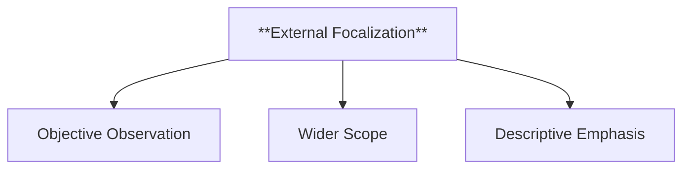

  - **Characteristics**
    - **Objective Observation**: Describes actions and dialogue neutrally.
    - **Wider Scope**: Provides an overview beyond any single character’s awareness.
    - **Descriptive Emphasis**: Focuses on external details and setting.

---

###### 2.1.1.3. **Variable Focalization**
- **Definition**: The shifting of focalization between different characters or perspectives throughout the narrative.

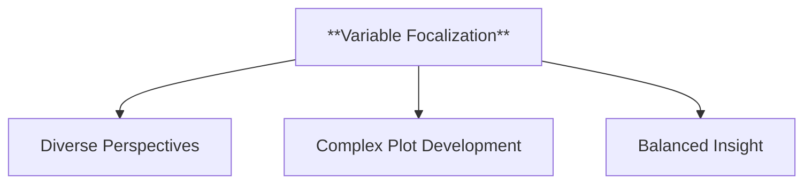

  - **Characteristics**
    - **Diverse Perspectives**: Presents varied viewpoints.
    - **Complex Plot Development**: Shows multiple character perceptions, adding intrigue.
    - **Balanced Insight**: Weaves multiple focal points for a comprehensive view.

---

#### 2.2. **Focalized**

**Definition**:
   The *focalized* refers to the object, event, or character being perceived by the focalizer. The focalizer’s perception shapes how the focalized is presented in the narrative.

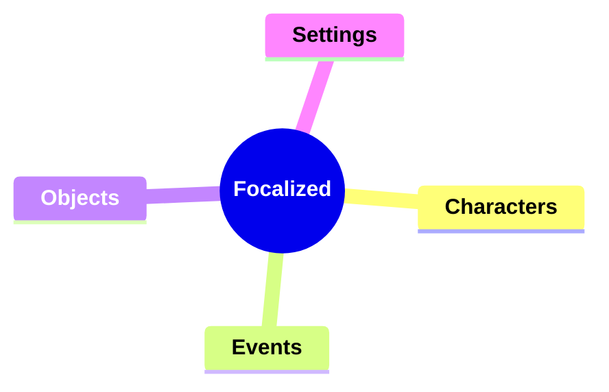

##### 2.2.1. **Components of Focalized**

###### 2.2.1.1. **Characters**
- **Definition**: The focalized can be a character whose actions, thoughts, or appearance are filtered through the focalizer's perspective.

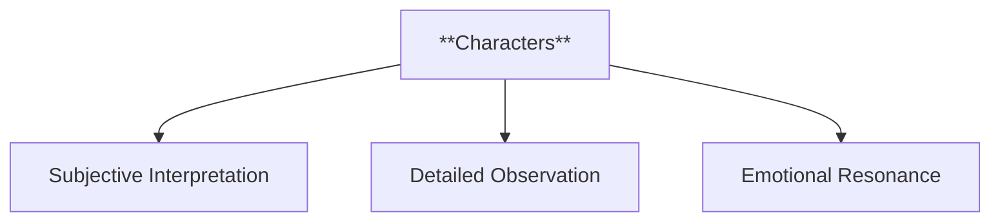

  - **Characteristics**
    - **Subjective Interpretation**: Character portrayal varies with the focalizer’s relationship or bias.
    - **Detailed Observation**: Highlights specific traits or actions.
    - **Emotional Resonance**: Influences reader connection through personal or external lens.

---

###### 2.2.1.2. **Events**
- **Definition**: A specific event or action in the narrative, focalized through a character or external narrator.

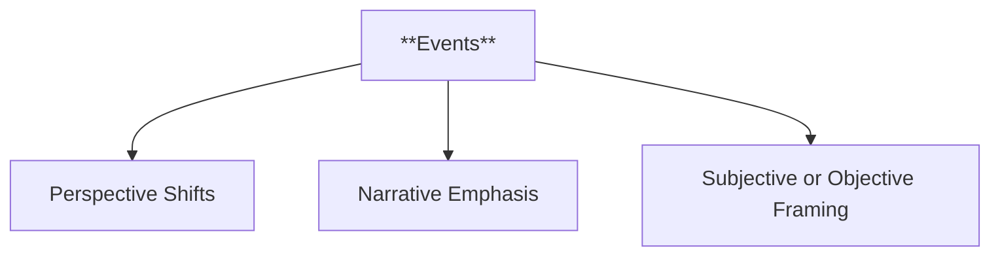

  - **Characteristics**
    - **Perspective Shifts**: Same event perceived differently depending on the focalizer.
    - **Narrative Emphasis**: Focalizer’s focus influences perceived significance.
    - **Subjective or Objective Framing**: Events can be biased or neutral.

---

###### 2.2.1.3. **Objects**

- **Definition**: Elements within the environment that the focalizer emphasizes, adding meaning and shaping narrative perception.

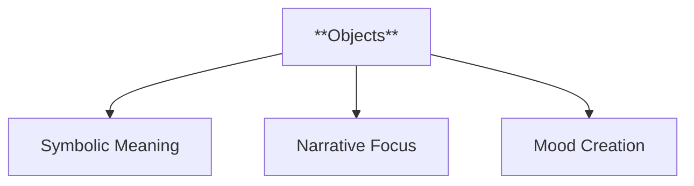

  - **Characteristics**
    - **Symbolic Meaning**: Objects take on thematic importance.
    - **Narrative Focus**: Emphasis on key details enhances plot or character.
    - **Mood Creation**: Highlights objects to evoke emotions and set tone.

---

###### 2.2.1.4. **Settings**

- **Definition**: The broader environment or background that frames the narrative, influenced by the focalizer’s perspective.

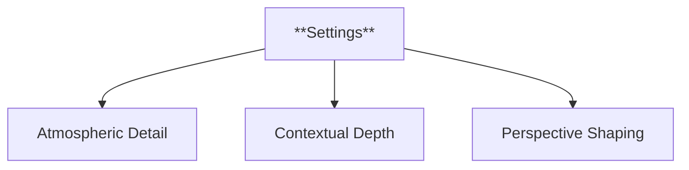

  - **Characteristics**
    - **Atmospheric Detail**: Enhances ambiance and sensory experience.
    - **Contextual Depth**: Reinforces themes and characters’ experiences.
    - **Perspective Shaping**: Alters reader perception of the world through focalizer’s lens.

---

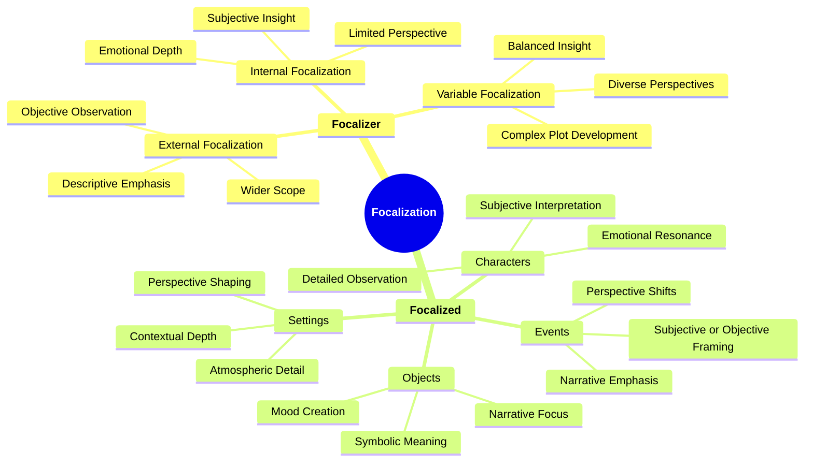
---

### 3. Implications of Focalization

**Impact on Narrative Theory**:
   Rimmon-Kenan’s *Focalization Framework* has significantly influenced narrative theory by providing a method for analyzing how perspectives shape the flow of information and reader interpretation. It is particularly useful for dissecting modern and postmodern narratives where fragmented or multiple viewpoints challenge traditional storytelling.

**Application Across Genres and Media**:
   This framework is applicable across various media, from literature to film and digital storytelling. In film, for instance, focalization can be paralleled with point-of-view shots, guiding the audience’s perspective. In interactive media, the player’s control over focalization shapes their engagement with the narrative.

**Supporting Information**:
   - **Interdisciplinary Influence**: Rimmon-Kenan’s concepts have impacted fields like cognitive science, media studies, and film analysis, where understanding perspective helps explore perception, attention, and narrative focus.
   - **Critiques and Further Development**: Critics argue that postmodern narratives blur the lines between focalizer and focalized, challenging the clear application of the framework. However, it remains a valuable tool for understanding how perspective shapes meaning in traditional and experimental narratives.

---
