- [1. **Title: Greimas's Actantial Model**](#1-title-greimass-actantial-model)
- [2. **Key Concepts**](#2-key-concepts)
  - [2.1. **Subject**](#21-subject)
    - [2.1.1. **Components of Subject**](#211-components-of-subject)
      - [2.1.1.1. **Central Role**](#2111-central-role)
      - [2.1.1.2. **Agency**](#2112-agency)
      - [2.1.1.3. **Development**](#2113-development)
  - [2.2. **Object**](#22-object)
    - [2.2.1. **Components of Object**](#221-components-of-object)
      - [2.2.1.1. **Motivational Force**](#2211-motivational-force)
      - [2.2.1.2. **Symbolic Meaning**](#2212-symbolic-meaning)
      - [2.2.1.3. **Conflict Catalyst**](#2213-conflict-catalyst)
  - [2.3. **Sender**](#23-sender)
    - [2.3.1. **Components of Sender**](#231-components-of-sender)
      - [2.3.1.1. **External Sender**](#2311-external-sender)
      - [2.3.1.2. **Internal Sender**](#2312-internal-sender)
  - [2.4. **Receiver**](#24-receiver)
    - [2.4.1. **Components of Receiver**](#241-components-of-receiver)
      - [2.4.1.1. **External Receiver**](#2411-external-receiver)
      - [2.4.1.2. **Internal Receiver**](#2412-internal-receiver)
  - [2.5. **Helper**](#25-helper)
    - [2.5.1. **Components of Helper**](#251-components-of-helper)
      - [2.5.1.1. **Character Helper**](#2511-character-helper)
      - [2.5.1.2. **Abstract Helper**](#2512-abstract-helper)
  - [2.6. **Opponent**](#26-opponent)
    - [2.6.1. **Components of Opponent**](#261-components-of-opponent)
      - [2.6.1.1. **Antagonist Opponent**](#2611-antagonist-opponent)
      - [2.6.1.2. **Abstract Opponent**](#2612-abstract-opponent)
- [3. Implications of **Actantial Model**](#3-implications-of-actantial-model)

---
### 1. **Title: Greimas's Actantial Model**

**Actantial Model**:
   **Definition**: Algirdas Julien Greimas’s *Actantial Model* is a structuralist framework for analyzing the roles and functions of characters in a narrative. The model identifies six essential actants—Subject, Object, Sender, Receiver, Helper, and Opponent—that interact to form the core of the narrative. These actants can represent characters, abstract concepts, or collective entities, making the model versatile for analyzing diverse narrative structures across various media.

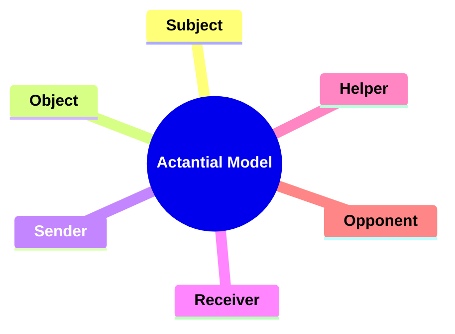

---

### 2. **Key Concepts**

#### 2.1. **Subject**

**Definition**:
   The *Subject* is the character or entity pursuing a goal.

##### 2.1.1. **Components of Subject**

###### 2.1.1.1. **Central Role**
- **Definition**: The Subject’s actions and decisions are crucial to moving the plot forward, forming the core of the narrative.

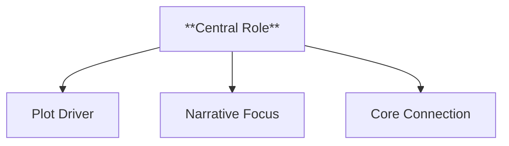

  - **Characteristics**
    - **Plot Driver**: The Subject’s choices and actions set the story in motion and keep it progressing, establishing the foundation for conflict and resolution.
    - **Narrative Focus**: The story often revolves around the Subject’s journey, making them the focal point for character interactions and key events.
    - **Core Connection**: The Subject’s involvement ensures that their motivations and goals are closely tied to the main themes and direction of the narrative.

###### 2.1.1.2. **Agency**
- **Definition**: Demonstrates active pursuit and determination, embodying the drive to overcome challenges in reaching their goal.

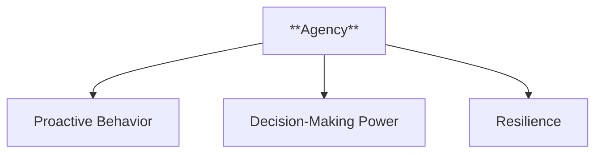

  - **Characteristics**
    - **Proactive Behavior**: Takes initiative rather than passively reacting to events, showing strength and commitment in the face of obstacles.
    - **Decision-Making Power**: Exercises control over their path, influencing the story through their choices and adaptability.
    - **Resilience and Drive**: Embodies perseverance, displaying the determination needed to push forward despite setbacks and challenges.

###### 2.1.1.3. **Development**
- **Definition**: Often experiences growth or change throughout the pursuit, reflecting personal evolution and resilience.

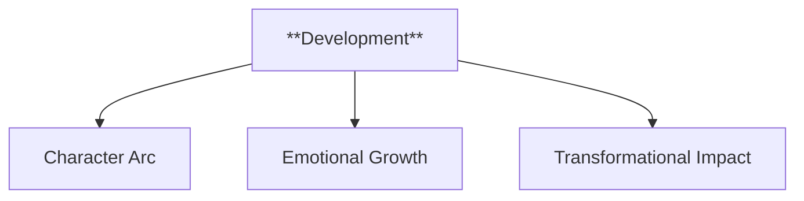

  - **Characteristics**
    - **Character Arc**: Shows progression, with the Subject learning from experiences and evolving in response to their journey.
    - **Emotional Growth**: Develops deeper emotional awareness or maturity, adding complexity to their character.
    - **Transformational Impact**: The pursuit shapes the Subject, leaving them changed by the end of the narrative, reinforcing themes of resilience and transformation.

---

#### 2.2. **Object**

**Definition**:
   The *Object* is the goal or desire that the Subject seeks to obtain or achieve.

##### 2.2.1. **Components of Object**  

###### 2.2.1.1. **Motivational Force**
- **Definition**: Serves as the primary purpose behind the Subject’s actions, giving the narrative direction and focus.

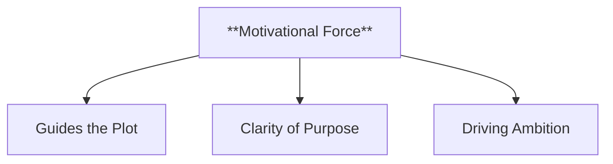

  - **Characteristics**
    - **Guides the Plot**: Provides the reason for the Subject’s journey or actions, setting the story in motion and maintaining its momentum.
    - **Clarity of Purpose**: Offers the Subject a clear goal, ensuring that their actions align with the overall direction of the narrative.
    - **Driving Ambition**: Instills a sense of urgency and passion in the Subject, making their pursuit compelling and engaging for the reader.

###### 2.2.1.2. **Symbolic Meaning**
- **Definition**: Can represent more than just a physical goal, embodying themes such as love, power, freedom, or knowledge.

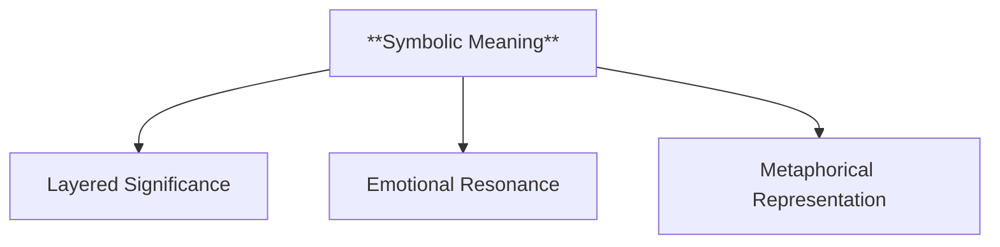

  - **Characteristics**
    - **Layered Significance**: Holds deeper thematic value, reinforcing the narrative’s underlying messages or moral questions.
    - **Emotional Resonance**: Adds richness to the story by connecting the Object to universal themes that resonate with the reader.
    - **Metaphorical Representation**: Transcends its literal definition, symbolizing broader concepts that reflect the protagonist’s journey or personal growth.

###### 2.2.1.3. **Conflict Catalyst**
- **Definition**: The pursuit of the Object often leads to challenges, rivalries, and obstacles that create narrative tension and drive character interaction.

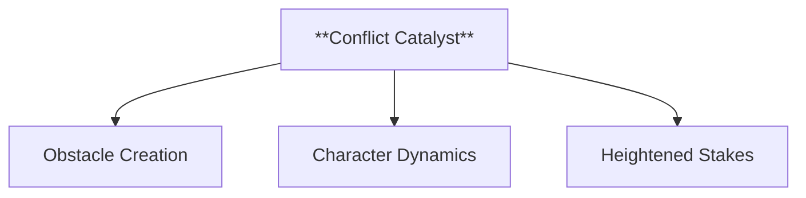

  - **Characteristics**
    - **Obstacle Creation**: Introduces conflicts or challenges that test the Subject’s resolve and add complexity to the plot.
    - **Character Dynamics**: Sparks interactions, alliances, and rivalries among characters, shaping relationships and narrative depth.
    - **Heightened Stakes**: Amplifies the tension and risk within the story, making the outcome of the pursuit crucial to the Subject and those around them.

---

#### 2.3. **Sender**

**Definition**:
   The *Sender* is the entity that initiates or motivates the Subject’s quest by assigning a mission, desire, or challenge.

##### 2.3.1. **Components of Sender**  

###### 2.3.1.1. **External Sender**
- **Definition**: A character, group, or authority outside the Subject’s inner world that provides the objective or quest.

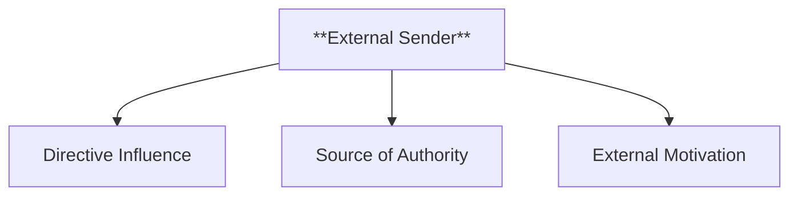

  - **Characteristics**
    - **Directive Influence**: Acts as a catalyst for the Subject’s journey by assigning or initiating the quest, giving structure to the plot.
    - **Source of Authority**: Often holds a position of power or significance, lending legitimacy and importance to the Subject’s pursuit.
    - **External Motivation**: Provides an objective that is separate from the Subject’s inner desires, creating a sense of duty or obligation that propels the narrative forward.

###### 2.3.1.2. **Internal Sender**
- **Definition**: An internal force, such as personal desire, conscience, or morality, that motivates the Subject to pursue the Object.

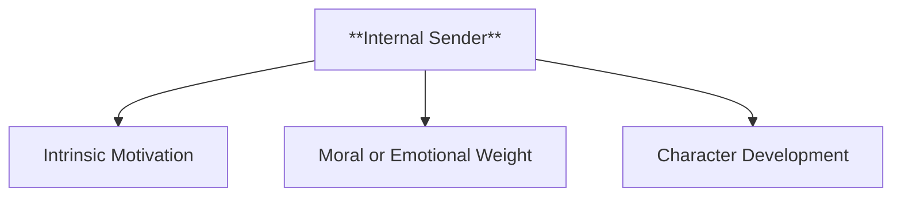

  - **Characteristics**
    - **Intrinsic Motivation**: The Subject’s pursuit is driven by their own internal desires, beliefs, or emotional needs, giving depth to their character.
    - **Moral or Emotional Weight**: Adds complexity as the motivation often stems from personal values, guilt, ambition, or a sense of justice.
    - **Character Development**: Encourages growth and introspection as the Subject confronts their inner conflicts and aligns their actions with their principles or goals.

---

#### 2.4. **Receiver**

**Definition**:
   The *Receiver* is the entity that ultimately benefits from the success of the Subject's quest. It is the target or beneficiary of the successful resolution of the narrative’s main goal.

##### 2.4.1. **Components of Receiver**  

###### 2.4.1.1. **External Receiver**
- **Definition**: A person, community, or society that stands to gain from the Subject's success.

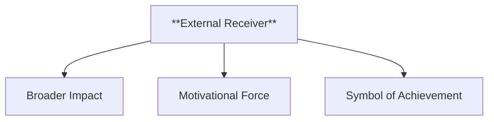

  - **Characteristics**
    - **Broader Impact**: The Subject’s actions have consequences that extend beyond personal gain, affecting others and adding stakes to the narrative.
    - **Motivational Force**: Provides the Subject with additional reasons to pursue the quest, driven by a sense of duty, responsibility, or altruism.
    - **Symbol of Achievement**: Represents the larger purpose or goal of the Subject’s quest, showing that success benefits more than just the protagonist, often reinforcing themes of unity or social justice.

###### 2.4.1.2. **Internal Receiver**
- **Definition**: The Subject themselves, who may benefit directly from completing their own quest.

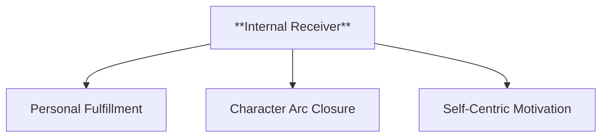

  - **Characteristics**
    - **Personal Fulfillment**: Highlights the Subject’s emotional or psychological growth, emphasizing self-discovery, redemption, or personal victory.
    - **Character Arc Closure**: Marks the culmination of the Subject’s journey, showing how achieving their goal leads to transformation or resolution.
    - **Self-Centric Motivation**: Centers the quest on

 the Subject’s own needs or desires, adding depth by exploring their inner motivations and how they evolve through the story.

---

#### 2.5. **Helper**

**Definition**:
   The *Helper* is the character, force, or entity that assists the Subject in achieving their goal. Helpers offer support, resources, or guidance that aid the Subject in overcoming obstacles.

##### 2.5.1. **Components of Helper**  

###### 2.5.1.1. **Character Helper**
- **Definition**: A person or group that directly aids the Subject in their quest.

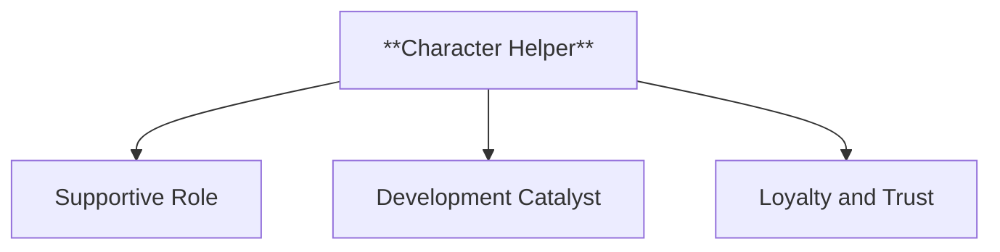

  - **Characteristics**
    - **Supportive Role**: Provides practical assistance, guidance, or companionship, reinforcing the Subject’s ability to overcome obstacles.
    - **Development Catalyst**: Influences the Subject’s growth by challenging or inspiring them, adding depth to character interactions and relationships.
    - **Loyalty and Trust**: Often embodies traits of loyalty, friendship, or mentorship, contributing to the emotional richness of the narrative and strengthening the hero’s resolve.

###### 2.5.1.2. **Abstract Helper**
- **Definition**: Forces such as luck, destiny, or magical items that indirectly assist the Subject.

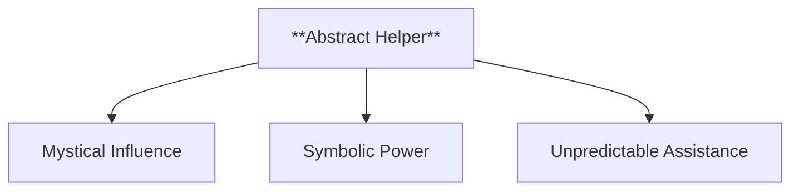

  - **Characteristics**
    - **Mystical Influence**: Operates beyond the Subject’s control, suggesting that fate or supernatural elements play a role in their success.
    - **Symbolic Power**: Represents larger themes such as divine intervention, the balance of good and evil, or the hero’s worthiness.
    - **Unpredictable Assistance**: Adds an element of surprise and intrigue, as these forces can manifest at unexpected times to alter the course of the quest.

---

#### 2.6. **Opponent**

**Definition**:
   The *Opponent* is the entity that creates obstacles, conflicts, or opposition to the Subject’s quest. Opponents hinder the Subject’s progress and serve as the primary source of narrative tension.

##### 2.6.1. **Components of Opponent**  

###### 2.6.1.1. **Antagonist Opponent**
- **Definition**: A specific character or group that directly opposes the Subject.

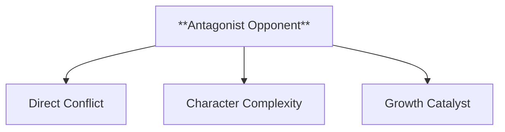

  - **Characteristics**
    - **Direct Conflict**: Engages in overt actions to thwart the Subject’s progress, creating clear and tangible obstacles in the narrative.
    - **Character Complexity**: Often has their own motivations, backstory, and goals, which can make them compelling and multi-dimensional adversaries.
    - **Catalyst for Growth**: Forces the Subject to adapt, grow, and push their limits, driving the character’s development and contributing to the overall tension of the story.

###### 2.6.1.2. **Abstract Opponent**
- **Definition**: Forces such as fate, internal conflict, or societal norms that indirectly create challenges for the Subject.

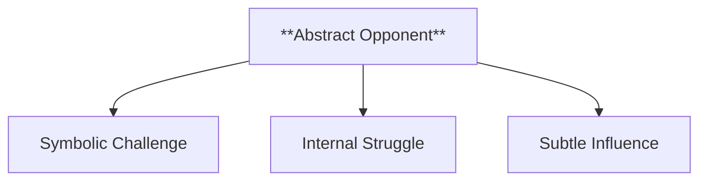

  - **Characteristics**
    - **Symbolic Challenge**: Represents broader themes like destiny, existential dilemmas, or cultural expectations, adding layers to the story’s meaning.
    - **Internal Struggle**: Often involves the Subject battling their own fears, doubts, or moral dilemmas, highlighting character depth and inner conflict.
    - **Subtle Influence**: Operates in the background, shaping the Subject’s journey and choices through less direct means, such as environmental factors or societal pressure.

---

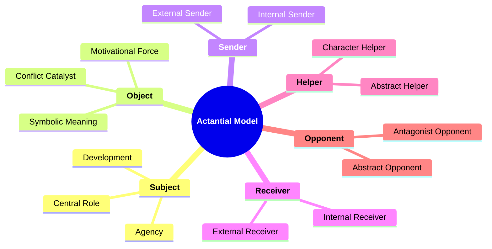
---

### 3. Implications of **Actantial Model**

**Impact on Structuralist Narratology**:
   Greimas’s Actantial Model has significantly influenced structuralist narratology by providing a systematic way to analyze the functions and roles of characters in narratives. It emphasizes the underlying structure of stories and highlights the relationships between different narrative elements.

**Application Across Media**:
   The actantial model applies to various forms of media, including literature, film, theater, and video games. Its ability to represent characters and abstract entities as actants makes it adaptable for diverse narratives.

**Supporting Information**:
   - **Interdisciplinary Influence**: The model has influenced fields such as semiotics and communication studies by offering a universal framework for understanding how stories operate in different cultural contexts.
   - **Critiques**: Some argue that the model oversimplifies characters by reducing them to functional roles, but it remains a foundational tool for analyzing narrative structures.

---
