- [1. Title: **Tomashevsky's Narrative Devices Framework**](#1-title-tomashevskys-narrative-devices-framework)
- [2. Key Concepts](#2-key-concepts)
  - [2.1. Irony](#21-irony)
    - [2.1.1. **Components of Irony**](#211-components-of-irony)
      - [2.1.1.1. **Verbal Irony**](#2111-verbal-irony)
      - [2.1.1.2. **Situational Irony**](#2112-situational-irony)
      - [2.1.1.3. **Dramatic Irony**](#2113-dramatic-irony)
  - [2.2. Allegory](#22-allegory)
    - [2.2.1. **Components of Allegory**](#221-components-of-allegory)
      - [2.2.1.1. **Moral Allegory**](#2211-moral-allegory)
      - [2.2.1.2. **Political Allegory**](#2212-political-allegory)
      - [2.2.1.3. **Religious Allegory**](#2213-religious-allegory)
  - [2.3. Symbolism](#23-symbolism)
    - [2.3.1. **Components of Symbolism**](#231-components-of-symbolism)
      - [2.3.1.1. **Personal Symbolism**](#2311-personal-symbolism)
      - [2.3.1.2. **Cultural Symbolism**](#2312-cultural-symbolism)
      - [2.3.1.3. **Universal Symbolism**](#2313-universal-symbolism)
- [3. Implications of Tomashevsky’s Narrative Devices Framework](#3-implications-of-tomashevskys-narrative-devices-framework)

---

---

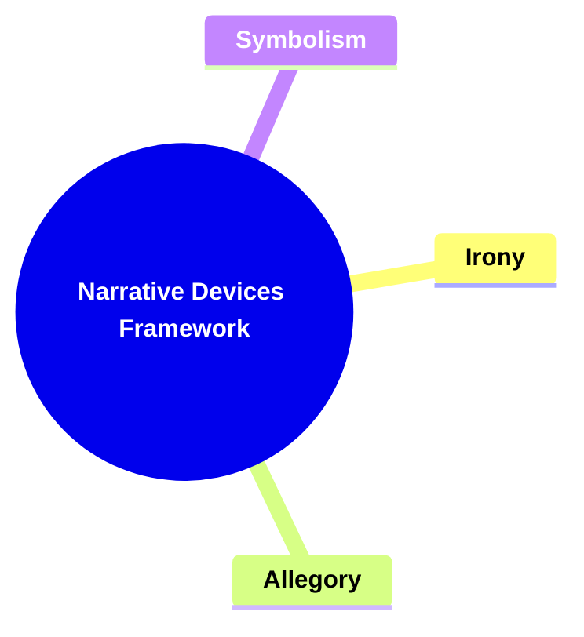

---

### 1. Title: **Tomashevsky's Narrative Devices Framework**

**Narrative Devices**:
   **Definition**: Tomashevsky studied various narrative devices, such as irony, allegory, and symbolism, and analyzed how they shape the reader’s experience. These devices add layers of meaning, complexity, and depth to narratives, making them more engaging and open to interpretation.

---

### 2. Key Concepts

#### 2.1. Irony

**Definition**:
   Irony is a narrative device that creates a contrast between expectations and reality, or between what is said and what is meant. It often leads to humor, tension, or critique by highlighting discrepancies in the narrative.

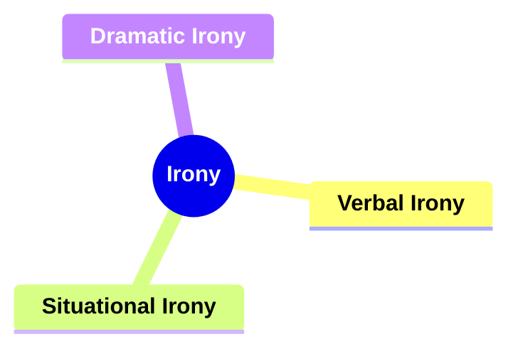

##### 2.1.1. **Components of Irony**

###### 2.1.1.1. **Verbal Irony**
  - **Definition**: When the intended meaning of a statement contrasts with its literal meaning.

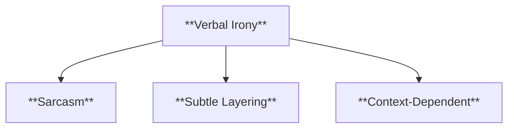

  - **Characteristics**
    - **Sarcasm**: Often used to mock or convey contempt, adding humor or tension to the dialogue.
    - **Subtle Layering**: Creates an additional layer of meaning, prompting readers to think critically about what is truly being conveyed.
    - **Context-Dependent**: The effectiveness of verbal irony relies on the context and the reader’s or character’s ability to recognize it.

###### 2.1.1.2. **Situational Irony**
  - **Definition**: When there is a discrepancy between what is expected to happen and what actually occurs.

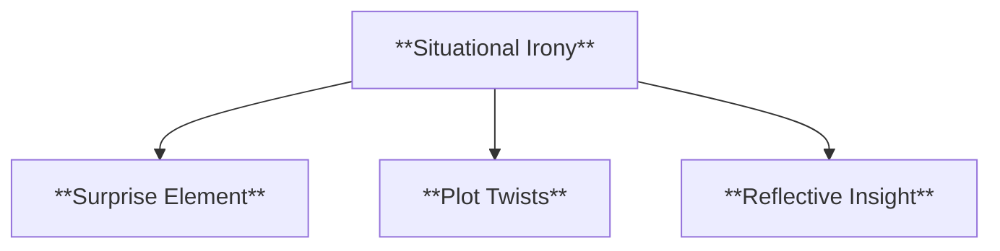

  - **Characteristics**
    - **Surprise Element**: Evokes surprise or shock by subverting readers’ or characters’ expectations.
    - **Plot Twists**: Often leads to unexpected outcomes that enhance the story’s complexity or thematic depth.
    - **Reflective Insight**: Encourages readers to reconsider assumptions and the nature of fate or coincidence.

###### 2.1.1.3. **Dramatic Irony**
  - **Definition**: When the audience or reader knows something that the characters do not, creating tension or humor.

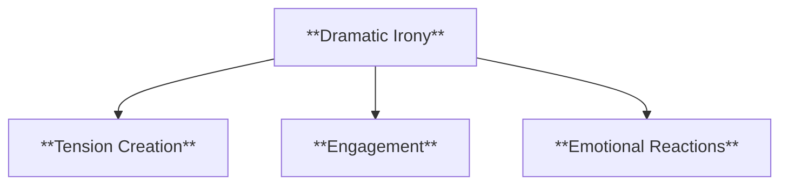

  - **Characteristics**
    - **Tension Creation**: Builds suspense as readers anticipate how and when characters will discover the truth.
    - **Engagement**: Keeps readers invested as they watch events unfold with knowledge that the characters lack.
    - **Emotional Reactions**: Elicits empathy, frustration, or humor as readers witness characters making uninformed decisions.

---

#### 2.2. Allegory

**Definition**:
   Allegory is a narrative technique in which characters, events, or settings symbolize broader abstract ideas or moral, political, or social messages. It often uses extended metaphors to convey a deeper or hidden meaning throughout the text.

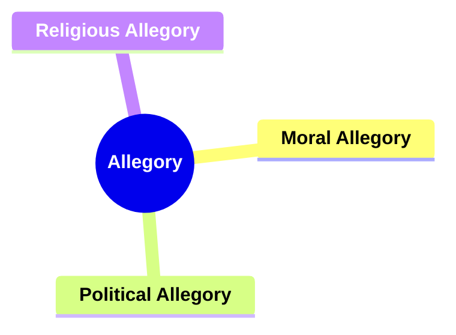

##### 2.2.1. **Components of Allegory**

###### 2.2.1.1. **Moral Allegory**
  - **Definition**: A story that teaches a moral lesson.

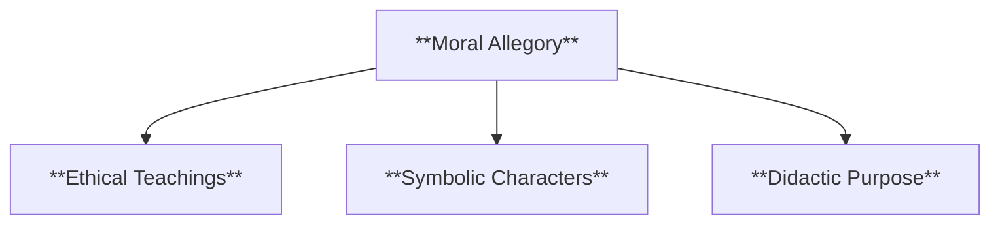

  - **Characteristics**
    - **Ethical Teachings**: Focuses on imparting lessons related to right and wrong, guiding reader behavior or beliefs.
    - **Symbolic Characters**: Uses characters and situations that embody moral virtues or vices.
    - **Didactic Purpose**: Aims to instruct and inspire readers toward a better understanding of moral values.

###### 2.2.1.2. **Political Allegory**
  - **Definition**: A narrative that represents political ideas or events.

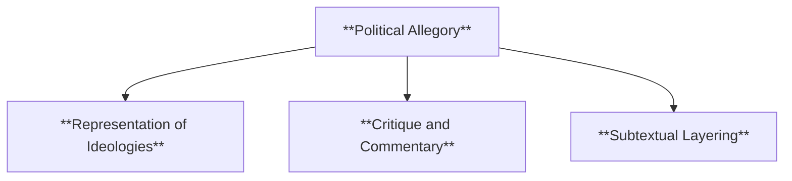

  - **Characteristics**
    - **Representation of Ideologies**: Portrays political figures, movements, or conflicts through metaphorical storytelling.
    - **Critique and Commentary**: Often critiques political systems or leaders, offering insight into real-world issues.
    - **Subtextual Layering**: Requires readers to draw parallels between the story and actual political contexts.

###### 2.2.1.3. **Religious Allegory**
  - **Definition**: A story that represents religious principles or beliefs.

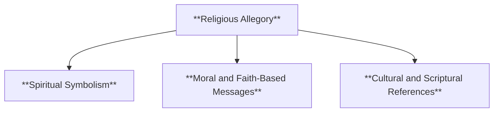

  - **Characteristics**
    - **Spiritual Symbolism**: Uses characters and plot elements to symbolize religious themes or teachings.
    - **Moral and Faith-Based Messages**: Encourages readers to reflect on spiritual principles and their application to life.
    - **Cultural and Scriptural References**: Often incorporates elements familiar to specific religious traditions to resonate with readers.

---

#### 2.3. Symbolism

**Definition**:
   Symbolism involves using objects, characters, or actions to represent abstract concepts or ideas, imbuing them with additional meaning beyond their literal interpretation. Symbols often carry thematic weight, contributing to the narrative’s depth and complexity.

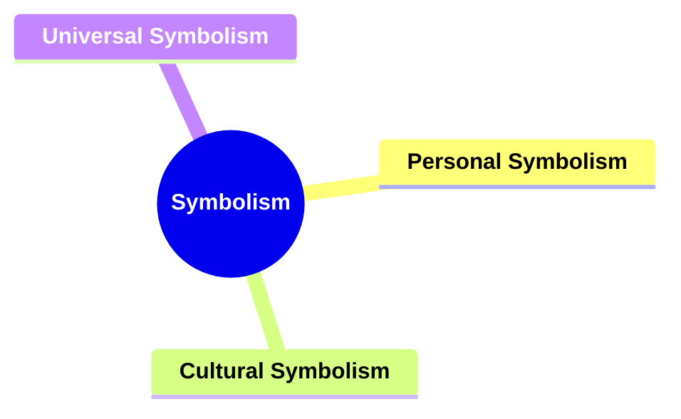

##### 2.3.1. **Components of Symbolism**

###### 2.3.1.1. **Personal Symbolism**
  - **Definition**: Objects or actions that carry significance for a specific character.

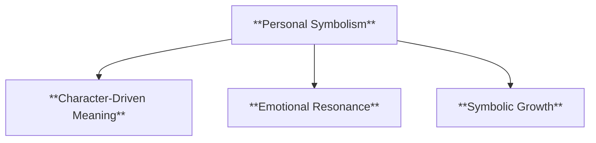

  - **Characteristics**
    - **Character-Driven Meaning**: Represents personal experiences or memories, adding depth to character development.
    - **Emotional Resonance**: Elicits strong emotional responses in both characters and readers by linking objects to personal stories.
    - **Symbolic Growth**: Evolves in meaning as the character’s journey progresses, reflecting their changes and growth.

###### 2.3.1.2. **Cultural Symbolism**
  - **Definition**: Symbols that represent larger cultural or societal themes.

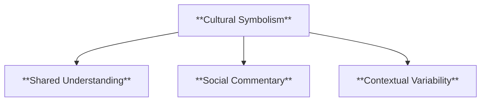

  - **Characteristics**
    - **Shared Understanding**: Relies on readers’ knowledge of cultural references to convey meaning effectively.
    - **Social Commentary**: Highlights societal values, struggles, or norms through symbolic representation.
    - **Contextual Variability**: May carry different meanings depending on the cultural background of the audience.

###### 2.3.1.3. **Universal Symbolism**
  - **Definition**: Symbols that carry meaning across different cultures and contexts.

  - **Characteristics**
    - **Timeless and Cross-Cultural**: Recognized and understood by people from diverse backgrounds.
    - **Archetypal Themes**: Embodies universal human experiences or emotions, such as light symbolizing hope or darkness representing fear.
    - **Broad Appeal**: Enhances the story’s relatability and thematic resonance by tapping into shared human understanding.

---

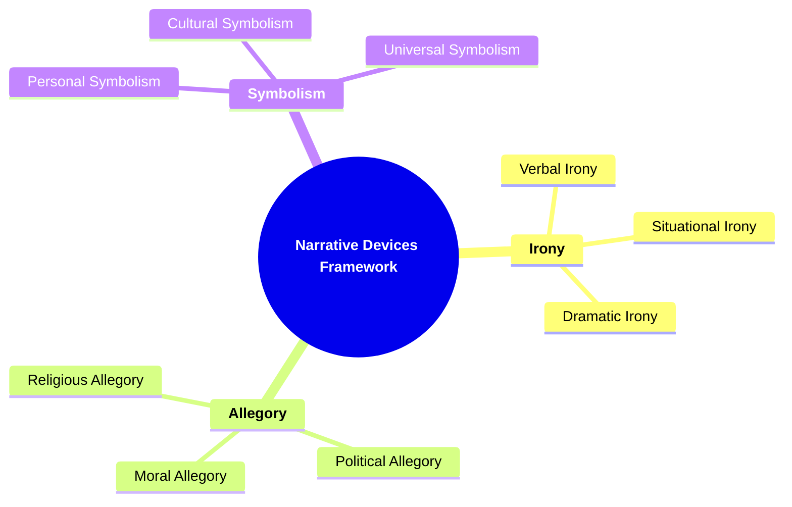
---
---

### 3. Implications of Tomashevsky’s Narrative Devices Framework

- Tomashevsky’s exploration of irony, allegory, and symbolism shows how these devices enhance the depth and richness of narrative texts. They invite readers to interpret and engage with multiple layers of meaning, creating more complex and resonant stories. This framework demonstrates that narrative devices are not just stylistic choices but essential tools for shaping how readers experience and understand literary works.

---
