- [1. Title: **Bakhtin's Heteroglossia Model**](#1-title-bakhtins-heteroglossia-model)
- [2. Key Concepts](#2-key-concepts)
  - [2.1. Plurality of Voices](#21-plurality-of-voices)
    - [2.1.1. **Components of Plurality of Voices**](#211-components-of-plurality-of-voices)
      - [2.1.1.1. **Social Stratification**](#2111-social-stratification)
      - [2.1.1.2. **Dialogic Interaction**](#2112-dialogic-interaction)
      - [2.1.1.3. **Polyphony**](#2113-polyphony)
      - [2.1.1.4. **Cultural Diversity**](#2114-cultural-diversity)
      - [2.1.1.5. **Ideological Diversity**](#2115-ideological-diversity)
      - [2.1.1.6. **Chronotopic Variation**](#2116-chronotopic-variation)
  - [2.2. Subversion of Authorial Voice](#22-subversion-of-authorial-voice)
    - [2.2.1. **Components of Subversion of Authorial Voice**](#221-components-of-subversion-of-authorial-voice)
      - [2.2.1.1. **Equal Weight to Character Voices**](#2211-equal-weight-to-character-voices)
      - [2.2.1.2. **Narrative Openness**](#2212-narrative-openness)
      - [2.2.1.3. **Decentralization of Authority**](#2213-decentralization-of-authority)
    - [2.2.2. Implications of Bakhtin's Heteroglossia](#222-implications-of-bakhtins-heteroglossia)

---

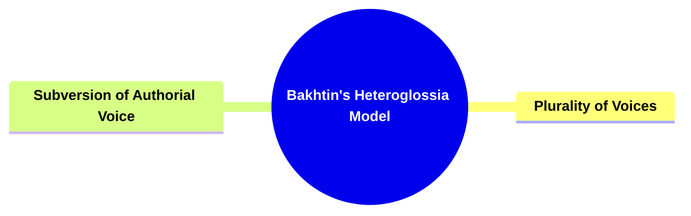

---

### 1. Title: **Bakhtin's Heteroglossia Model**

**Heteroglossia**:
**Definition**: Heteroglossia, a concept developed by Mikhail Bakhtin, is defined as the coexistence of multiple forms of speech or social languages within a single text. It reflects the diversity of voices, perspectives, and ideologies in society, which are brought into dialogue within the narrative. Heteroglossia is closely related to Bakhtin's broader theory of dialogism, which emphasizes the interaction and conflict between different voices in a text, rather than a single, unified narrative voice.

---

### 2. Key Concepts

#### 2.1. Plurality of Voices

**Definition**:
The concept of the plurality of voices within heteroglossia challenges the notion of a monologic or singular narrative voice. Instead of presenting a unified, authoritative perspective, heteroglossia emphasizes the presence of multiple, often conflicting voices within a text. These voices can represent different social classes, professions, ideologies, or cultural backgrounds, all interacting and competing within the narrative.

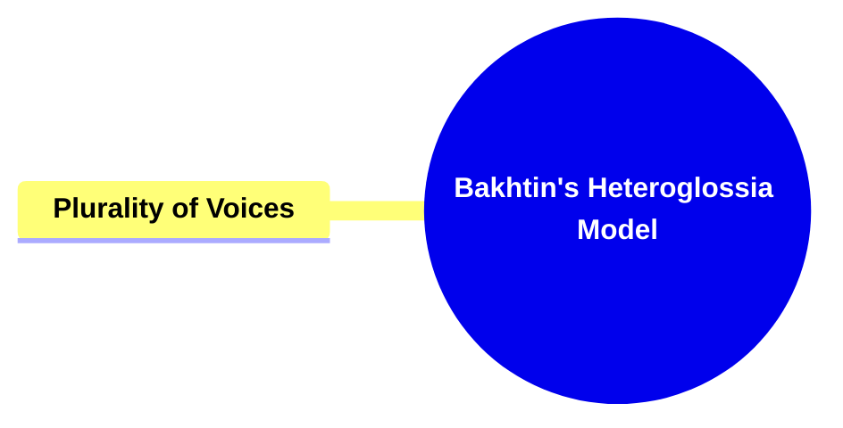

##### 2.1.1. **Components of Plurality of Voices**

###### 2.1.1.1. **Social Stratification**

- **Definition**: Representation of different social classes and groups, each with its own distinct language, worldview, and ideology.

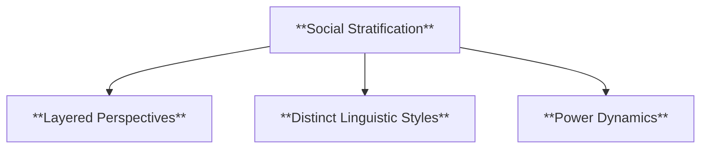

- **Characteristics**
  - **Layered Perspectives**: Depicts multiple social layers to highlight contrasts and interactions between different classes.
  - **Distinct Linguistic Styles**: Uses varied language and dialects to represent each social group’s unique identity.
  - **Power Dynamics**: Illustrates the relationships and tensions between social hierarchies.

###### 2.1.1.2. **Dialogic Interaction**

- **Definition**: Interplay and conflict between different voices, reflecting the dynamic nature of social discourse.

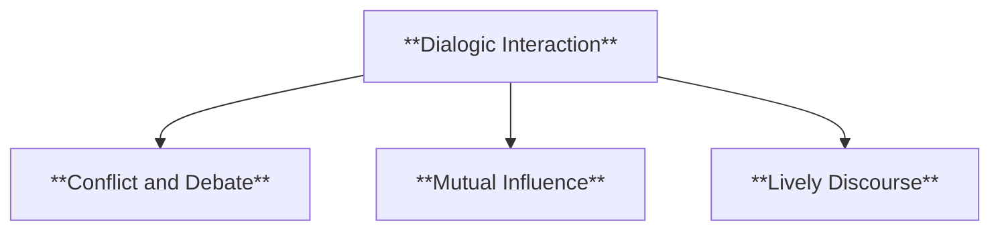

- **Characteristics**
  - **Conflict and Debate**: Shows how differing opinions clash and influence the narrative.
  - **Mutual Influence**: Demonstrates how voices within the narrative respond to and shape each other.
  - **Lively Discourse**: Creates a vibrant, dynamic narrative where multiple viewpoints coexist and interact.

###### 2.1.1.3. **Polyphony**

- **Definition**: Equal importance of multiple voices, each contributing to the narrative without subordination to a singular, authoritative voice.

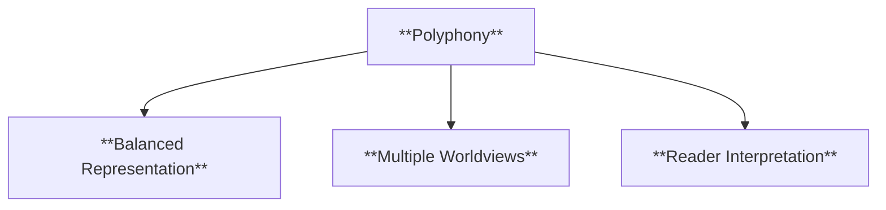

- **Characteristics**
  - **Balanced Representation**: No single voice dominates; each one holds equal weight in the narrative.
  - **Multiple Worldviews**: Emphasizes the diversity of perspectives within the story.
  - **Reader Interpretation**: Invites readers to navigate and interpret the interactions between voices themselves.

###### 2.1.1.4. **Cultural Diversity**

- **Definition**: The inclusion of multiple cultural perspectives, traditions, and practices within a narrative, providing a rich and nuanced portrayal of different ways of life.

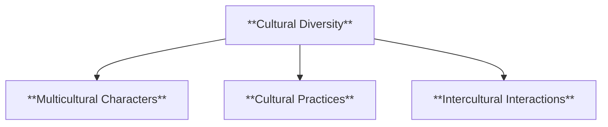

- **Characteristics**
  - **Multicultural Characters**: Features characters from various cultural backgrounds, bringing authenticity and varied perspectives to the narrative.
  - **Cultural Practices**: Depicts diverse cultural customs, rituals, and lifestyles, enhancing the depth of the story.
  - **Intercultural Interactions**: Explores interactions between characters of different cultural backgrounds, showing potential challenges and enriching mutual understanding.

###### 2.1.1.5. **Ideological Diversity**

- **Definition**: The representation of diverse ideological beliefs and values, highlighting the plurality of thought within the narrative.

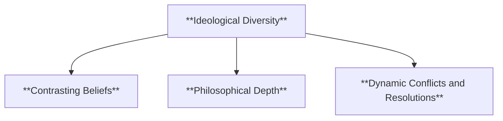

- **Characteristics**
  - **Contrasting Beliefs**: Introduces characters with different ideological stances, creating tension and enriching the storyline.
  - **Philosophical Depth**: Adds layers of meaning by allowing characters to reflect and debate ideological viewpoints.
  - **Dynamic Conflicts and Resolutions**: Demonstrates how varying ideologies can lead to conflict or coexistence, illustrating the complexities of human belief systems.

###### 2.1.1.6. **Chronotopic Variation**

- **Definition**: Different times and places represented in the narrative, each with its own distinct language and perspective.

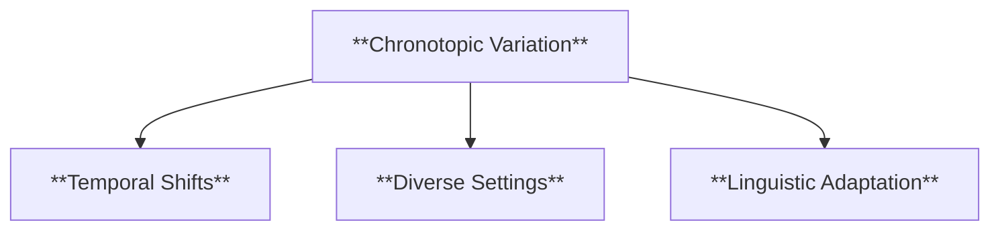

- **Characteristics**
  - **Temporal Shifts**: Integrates various historical periods and settings, each adding unique context.
  - **Diverse Settings**: Uses different places to create contrasting backdrops that influence the story’s themes and perspectives.
  - **Linguistic Adaptation**: Adapts language and tone to reflect the specific time and place of each setting.

---

#### 2.2. Subversion of Authorial Voice

**Definition**:
In a heteroglossic narrative, the author often minimizes their own voice in favor of letting characters' voices dominate the text. This technique allows the plurality of voices to come to the forefront, creating a more dialogic and multi-faceted text

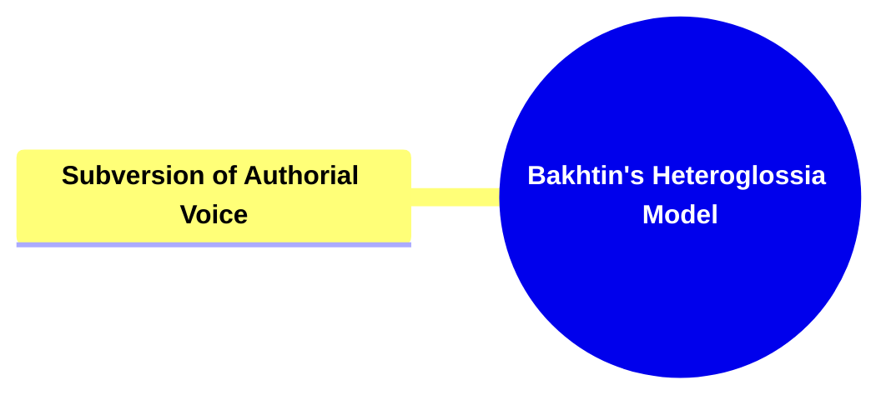

##### 2.2.1. **Components of Subversion of Authorial Voice**

###### 2.2.1.1. **Equal Weight to Character Voices**

- **Definition**: The author’s voice does not dominate but interacts with characters' voices, allowing each perspective to contribute equally.

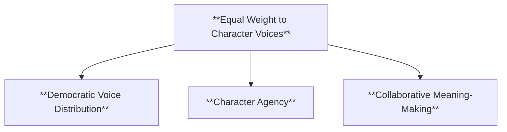

- **Characteristics**
  - **Democratic Voice Distribution**: Ensures that all character voices are represented without one overshadowing the others.
  - **Character Agency**: Gives characters the freedom to express their own thoughts and ideas independently.
  - **Collaborative Meaning-Making**: Readers interpret the story based on the dialogue and interaction between character voices.

###### 2.2.1.2. **Narrative Openness**

- **Definition**: The narrative remains open to multiple interpretations, resisting a single authoritative viewpoint.

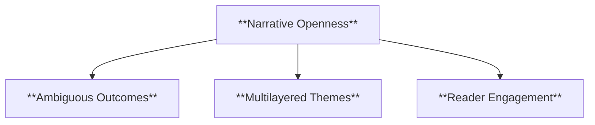

- **Characteristics**
  - **Ambiguous Outcomes**: Ends with unresolved or open-ended conclusions, inviting different interpretations.
  - **Multilayered Themes**: Explores various thematic possibilities without imposing one definitive answer.
  - **Reader Engagement**: Encourages readers to draw their own conclusions and explore different interpretations.

###### 2.2.1.3. **Decentralization of Authority**

- **Definition**: The author decentralizes control over the narrative’s meaning, allowing the interplay of various voices to shape the story’s interpretation.

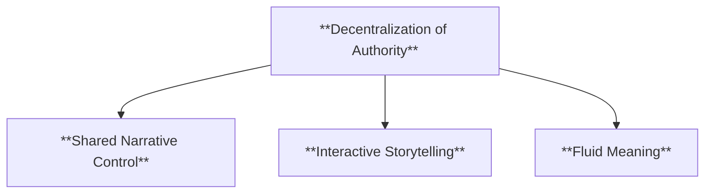

- **Characteristics**
  - **Shared Narrative Control**: Shifts narrative authority to include multiple voices and perspectives.
  - **Interactive Storytelling**: Invites readers to actively engage with the text and contribute to its interpretation.
  - **Fluid Meaning**: Maintains a story that evolves based on the reader's perception of the voices involved.

---

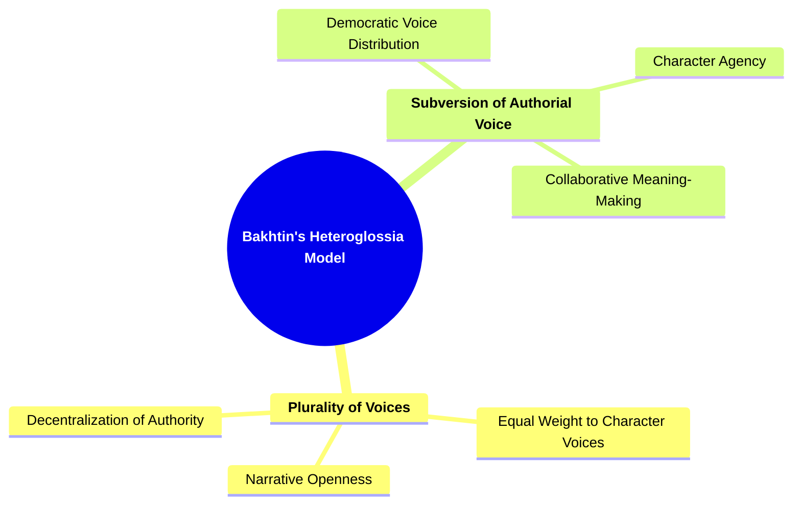

---

##### 2.2.2. Implications of Bakhtin's Heteroglossia

**Key Insight or Implication**:
Bakhtin’s heteroglossia model provides a powerful framework for analyzing narratives that feature a diversity of voices. It challenges the traditional view of a singular, authoritative narrative voice and instead presents the text as a site of dialogue between competing perspectives.

**Collaborative or Future-Oriented Insight**:
As narratives evolve in the digital and globalized world, Bakhtin’s heteroglossia model offers a valuable tool for analyzing how modern narratives incorporate multiple voices and perspectives. It encourages scholars and creators to explore how cultural, ideological, and social diversity can shape narrative meaning.

---
