- [1. Title: **Barthes's Pleasure of the Text Framework**](#1-title-barthess-pleasure-of-the-text-framework)
- [2. Key Concepts](#2-key-concepts)
  - [2.1. Readerly (Lisible) Texts](#21-readerly-lisible-texts)
    - [2.1.1. **Components of Readerly (Lisible) Texts**](#211-components-of-readerly-lisible-texts)
      - [2.1.1.1. **Linear Narrative**](#2111-linear-narrative)
      - [2.1.1.2. **Fixed Meaning**](#2112-fixed-meaning)
      - [2.1.1.3. **Predictability**](#2113-predictability)
      - [2.1.1.4. **Passive Consumption**](#2114-passive-consumption)
  - [2.2. Writerly (Scriptible) Texts](#22-writerly-scriptible-texts)
    - [2.2.1. **Components of Writerly (Scriptable) Texts**](#221-components-of-writerly-scriptable-texts)
      - [2.2.1.1. **Non-Linear Narrative**](#2211-non-linear-narrative)
      - [2.2.1.2. **Multiple Interpretations**](#2212-multiple-interpretations)
      - [2.2.1.3. **Unpredictability**](#2213-unpredictability)
      - [2.2.1.4. **Active Participation**](#2214-active-participation)
- [3. Comparative Analysis](#3-comparative-analysis)
- [4. Implications of Barthes's Framework](#4-implications-of-barthess-framework)

---

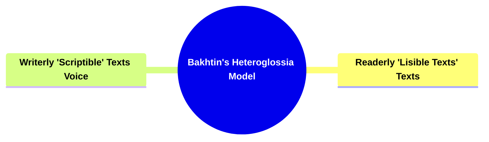

---

---

### 1. Title: **Barthes's Pleasure of the Text Framework**

**The Pleasure of the Text**:
**Definition**: In _"The Pleasure of the Text"_ (1973), Roland Barthes explores the concept of readerly pleasure, focusing on how different types of texts engage readers in diverse ways. He introduces a crucial distinction between _readerly_ (lisible) and _writerly_ (scriptible) texts, arguing that each type offers a unique experience of reading and interpretation. Barthes delves into how these experiences relate to the pleasure derived from reading, challenging conventional ideas about the role of the reader and the nature of textual meaning.

---

### 2. Key Concepts

#### 2.1. Readerly (Lisible) Texts

**Definition**:
Readerly texts present a straightforward, conventional narrative that is easy to understand and follow. They are designed to be accessible, offering clear and unambiguous meaning, requiring little interpretive effort from the reader. The reader receives the content passively, without the need for deep analysis or engagement.

##### 2.1.1. **Components of Readerly (Lisible) Texts**

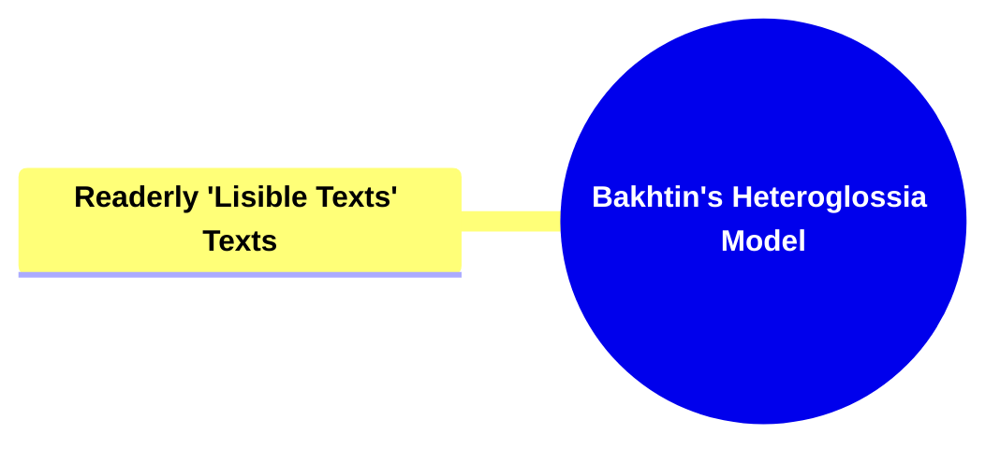

###### 2.1.1.1. **Linear Narrative**

- **Definition**: Follows a traditional, chronological structure that is easy to follow.

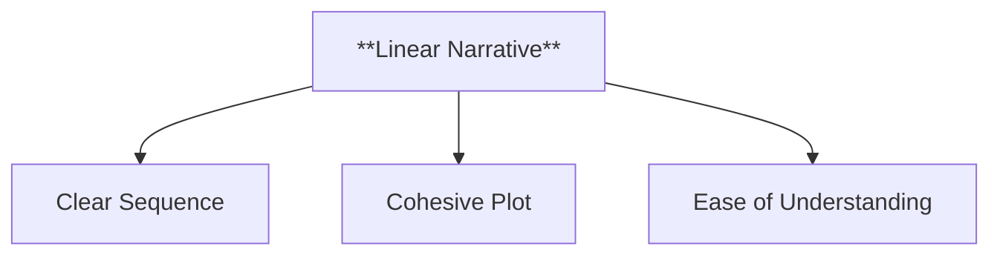

- **Characteristics**
  - **Clear Sequence**: Events unfold in a straightforward, logical order, aiding comprehension.
  - **Cohesive Plot**: Provides a seamless story progression with a beginning, middle, and end.
  - **Ease of Understanding**: Readers can follow the story without needing to reconstruct timelines or piece together events.

###### 2.1.1.2. **Fixed Meaning**

- **Definition**: The meaning is predetermined by the author, leaving little room for ambiguity or alternative interpretations.

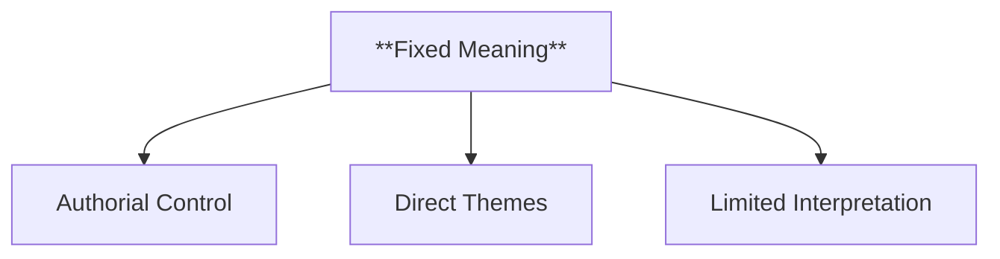

- **Characteristics**
  - **Authorial Control**: The narrative’s message is clearly communicated, aligning with the author’s intended meaning.
  - **Direct Themes**: Presents themes in an unambiguous way, ensuring readers grasp the core message.
  - **Limited Interpretation**: Reduces the scope for subjective readings, as the meaning is explicit.

###### 2.1.1.3. **Predictability**

- **Definition**: Often adhere to genre conventions, providing satisfaction through familiarity.

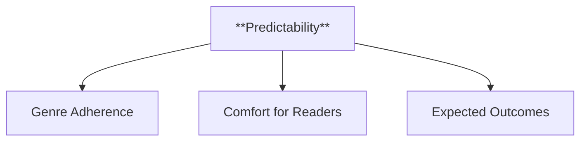

- **Characteristics**
  - **Genre Adherence**: Sticks to established tropes and patterns, creating a sense of reliability.
  - **Comfort for Readers**: Provides a familiar experience that meets expectations.
  - **Expected Outcomes**: Readers can anticipate key plot points and resolutions based on genre norms.

###### 2.1.1.4. **Passive Consumption**

- **Definition**: The reader decodes the message with minimal need for reflection or reinterpretation.

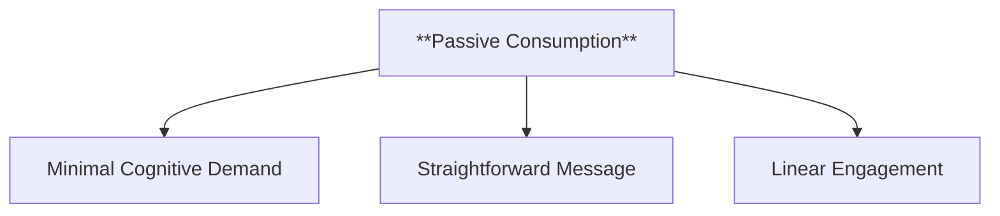

- **Characteristics**
  - **Minimal Cognitive Demand**: Requires less critical thinking or analysis from the reader.
  - **Straightforward Message**: Presents the narrative in a way that doesn’t invite deep reflection.
  - **Linear Engagement**: The reader follows along passively, receiving the story as it unfolds.

---

#### 2.2. Writerly (Scriptible) Texts

**Definition**:
Writerly texts challenge the reader to engage actively with the narrative, constructing meaning rather than passively receiving it. They are complex, open-ended, and resist easy interpretation, requiring the reader to navigate multiple layers of meaning and participate in the creation of the text’s significance.

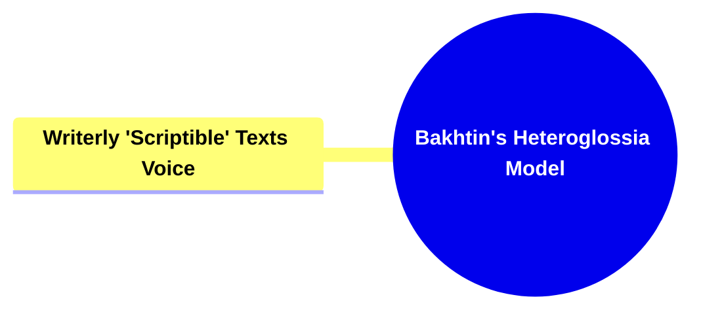

##### 2.2.1. **Components of Writerly (Scriptable) Texts**

###### 2.2.1.1. **Non-Linear Narrative**

- **Definition**: May use fragmented or non-chronological structures, requiring the reader to piece together the story.

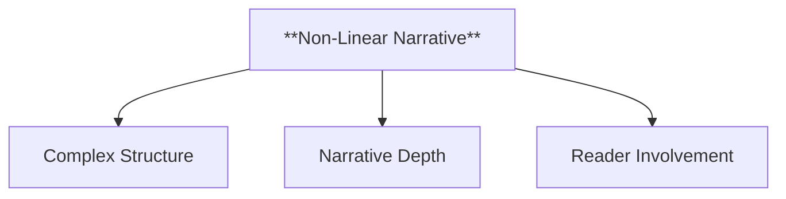

- **Characteristics**
  - **Complex Structure**: Events are presented out of order, challenging readers to reconstruct the timeline.
  - **Narrative Depth**: Offers layers of storytelling that require active engagement to understand fully.
  - **Reader Involvement**: Demands attention and cognitive effort to grasp the overall plot and connections.

###### 2.2.1.2. **Multiple Interpretations**

- **Definition**: Rich in ambiguity, inviting various readings and personal interpretations.

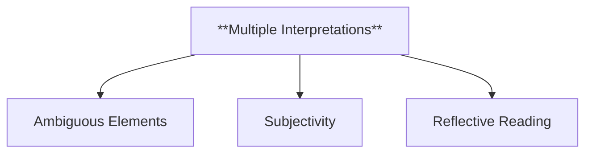

- **Characteristics**
  - **Ambiguous Elements**: Contains open-ended or unclear details that prompt reader interpretation.
  - **Subjectivity**: Readers bring their own perspectives, leading to unique and varied understandings.
  - **Reflective Reading**: Encourages deeper thought and analysis to uncover different meanings.

###### 2.2.1.3. **Unpredictability**

- **Definition**: Defy genre conventions, challenging reader expectations.

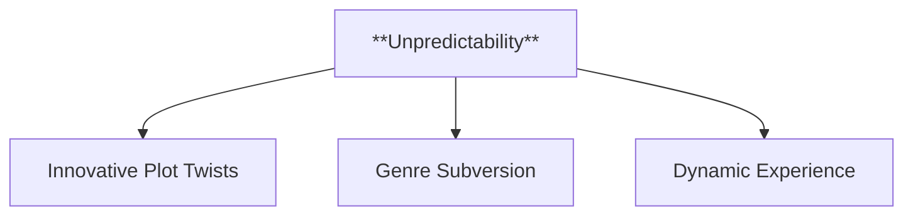

- **Characteristics**
  - **Innovative Plot Twists**: Surprises readers with unexpected developments.
  - **Genre Subversion**: Breaks traditional storytelling patterns to create original narratives.
  - **Dynamic Experience**: Keeps readers guessing, enhancing engagement through uncertainty.

###### 2.2.1.4. **Active Participation**

- **Definition**: The reader becomes a co-creator of meaning, engaging in a reflective and interpretative process.

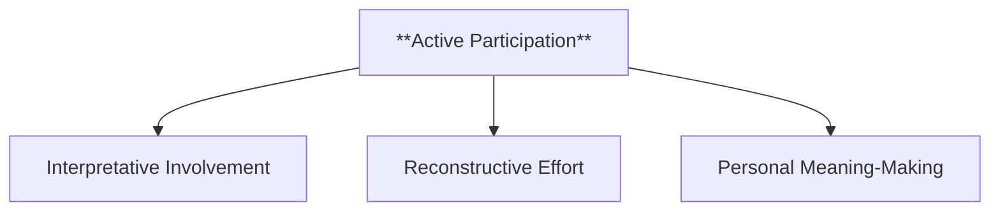

- **Characteristics**
  - **Interpretative Involvement**: Requires readers to make sense of the narrative through active thinking.
  - **Reconstructive Effort**: Readers piece together clues and narrative fragments to form a coherent story.
  - **Personal Meaning-Making**: Invites readers to shape the story’s interpretation based on their own reflections and insights.

---

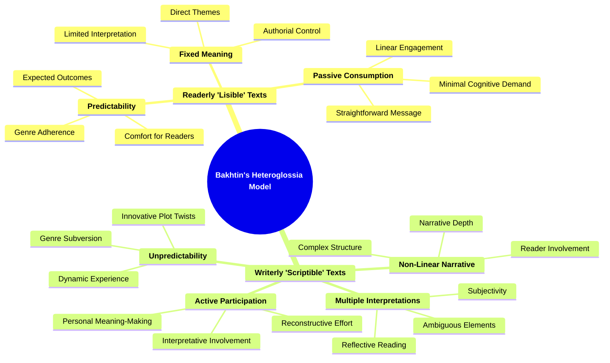

---

### 3. Comparative Analysis

- **Engagement Level**: Readerly texts require basic engagement focused on understanding, while writerly texts demand active participation in meaning-making.
- **Interpretation**: Readerly texts guide the reader toward a specific interpretation, whereas writerly texts open the space for multiple interpretations, making the reading experience more subjective.
- **Pleasure**: Readerly texts offer the satisfaction of familiarity and resolution, while writerly texts provide pleasure through the intellectual challenge and creative freedom they offer.

---

### 4. Implications of Barthes's Framework

**Key Insight or Implication**:
Barthes's distinction between readerly and writerly texts underscores the diversity of reading experiences, positioning the reader as either a passive recipient or an active participant in the creation of meaning. This framework challenges traditional literary hierarchies and emphasizes the role of the reader in constructing textual meaning.

**Collaborative or Future-Oriented Insight**:
Barthes's ideas have had a significant impact on literary theory, particularly in reader-response criticism and post-structuralism. His framework suggests that the pleasure of reading is not only in uncovering meaning but also in participating in its creation, making the text a site of dynamic interplay between author, text, and reader.

---
