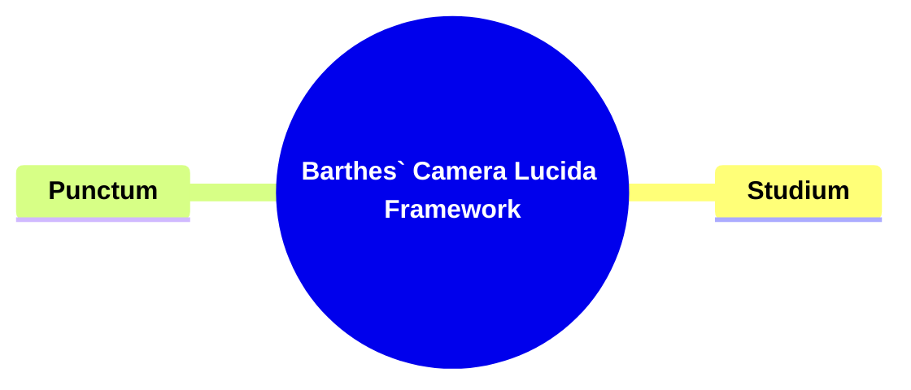
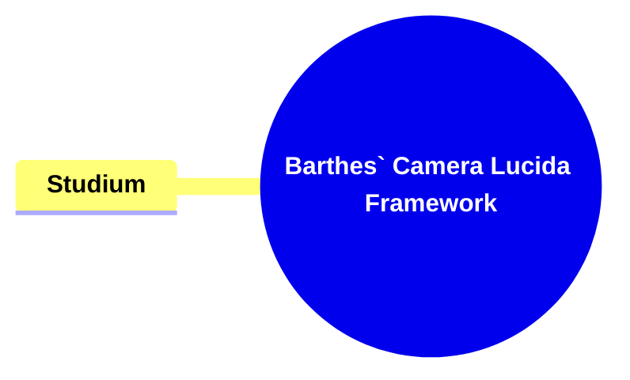
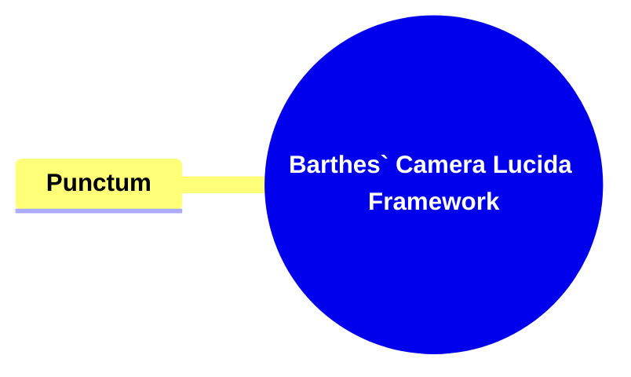

- [1. Title: **Barthes's Camera Lucida Framework**](#1-title-barthess-camera-lucida-framework)
- [2. Key Concepts](#2-key-concepts)
  - [2.1. Studium](#21-studium)
    - [2.1.1. **Components of Studium**](#211-components-of-studium)
      - [2.1.1.1. **Intellectual Engagement (_Studium_)**](#2111-intellectual-engagement-studium)
      - [2.1.1.2. **Cultural and Social Context**](#2112-cultural-and-social-context)
      - [2.1.1.3. **General Interest (_Studium_)**](#2113-general-interest-studium)
  - [2.2. Punctum](#22-punctum)
    - [2.2.1. **Components of Punctum**](#221-components-of-punctum)
      - [2.2.1.1. **Emotional Impact (_Punctum_)**](#2211-emotional-impact-punctum)
      - [2.2.1.2. **Subjectivity**](#2212-subjectivity)
      - [2.2.1.3. **Involuntary Reaction**](#2213-involuntary-reaction)
- [3. Theoretical Significance](#3-theoretical-significance)

---

## **Definition**:

### 1. Title: **Barthes's Camera Lucida Framework**

**Camera Lucida**:
**Definition**: In _"Camera Lucida"_ (1980), Roland Barthes offers a profound meditation on the nature of photography, exploring its intrinsic connections to memory, time, and mortality. Barthes introduces two central concepts—_studium_ and _punctum_—to articulate the intellectual and emotional responses that photographs can evoke, distinguishing between the cultural understanding of an image and the personal, emotional impact it can have.

---

### 2. Key Concepts

#### 2.1. Studium

**Definition**:
_Studium_ refers to the cultural, linguistic, and political interpretation of a photograph. It encompasses the broader, general interest that a viewer might have in the content of an image, shaped by their understanding of the context in which the photograph was taken.

##### 2.1.1. **Components of Studium**

###### 2.1.1.1. **Intellectual Engagement**

- **Definition**: Intellectual Engagement involves the viewer’s intellectual engagement with the photograph, interpreting it based on cultural and social knowledge.
- **Characteristics**
  - **Analytical Response**: Encourages viewers to analyze and understand the photograph by relating it to shared knowledge and context.
  - **Objective Appreciation**: Focuses on understanding the content, composition, and subject matter from an informed perspective.
  - **Cognitive Involvement**: Promotes thoughtful reflection on the photograph's themes and the context in which it was taken.

###### 2.1.1.2. **Cultural and Social Context**

- **Definition**: The response is informed by shared cultural codes, contributing to a collective understanding of the photograph's significance.
- **Characteristics**
  - **Contextual Interpretation**: Viewers derive meaning based on cultural symbols, norms, and historical knowledge.
  - **Collective Recognition**: Prompts an understanding shared by a wider audience, highlighting the photograph’s relevance within a societal framework.
  - **Educational Value**: Serves as a medium for exploring cultural and social narratives embedded in the photograph.

###### 2.1.1.3. **General Interest**

- **Definition**: General Interest reflects a more detached, analytical appreciation of a photograph, focusing on the subject matter and context.
- **Characteristics**
  - **Observational Engagement**: Encourages a general interest that doesn’t evoke a deep emotional response.
  - **Intellectual Curiosity**: Sparks interest in the photograph’s details, such as historical context or subject portrayal.
  - **Informative Reaction**: Allows the viewer to appreciate the photograph for its informational and representational qualities.

---

#### 2.2. Punctum

**Definition**:
_Punctum_ refers to the personal, emotional response that a photograph evokes in the viewer. It is the detail in the photograph that "pricks" or "wounds" the viewer, creating a personal and emotional connection to the image.

##### 2.2.1. **Components of Punctum**

###### 2.2.1.1. **Emotional Impact**

- **Definition**: Emotional Impact provokes a strong, often visceral emotional response in the viewer, unrelated to the broader context of the photograph.
- **Characteristics**
  - **Personal Connection**: Elicits a deeply emotional reaction that resonates beyond intellectual analysis.
  - **Immediate Resonance**: Strikes the viewer in an unanticipated way, creating a lasting impression.
  - **Affective Engagement**: Transforms the experience from observation to feeling, heightening the photograph’s impact.

###### 2.2.1.2. **Subjectivity**

- **Definition**: The experience of Subjectivity is unique to each viewer, influenced by personal memories and emotions.
- **Characteristics**
  - **Individual Interpretation**: Each viewer’s response is different, shaped by personal history and experiences.
  - **Selective Response**: The aspect that provokes subjectivity might be unnoticed by others, emphasizing its subjective nature.
  - **Memory Trigger**: Often connects to past events or emotions specific to the viewer, making the photograph highly personal.

###### 2.2.1.3. **Involuntary Reaction**

- **Definition**: Involuntary Rejection triggers an unexpected emotional response, creating a deep personal connection with the photograph.
- **Characteristics**
  - **Spontaneous Impact**: The response is not deliberate; it occurs naturally and without anticipation.
  - **Profound Engagement**: Draws the viewer into an unplanned relationship with the image, altering their perception of it.
  - **Lasting Effect**: Leaves a strong, memorable impression that may linger long after viewing.

---

### 3. Theoretical Significance

**Intellectual and Emotional Dimensions**:
Barthes's _Camera Lucida_ framework provides a way to analyze both the intellectual and emotional dimensions of photography. _Studium_ allows for a collective interpretation based on cultural knowledge, while _punctum_ introduces the element of personal, emotional engagement, making each viewer’s experience of a photograph unique.

**Application in Visual and Cultural Studies**:
This framework is influential in visual culture, photography criticism, and media studies. It highlights the dual nature of photographs as cultural artifacts that carry shared meaning and personal objects that evoke individual emotional responses. Barthes’s insights continue to shape how visual media is analyzed, especially in relation to memory, temporality, and mortality.

**Supporting Information**:

- **Influence on Photography Criticism**: Barthes's distinction between _studium_ and _punctum_ has become foundational in photography criticism, helping to articulate the dual layers of meaning in images.
- **Impact on Media Studies**: In media studies, Barthes’s framework is used to understand how visual texts communicate and affect viewers, especially regarding their emotional and cultural significance.
- **Enduring Relevance**: _Camera Lucida_ remains a seminal text in the study of visual culture, offering valuable insights into how images evoke both collective and personal responses, a theme that continues to be relevant in the digital age.

---
