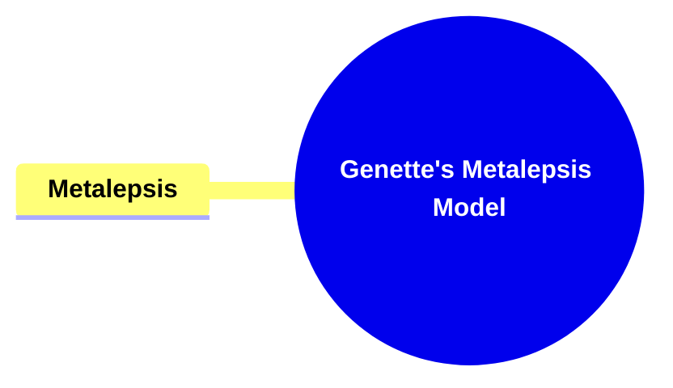

- [1. Title: **Genette's Metalepsis Model**](#1-title-genettes-metalepsis-model)
- [2. **Key Components**](#2-key-components)
  - [2.1. **Metalepsis**:](#21-metalepsis)
    - [2.1.1. **Components of Metalepsis**](#211-components-of-metalepsis)
      - [2.1.1.1. **Extradiegetic Level**](#2111-extradiegetic-level)
      - [2.1.1.2. **Intradiegetic Level**](#2112-intradiegetic-level)
      - [2.1.1.3. **Metadiegetic Level**](#2113-metadiegetic-level)
- [3. **Transgressions**](#3-transgressions)

---

---

### 1. Title: **Genette's Metalepsis Model**

- **Metalepsis**:
  - **Definition**: Metalepsis is a narratological concept introduced by Gérard Genette that refers to the transgression or blending of boundaries between different narrative levels. It occurs when a narrative voice or character from one level of the story interferes with or interacts with another level, breaking the conventional separation between the layers of a narrative. This concept challenges the traditional boundaries of narrative structure, creating complex and often paradoxical effects that can disrupt the reader’s understanding of the story.

### 2. **Key Components**

#### 2.1. **Metalepsis**:

- **Definition**: Metalepsis involves a disruption where characters, narrators, or elements from one narrative level intrude into another, violating the distinct boundaries that typically separate different layers of a narrative. This can include instances where characters interact with their authors, narrators acknowledge their fictional status, or elements from a story within a story affect the outer narrative.

##### 2.1.1. **Components of Metalepsis**

###### 2.1.1.1. **Extradiegetic Level**

- **Definition**: The outermost level of the narrative, where the narrator exists outside the story world. The extradiegetic narrator typically provides the overarching voice that frames the narrative, offering commentary, description, or guidance to the reader.
- **Characteristics**
  - **Narrative Authority**: The extradiegetic narrator holds control over the story’s presentation and provides context, commentary, or framing for the intradiegetic narrative.
  - **Detached Perspective**: Maintains an external viewpoint that allows for a broader overview and objective commentary on the story.
  - **Guiding Voice**: Acts as a mediator between the story and the reader, influencing how the narrative is interpreted and understood.

###### 2.1.1.2. **Intradiegetic Level**

- **Definition**: The level within the story world, where the characters and events take place. The intradiegetic level is the primary narrative layer where the plot unfolds and where characters interact with one another.
- **Characteristics**
  - **Character Interaction**: The intradiegetic level encompasses the events and dialogues that occur among characters within the story.
  - **Plot Development**: This level serves as the main stage for the narrative, where the storyline progresses and conflicts arise.
  - **Subjective Experiences**: Events are experienced from the perspectives of characters, allowing for direct engagement with their thoughts, feelings, and actions.

###### 2.1.1.3. **Metadiegetic Level**

- **Definition**: A story within a story, creating an additional layer of narrative. The metadiegetic level involves narratives that are embedded within the primary story, often told by a character within the intradiegetic level.
- **Characteristics**
  - **Embedded Narratives**: Provides a nested storytelling structure that can add depth and context to the main plot.
  - **Reflective or Paralleled Themes**: Often mirrors or contrasts the main narrative, enriching the overall story with additional layers of meaning.
  - **Character as Narrator**: A character within the intradiegetic level acts as the narrator of the metadiegetic story, adding subjectivity and potentially unreliable narration to the embedded tale.

### 3. **Transgressions**

- **Metalepsis Transgressions**:
  - **Extradiegetic/Intradiegetic**: When an extradiegetic narrator or element crosses into the intradiegetic level, interacting with the characters or events within the story world.
    - **Example**: A narrator who steps into the story to interact with the characters or to alter the course of events.
  - **Extradiegetic/Metadiegetic**: When elements from the extradiegetic level influence or become part of a metadiegetic narrative (a story within a story).
    - **Example**: An author commenting on the actions of characters in a nested narrative.
  - **Intradiegetic/Extradiegetic**: When characters or elements from the intradiegetic level acknowledge or interact with the extradiegetic level.
    - **Example**: A character realizing they are part of a story and addressing the reader or narrator directly.
  - **Intradiegetic/Metadiegetic**: When elements from the intradiegetic level cross into the metadiegetic level, influencing the nested narrative.
    - **Example**: A character within the main story influencing or altering the outcome of a story being told by another character.
  - **Metadiegetic/Extradiegetic**: When elements from a metadiegetic narrative influence or interact with the extradiegetic level.
    - **Example**: A story within a story that changes the narrative framework of the overarching story.
  - **Metadiegetic/Intradiegetic**: When elements from a metadiegetic narrative interact with or influence the intradiegetic level.
    - **Example**: Characters in the main narrative being influenced by events or revelations from a nested story.
