- [1. Title: **Rimmon-Kenan's Textual and Intertextual Analysis Framework**](#1-title-rimmon-kenans-textual-and-intertextual-analysis-framework)
- [2. Key Concepts](#2-key-concepts)
  - [2.1. Textual Analysis](#21-textual-analysis)
    - [2.1.1. **Components of Textual Analysis**](#211-components-of-textual-analysis)
      - [2.1.1.1. **Focus on Intrinsic Elements**](#2111-focus-on-intrinsic-elements)
      - [2.1.1.2. **Theme**](#2112-theme)
      - [2.1.1.3. **Structure**](#2113-structure)
      - [2.1.1.4. **Close Reading**](#2114-close-reading)
  - [2.2. Intertextual Analysis](#22-intertextual-analysis)
    - [2.2.1. **Components of Intertextual Analysis**](#221-components-of-intertextual-analysis)
      - [2.2.1.1. **Allusions**](#2211-allusions)
      - [2.2.1.2. **References**](#2212-references)
      - [2.2.1.3. **Dialogue with Other Texts**](#2213-dialogue-with-other-texts)
      - [2.2.1.4. **Cultural Context**](#2214-cultural-context)
      - [2.2.1.5. **Historical Context**](#2215-historical-context)
- [3. Implications of Textual and Intertextual Analysis](#3-implications-of-textual-and-intertextual-analysis)

---

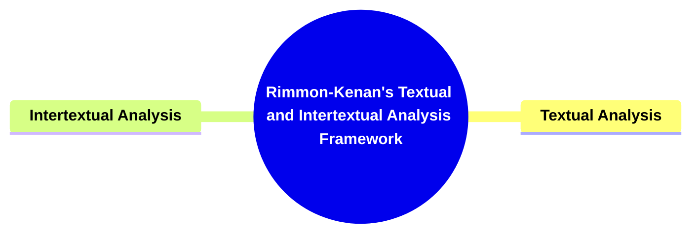

---

### 1. Title: **Rimmon-Kenan's Textual and Intertextual Analysis Framework**

**Textual and Intertextual Analysis**:
**Definition**: Shlomith Rimmon-Kenan's framework for textual and intertextual analysis emphasizes the importance of examining narratives both within their own boundaries and in relation to other texts. This dual approach helps to uncover the deeper layers of meaning in narrative fiction by analyzing how stories are constructed internally and how they interact with a broader literary and cultural context.

---

### 2. Key Concepts

#### 2.1. Textual Analysis

**Definition**:
Textual analysis is the process of closely examining the internal structure and elements of a narrative. This includes analyzing language, themes, narrative techniques, character development, plot structure, and other intrinsic features of the text. The goal is to understand how these elements work together to create meaning within the narrative.

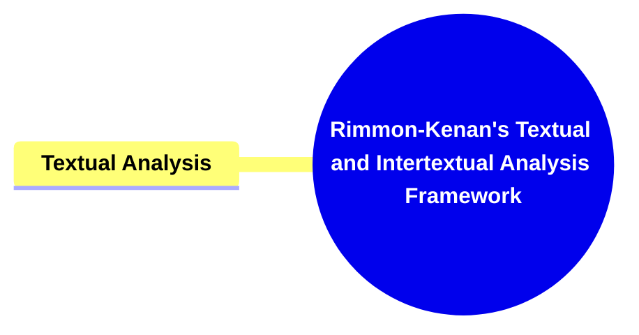

##### 2.1.1. **Components of Textual Analysis**

###### 2.1.1.1. **Focus on Intrinsic Elements**

- **Definition**: Textual analysis involves a detailed examination of the text's language, style, and structure. It looks at how narrative techniques, such as point of view, time management, and symbolism, contribute to the overall meaning of the story.

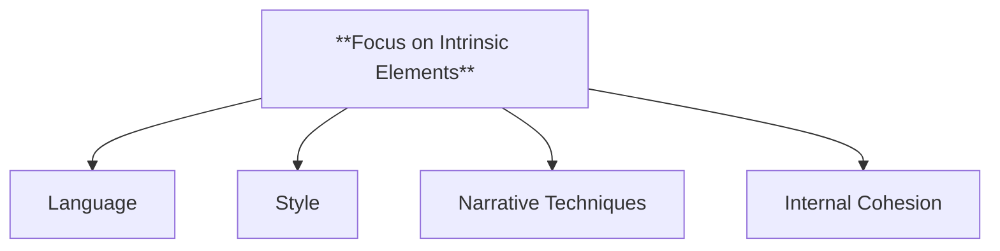

- **Characteristics**
  - **Language**: Analyzes how the choice of words impacts the story’s tone and message.
  - **Style**: Examines sentence structure and literary devices.
  - **Narrative Techniques**: Examines techniques like point of view, pacing, and symbolism to see how they shape the reader’s understanding.
  - **Internal Cohesion**: Focuses on how all the elements within the text work together to create a unified narrative.

###### 2.1.1.2. **Theme**

- **Definition**: Theme analysis focuses on the recurring motifs, ideas, and underlying messages developed throughout the narrative.

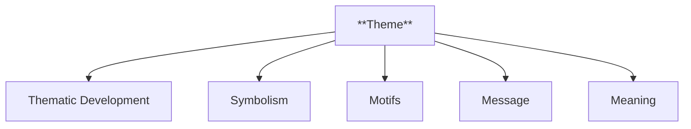

- **Characteristics**
  - **Thematic Development**: Analyzes how recurring motifs and themes are presented within the text.
  - **Symbolism**: Considers the use of symbols to reinforce thematic elements.
  - **Motifs**: Examines repeated imagery or ideas that enhance the theme.
  - **Message**: Identifies the overall message conveyed through the narrative.
  - **Meaning**: Interprets the deeper significance behind the themes.

###### 2.1.1.3. **Structure**

- **Definition**: Structure analysis examines how the organization and arrangement of the narrative support and enhance the storytelling.

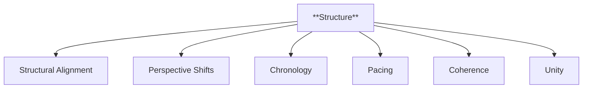

- **Characteristics**
  - **Structural Alignment**: Investigates how the organization of chapters supports themes.
  - **Perspective Shifts**: Analyzes changes in perspective within the narrative.
  - **Chronology**: Focuses on the order of events in the story.
  - **Pacing**: Considers the rhythm or speed of narrative progression.
  - **Coherence**: Looks at how structural elements contribute to a unified story.
  - **Unity**: Examines the seamlessness of the narrative's flow.

###### 2.1.1.4. **Close Reading**

- **Definition**: Textual analysis often involves close reading, a method where the text is examined in detail to uncover nuances and subtle meanings that may not be immediately apparent.

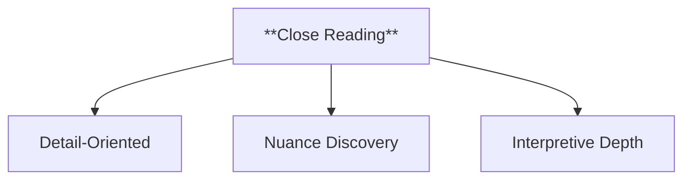

- **Characteristics**
  - **Detail-Oriented**: Focuses on specific passages or phrases to reveal hidden layers of meaning.
  - **Nuance Discovery**: Identifies subtle linguistic and literary elements that contribute to the text’s complexity.
  - **Interpretive Depth**: Promotes a deeper understanding of the text through meticulous analysis of language and content.

---

#### 2.2. Intertextual Analysis

**Definition**:
Intertextual analysis examines the relationships between a narrative and other texts. This includes identifying and analyzing allusions, quotations, references, and influences that contribute to the narrative's meaning. Intertextuality suggests that no text exists in isolation; rather, every narrative is part of a larger web of literary and cultural references that inform its content and interpretation.

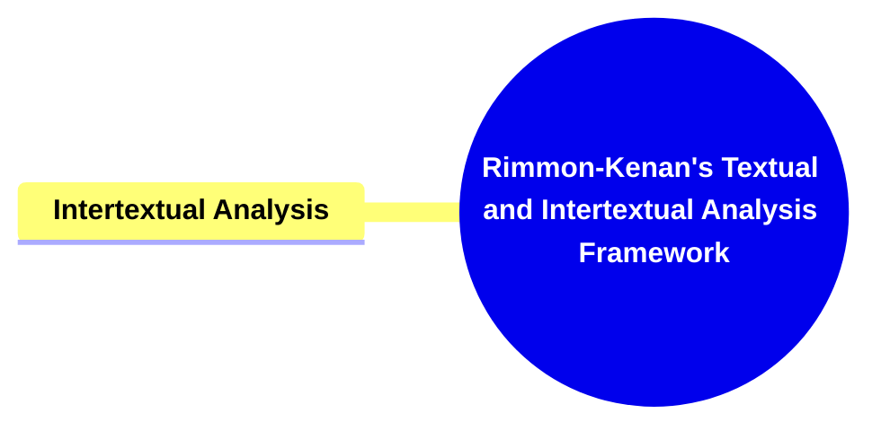

##### 2.2.1. **Components of Intertextual Analysis**

###### 2.2.1.1. **Allusions**

- **Definition**: Allusions are indirect references within a narrative that suggest connections to other texts, cultural motifs, or historical events, adding depth to the story.

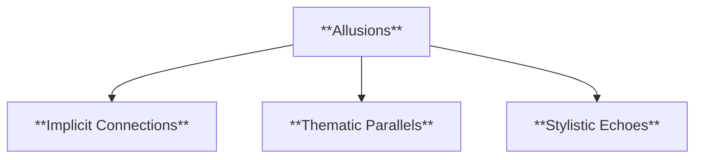

- **Characteristics**
  - **Implicit Connections**: Indicates subtle references without directly mentioning the source.
  - **Thematic Parallels**: Examines how themes in the text resonate with or contrast themes from other works.
  - **Stylistic Echoes**: Identifies how the text’s style subtly mimics or pays homage to another work or genre.

###### 2.2.1.2. **References**

- **Definition**: References are direct mentions or explicit acknowledgments of other texts, works, or cultural elements within the narrative, often serving to ground the story in a larger context.

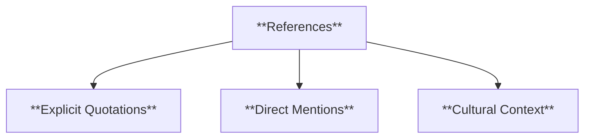

- **Characteristics**
  - **Explicit Quotations**: Highlights direct references or citations from other works.
  - **Direct Mentions**: Identifies explicit naming or acknowledgment of other texts, characters, or events.
  - **Cultural Context**: Links the narrative to broader cultural or historical references, providing clarity or context for the reader.

###### 2.2.1.3. **Dialogue with Other Texts**

- **Definition**: This analysis explores how a narrative engages in dialogue with other works, either by building upon them, responding to them, or subverting them.

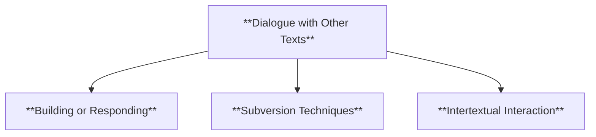

- **Characteristics**
  - **Building or Responding**: Investigates how the narrative extends or critiques the ideas of previous texts.
  - **Subversion Techniques**: Identifies how the story challenges or reinterprets well-known themes or tropes from other works.
  - **Intertextual Interaction**: Reveals how different texts influence and shape the current narrative’s meaning.

###### 2.2.1.4. **Cultural Context**

- **Definition**: Cultural context refers to the inclusion of elements within a narrative that connect it to the values, norms, and symbols of a specific society or cultural group, enhancing reader understanding.

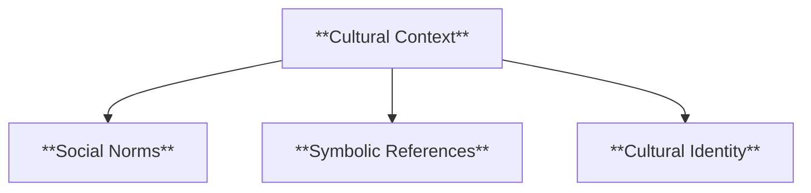

- **Characteristics**
  - **Social Norms**: Examines references to social behaviors, customs, and expectations.
  - **Symbolic References**: Identifies symbols or motifs that resonate within a particular culture.
  - **Cultural Identity**: Highlights aspects that emphasize or explore a group’s cultural identity and traditions.

###### 2.2.1.5. **Historical Context**

- **Definition**: Historical context provides the backdrop of the time period in which the narrative is set or references, grounding the story in real-world historical events or eras.

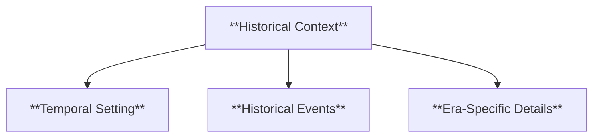

- **Characteristics**
  - **Temporal Setting**: Links the narrative to a specific time period or historical moment.
  - **Historical Events**: Highlights references to notable events or figures from history.
  - **Era-Specific Details**: Analyzes details like language, clothing, and technology that root the narrative in its historical setting.

---

### 3. Implications of Textual and Intertextual Analysis

**Key Insight or Implication**:
Rimmon-Kenan’s framework for textual and intertextual analysis provides a comprehensive approach to understanding narrative fiction. By integrating both methods, her framework allows for a nuanced exploration of how narratives function internally and how they resonate within broader literary and cultural contexts. This dual focus enriches the analysis of texts, making it possible to uncover multiple layers of meaning.

**Collaborative or Future-Oriented Insight**:
The framework’s application extends beyond literature to interdisciplinary fields, offering a foundation for analyzing narratives in various mediums such as film, media, and cultural studies. Future research could explore how digital narratives create new forms of textual and intertextual relationships.

---

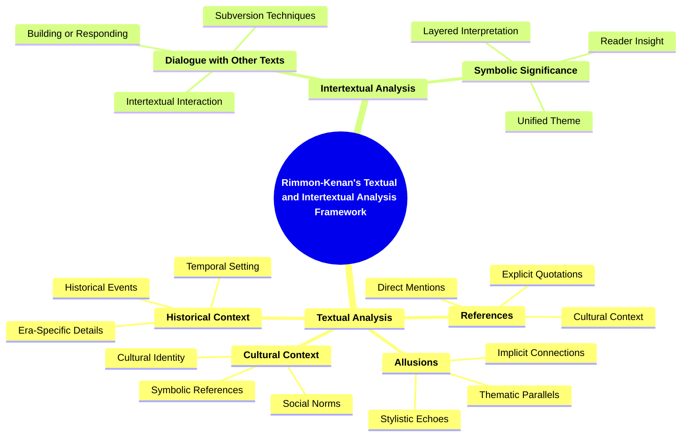
