- [1. **The Role of Desire in Narrative**](#1-the-role-of-desire-in-narrative)
- [2. **Key Concepts**](#2-key-concepts)
  - [2.1. **Desire for Closure**](#21-desire-for-closure)
    - [2.1.1. **Components of Desire for Closure**:](#211-components-of-desire-for-closure)
      - [2.1.1.1. **Narrative Drive**:](#2111-narrative-drive)
      - [2.1.1.2. **Resolution of Conflict**:](#2112-resolution-of-conflict)
      - [2.1.1.3. **Satisfaction of Curiosity**:](#2113-satisfaction-of-curiosity)
      - [2.1.1.4. **Narrative Completion**:](#2114-narrative-completion)
  - [2.2. **Death Drive (Thanatos)**](#22-death-drive-thanatos)
    - [2.2.1. **Components of Death Drive (Thanatos)**:](#221-components-of-death-drive-thanatos)
      - [2.2.1.1. **Return to Equilibrium**:](#2211-return-to-equilibrium)
      - [2.2.1.2. **Self-Destructive Behavior**:](#2212-self-destructive-behavior)
      - [2.2.1.3. **Narrative Termination**:](#2213-narrative-termination)
      - [2.2.1.4. **Existential Reflection**:](#2214-existential-reflection)
  - [2.3. **Pleasure Principle (Eros)**](#23-pleasure-principle-eros)
    - [2.3.1. **Components of Pleasure Principle (Eros)**:](#231-components-of-pleasure-principle-eros)
      - [2.3.1.1. **Pursuit of Happiness**:](#2311-pursuit-of-happiness)
      - [2.3.1.2. **Avoidance of Pain**:](#2312-avoidance-of-pain)
      - [2.3.1.3. **Creative Expression**:](#2313-creative-expression)
      - [2.3.1.4. **Romantic Love**](#2314-romantic-love)
      - [2.3.1.5. **Familial Love**](#2315-familial-love)
  - [2.4. **Narrative Tension**](#24-narrative-tension)
    - [2.4.1. **Components of Narrative Tension**:](#241-components-of-narrative-tension)
      - [2.4.1.1. **Conflict**:](#2411-conflict)
      - [2.4.1.2. **Obstacles**:](#2412-obstacles)
      - [2.4.1.3. **Suspense**:](#2413-suspense)
      - [2.4.1.4. **Uncertainty**:](#2414-uncertainty)
      - [2.4.1.5. **Rising Stakes**:](#2415-rising-stakes)
      - [2.4.1.6. **Climactic Build-Up**:](#2416-climactic-build-up)
  - [2.5. **Anticipation**](#25-anticipation)
    - [2.5.1. **Components of Anticipation**:](#251-components-of-anticipation)
      - [2.5.1.1. **Foreshadowing**:](#2511-foreshadowing)
      - [2.5.1.2. **Reader Predictions**:](#2512-reader-predictions)
      - [2.5.1.3. **Narrative Hooks**:](#2513-narrative-hooks)
      - [2.5.1.4. **Delayed Gratification**:](#2514-delayed-gratification)
- [3. **Contextualization**](#3-contextualization)
- [4. **Conclusion**](#4-conclusion)

---

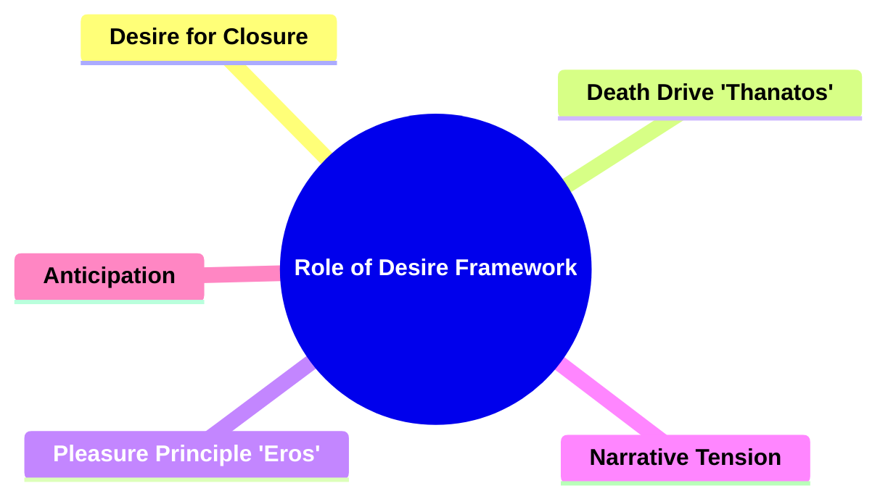

---

### 1. **The Role of Desire in Narrative**

- **Peter Brooks' Focus**:
  - Peter Brooks applies **psychoanalytic theory** to narrative analysis, particularly drawing from Freudian concepts to explain how narratives function. His focus is on the underlying psychological drives, such as desire for closure and the interplay between the death drive and pleasure principle, which push narratives toward resolution and influence how stories engage readers.

---

### 2. **Key Concepts**

#### 2.1. **Desire for Closure**

- **Definition**:
  - The inherent drive within a narrative that moves it toward resolution. This desire propels the plot toward an ending where conflicts, tensions, and questions raised throughout the story are resolved.


##### 2.1.1. **Components of Desire for Closure**:

###### 2.1.1.1. **Narrative Drive**:

**Definition**: The force that propels the story forward, urging it toward its conclusion.

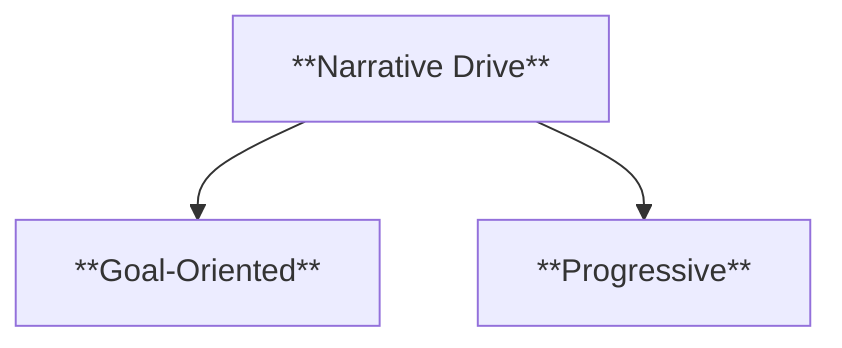

- **Characteristics**:
  - **Goal-Oriented**: Driven by characters’ goals or objectives.
  - **Progressive**: The plot develops toward a clear ending.
- **Examples**: Raskolnikov’s journey toward confession in _Crime and Punishment_ represents the narrative’s push toward closure.

###### 2.1.1.2. **Resolution of Conflict**:

**Definition**: The central conflicts in the narrative are resolved, providing a sense of completion.

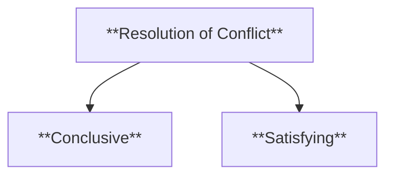

- **Characteristics**:
  - **Conclusive**: Ends the primary conflict.
  - **Satisfying**: Provides closure for the reader.
- **Examples**: In _The Lord of the Rings_, the destruction of the One Ring brings resolution to the epic conflict.

###### 2.1.1.3. **Satisfaction of Curiosity**:

**Definition**: The fulfillment of the reader’s desire to know the outcome of the narrative’s events and conflicts.

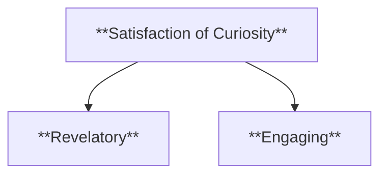

- **Characteristics**:
  - **Revelatory**: Answers lingering questions.
  - **Engaging**: Keeps the reader interested until the end.
- **Examples**: The unraveling of the mystery in _The Da Vinci Code_ satisfies readers’ curiosity.

###### 2.1.1.4. **Narrative Completion**:

- **Definition**: The sense of wholeness achieved when all plot threads are tied up, bringing the story to a definitive conclusion.

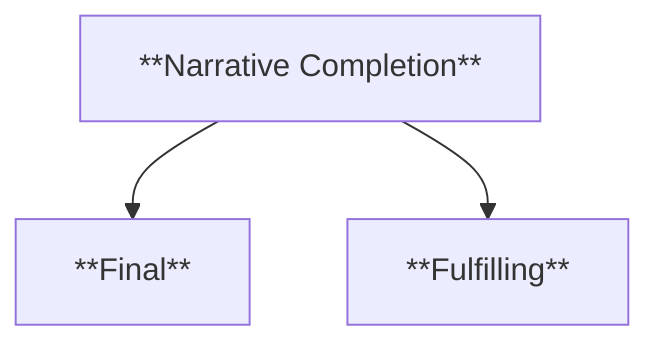

- **Characteristics**:
  - **Final**: The story ends with no loose ends.
  - **Fulfilling**: Provides intellectual and emotional closure.
- **Examples**: In _To Kill a Mockingbird_, the resolution of Tom Robinson’s trial and Scout’s reflections complete the narrative arc.

---

#### 2.2. **Death Drive (Thanatos)**

- **Definition**:
  - A Freudian concept representing an unconscious desire for a return to nonexistence, calm, or rest. The death drive is a counterpoint to life-preserving instincts (Eros) and is reflected in narrative tendencies toward termination or self-destruction.

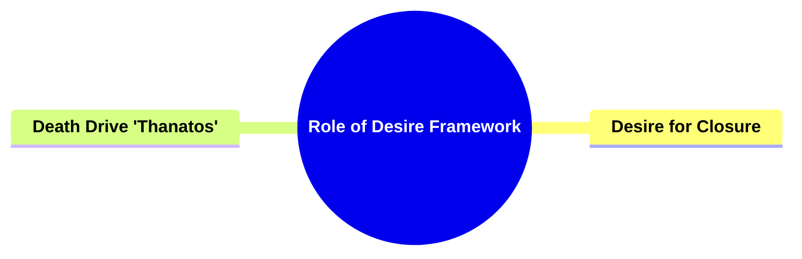

##### 2.2.1. **Components of Death Drive (Thanatos)**:

###### 2.2.1.1. **Return to Equilibrium**:

- **Definition**: The narrative’s movement toward resolution, where conflicts cease, and the story reaches a state of rest.

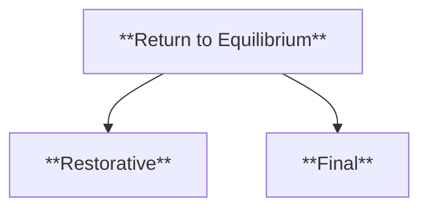

- **Characteristics**:
  - **Restorative**: Seeks an end to tension.
  - **Final**: Leads to narrative termination.
- **Examples**: Gatsby’s tragic pursuit of a dream in _The Great Gatsby_ aligns with the death drive, leading to his demise.

###### 2.2.1.2. **Self-Destructive Behavior**:

**Definition**: Actions that lead characters toward their downfall, often driven by unconscious desires that reflect the death drive.

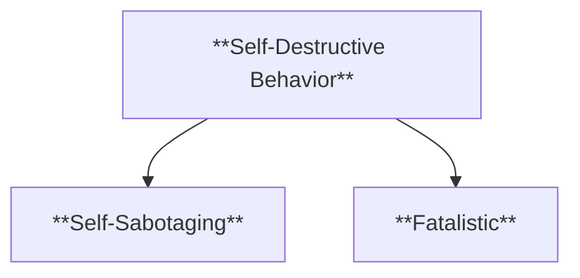

- **Characteristics**:
  - **Self-Sabotaging**: Characters make choices that lead to ruin.
  - **Fatalistic**: The drive toward destruction dominates.
- **Examples**: Hamlet’s indecision and obsession with revenge in _Hamlet_ leads to his downfall.

###### 2.2.1.3. **Narrative Termination**:

**Definition**: The narrative’s inevitable conclusion, where the story reaches its endpoint, often linked to the death drive.

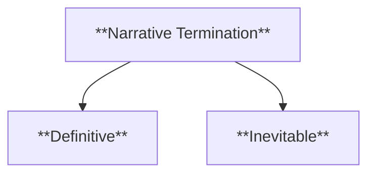

- **Characteristics**:
  - **Definitive**: The story ends, ceasing further development.
  - **Inevitable**: The end is seen as unavoidable.
- **Examples**: In _Romeo and Juliet_, the lovers' deaths conclude the narrative with a sense of tragic inevitability.

###### 2.2.1.4. **Existential Reflection**:

- **Definition**: Characters’ reflections on mortality and the meaning of life deepen the exploration of the death drive.

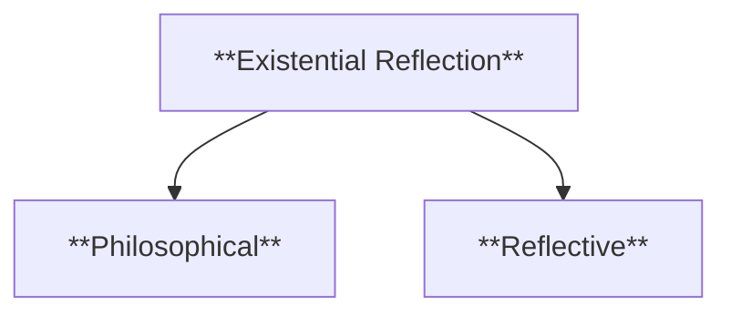

- **Characteristics**:
  - **Philosophical**: Characters question life’s purpose.
  - **Reflective**: Themes of death and existence dominate.
- **Examples**: Ahab’s obsession with Moby Dick leads to existential musings about fate and mortality in _Moby-Dick_.

---

#### 2.3. **Pleasure Principle (Eros)**

- **Definition**:
  - A Freudian concept representing life-affirming instincts, including the pursuit of happiness, love, and creative expression. In narrative, the pleasure principle drives characters toward fulfilling and life-preserving actions.

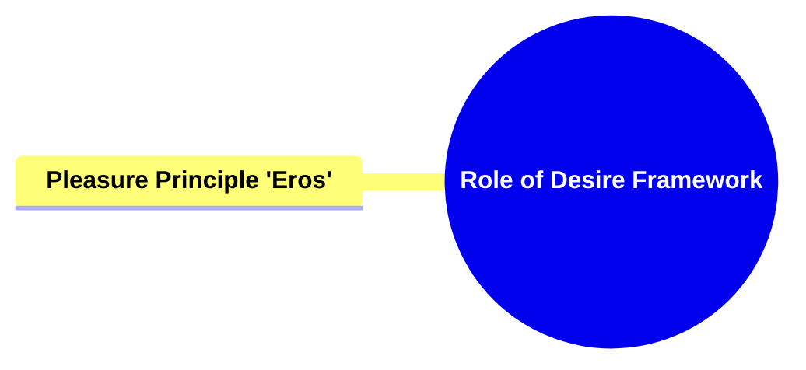

##### 2.3.1. **Components of Pleasure Principle (Eros)**:

###### 2.3.1.1. **Pursuit of Happiness**:

- **Definition**: Characters are motivated by a desire to achieve happiness or fulfillment.

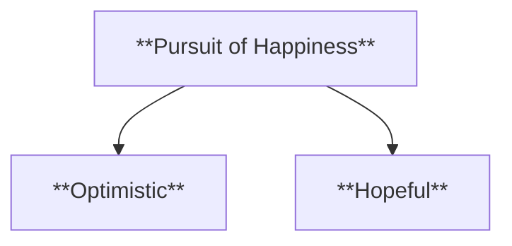

- **Characteristics**:
  - **Optimistic**: Characters aim for positive outcomes.
  - **Hopeful**: Actions are geared toward joy and contentment.
- **Examples**: Elizabeth Bennet’s eventual marriage to Mr. Darcy in _Pride and Prejudice_ reflects her pursuit of happiness.

###### 2.3.1.2. **Avoidance of Pain**:

- **Definition**: Characters’ efforts to avoid suffering or hardship, driving the plot away from negative outcomes.

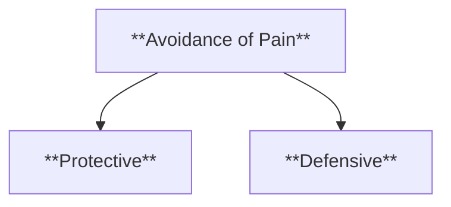

- **Characteristics**:
  - **Protective**: Characters seek to avoid harm.
  - **Defensive**: Decisions are made to prevent discomfort.
- **Examples**: Holden Caulfield’s avoidance of emotional pain shapes his actions in _The Catcher in the Rye_.

###### 2.3.1.3. **Creative Expression**:

- **Definition**: Characters engage in life-affirming creative activities that embody the pleasure principle.

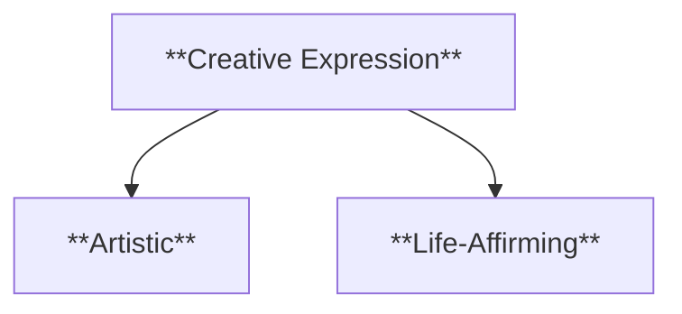

- **Characteristics**:
  - **Artistic**: Characters express themselves through creative pursuits.
  - **Life-Affirming**: These actions add vitality to the narrative.
- **Examples**: Jane Eyre’s pursuit of art and love represents her creative and emotional fulfillment in _Jane Eyre_.

###### 2.3.1.4. **Romantic Love**

- **Definition**: A type of love characterized by deep emotional connection, passion, and intimacy between individuals.

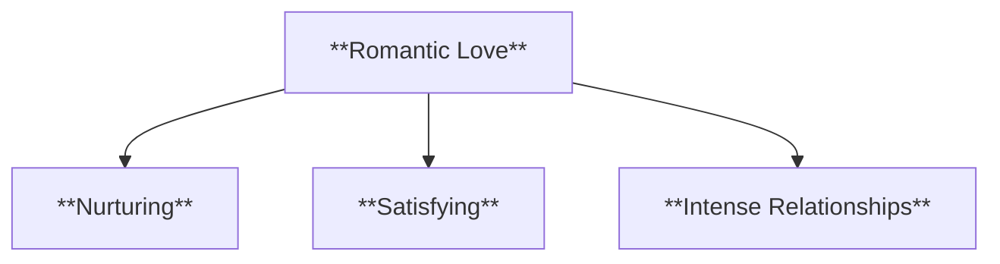

- **Characteristics**:
  - **Nurturing**: Provides emotional support and growth for partners.
  - **Satisfying**: Leads to personal happiness and fulfillment.
  - **Intense Relationships**: Often marked by passion and profound emotional attachment.
- **Examples**: Catherine and Heathcliff’s tumultuous love in _Wuthering Heights_ exemplifies romantic love's consuming nature.

###### 2.3.1.5. **Familial Love**

- **Definition**: A type of love based on kinship, loyalty, and support within family relationships.


- **Characteristics**:
  - **Nurturing**: Creates a foundation of emotional and physical care within families.
  - **Satisfying**: Strengthens family bonds and provides stability.
  - **Supportive Bonds**: Emphasizes loyalty and mutual support among family members.
- **Examples**: The relationship between Scout and Atticus Finch in _To Kill a Mockingbird_ reflects the strength of familial love.v

#### 2.4. **Narrative Tension**

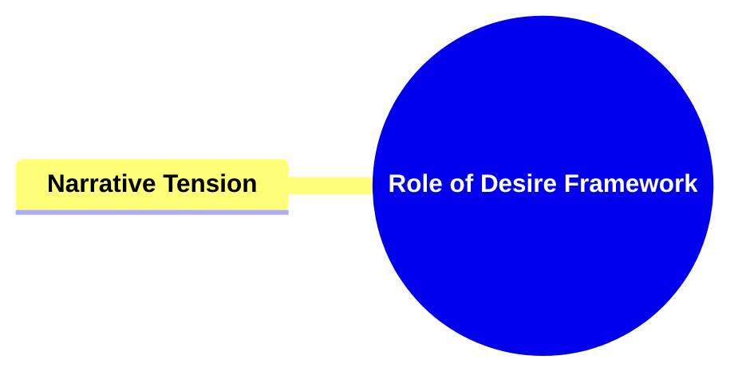

- **Definition**:
  - The emotional and psychological strain created by unresolved conflicts or obstacles within the story. Narrative tension keeps readers engaged, building suspense as they anticipate resolution.

##### 2.4.1. **Components of Narrative Tension**:

###### 2.4.1.1. **Conflict**:

- **Definition**: The clash of opposing forces, motivations, or desires, driving the narrative forward through tension.

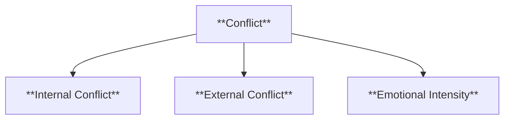

- **Characteristics**:
  - **Internal Conflict**: Characters struggle within themselves, such as moral dilemmas or personal fears.
  - **External Conflict**: Characters face opposition from other characters, society, or nature.
  - **Emotional Intensity**: Conflict often heightens emotional stakes for the characters and the audience.
- **Examples**: In _The Hunger Games_, Katniss faces external conflict with the Capitol, as well as internal conflict about her role as a symbol of rebellion.

###### 2.4.1.2. **Obstacles**:

- **Definition**: Physical, social, or psychological barriers that characters must navigate or overcome to achieve their goals.

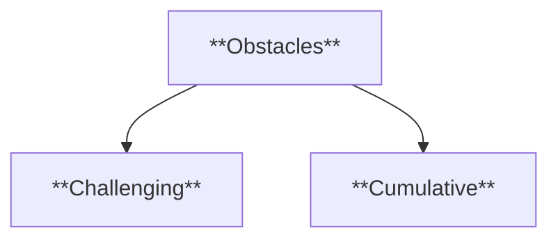

- **Characteristics**:
  - **Challenging**: Characters encounter difficult trials that test their abilities and resilience.
  - **Cumulative**: Obstacles often build upon one another, increasing difficulty as the narrative progresses.
- **Examples**: The dangerous arena in _The Hunger Games_ acts as an ongoing obstacle that Katniss must survive while navigating alliances and enemies.

###### 2.4.1.3. **Suspense**:

- **Definition**: A state of excitement or anxious anticipation regarding the outcome of a story's conflict, driven by the delay of expected results.

```mermaid
flowchart TD;
    H[**Suspense**]
    H --> I[**Tension-Building**];
    H --> J[**Foreshadowing**];
    H --> K[**Emotional Engagement**];
```

- **Characteristics**:
  - **Tension-Building**: Suspense is created by delaying the resolution, keeping readers on edge.
  - **Foreshadowing**: Hints and clues are often provided, heightening anticipation of what might happen.
  - **Emotional Engagement**: Readers or viewers become emotionally invested in the characters' fate.
- **Examples**: In _Gone Girl_, the twists and turns in the investigation build suspense as the reader is left waiting for the truth to unfold.

###### 2.4.1.4. **Uncertainty**:

- **Definition**: The lack of clarity or predictability in a narrative, often leaving both characters and readers unsure of future events or outcomes.

```mermaid
flowchart TD;
    L[**Uncertainty**]
    L --> M[**Unpredictability**];
    L --> N[**Ambiguity**];
    L --> O[**Mental Conflict**];
```

- **Characteristics**:
  - **Unpredictability**: The plot avoids clear direction, keeping outcomes unknown.
  - **Ambiguity**: Key details may remain hidden or left open to interpretation, fueling confusion or doubt.
  - **Mental Conflict**: Characters may experience doubt or indecision, reflecting the uncertainty in the narrative.
- **Examples**: The unreliable narration in _Gone Girl_ creates a sense of uncertainty, leaving readers questioning the validity of what they are being told.

###### 2.4.1.5. **Rising Stakes**:

- **Definition**: The gradual increase in consequences, making the outcomes of the narrative more significant.

```mermaid
flowchart TD;
    P[**Rising Stakes**]
    P --> Q[**Intensifying**];
    P --> R[**High-Risk**];
```

- **Characteristics**:
  - **Intensifying**: The importance of outcomes increases.
  - **High-Risk**: Characters face greater risks as the story progresses.
- **Examples**: In _The Dark Knight_, the Joker’s escalating threats heighten the narrative’s stakes.

###### 2.4.1.6. **Climactic Build-Up**:

- **Definition**: The culmination of tension at the narrative’s climax, where conflicts are at their most intense.

```mermaid
flowchart TD;
    S[**Climactic Build-Up**]
    S --> T[**Pinnacle**];
    S --> U[**Explosive**];
```

- **Characteristics**:
  - **Pinnacle**: The highest point of tension.
  - **Explosive**: The conflict is resolved in a dramatic way.
- **Examples**: The final battle in _Harry Potter and the Deathly Hallows_ represents the peak of narrative tension.

---

#### 2.5. **Anticipation**

- **Definition**:
  - The reader’s expectation or prediction of future events, fueled by foreshadowing and the buildup of narrative tension.

```mermaid
mindmap
  root((**Role of Desire Framework**))
    **Anticipation**
```

##### 2.5.1. **Components of Anticipation**:

###### 2.5.1.1. **Foreshadowing**:

- **Definition**: Hints or clues about future events create anticipation as readers try to predict the story’s outcome.

```mermaid
flowchart TD;
    A[**Foreshadowing**]
    A --> B[**Subtle**];
    A --> C[**Intriguing**];
```

- **Characteristics**:
  - **Subtle**: Clues hint at future developments.
  - **Intriguing**: Engages readers’ curiosity.
- **Examples**: Lennie’s strength in _Of Mice and Men_ foreshadows the tragic climax.

###### 2.5.1.2. **Reader Predictions**:

- **Definition**: Readers actively speculate about the story’s direction based on narrative clues.

```mermaid
flowchart TD;
    D[**Reader Predictions**]
    D --> E[**Interactive**];
    D --> F[**Speculative**];
```

- **Characteristics**:
  - **Interactive**: Readers engage with the narrative by forming predictions.
  - **Speculative**: Future outcomes are anticipated.
- **Examples**: The shifting alliances in _A Song of Ice and Fire_ series keep readers constantly speculating.

###### 2.5.1.3. **Narrative Hooks**:

- **Definition**: Key moments in the narrative that grab attention and create a desire to know what happens next.

```mermaid
flowchart TD;
    G[**Narrative Hooks**]
    G --> H[**Gripping**];
    G --> I[**Engaging**];
```

- **Characteristics**:
  - **Gripping**: Dramatic moments that demand continuation.
  - **Engaging**: Keeps the reader interested through pivotal points.
- **Examples**: Cliffhangers in _The Girl with the Dragon Tattoo_ keep readers hooked, building anticipation for the next revelation.

###### 2.5.1.4. **Delayed Gratification**:

- **Definition**: The postponement of resolution or answers, increasing the reader’s anticipation for the eventual payoff.

```mermaid
flowchart TD;
    J[**Delayed Gratification**]
    J --> K[**Teasing**];
    J --> L[**Rewarding**];
```

- **Characteristics**:
  - **Teasing**: The outcome is withheld, building anticipation.
  - **Rewarding**: The final reveal or resolution feels more satisfying.
- **Examples**: _Breaking Bad_ delays the full revelation of Walter White’s transformation, increasing viewer anticipation.

### 3. **Contextualization**

- **Brooks’ Theory**:
  - Brooks integrates psychoanalysis, particularly Freudian concepts like the death drive and pleasure principle, to explain how narratives engage readers and why stories are structured around tension, desire for closure, and resolution.
  - His framework emphasizes the importance of narrative tension and anticipation as key elements that keep readers invested in a story, leading to emotional and intellectual fulfillment when the narrative reaches closure.

---

### 4. **Conclusion**

- **Brooks’ Framework**:
  - Peter Brooks’ exploration of narrative desire reveals the psychological drives that shape narrative structure. His focus on the pleasure principle, death drive, and the role of narrative tension offers a deeper understanding of how stories captivate and engage audiences.
  - By framing narratives through these psychoanalytic lenses, Brooks demonstrates how the desire for closure, the interplay of tension, and anticipation are essential for creating compelling stories that resonate with readers on both emotional and intellectual levels.

---

```mermaid
mindmap
  root((**Role of Desire Framework**))
    **Desire for Closure**
      **Narrative Drive**
      **Resolution of Conflict**
      **Satisfaction of Curiosity**
      **Narrative Completion**
    **Death Drive 'Thanatos'**
      **Return to Equilibrium**
      **Self-Destructive Behavior**
      **Narrative Termination**
      **Existential Reflection**
    **Pleasure Principle 'Eros'**
      **Pursuit of Happiness**
      **Avoidance of Pain**
      **Creative Expression**
      **Romantic Love**
      **Familial Love**
    **Narrative Tension**
      **Conflict**
      **Obstacles**
      **Suspense**
      **Uncertainty**
      **Rising Stakes**
      **Climactic Build-Up**
    **Anticipation**
      **Foreshadowing**
      **Reader Predictions**
      **Narrative Hooks**
      **Delayed Gratification**
```
