- [1. **Todorov's Narrative Syntax Model**](#1-todorovs-narrative-syntax-model)
- [2. **Key Elements of Narrative Syntax**](#2-key-elements-of-narrative-syntax)
  - [2.1. **Equilibrium**](#21-equilibrium)
    - [2.1.1. **Components of Equilibrium**](#211-components-of-equilibrium)
      - [2.1.1.1. **Establishment of Normalcy**:](#2111-establishment-of-normalcy)
      - [2.1.1.2. **Character Introduction**:](#2112-character-introduction)
      - [2.1.1.3. **Setting Introduction**:](#2113-setting-introduction)
      - [2.1.1.4. **Implicit Expectations**:](#2114-implicit-expectations)
      - [2.1.1.5. **Explicit Expectations**:](#2115-explicit-expectations)
    - [2.1.2. **Purpose and Function**:](#212-purpose-and-function)
    - [2.1.3. **Contextualization**:](#213-contextualization)
  - [2.2. **Disequilibrium**](#22-disequilibrium)
    - [2.2.1. **Components of Disequilibrium**](#221-components-of-disequilibrium)
      - [2.2.1.1. **Catalyst Event**:](#2211-catalyst-event)
      - [2.2.1.2. **Introduction of Conflict**:](#2212-introduction-of-conflict)
      - [2.2.1.3. **Character Reaction**:](#2213-character-reaction)
      - [2.2.1.4. **Character Adaptation**:](#2214-character-adaptation)
      - [2.2.1.5. **Escalation of Tension**:](#2215-escalation-of-tension)
    - [2.2.2. - **Purpose and Function**:](#222---purpose-and-function)
    - [2.2.3. - **Contextualization**:](#223---contextualization)
  - [2.3. **Restoration of Equilibrium**](#23-restoration-of-equilibrium)
    - [2.3.1. **Components of Restoration of Equilibrium**](#231-components-of-restoration-of-equilibrium)
      - [2.3.1.1. **Resolution of Conflict**:](#2311-resolution-of-conflict)
      - [2.3.1.2. **Establishment of a New Normal**:](#2312-establishment-of-a-new-normal)
      - [2.3.1.3. **Character Growth**:](#2313-character-growth)
      - [2.3.1.4. **Character Change**:](#2314-character-change)
      - [2.3.1.5. **Thematic Closure**:](#2315-thematic-closure)
    - [2.3.2. **Purpose and Function**:](#232-purpose-and-function)
    - [2.3.3. **Contextualization**:](#233-contextualization)
- [3. **Theoretical Significance**](#3-theoretical-significance)
- [4. **Conclusion**](#4-conclusion)

---

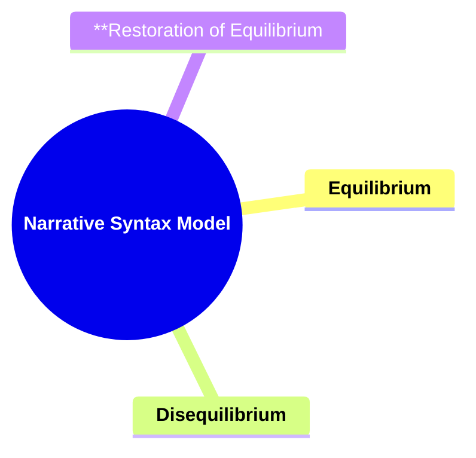

---

### 1. **Todorov's Narrative Syntax Model**

- **Narrative Syntax**:
  - **Definition**: Tzvetan Todorov posits that narratives can be analyzed through a syntax-like structure, analogous to how sentences are constructed in language. This approach views narratives as having a formal structure that can be broken down into key elements, each contributing to the overall progression of the story. Todorov's model identifies a pattern of equilibrium, disequilibrium, and restoration of equilibrium as the foundational structure of many narratives.

---

### 2. **Key Elements of Narrative Syntax**

#### 2.1. **Equilibrium**

- **Definition**:
  - The narrative begins with a state of equilibrium, where the story world is in a condition of balance or normalcy. This initial state serves as a baseline from which the story’s events will deviate.

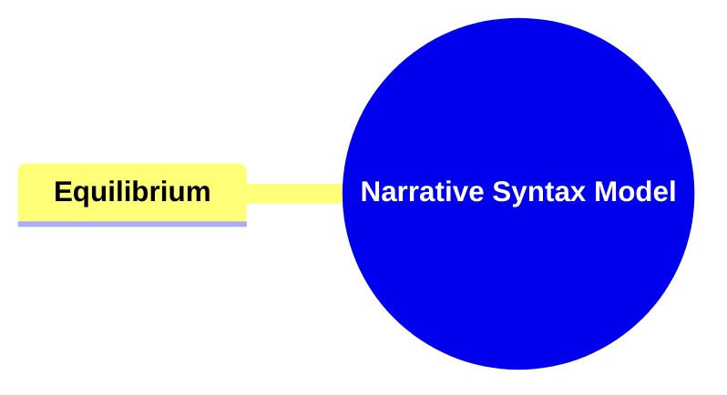

##### 2.1.1. **Components of Equilibrium**

###### 2.1.1.1. **Establishment of Normalcy**:

- **Definition**: The story world is introduced as stable, with characters living in routine or expected ways. This normalcy sets the stage for understanding the significance of the upcoming disruption.

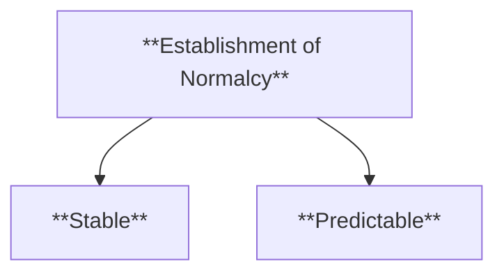

- **Characteristics**:
  - **Stable**: Presents a calm, balanced environment for characters.
  - **Predictable**: Events and character actions follow a routine or expected pattern.

###### 2.1.1.2. **Character Introduction**:

- **Definition**: Key characters are introduced, offering insight into their backgrounds, personalities, and relationships with others.

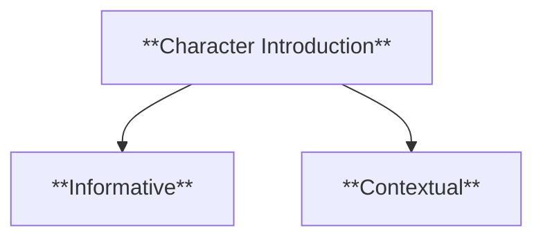

- **Characteristics**:
  - **Informative**: Provides essential details about the characters, their roles, and relationships.
  - **Contextual**: Offers background that helps the audience understand the characters' motives and actions.

###### 2.1.1.3. **Setting Introduction**:

- **Definition**: The environment or world in which the characters operate is established, setting the stage for the narrative’s unfolding events.

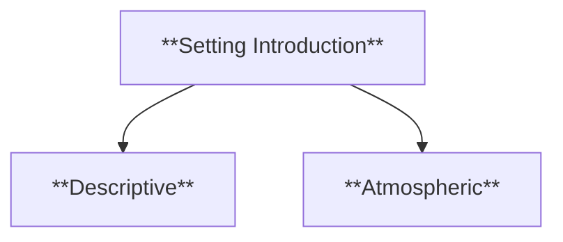

- **Characteristics**:
  - **Descriptive**: The setting is richly described, painting a vivid picture of the world.
  - **Atmospheric**: Establishes the mood and tone that will influence the story's progression.

###### 2.1.1.4. **Implicit Expectations**:

- **Definition**: Unstated or subtly conveyed norms that the characters and audience come to understand through context and subtext.

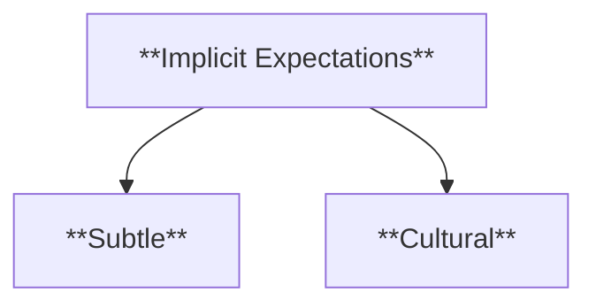

- **Characteristics**:
  - **Subtle**: Norms are conveyed through actions, dialogue, or societal behaviors rather than being directly stated.
  - **Cultural**: Reflects underlying cultural or societal norms that characters are influenced by.

###### 2.1.1.5. **Explicit Expectations**:

- **Definition**: Clearly stated norms or rules that are presented directly to the characters and audience, often setting up future challenges.

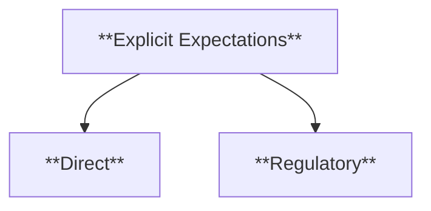

- **Characteristics**:

  - **Direct**: The expectations are clearly outlined, often through dialogue or exposition.
  - **Regulatory**: These expectations establish rules or standards that characters are aware of and expected to follow.

##### 2.1.2. **Purpose and Function**:

- **Establishing the Status Quo**: Provides a clear sense of the normal conditions before conflict arises.
- **Character and Setting Introduction**: Introduces key elements of the story world to engage the audience.
- **The Calm Before the Storm**: Highlights the peace or routine that will be disrupted.

##### 2.1.3. **Contextualization**:

- **Narrative Foundations**: Equilibrium is essential for setting up the baseline of the story’s world.
- **Genre Variations**: The form and tone of equilibrium can change depending on the genre.
- **Narrative Expectations**: Helps the audience understand the magnitude of the disequilibrium.

---

#### 2.2. **Disequilibrium**

- **Definition**:
  - Disequilibrium occurs when an event disrupts the initial balance, introducing conflict or tension into the narrative. This disruption is the catalyst for the story, driving the plot forward.

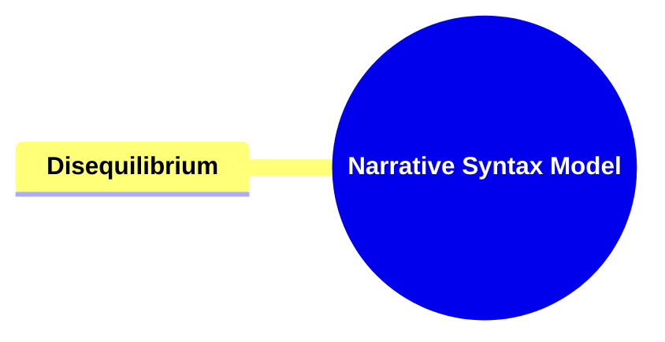

##### 2.2.1. **Components of Disequilibrium**

###### 2.2.1.1. **Catalyst Event**:

- **Definition**: The specific event or action that disrupts the equilibrium and introduces conflict.

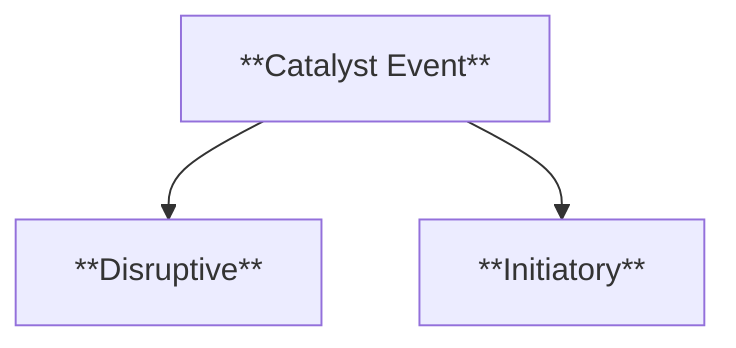

- **Characteristics**:
  - **Disruptive**: Causes an immediate change or upset in the story’s world.
  - **Initiatory**: Begins the central conflict or problem of the narrative.

###### 2.2.1.2. **Introduction of Conflict**:

- **Definition**: The disruption introduces conflict or tension that drives the story forward.

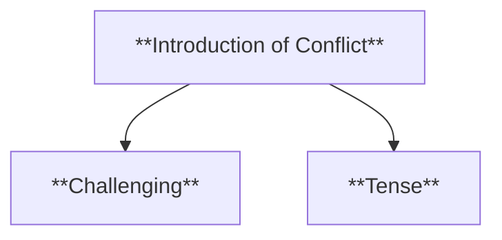

- **Characteristics**:
  - **Challenging**: Presents obstacles or problems the characters must face.
  - **Tense**: Raises the stakes and introduces tension into the narrative.

###### 2.2.1.3. **Character Reaction**:

- **Definition**: How characters respond emotionally, mentally, or physically to disruptions or challenges within the narrative.

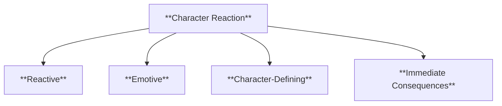

- **Characteristics**:
  - **Reactive**: Characters respond immediately to events, showing their instincts, emotions, or decisions.
  - **Emotive**: Reveals the character’s internal state, such as fear, anger, or determination.
  - **Character-Defining**: These reactions often showcase core personality traits, values, or motivations.
  - **Immediate Consequences**: The character’s reactions usually lead to immediate effects on the plot or other characters.

###### 2.2.1.4. **Character Adaptation**:

- **Definition**: How characters adjust their behavior, strategies, or mindset to overcome challenges or disruptions, leading to growth or development.

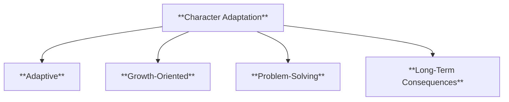

- **Characteristics**:
  - **Adaptive**: Characters modify their actions or plans to cope with changing circumstances.
  - **Growth-Oriented**: Character adaptation often leads to personal development or transformation.
  - **Problem-Solving**: Adaptation highlights a character’s resourcefulness and ability to navigate difficult situations.
  - **Long-Term Consequences**: The character’s ability to adapt often drives long-term changes in the plot and character arc.

###### 2.2.1.5. **Escalation of Tension**:

- **Definition**: As the disequilibrium progresses, the conflict intensifies, building toward a climax.

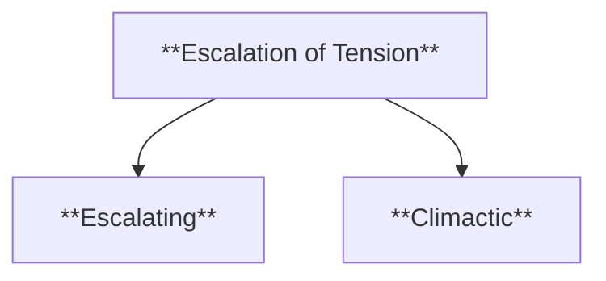

- **Characteristics**:

  - **Escalating**: Conflict and tension increase steadily.
  - **Climactic**: Leads toward the story’s peak or turning point.

##### 2.2.2. - **Purpose and Function**:

- **Introducing Conflict**: Sets the story in motion by presenting a challenge.
- **Character Development**: Forces characters to grow, adapt, or face failure.
- **Building Tension**: Increases suspense and stakes for the audience.

##### 2.2.3. - **Contextualization**:

- **Central to Plot Progression**: Marks the transition from setup to main action.
- **Narrative Dynamics**: The nature of the disequilibrium can vary across genres.
- **Symbolic Representation**: Represents broader themes or critiques within the story.

---

#### 2.3. **Restoration of Equilibrium**

- **Definition**:
  - The narrative concludes with a restoration of equilibrium, where a new balance is achieved. This new state may either mirror the original equilibrium or reflect a transformed reality.

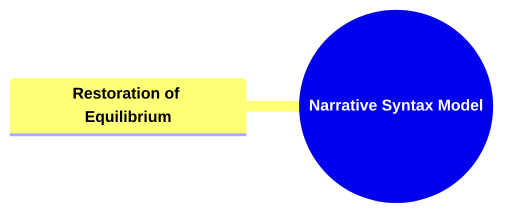

##### 2.3.1. **Components of Restoration of Equilibrium**

###### 2.3.1.1. **Resolution of Conflict**:

- **Definition**: The central conflict is resolved, bringing closure to the story’s tension.

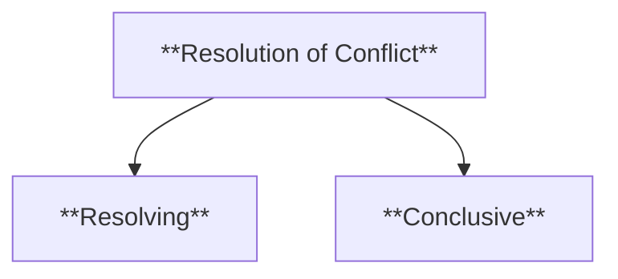

- **Characteristics**:
  - **Resolving**: Puts an end to the conflict that drives the narrative.
  - **Conclusive**: Marks the finality of the story’s primary challenges.

###### 2.3.1.2. **Establishment of a New Normal**:

- **Definition**: The story concludes with a new, often transformed, state of balance.

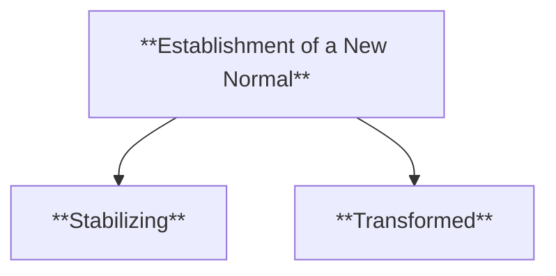

- **Characteristics**:
  - **Stabilizing**: Brings the story world back to a stable state.
  - **Transformed**: Reflects changes that have occurred throughout the narrative.

###### 2.3.1.3. **Character Growth**:

- **Definition**: The character evolves, gaining new insights or developing emotionally and mentally as a result of the events in the story.

- **Characteristics**:
  - **Developmental**: The character undergoes personal growth or maturation.
  - **Gradual**: The change often occurs over time as the character processes their experiences.

###### 2.3.1.4. **Character Change**:

- **Definition**: The character undergoes a transformation, often resulting in a significant shift in their beliefs, behaviors, or outlook

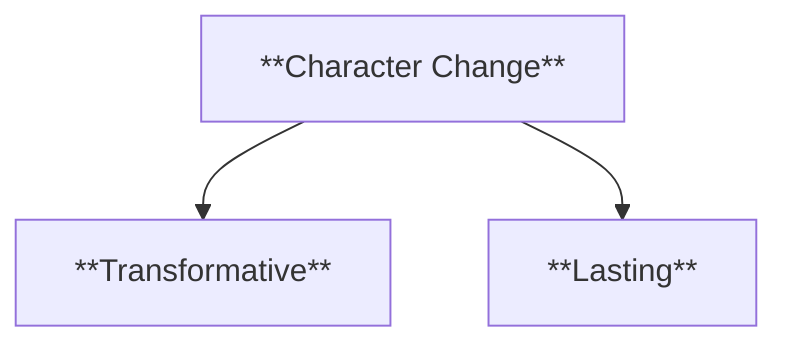

- **Characteristics**:
  - **Transformative**: The change is substantial, altering the character’s core behavior or beliefs.
  - **Lasting**: The impact of the change is enduring, affecting the character long after the story’s conclusion.

###### 2.3.1.5. **Thematic Closure**:

- **Definition**: The narrative concludes with thematic closure, often reinforcing the central ideas or messages.

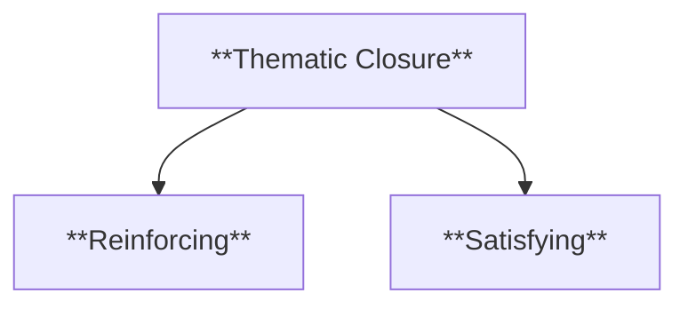

- **Characteristics**:

  - **Reinforcing**: Brings the story’s themes to a conclusion.
  - **Satisfying**: Leaves the audience with a sense of completion or resolution.

##### 2.3.2. **Purpose and Function**:

- **Resolution of Conflict**: Concludes the story’s central challenges and tensions.
- **Narrative Closure**: Provides a satisfying end, tying up loose ends.
- **Reflection and Transformation**: Highlights the growth or changes resulting from the conflict.

##### 2.3.3. **Contextualization**:

- **Comparative Analysis**: The final equilibrium often reflects the journey undertaken by the characters.
- **Genre-Specific Endings**: The nature of the restored equilibrium can differ based on the genre.
- **Philosophical Implications**: The way the equilibrium is restored can reflect deeper thematic or philosophical ideas.

--

### 3. **Theoretical Significance**

- **Todorov’s Model in Narrative Theory**:

  - Todorov's narrative syntax model is essential for distilling stories into a formal structure. By identifying equilibrium, disequilibrium, and restoration, it provides a foundational framework for understanding narrative progression.
  - **Application in Narrative Analysis**: Useful for identifying how narratives manage tension, conflict, and resolution across genres.
  - **Cross-Genre Applicability**: Versatile in analyzing different forms of storytelling, including film, literature, and digital media.

- **Subversion and Innovation**:

  - **Subversion of Todorov's Model**: Modern narratives often challenge the traditional equilibrium-disequilibrium-restoration structure by starting in disequilibrium or never resolving conflicts.
  - **Innovation in Narrative Forms**: Todorov’s model has inspired experimental structures, particularly in non-linear storytelling.

- **Cultural and Historical Perspectives**:

  - **Cultural Variations**: The model’s application can vary across cultural contexts, reflecting different narrative traditions.
  - **Historical Context**: Todorov’s work is rooted in structuralism, influencing a wide range of disciplines beyond narratology.

- **Educational and Analytical Utility**:

  - **Teaching Narrative Structure**: A valuable tool for understanding and teaching the basics of storytelling.
  - **Analytical Framework**: Provides a robust method for comparing different narratives and exploring deeper meanings.

- **Limitations and Extensions**:
  - **Limitations**: Todorov’s model may oversimplify more complex, non-linear narratives.
  - **Extensions and Adaptations**: Scholars have expanded the model to address more intricate narrative structures and thematic developments.

---

### 4. **Conclusion**

- **Tzvetan Todorov’s Lasting Influence**:
  - Todorov’s model remains foundational for understanding narrative structure. Its ability to distill stories into three key elements—equilibrium, disequilibrium, and restoration—continues to provide a powerful tool for analysis across media and genres.
  - **Impact on Storytelling and Analysis**: Todorov’s insights have influenced both narrative construction and academic analysis, emphasizing the importance of structure in storytelling.
  - **Broader Implications**: The model reflects universal aspects of human experience, underscoring how stories mirror our constant negotiation between stability, conflict, and resolution.

---

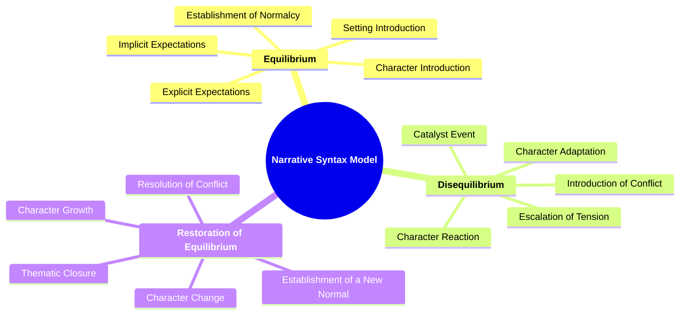
