- [1. **Brooks's Middle as a Site of Meaning Framework**](#1-brookss-middle-as-a-site-of-meaning-framework)
- [2. **Key Concepts**](#2-key-concepts)
  - [2.1. **Narrative Development**](#21-narrative-development)
    - [2.1.1. **Components of Narrative Development**](#211-components-of-narrative-development)
      - [2.1.1.1. **Conflict Intensification**:](#2111-conflict-intensification)
      - [2.1.1.2. **Character Development**](#2112-character-development)
      - [2.1.1.3. **Plot Complication**](#2113-plot-complication)
      - [2.1.1.4. **Thematic Exploration**](#2114-thematic-exploration)
  - [2.2. **The Role of Tension**](#22-the-role-of-tension)
    - [2.2.1. **Components of The Role of Tension**](#221-components-of-the-role-of-tension)
      - [2.2.1.1. **Heightened Stakes**](#2211-heightened-stakes)
      - [2.2.1.2. **Urgency**](#2212-urgency)
      - [2.2.1.3. **Suspense**](#2213-suspense)
  - [2.3. **The Role of Complexity**](#23-the-role-of-complexity)
    - [2.3.1. **Components of the Role of Complexity**](#231-components-of-the-role-of-complexity)
      - [2.3.1.1. **Multiple Plot Lines**](#2311-multiple-plot-lines)
      - [2.3.1.2. **Character Depth**](#2312-character-depth)
      - [2.3.1.3. **Thematic Layers**](#2313-thematic-layers)
- [3. **Brooks's Perspective on the Middle as a Narrative Focus**](#3-brookss-perspective-on-the-middle-as-a-narrative-focus)
- [4. **Theoretical Significance in Narratology**](#4-theoretical-significance-in-narratology)
- [5. **Conclusion**](#5-conclusion)

---

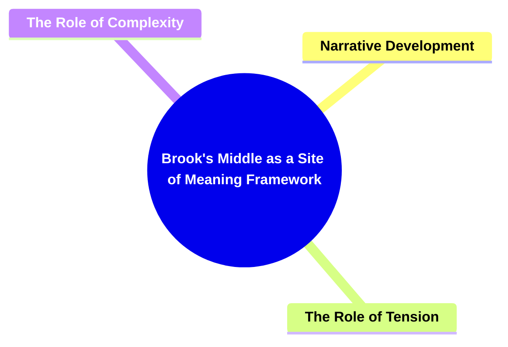

---

### 1. **Brooks's Middle as a Site of Meaning Framework**

- **The Middle as a Site of Meaning**:
  - **Definition**: Peter Brooks challenges traditional plot structures that emphasize the beginning and ending of a narrative, arguing that the middle is where a story's true meaning is developed. He highlights that the middle is crucial for deepening conflicts, characters, and themes, making it the core of narrative complexity.

---

### 2. **Key Concepts**

#### 2.1. **Narrative Development**

- **Definition**:
  - The middle of a narrative is the site of major conflict, character growth, and plot complication. It represents the phase where foundational elements from the beginning are tested and expanded upon, leading to greater depth and tension.

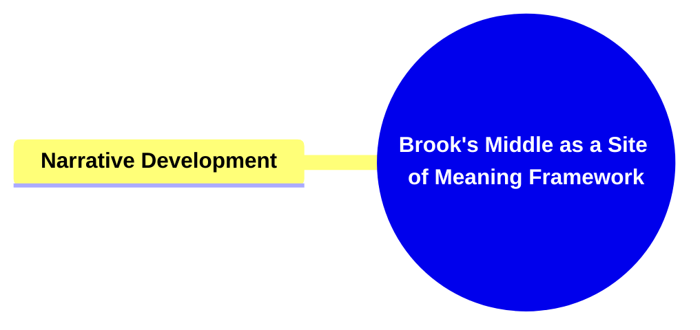

##### 2.1.1. **Components of Narrative Development**

###### 2.1.1.1. **Conflict Intensification**:

- **Definition**: In the middle, conflicts grow more serious and complex, with the stakes raised for characters and outcomes.

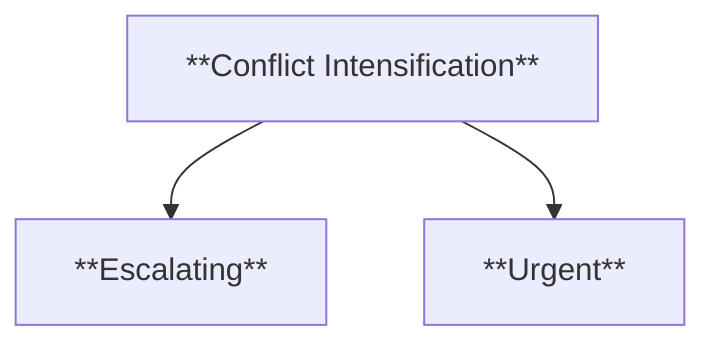

- **Components of Conflict Intensification**:
  - **Escalating**: Tensions increase, putting characters in more difficult situations.
  - **Urgent**: The pressure on the characters becomes more immediate and challenging.

###### 2.1.1.2. **Character Development**

- **Definition**: Characters face trials and dilemmas in the middle of the narrative that reveal their deeper complexities and catalyze their growth.

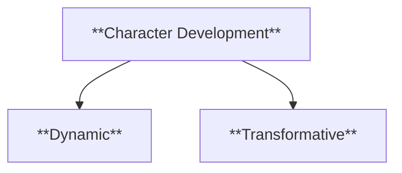

- **Characteristics**:
  - **Dynamic**: Characters evolve and change as they confront new challenges.
  - **Transformative**: The middle is where significant internal shifts occur in characters.

###### 2.1.1.3. **Plot Complication**

- **Definition**: The middle introduces twists, new subplots, or unexpected developments that complicate the narrative.

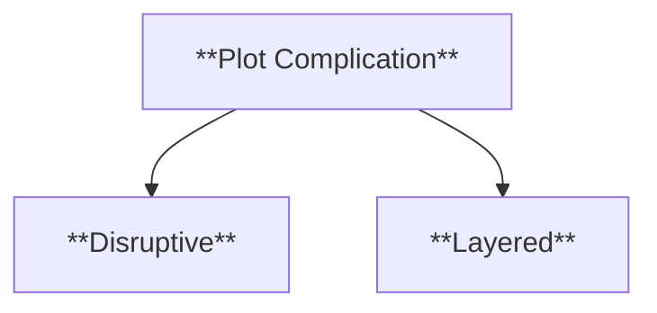

- **Characteristics**:
  - **Disruptive**: These complications challenge the trajectory set in the beginning.
  - **Layered**: New narrative elements enrich the story's complexity.

###### 2.1.1.4. **Thematic Exploration**

- **Definition**: The middle of the narrative is where central themes are thoroughly examined and expanded through character actions and plot events.

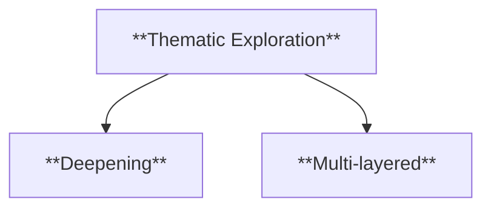

- **Characteristics**:
  - **Deepening**: Themes are explored in greater detail and complexity.
  - **Multi-layered**: The narrative uses different events to address multiple facets of its central themes.

---

#### 2.2. **The Role of Tension**

- **Definition**: Tension in the middle of a narrative is a critical factor in driving the story forward. It keeps the audience engaged by heightening stakes and creating a sense of urgency as characters face increasingly challenging obstacles.

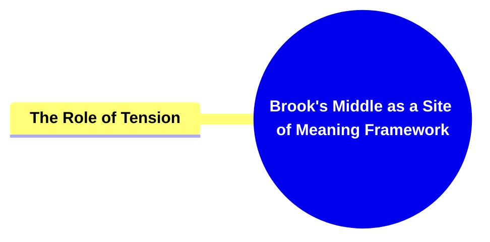

##### 2.2.1. **Components of The Role of Tension**

###### 2.2.1.1. **Heightened Stakes**

- **Definition**: As the narrative develops, the consequences of characters' actions grow more significant, often leading to moments where the outcome could drastically alter the course of the story. These increased stakes add tension and bring the narrative closer to a climactic turning point.

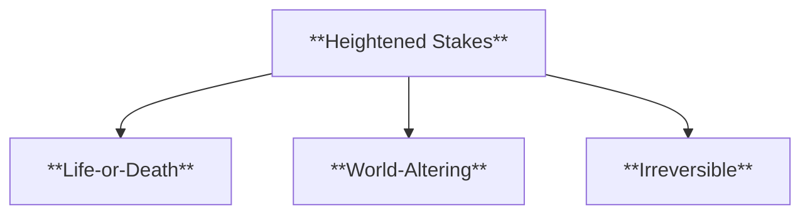

- **Characteristics**:
  - **Life-or-Death**: Characters often face life-threatening situations as the stakes reach their peak.
  - **World-Altering**: Outcomes may have large-scale effects on the world or setting, impacting many people.
  - **Irreversible**: Decisions made during these moments often cannot be undone, making the consequences permanent.

###### 2.2.1.2. **Urgency**

- **Definition**: Urgency in the narrative accelerates the pace of events, pushing characters to make critical decisions under increasing pressure. The sense of urgency drives the plot forward, often leading to moments where time is of the essence.

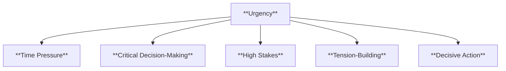

- **Characteristics**:
  - **Time Pressure**: The plot introduces a time-sensitive element, forcing characters to act quickly and make decisions with limited time.
  - **Critical Decision-Making**: Characters must make important, often irreversible decisions quickly, heightening the stakes and driving the narrative toward its resolution.
  - **High Stakes**: The urgency of the moment forces characters to act without fully considering the consequences, amplifying the risk.
  - **Tension-Building**: The rapid pace and pressure create tension that builds toward a climactic moment.
  - **Decisive Action**: Characters are forced into action without delay, often determining the success or failure of their goals.

###### 2.2.1.3. **Suspense**

- **Definition**: Suspense keeps the audience on edge by creating a sense of anticipation and uncertainty about how the narrative’s conflicts and challenges will be resolved. The feeling of suspense heightens the emotional engagement of the reader or viewer.

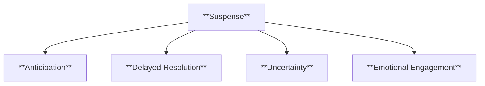

- **Characteristics**:
  - **Anticipation**: The audience anticipates an outcome but is unsure when or how it will happen, creating a sense of uncertainty and tension.
  - **Delayed Resolution**: Suspense often involves stretching out the time before a conflict or danger is resolved, building anticipation.
  - **Uncertainty**: The outcome remains unclear, keeping the audience guessing and increasing tension.
  - **Emotional Engagement**: Suspense draws the audience deeper into the story by making them emotionally invested in the characters’ fates.

---

#### 2.3. **The Role of Complexity**

- **Definition**: Complexity in the middle of a narrative involves the intertwining of multiple plot lines, character arcs, and thematic elements. It adds depth to the story, making it richer and more layered, and allowing for intricate development of the narrative.

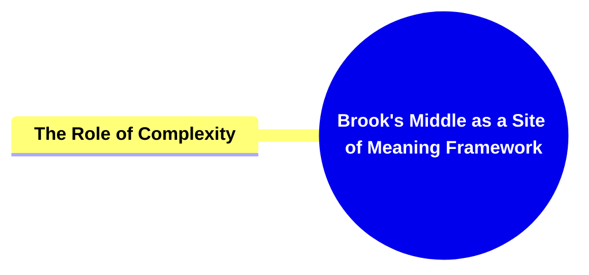

##### 2.3.1. **Components of the Role of Complexity**

###### 2.3.1.1. **Multiple Plot Lines**

- **Definition**: The narrative includes several subplots or parallel storylines that intersect and contribute to the overall plot, creating a more intricate and engaging story world. These subplots often enhance the complexity of the main plot by adding depth, tension, and variety.

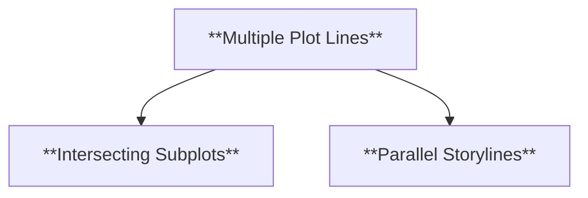

- **Characteristics**:
  - **Intersecting Subplots**: Different subplots run parallel but intersect at key moments, enhancing the central narrative by weaving together various
  - **Parallel Storylines**: Different plot threads develop in tandem, offering diverse perspectives and adding richness to the narrative without necessarily intersecting immediately.

###### 2.3.1.2. **Character Depth**

- **Definition**: Characters become more complex and multi-dimensional as the narrative progresses, with their motivations, flaws, and growth explored in greater detail. The middle of the story often provides opportunities for deeper character development, allowing for a richer emotional and psychological portrayal.

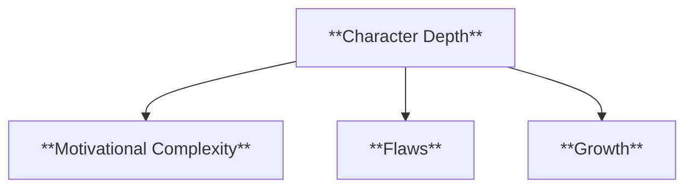

- **Characteristics**:
  - **Motivational Complexity**: Characters are driven by a range of motivations that go beyond simple goals, reflecting inner conflicts, desires, and moral dilemmas.
  - **Flaws**: Characters exhibit personal flaws that hinder their progress, creating obstacles within the narrative that affect their decisions, relationships, and overall journey.
  - **Growth**: These personal flaws often lead to growth and transformation throughout the narrative, as characters confront their weaknesses and learn from their experiences.

###### 2.3.1.3. **Thematic Layers**

- **Definition**: The middle of the narrative provides space for a deeper exploration of central themes, presenting different perspectives and conflicts that enrich the story's meaning. These thematic layers often reflect on the broader questions or ideas the narrative seeks to address.

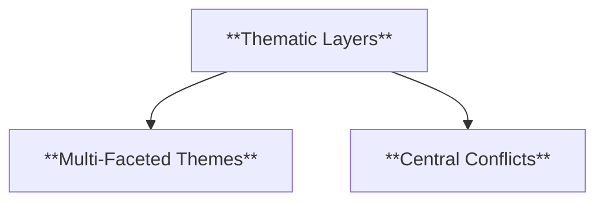

- **Characteristics**:
  - **Multi-Faceted Themes**: Themes are explored from multiple angles, often through the actions of different characters or subplots, adding richness and complexity to the narrative.
  - **Central Conflicts**: Thematic exploration is often tied to the central conflicts of the story, with characters' actions and decisions reflecting the broader themes at play.

---

### 3. **Brooks's Perspective on the Middle as a Narrative Focus**

- **Reframing Narrative Structure**:
  - **Definition**: Brooks suggests a shift in narrative analysis, emphasizing the middle as the focal point where the story's true depth is realized. Rather than seeing it as a bridge between the beginning and end, the middle should be considered the heart of the narrative.
  - **Characteristics**:
    - **Central**: The middle is the primary site of meaning, where the story’s complexity is most evident.
    - **Crucial**: The middle holds the key to the narrative’s ultimate impact.

### 4. **Theoretical Significance in Narratology**

- **Definition**: Peter Brooks’s framework on the middle as a narrative focal point challenges conventional linear plot analysis, offering a new way to understand the dynamics of narrative progression. By emphasizing the middle as the critical site of meaning, Brooks reframes how narratologists approach the structure and function of narratives.
- **Significance**:
  - **Narrative Centrality**: Shifts the focus from beginnings and endings to the middle, highlighting its role in character and thematic development.
  - **Complexity and Depth**: Suggests that the middle is the richest part of the narrative, where layers of meaning are constructed and explored in the most detail.
  - **Broader Application**: This perspective can be applied to both classical and modern storytelling, offering insights into the narrative structure of complex, multi-threaded plots in literature and media.

---

### 5. **Conclusion**

- Peter Brooks's concept of the middle as the central site of narrative meaning offers a profound shift in how narratives are analyzed. Rather than viewing the middle as a transitional phase, Brooks highlights its importance in deepening conflicts, character arcs, and themes. His theoretical framework not only adds complexity to traditional plot structures but also opens up new avenues for exploring the intricate mechanics of storytelling, ensuring that the middle is recognized as a crucial element of narrative architecture.

---

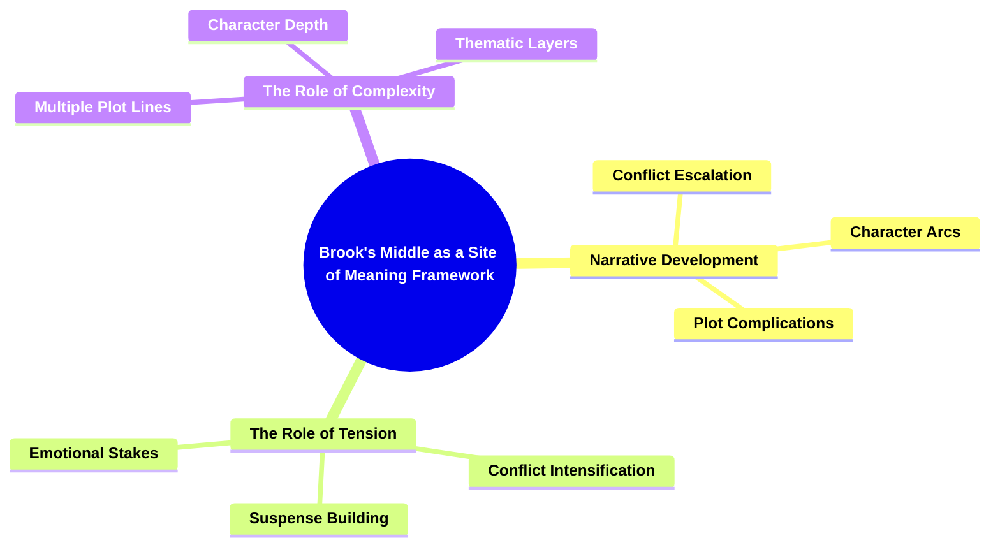
