- [1. Title: **Brooks's Melodramatic Imagination Framework**](#1-title-brookss-melodramatic-imagination-framework)
- [2. **Key Concepts**](#2-key-concepts)
  - [2.1. **Melodrama**](#21-melodrama)
    - [2.1.1. **Components of Melodrama**:](#211-components-of-melodrama)
      - [2.1.1.1. **Amplified Emotions**](#2111-amplified-emotions)
      - [2.1.1.2. **Clear Moral Distinctions**](#2112-clear-moral-distinctions)
      - [2.1.1.3. **Dramatic Conflicts**](#2113-dramatic-conflicts)
      - [2.1.1.4. **Mode of Excess**](#2114-mode-of-excess)
  - [2.2. **Modern Narrative**](#22-modern-narrative)
    - [2.2.1. **Components of Modern Narrative**:](#221-components-of-modern-narrative)
      - [2.2.1.1. **Psychological Complexity**](#2211-psychological-complexity)
      - [2.2.1.2. **Fragmented Structures**](#2212-fragmented-structures)
      - [2.2.1.3. **Subtle Moral Ambiguities**](#2213-subtle-moral-ambiguities)
      - [2.2.1.4. **Social Reflection**](#2214-social-reflection)
      - [2.2.1.5. **Cultural Reflection**](#2215-cultural-reflection)
  - [2.3. **Moral Polarization**](#23-moral-polarization)
    - [2.3.1. **Components of Moral Polarization**:](#231-components-of-moral-polarization)
      - [2.3.1.1. **Binary Opposition**](#2311-binary-opposition)
      - [2.3.1.2. **Moral Clarity**](#2312-moral-clarity)
  - [2.4. **Heightened Emotional Stakes**](#24-heightened-emotional-stakes)
    - [2.4.1. **Components of Emotional Stakes**:](#241-components-of-emotional-stakes)
      - [2.4.1.1. **Intense Emotions**](#2411-intense-emotions)
      - [2.4.1.2. **Emotional Extremes**](#2412-emotional-extremes)
  - [2.5. **Mode of Excess**](#25-mode-of-excess)
    - [2.5.1. **Components of Mode of Excess**:](#251-components-of-mode-of-excess)
      - [2.5.1.1. **Exaggerated Conflict**](#2511-exaggerated-conflict)
      - [2.5.1.2. **Dramatic Excess**](#2512-dramatic-excess)
  - [2.6. **Influence on Modern Genre Fiction**](#26-influence-on-modern-genre-fiction)
    - [2.6.1. **Components of Influence of Modern Genre Fiction**:](#261-components-of-influence-of-modern-genre-fiction)
      - [2.6.1.1. **Cross-Genre Influence**](#2611-cross-genre-influence)
      - [2.6.1.2. **Enduring Legacy**](#2612-enduring-legacy)
- [3. **Implications of Brooks's Framework**](#3-implications-of-brookss-framework)


---

### 1. Title: **Brooks's Melodramatic Imagination Framework**

- **The Melodramatic Imagination**:
  - **Definition**: In *"The Melodramatic Imagination: Balzac, Henry James, Melodrama, and the Mode of Excess"* (1976), Peter Brooks explores how melodrama has influenced modern narrative. Characterized by exaggerated emotions, stark moral oppositions, and intense conflicts, melodrama plays a crucial role in shaping how modern literature and storytelling approach moral and emotional complexity.

---
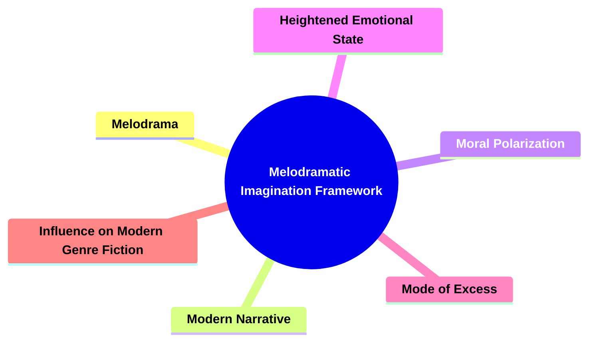

---

### 2. **Key Concepts**

#### 2.1. **Melodrama**

- **Definition**:
  - Melodrama is a narrative mode that amplifies emotional stakes and highlights moral polarities, often presenting characters and situations in clear-cut terms of good versus evil. Rooted in 19th-century popular theater, this mode dramatizes internal and social conflicts.

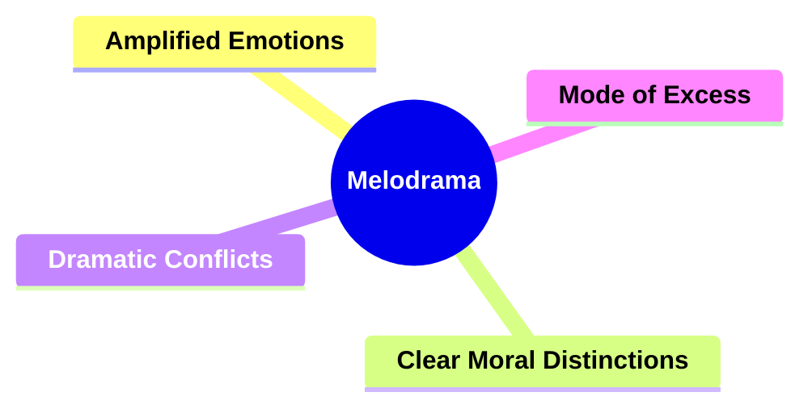

##### 2.1.1. **Components of Melodrama**:


###### 2.1.1.1. **Amplified Emotions**
  - **Definition**: Heightens the emotional stakes of the narrative, leading characters to experience intense feelings such as love, fear, or despair in extreme ways.

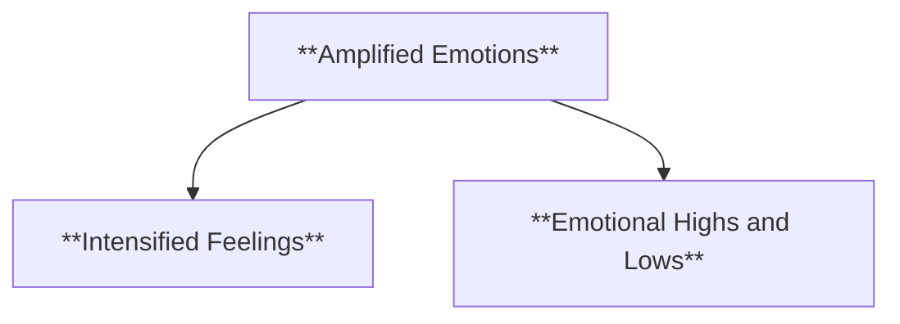

  - **Characteristics**
    - **Intensified Feelings**: Characters are pushed to emotional extremes, experiencing heightened joy, sorrow, or anxiety that drives the drama forward.
    - **Emotional Highs and Lows**: The narrative takes characters through significant emotional shifts, where their responses to events are portrayed with great intensity.

###### 2.1.1.2. **Clear Moral Distinctions**
  - **Definition**: Presents moral dilemmas in stark terms, with heroes and villains portrayed with sharp ethical contrasts, making it easy to distinguish between good and evil.

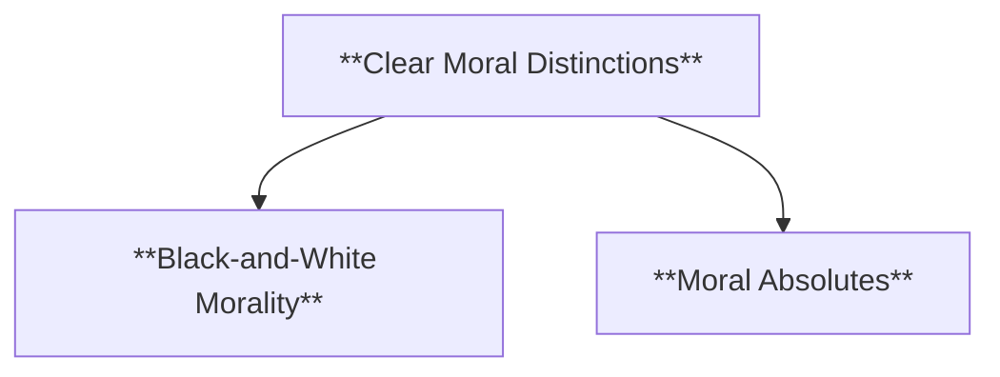

  - **Characteristics**
    - **Black-and-White Morality**: The ethical lines in the story are clearly drawn, with characters representing distinct moral positions, such as the virtuous hero versus the corrupt villain.
    - **Moral Absolutes**: The narrative often avoids ambiguity, offering clear resolutions where good triumphs over evil, reinforcing traditional moral ideals.

###### 2.1.1.3. **Dramatic Conflicts**
  - **Definition**: Thrives on intense conflict, particularly in extreme situations where characters must confront deep moral, emotional, or social challenges.

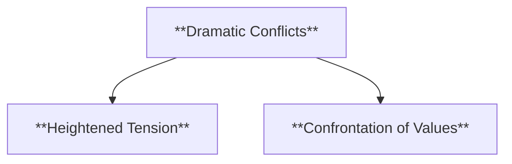

  - **Characteristics**
    - **Heightened Tension**: Characters face significant internal and external struggles, often involving life-altering decisions or crises that elevate the dramatic stakes.
    - **Confrontation of Values**: The conflicts in the story typically revolve around fundamental disagreements over values, ethics, or emotional desires, pushing characters to their limits.

###### 2.1.1.4. **Mode of Excess**
  - **Definition**: Leans into exaggerated actions, emotions, or situations to highlight emotional and ethical extremes, often resulting in heightened drama and intensity.

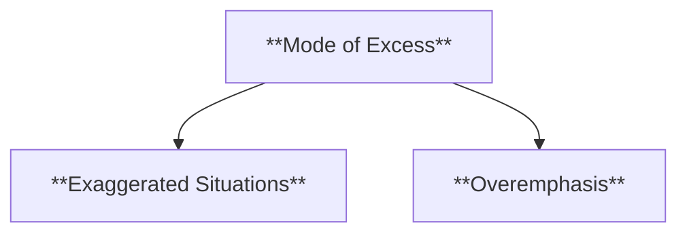
  - **Characteristics**
    - **Exaggerated Situations**: The narrative includes over-the-top actions, events, or reactions that push the boundaries of realism to emphasize emotional or moral stakes.
    - **Overemphasis**: Characters may act or react in ways that seem excessive or melodramatic, reflecting the story's focus on exploring extremes in behavior, emotion, or morality.


---
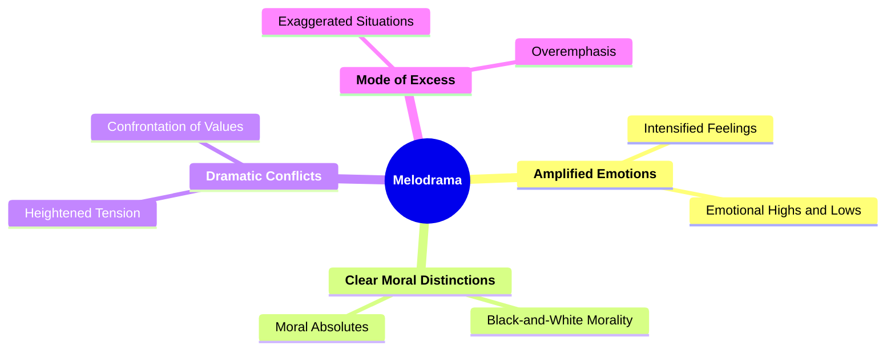
---

#### 2.2. **Modern Narrative**

- **Definition**:
  - Modern narrative encompasses literary works that reflect the complexities of contemporary society, often emphasizing psychological depth, fragmented structures, and the exploration of internal conflicts.

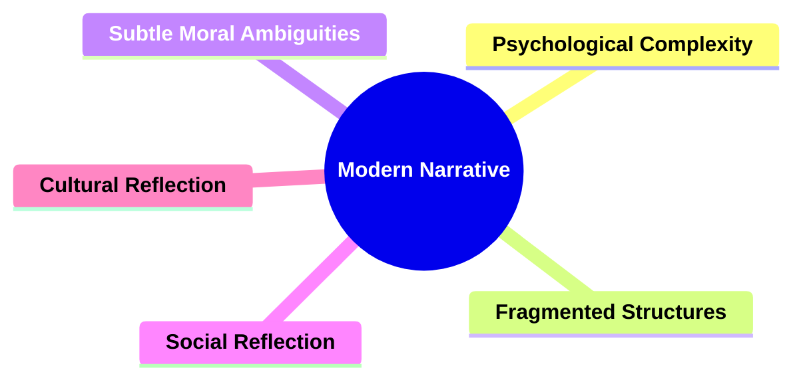

##### 2.2.1. **Components of Modern Narrative**:

###### 2.2.1.1. **Psychological Complexity**
  - **Definition**: Focuses on the internal lives and struggles of characters, often delving into their thoughts, emotions, and ambiguous moral dilemmas.

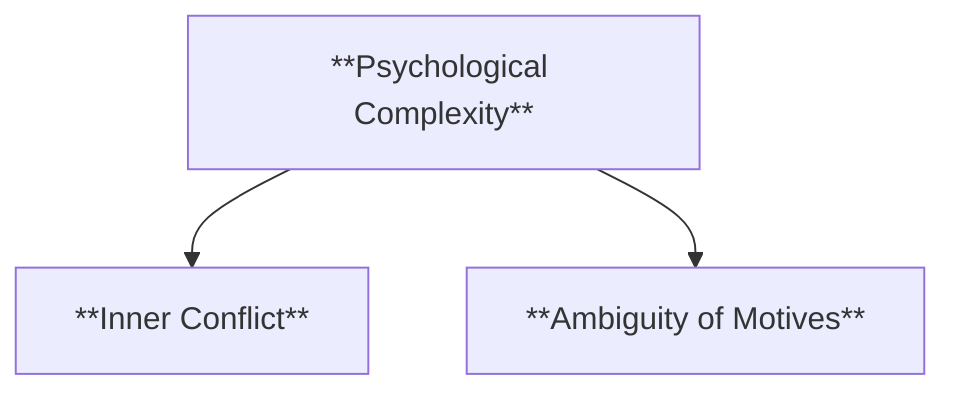

  - **Characteristics**
    - **Inner Conflict**: Characters grapple with difficult decisions, personal insecurities, or unresolved traumas, revealing their psychological depth.
    - **Ambiguity of Motives**: Rather than clear-cut heroes or villains, characters are portrayed with layered motivations, making them more realistic and complex.

###### 2.2.1.2. **Fragmented Structures**
  - **Definition**: Modern narratives often use non-linear or fragmented structures, breaking away from traditional storytelling to reflect the complexities of human experience.

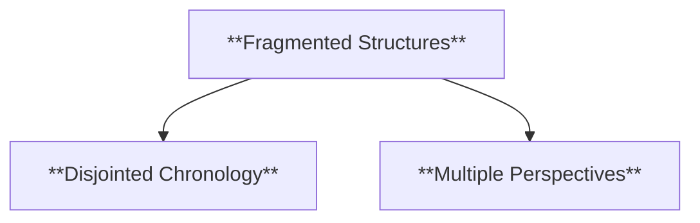

  - **Characteristics**
    - **Disjointed Chronology**: The narrative may jump between time periods, events, or perspectives, requiring the reader to piece together the storyline.
    - **Multiple Perspectives**: Stories may be told from various viewpoints, creating a mosaic of experiences that reflects the fragmented nature of reality.

###### 2.2.1.3. **Subtle Moral Ambiguities**
  - **Definition**: Unlike melodrama, modern narratives blur ethical distinctions, portraying characters with mixed motivations and unresolved moral conflicts.

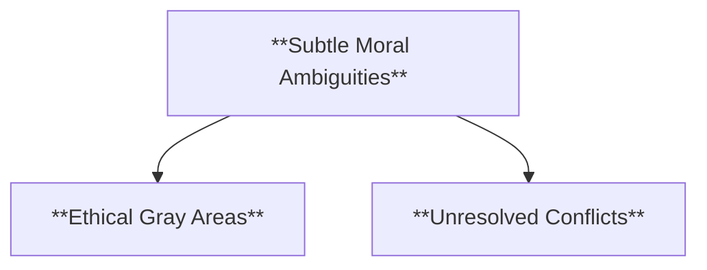

  - **Characteristics**
    - **Ethical Gray Areas**: Characters may navigate situations where right and wrong are unclear, leaving the reader to question moral certainties.
    - **Unresolved Conflicts**: The narrative may leave moral questions unanswered, reflecting the complexity of real-life ethical dilemmas.

###### 2.2.1.4. **Social Reflection**
- **Definition**: Modern narratives reflect on broader social issues, positioning individual conflicts within the context of societal structures.

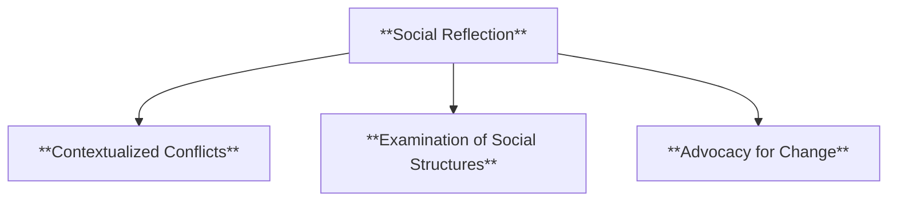


- **Characteristics**
  - **Contextualized Conflicts**: Individual struggles are depicted in relation to larger social forces, such as class, race, or gender.
  - **Examination of Social Structures**: The narrative examines societal institutions and their impact on characters and communities.
  - **Advocacy for Change**: The story highlights social injustices and advocates for reform or raises awareness about societal issues.

###### 2.2.1.5. **Cultural Reflection**
- **Definition**: Modern narratives offer insight into cultural norms, using personal stories to critique or highlight broader cultural values and traditions.

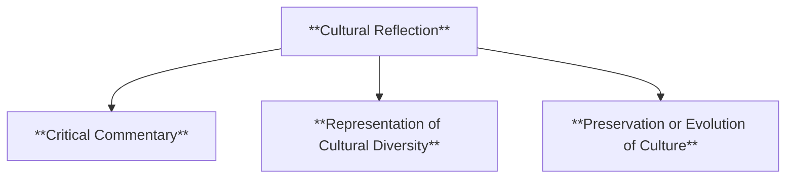


- **Characteristics**
  - **Critical Commentary**: The narrative critiques or reflects upon cultural norms, engaging with contemporary debates and cultural shifts.
  - **Representation of Cultural Diversity**: The story includes diverse cultural perspectives and practices, showcasing a variety of traditions and beliefs.
  - **Preservation or Evolution of Culture**: The narrative explores how cultures are maintained, transformed, or challenged over time.


---
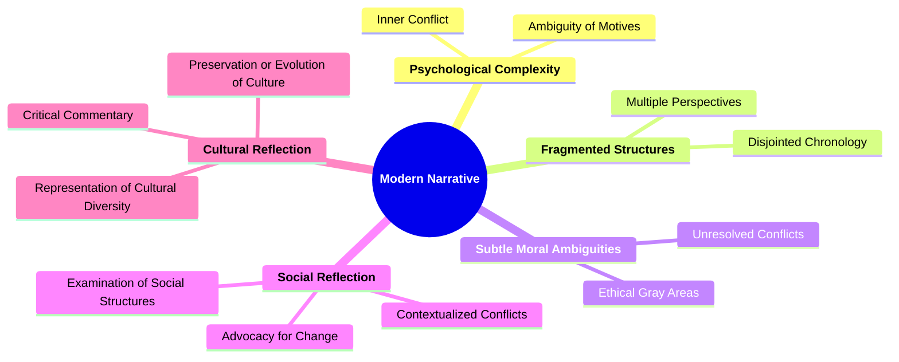
---

#### 2.3. **Moral Polarization**

- **Definition**:
  - Moral polarization in melodrama refers to its tendency to depict characters and conflicts in terms of absolute moral opposites—good versus evil, innocence versus corruption.

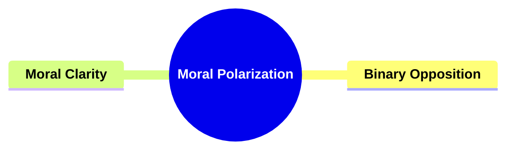

##### 2.3.1. **Components of Moral Polarization**:
###### 2.3.1.1. **Binary Opposition**

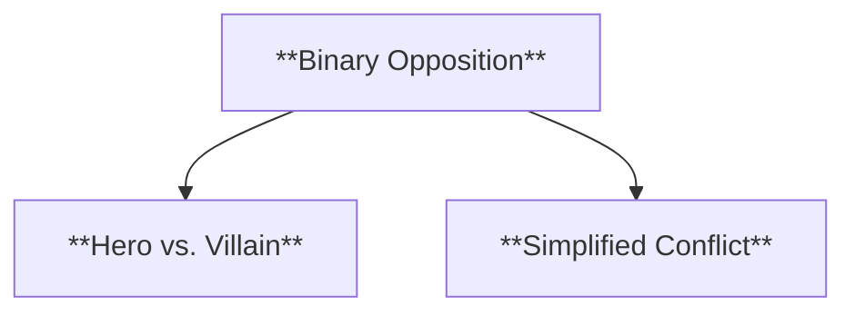


  - **Definition**: Characters are often divided into clear, opposing categories of hero and villain, embodying the forces of good and evil.
  - **Characteristics**
    - **Hero vs. Villain**: The narrative establishes a strong contrast between the protagonist and antagonist, with each representing distinct moral or ethical positions.
    - **Simplified Conflict**: The opposition between characters is straightforward, emphasizing clear-cut battles between right and wrong, good and evil.

###### 2.3.1.2. **Moral Clarity**
  - **Definition**: Ethical dilemmas are framed in stark, unambiguous terms, making the moral stakes of the narrative easily identifiable for the audience.

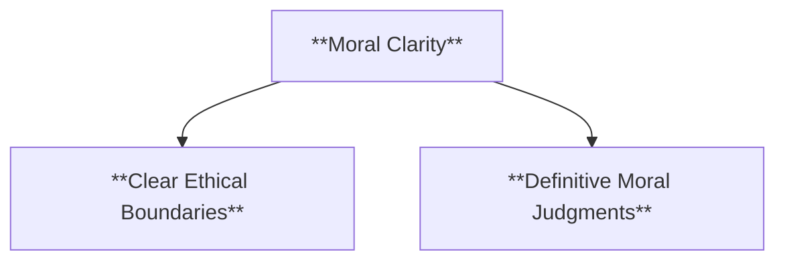
  - **Characteristics**
    - **Clear Ethical Boundaries**: The story leaves little room for moral ambiguity, presenting the audience with clear distinctions between what is right and wrong.
    - **Definitive Moral Judgments**: Characters' actions are judged against an established ethical framework, with good actions rewarded and bad ones condemned, ensuring a clear moral resolution.

---
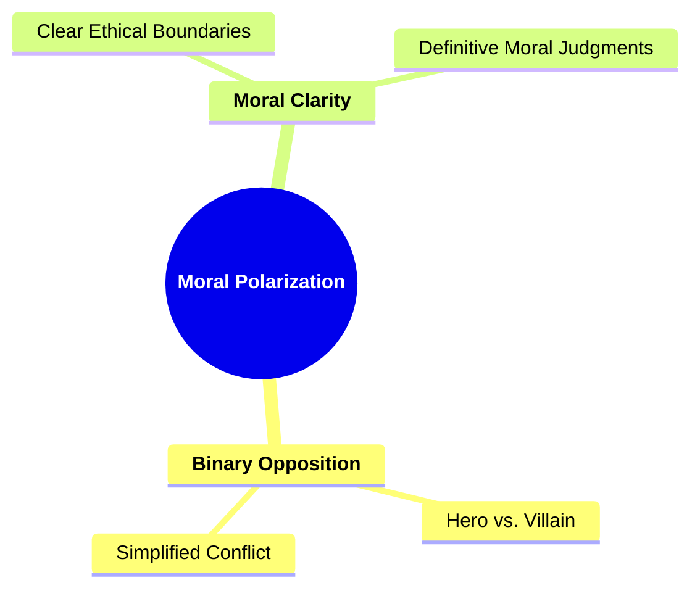
---

#### 2.4. **Heightened Emotional Stakes**

- **Definition**:
  - Melodrama is known for its intense emotional expression, where characters experience extreme feelings that reflect the narrative's heightened moral and emotional stakes.

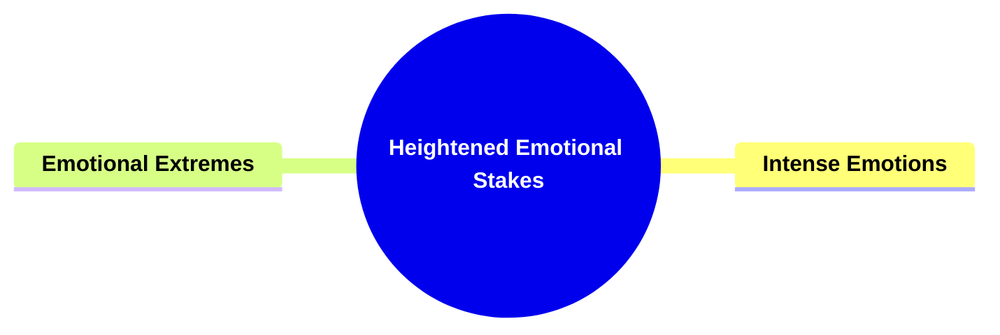

##### 2.4.1. **Components of Emotional Stakes**:
###### 2.4.1.1. **Intense Emotions**
  - **Definition**: Characters are depicted in extreme emotional states, experiencing heightened feelings such as intense love, deep hatred, or overwhelming despair.

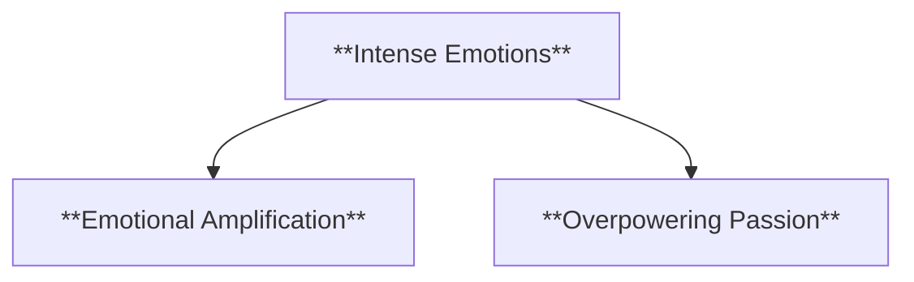

  - **Characteristics**
    - **Emotional Amplification**: Characters' emotions are portrayed in exaggerated forms, making their feelings central to the narrative's dramatic effect.
    - **Overpowering Passion**: Characters often express emotions that dominate their actions and decisions, creating a heightened emotional atmosphere in the story.

###### 2.4.1.2. **Emotional Extremes**
  - **Definition**: The narrative pushes characters to their emotional limits, forcing them to confront powerful feelings that create dramatic tension and engage the audience.

```mermaid
flowchart TD;
    D[**Emotional Extremes**] --> E[**Tension from Emotional Peaks**];
    D --> F[**High-Intensity Conflict**];
```

  - **Characteristics**
    - **Tension from Emotional Peaks**: Characters face situations that drive them to extreme emotional reactions, heightening the drama and stakes within the story.
    - **High-Intensity Conflict**: The emotional extremes of the characters often lead to intense personal conflicts, where the stakes are amplified by their emotional states.

---
```mermaid
mindmap
  root((**Heightened Emotional Stakes**))
    **Intense Emotions**
      Emotional Amplification
      Overpowering Passion
    **Emotional Extremes**
      Tension from Emotional Peaks
      High-Intensity Conflict
```

---

#### 2.5. **Mode of Excess**

- **Definition**:
  - Brooks describes melodrama as a "mode of excess," where emotional expression, moral dilemmas, and dramatic conflicts are heightened to an extreme degree. This exaggeration is used to explore the limits of human experience and morality.

```mermaid
mindmap
  root((**Mode of Excess**))
    **Exaggerated Conflict**
    **Dramatic Excess**
```

##### 2.5.1. **Components of Mode of Excess**:
###### 2.5.1.1. **Exaggerated Conflict**
  - **Definition**: Characters face extreme moral and emotional challenges that push them to their limits, creating heightened stakes and tension in the narrative.

```mermaid
flowchart TD;
    A[**Exaggerated Conflict**] --> B[**Moral Dilemmas**];
    A --> C[**High-Stakes Drama**];
```

  - **Characteristics**
    - **Moral Dilemmas**: Characters are often forced to make difficult, life-altering decisions, placing their values, beliefs, and emotions in direct conflict.
    - **High-Stakes Drama**: The conflicts are not subtle or minor but instead extreme, often dealing with themes like life and death, betrayal, or deep personal loss.

###### 2.5.1.2. **Dramatic Excess**
  - **Definition**: The narrative amplifies every element—emotion, action, and conflict—to emphasize the gravity of the situation and create an intense, over-the-top atmosphere.

```mermaid
flowchart TD;
    D[**Dramatic Excess**] --> E[**Heightened Emotions**];
    D --> F[**Amplified Action**];
    D --> G[**Overwhelming Stakes**];
```

  - **Characteristics**
    - **Heightened Emotions**: Emotions are portrayed in an exaggerated fashion, with characters experiencing extreme joy, anger, sadness, or fear to draw the audience into the intensity of their struggles.
    - **Amplified Action**: Conflicts and events are made larger-than-life, with dramatic confrontations and climactic showdowns that add to the overall sense of excess.
    - **Overwhelming Stakes**: The gravity of the situation is underscored by making the consequences of failure or success seem monumental, ensuring that the audience feels the weight of the drama.

---
```mermaid
mindmap
  root((**Mode of Excess**))
    **Exaggerated Conflict**
      Moral Dilemmas
      High-Stakes Drama
    **Dramatic Excess**
      Heightened Emotions
      Amplified Action
      Overwhelming Stakes
```
---

#### 2.6. **Influence on Modern Genre Fiction**

- **Definition**:
  - Brooks argues that melodrama’s influence extends beyond literary fiction, shaping various genres in modern storytelling, including film, television, and popular fiction.

```mermaid
mindmap
  root((**Influence on Modern Genre Fiction**))
    **Cross-Genre Influence**
    **Enduring Legacy**
```

##### 2.6.1. **Components of Influence of Modern Genre Fiction**:
###### 2.6.1.1. **Cross-Genre Influence**
  - **Definition**: Melodramatic conventions are present across a variety of genres, from crime dramas to romance and action, demonstrating their versatility and adaptability.

```mermaid
flowchart TD;
    A[**Cross-Genre Influence**] --> B[**Widespread Adoption**];
    A --> C[**Genre Fusion**];
    A --> D[**Emotional Resonance**];
```

  - **Characteristics**
    - **Widespread Adoption**: Elements of melodrama, such as intense emotional conflict and clear moral distinctions, are used in multiple genres to heighten dramatic tension and engagement.
    - **Genre Fusion**: Melodramatic techniques blend seamlessly with other genres, enhancing the emotional stakes in crime dramas, amplifying romantic tensions, and intensifying the conflicts in action narratives.
    - **Emotional Resonance**: The melodramatic focus on extreme emotions and moral dilemmas appeals to a broad audience, allowing these conventions to enrich storytelling across various genres.

###### 2.6.1.2. **Enduring Legacy**
  - **Definition**: The core elements of melodrama, such as moral clarity and heightened emotional conflict, continue to influence and resonate in contemporary narratives.

```mermaid
flowchart TD;
    E[**Enduring Legacy**] --> F[**Moral Clarity**];
    E --> G[**Emotional Conflict**];
    E --> H[**Narrative Tradition**];
```

  - **Characteristics**
    - **Moral Clarity**: Even in modern storytelling, the sharp ethical contrasts between good and evil, hero and villain, remain a popular narrative device, ensuring that audiences can easily identify with the stakes of the story.
    - **Emotional Conflict**: The intense, larger-than-life emotions central to melodrama—whether in familial, romantic, or societal conflicts—still captivate audiences, providing a timeless appeal.
    - **Narrative Tradition**: Melodramatic conventions have left a lasting imprint on contemporary literature, film, and television, ensuring their legacy as foundational components of storytelling.

---
```mermaid
mindmap
  root((**Influence on Modern Genre Fiction**))
    **Cross-Genre Influence**
      Widespread Adoption
      Genre Fusion
      Emotional Resonance
    **Enduring Legacy**
      Moral Clarity
      Emotional Conflict
      Narrative Tradition
```
---

```mermaid
mindmap
  root((**Melodramatic Imagination Framework**))
    **Melodrama**
      Character Archetypes
      Conflict and Resolution
      Overcoming Adversity
    **Modern Narrative**
      Psychological Complexity
      Fragmented Structures
      Subtle Moral Ambiguities
      Social Reflection
      Cultural Reflection
    **Moral Polarization**
      Binary Opposition
        Hero vs. Villain
        Simplified Conflict
      Moral Clarity
        Clear Ethical Boundaries
        Definitive Moral Judgments
    **Heightened Emotional State**
      Intense Emotions
        Emotional Amplification
        Overpowering Passion
      Emotional Extremes
        Tension from Emotional Peaks
        High-Intensity Conflict
    **Mode of Excess**
      Exaggerated Conflict
        Moral Dilemmas
        High-Stakes Drama
      Dramatic Excess
        Heightened Emotions
        Amplified Action
        Overwhelming Stakes
    **Influence on Modern Genre Fiction**
      Cross-Genre Influence
        Widespread Adoption
        Genre Fusion
        Emotional Resonance
      Enduring Legacy
        Moral Clarity
        Emotional Conflict
        Narrative Tradition
```


---

### 3. **Implications of Brooks's Framework**

- **Brooks’s *"The Melodramatic Imagination"* offers a valuable perspective on the role of melodrama in shaping modern narratives.** Through its focus on moral clarity, heightened emotions, and the exploration of extreme situations, melodrama provides a unique lens through which to explore the complexities of modern life and literature. Brooks’s analysis reveals how melodrama's mode of excess continues to influence not only the novel but also broader cultural narratives, making it an essential component in the evolution of storytelling. This framework enhances the reader’s understanding of how melodramatic elements contribute to both classic and contemporary narratives, offering a deeper engagement with their moral and emotional dimensions.
