- [1. **Forster's Prophecy Concept**](#1-forsters-prophecy-concept)
  - [1.1. **Prophecy**](#11-prophecy)
  - [1.2. **Forester's Prophecy**](#12-foresters-prophecy)
    - [1.2.1. **Components of Forester's Prophecy**:](#121-components-of-foresters-prophecy)
      - [1.2.1.1. **Spiritual**](#1211-spiritual)
      - [1.2.1.2. **Philosophical**](#1212-philosophical)
      - [1.2.1.3. **Universal**](#1213-universal)
      - [1.2.1.4. **Transcendent**](#1214-transcendent)
      - [1.2.1.5. **Symbolic**](#1215-symbolic)
      - [1.2.1.6. **Reflective**](#1216-reflective)
      - [1.2.1.7. **Profound**](#1217-profound)
  - [1.3. **Deeper Meaning**](#13-deeper-meaning)
    - [1.3.1. **Components of Deeper Meaning**](#131-components-of-deeper-meaning)
      - [1.3.1.1. **Transcendence of Storytelling**](#1311-transcendence-of-storytelling)
      - [1.3.1.2. **Universal Truths**](#1312-universal-truths)
      - [1.3.1.3. **Philosophical Inquiry**](#1313-philosophical-inquiry)
      - [1.3.1.4. **Engagement with the Profound**](#1314-engagement-with-the-profound)
  - [1.4. **Forster’s Perspective on Prophetic Literature**](#14-forsters-perspective-on-prophetic-literature)
    - [1.4.1. **Components of Forster’s Perspective on Prophetic Literature**:](#141-components-of-forsters-perspective-on-prophetic-literature)
      - [1.4.1.1. **Insightful**](#1411-insightful)
      - [1.4.1.2. **Reflective**](#1412-reflective)
      - [1.4.1.3. **Ethical**](#1413-ethical)


---

### 1. **Forster's Prophecy Concept**

#### 1.1. **Prophecy**
- **Definition**: The term prophecy, in its general and original context, refers to the act of foretelling or predicting future events, often through divine inspiration or supernatural insight. Traditionally associated with religious and spiritual contexts, prophecy is believed to come from a higher power, where a prophet acts as a messenger or intermediary, revealing insights about future occurrences or guiding people based on divine will.

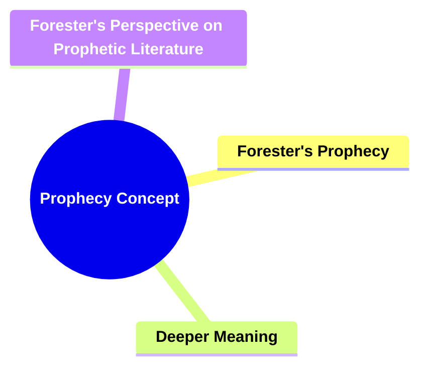

---

#### 1.2. **Forester's Prophecy**
- **Definition**: In E.M. Forster's concept, prophecy refers to a deeper, more abstract dimension in literature where a novel transcends its surface narrative to engage with universal truths, existential questions, and profound aspects of human life. Prophetic novels go beyond mere storytelling to explore deeper spiritual or philosophical insights, often addressing fundamental concerns about morality, existence, and the human condition. Forster's idea of prophecy involves a narrative that reaches for something greater than its plot or characters, touching on timeless, universal themes that resonate with readers on a deeper level.

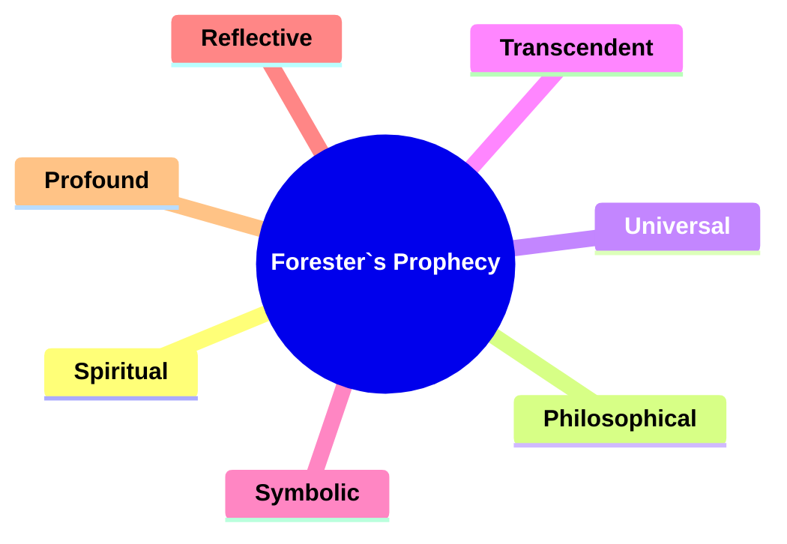
  
##### 1.2.1. **Components of Forester's Prophecy**:
###### 1.2.1.1. **Spiritual**
  - **Definition**: Engages with deeper, often spiritual aspects of existence, exploring questions about the soul, faith, and the meaning of life beyond the material world.

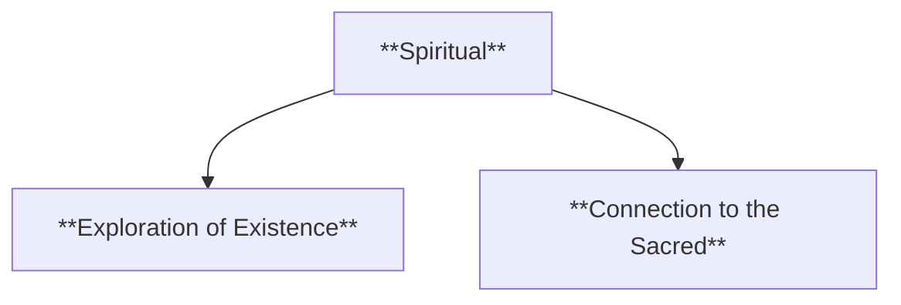

  - **Characteristics**
    - **Exploration of Existence**: The narrative delves into spiritual questions, addressing themes like the nature of the soul, enlightenment, or the search for divine truth.
    - **Connection to the Sacred**: Often, spiritual narratives feature characters or events that seek to connect with something greater than themselves, offering a reflection on the sacred or transcendent.


###### 1.2.1.2. **Philosophical**
  - **Definition**: Explores fundamental questions about life, morality, and the human condition, encouraging readers to contemplate the nature of reality and ethical decision-making.

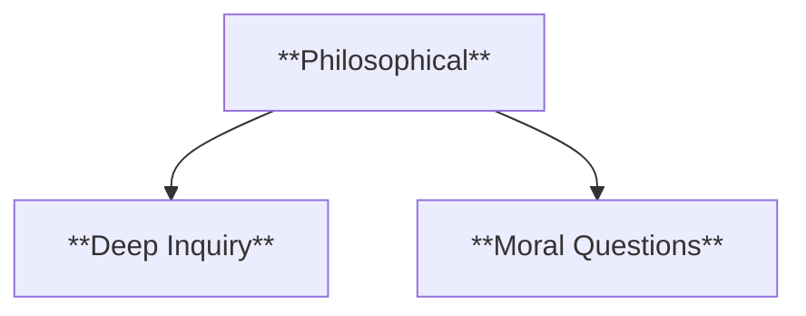

  - **Characteristics**
    - **Deep Inquiry**: The story invites readers to engage with philosophical ideas, challenging them to think about issues like free will, justice, or the meaning of existence.
    - **Moral Questions**: Philosophical narratives often present moral dilemmas that characters must navigate, reflecting broader questions about right and wrong, virtue, and consequence.


###### 1.2.1.3. **Universal**
  - **Definition**: Speaks to timeless, cross-cultural truths and themes that resonate with audiences from diverse backgrounds and across different eras.

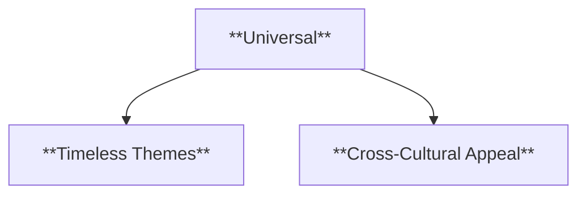

  - **Characteristics**
    - **Timeless Themes**: The narrative addresses universal aspects of the human experience, such as love, loss, freedom, or identity, making it relatable across generations and cultures.
    - **Cross-Cultural Appeal**: By focusing on fundamental truths, the story can connect with a wide range of readers, regardless of their specific cultural or historical context.


###### 1.2.1.4. **Transcendent**
  - **Definition**: Goes beyond surface-level storytelling to reveal hidden layers of meaning, often challenging readers to reflect on deeper, more profound truths.

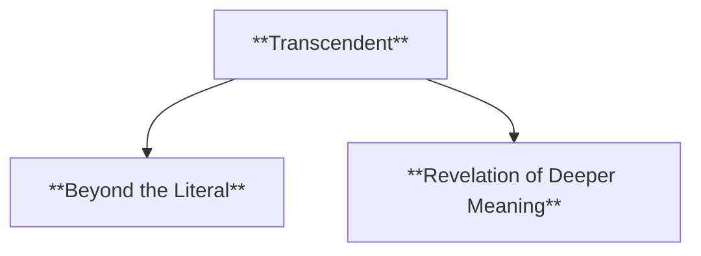

  - **Characteristics**
    - **Beyond the Literal**: The narrative engages with ideas that surpass the literal events of the story, pointing to greater existential or metaphysical truths.
    - **Revelation of Deeper Meaning**: Through its themes, symbols, or narrative structure, the story encourages readers to explore truths that transcend ordinary life.


###### 1.2.1.5. **Symbolic**
  - **Definition**: Often uses metaphors and symbols to express profound ideas, allowing abstract concepts to be conveyed through concrete imagery.

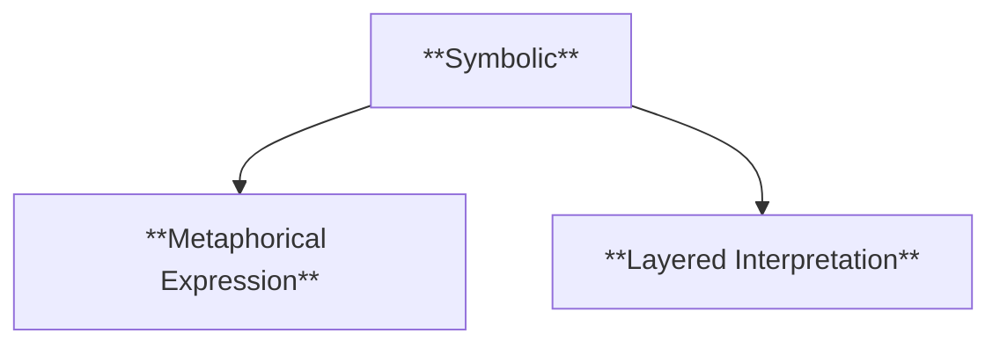

  - **Characteristics**
    - **Metaphorical Expression**: The narrative relies on symbols or metaphors to convey deeper meanings, turning ordinary objects or events into carriers of abstract concepts.
    - **Layered Interpretation**: Readers are invited to interpret symbols and metaphors, unlocking hidden meanings that enrich the narrative’s thematic depth.


###### 1.2.1.6. **Reflective**
  - **Definition**: Encourages readers to think about existential and ethical dilemmas, prompting introspection about life, purpose, and morality.

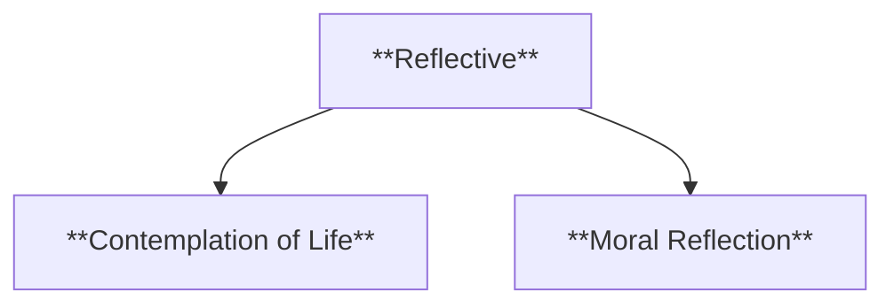

  - **Characteristics**
    - **Contemplation of Life**: The narrative inspires readers to consider deeper questions about existence, meaning, and the nature of being.
    - **Moral Reflection**: Characters may face ethical challenges that push the reader to think about what is right or just in difficult situations.


###### 1.2.1.7. **Profound**
  - **Definition**: Deals with serious, significant, and often challenging subjects, offering a narrative that pushes readers to engage with complex and weighty issues.

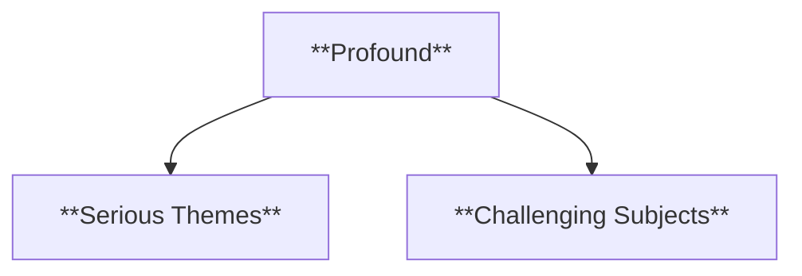

  - **Characteristics**
    - **Serious Themes**: The narrative tackles heavy topics such as death, suffering, or the search for meaning, often demanding deep emotional or intellectual engagement.
    - **Challenging Subjects**: The story explores issues that may not have easy answers, encouraging readers to wrestle with difficult and sometimes uncomfortable truths.

---
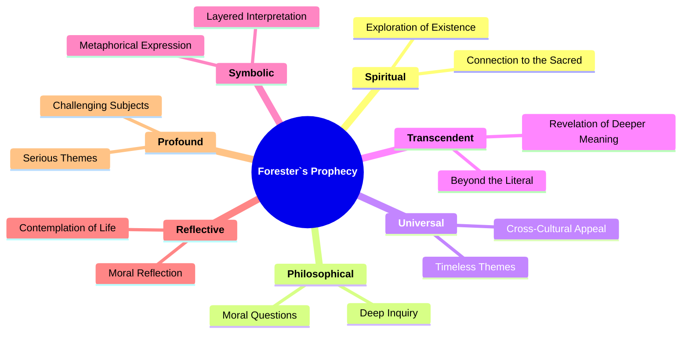
---

#### 1.3. **Deeper Meaning**
- **Definition**:  
  Prophetic novels are characterized by their exploration of universal truths or deep philosophical questions about human existence. Unlike works that focus solely on plot or character development, prophetic novels aim to uncover and express fundamental insights into life, often grappling with themes like morality, the nature of existence, or the human spirit.

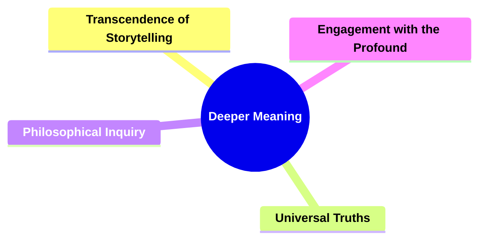

##### 1.3.1. **Components of Deeper Meaning**
###### 1.3.1.1. **Transcendence of Storytelling**
  - **Definition**: Prophetic novels transcend the limitations of conventional storytelling by infusing the narrative with layers of meaning that speak to the universal human condition.

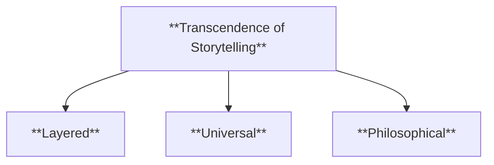

  - **Characteristics**:
    - **Layered**: The narrative contains multiple levels of meaning, offering both literal and symbolic interpretations.
    - **Universal**: Engages with timeless, cross-cultural themes that reflect fundamental aspects of human existence.
    - **Philosophical**: Focuses on deep, existential questions, encouraging readers to think about life's larger mysteries and human purpose.


###### 1.3.1.2. **Universal Truths**
  - **Definition**: Fundamental insights or principles that prophetic novels convey, addressing core aspects of human nature, morality, and the human condition.

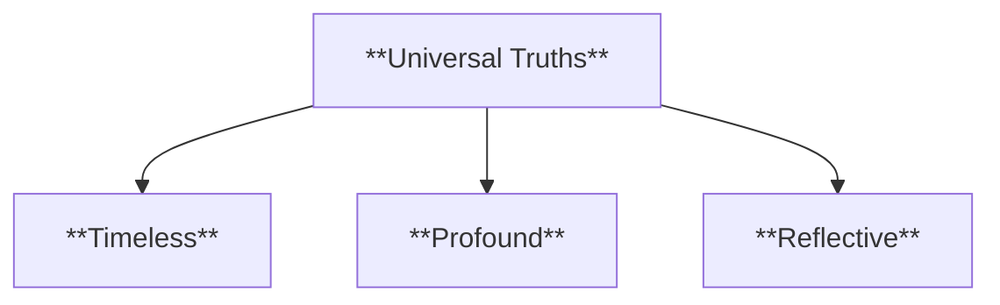

  - **Characteristics**:
    - **Timeless**: These truths remain relevant across different historical periods, speaking to the constant nature of human experiences.
    - **Profound**: Engages with deep philosophical concerns, often dealing with significant ethical and existential issues.
    - **Reflective**: Encourages readers to contemplate the meaning of life, prompting introspection on personal and collective levels.


###### 1.3.1.3. **Philosophical Inquiry**
  - **Definition**: Prophetic novels serve as a medium for philosophical inquiry, using the narrative to explore and question the nature of reality, existence, and the human soul.

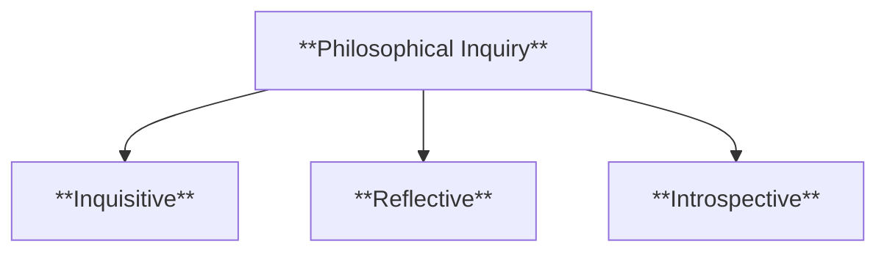

  - **Characteristics**:
    - **Inquisitive**: The narrative poses existential questions about the nature of truth, freedom, and the human experience.
    - **Reflective**: Encourages readers to engage in philosophical thought and debate, questioning societal norms and individual beliefs.
    - **Introspective**: Examines the inner lives of characters, exploring their thoughts and emotions in relation to larger philosophical questions.


###### 1.3.1.4. **Engagement with the Profound**
  - **Definition**: Forster’s concept of prophecy involves an engagement with the profound aspects of life, requiring readers to look beyond literal events to understand the symbolic and thematic significance of the narrative.

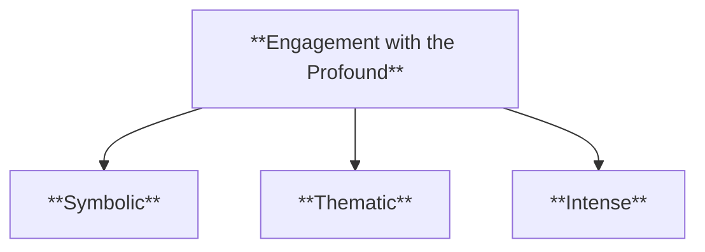

  - **Characteristics**:
    - **Symbolic**: The narrative works on metaphorical levels, using symbols to express deeper truths and meanings.
    - **Thematic**: Focuses on significant existential or moral issues, often reflecting on humanity’s role in the universe.
    - **Intense**: Confronts readers with difficult, often unanswerable questions, encouraging deep thought and emotional involvement.

---

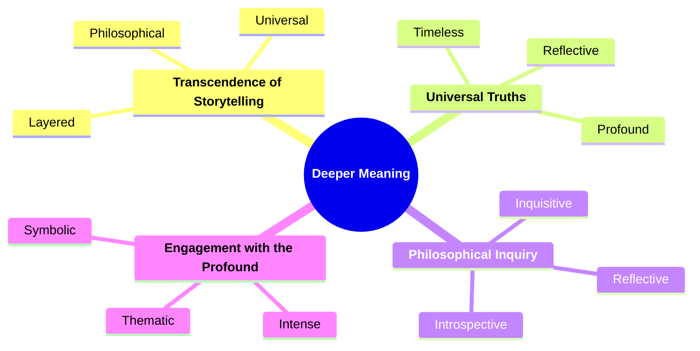

---

#### 1.4. **Forster’s Perspective on Prophetic Literature**
- **Definition**: Forster sees prophetic literature as a means of conveying truths that are not easily articulated in other forms. These novels use the narrative as a vehicle to express deeper philosophical or spiritual insights.

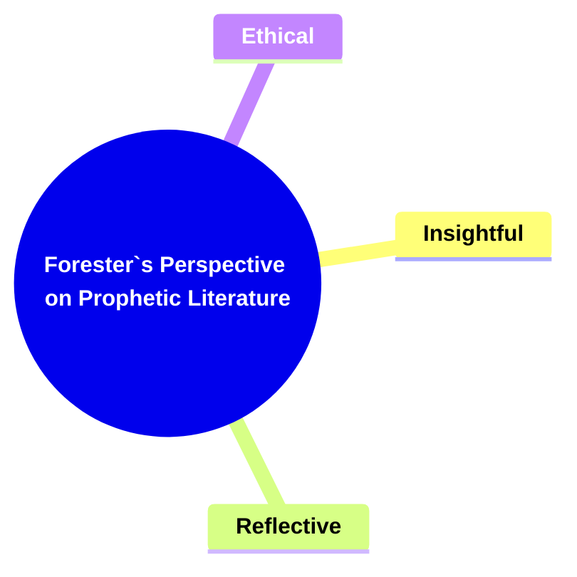

##### 1.4.1. **Components of Forster’s Perspective on Prophetic Literature**:
###### 1.4.1.1. **Insightful**
  - **Definition**: Conveys deep truths about life and existence, offering readers a profound understanding of human nature and the broader existential questions that define the human condition.

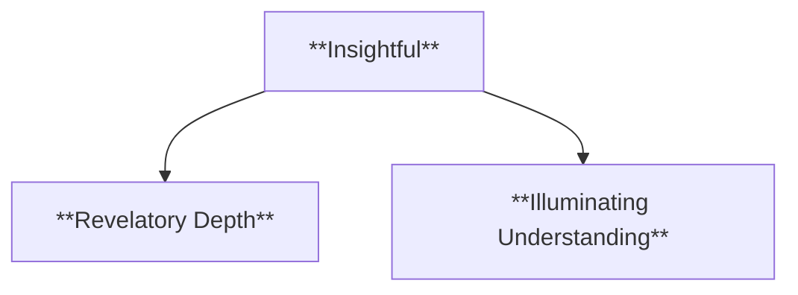

  - **Characteristics**:
    - **Revelatory Depth**: The narrative provides insights that go beyond surface-level events, delving into fundamental aspects of life, identity, and purpose.
    - **Illuminating Understanding**: The story helps readers recognize universal truths, offering wisdom and perspective on life's complexities.


###### 1.4.1.2. **Reflective**
  - **Definition**: Provokes contemplation on universal themes, encouraging readers to think deeply about life, society, and the human experience.

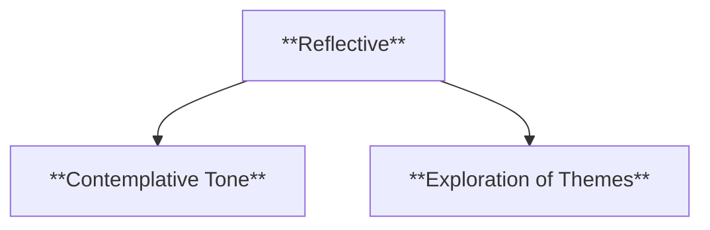

  - **Characteristics**:
    - **Contemplative Tone**: The narrative invites introspection, prompting readers to reflect on larger questions about existence, purpose, and the meaning of life.
    - **Exploration of Themes**: It engages with themes that resonate across cultures and time periods, such as love, death, freedom, and justice, urging readers to consider these from different angles.


###### 1.4.1.3. **Ethical**
  - **Definition**: Engages with moral and philosophical dilemmas, presenting characters or situations that force readers to confront difficult ethical questions and consider varying perspectives.

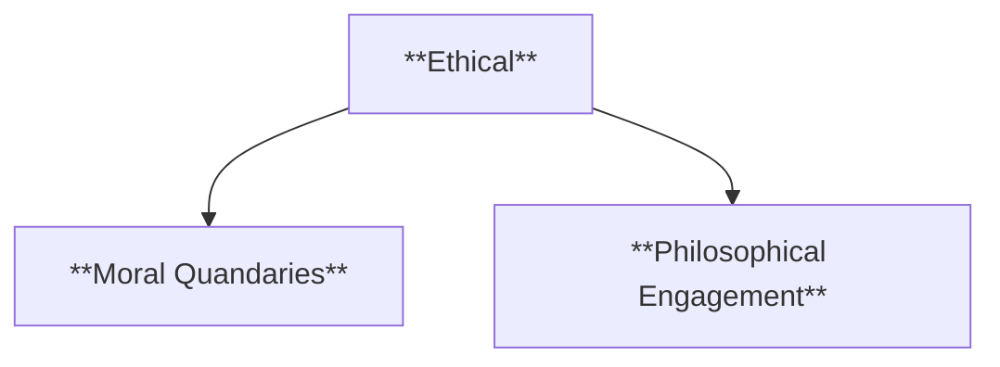

  - **Characteristics**:
    - **Moral Quandaries**: The narrative often centers around ethical challenges or choices, prompting readers to reflect on what is right or wrong in complex situations.
    - **Philosophical Engagement**: The story explores broader philosophical issues, such as the nature of justice, morality, and the consequences of actions, encouraging readers to think critically about these dilemmas.

---

```mermaid
mindmap
  root((**Forester's Perspective on Prophetic Literature**))
    **Insightful**
      Revelatory Depth
      Illuminating Understanding
    **Reflective**
      Contemplative Tone
      Exploration of Themes
    **Ethical**
      Moral Quandaries
      Philosophical Engagement
```
---

```mermaid
mindmap
  root((**Prophecy Concept**))
    **Forester`s Prophecy**
      Spiritual
        Exploration of Existence
        Connection to the Sacred
      Philosophical
        Deep Inquiry
        Moral Questions
      Universal
        Timeless Themes
        Cross-Cultural Appeal
      Transcendent
        Beyond the Literal
        Revelation of Deeper Meaning
      Symbolic
        Metaphorical Expression
        Layered Interpretation
      Reflective
        Contemplation of Life
        Moral Reflection
      Profound
        Serious Themes
        Challenging Subjects
    **Deeper Meaning**
      Transcendence of Storytelling
        Layered
        Universal
        Philosophical
      Universal Truths
        Timeless
        Profound
        Reflective
      Philosophical Inquiry
        Inquisitive
        Reflective
        Introspective
      Engagement with the Profound
        Symbolic
        Thematic
        Intense
    **Forester`s Perspective on Prophetic Literature**
      Insightful
        Revelatory Depth
        Illuminating Understanding
      Reflective
        Contemplative Tone
        Exploration of Themes
      Ethical
        Moral Quandaries
        Philosophical Engagement
```